# Guardian Lens — Architecture

**The normative architecture description: context, structure, runtime behaviour, deployment, crosscutting concepts and the decisions behind them**

| Field | Value |
|---|---|
| Document | Architecture Description |
| Version | 1.0 |
| Status | For engineering review |
| Programme phase | Week 3 — Govern · 8 August 2026 |
| Owner | Kapil (Engineering) — same owner as [TRD.md](TRD.md), per [GOVERNANCE.md](GOVERNANCE.md) §19.1 |
| Change control | ADR + T2/T3 per [GOVERNANCE.md](GOVERNANCE.md) §8.2. A change touching any enforcement point in [RULE_BOOK.md](RULE_BOOK.md) §6 is T3. |
| Inputs | [PRD.md](PRD.md) v1.0 · [TRD.md](TRD.md) v1.0 · [RULE_BOOK.md](RULE_BOOK.md) v1.0 · [GOVERNANCE.md](GOVERNANCE.md) v1.0 |
| Companion | [DATABASE.md](DATABASE.md) — normative for the data model this document treats as a black box |
| Method basis | **arc42** 8.x (12 sections) · **C4 model** levels 1–3 · **Nygard ADRs** · ATAM sensitivity and tradeoff points · STRIDE threat modelling |
| Answers | [GOVERNANCE.md](GOVERNANCE.md) §19.2 handoff standard (arc42 + C4) · part of gate **G0** evidence: *"security architecture, threat model and key management documented and reviewed"* |

---

## Authority

**This document is the normative source for the architecture of Guardian Lens.**

| Relationship | Which prevails |
|---|---|
| This document vs **[TRD.md](TRD.md) §2** (Solution Architecture) | **This document.** TRD §2 is a summary view. Divergences are listed as numbered amendments in Appendix A for the TRD owner to action. |
| This document vs **[TRD.md](TRD.md) §3–§7, §10–§24** | **The TRD.** Those sections remain TRD-owned. This document references them and does not restate them. |
| This document vs **[DATABASE.md](DATABASE.md)** | **DATABASE.md** on anything concerning the data model, schema, constraints, migration or retention mechanics. |
| This document vs **[RULE_BOOK.md](RULE_BOOK.md)** | **RULE_BOOK.md** on *what a rule requires*. **This document** on *how it is enforced structurally*. (RULE_BOOK.md §0, Manifesto Article 4.5.) |
| This document vs **[PRD.md](PRD.md)** | **The PRD.** Product intent is not settled here. |
| This document vs **[GOVERNANCE.md](GOVERNANCE.md)** | **GOVERNANCE.md** on who may change anything, and through what authority. |

> **This document does not amend the TRD.** [GOVERNANCE.md](GOVERNANCE.md) §19.1 assigns TRD.md to Kapil under ADR + T2/T3 change control. Where analysis here contradicts TRD §2, the contradiction is recorded as `AMD-ARCH-nn` in **Appendix A** and actioned by the owner, not edited in place.

### Scope marking

The convention is [TRD.md](TRD.md)'s and is used unchanged: `[MVP]` · `[V1]` · `[V2+]` · `[OPEN]`. `[OPEN]` always carries a PRD Open Question or a GOVERNANCE Open Governance Question reference, and is never resolved by assumption.

### Rule status warning

25 of the 45 rules in [RULE_BOOK.md](RULE_BOOK.md) are `PROPOSED` and **carry no force until ratified** (RULE_BOOK.md §8 item 6, §10). Where this document relies on a `PROPOSED` rule it is marked `[PROPOSED]` inline. Gate **G0** requires the rule book to be fully ratified before any customer-site work; **G0 has not been passed.** This document is a specification, not an instruction to build.

---

## Reading guide

Per the Diátaxis separation in [GOVERNANCE.md](GOVERNANCE.md) §19.2, this is **reference and explanation**. It contains no tutorials and no operational how-to procedures; those live in runbooks and TRD §14, §20.

| If you are… | Read |
|---|---|
| Joining the team | §1, §3, §4, then §5 |
| Reviewing a change for T3 impact | §5, §8.2, Appendix B |
| Doing the G0 security review | §8.2 (threat model), §8.3 (key management), Appendix B |
| Deciding whether a proposal fits | §9 (decisions), §10.3 (tradeoff points) |
| Implementing the data layer | [DATABASE.md](DATABASE.md), then §5.3 here |

---

# 1. Introduction and Goals

## 1.1 Requirements overview

Not restated. The requirement baseline is [PRD.md](PRD.md) §9 (feature catalogue), §11 (functional requirements FR-001…), §12 (non-functional requirements) and §13 (business rules, superseded as a normative source by [RULE_BOOK.md](RULE_BOOK.md)).

In one paragraph: Guardian Lens attaches an AI safety layer to a customer's **existing** cameras. It detects safety-rule exceptions, presents each as a *claim* to an authorised human, and records only what that human confirms — with the reviewer's identity permanently attached. The detection is commodity; the human gate and the audit trail are the product ([README.md](../README.md), claim 3).

## 1.2 Quality goals

Ranked. Where two conflict, the higher-ranked wins. Carried from [TRD.md](TRD.md) §1.3 and made measurable in §10.

| Rank | Quality goal | Architectural expression |
|---|---|---|
| 1 | **Auditability / integrity** | Append-only audit at the data layer; decision immutability by trigger; every mutation attributable |
| 2 | **Correctness of the human gate** | Four independent enforcement layers (§4.2); no automated disposition path exists anywhere in the structure |
| 3 | **Reviewer latency** | Single-purpose review path; evidence retrieval on the critical path; no batching (BR-V-02 `[PROPOSED]`) |
| 4 | **Resilience to network and stream loss** | Edge-resident buffering; recorded coverage gaps; at-least-once delivery with idempotent ingest |
| 5 | **Deployability** | One container stack; pull-only configuration; no inbound path to the site |
| 6 | Throughput | Sampling rather than full frame rate; a missed frame is recoverable, a corrupted record is not |

## 1.3 Stakeholders

| Stakeholder | Concern | Where this document addresses it |
|---|---|---|
| **P-1 Plant Head** (PRD §6.1) | Is the record defensible? | §4.2, §8.2, §10.2 QS-1 |
| **P-2 Safety / EHS Officer** (PRD §6.2) | Can I get through the queue? | §6.3, §10.2 QS-3 |
| **P-4 IT / Network Admin** (PRD §6.4) | What crosses my network, and in which direction? | §3.2, §7, ADR-010 |
| **P-5 Worker** (PRD §6.5) | What can this system know about me? | §4.3 (the negative architecture), §8.6 |
| Kapil — Engineering owner | Is it buildable by five people? | §2.2, §5, §11 |
| Yashpal — Test & Verification, veto holder | Can each commitment fail a test? | §10.4 fitness functions, Appendix B |
| Kamal — Model owner | Where does a model version live in the structure? | §5.2 MOD-2, §6.7 |
| Kuldeep — Product Owner, gate approver | Is G0 evidence complete? | §8.2, §8.3 |
| A receiving team `[V1]` | Can we operate this without asking a departed person? | The whole document — GOVERNANCE §19.2 |

---

# 2. Architecture Constraints

Constraints are given, not chosen. Anything in this section that is later relaxed invalidates decisions downstream of it.

## 2.1 Rule constraints — the binding ones

These are not quality attributes to be traded off. They are `ABSOLUTE` rules from [RULE_BOOK.md](RULE_BOOK.md) §4, and per its §8 item 5 may be changed only by amending that document under [GOVERNANCE.md](GOVERNANCE.md) §8.4 — never by configuration, feature flag, support decision or hotfix.

| Rule | Structural consequence — what the architecture may not contain |
|---|---|
| **BR-001** | No default-active rule anywhere in the structure. A fresh install has no code path that produces a candidate event. |
| **BR-002** | No component may compute, store, transit or expose a per-person measure. This is enforced by the *absence* of a person concept, not by a filter. |
| **BR-003** | No outbound integration layer to HR, performance or disciplinary systems exists. Not disabled — **absent** from the dependency graph (§8.5). |
| **BR-004** | The only transition out of `unverified` is the decision path in MOD-7. No timer, no threshold, no batch job may perform it. |
| **BR-005** | Reviewer identity and decision timestamp are structural preconditions of a verified record, enforced at the data layer. |
| **BR-006** | No facial-recognition, re-identification, biometric or emotion library may appear in the dependency tree (TRD §3, rejected technologies). |
| **BR-S-01** | Reviewer identity is derived from the validated token. No interface accepts it as input. |
| **BR-P-01** `[PROPOSED]` | No audio capture, processing, storage or transmission at any horizon. No audio codec in the edge dependency tree. |

## 2.2 Organisational constraints

| Constraint | Source | Consequence |
|---|---|---|
| **Five people, pre-revenue** | [GOVERNANCE.md](GOVERNANCE.md) §2, §6.5 | Every operational component must justify the person-hours to run it. This is why there is no broker (TD-007) and no Kubernetes (TD-012). |
| **G0 not passed** | [GOVERNANCE.md](GOVERNANCE.md) §9 | The impact assessment, DPIA, ratified rule book and 3-site camera audit are all outstanding. No customer-site work may begin. |
| **25 of 45 rules `PROPOSED`** | [RULE_BOOK.md](RULE_BOOK.md) §10 | A `PROPOSED` rule must not be cited to block work (RULE_BOOK.md §8 item 6), and must not be treated as an enforced guarantee. |
| **No independent model validation** | [GOVERNANCE.md](GOVERNANCE.md) §6.5, ADR-006 | The architecture cannot rely on an independent challenge function existing. Model risk is carried structurally (fail-safe, §6.6) rather than by assurance. |
| **Docs-as-code** | [GOVERNANCE.md](GOVERNANCE.md) §19.1 | This document changes by pull request, reviewed like code. |

## 2.3 Technical constraints

| Constraint | Source | Consequence |
|---|---|---|
| Customer's **existing** cameras, unmodified | PRD §1.4, RULE_BOOK §3.1 | The architecture may assume ONVIF Profile S / RTSP and nothing better. Camera readiness is `[OPEN — PRD OQ-2]`. |
| No inbound network path to the site | NFR-SEC-05, persona P-4 | All site→cloud communication is agent-initiated. See ADR-010. |
| Single-tenant per site in v1 | RULE_BOOK §3.1 | Isolation is logical, by `site_id` + repository scope filter. See ADR-012. |
| PostgreSQL as an enforcement point | TD-005 | The database is not a passive store. Reversing TD-005 removes the guarantee behind quality goal 1. |
| No labelled site footage exists | PRD OQ-5, AP-2 | No accuracy, latency or volume figure may be asserted (BR-M-01 `[PROPOSED]`). Every such value in this document is `[OPEN]`. |

## 2.4 Regulatory posture

Summarised from [GOVERNANCE.md](GOVERNANCE.md) §3, which is normative. The design sits deliberately outside EU AI Act Annex III by excluding biometric identification (BR-006) and individual measurement (BR-002). **This is an architectural property, not a legal opinion** — it holds only while those two rules hold. Jurisdiction-specific obligations are `[OPEN — GQ-1, GQ-6]` and block G0.

---

# 3. Context and Scope (C4 Level 1)

> **New in this document.** [TRD.md](TRD.md) §2.1 begins at the container level. Without a context view, the set of external systems the product touches — and, more importantly, the set it must *never* touch — is not stated anywhere as a boundary.

## 3.1 Business context

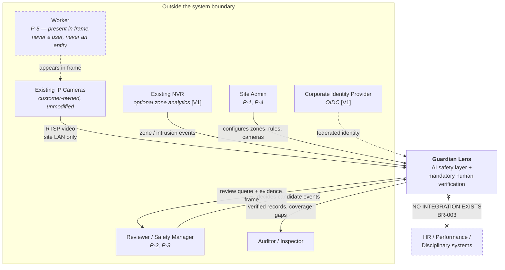

## 3.2 External interfaces

| # | Partner | Direction | Protocol / format | Crosses a trust boundary? | Scope |
|---|---|---|---|---|---|
| EI-1 | IP camera | Inbound to edge | RTSP / ONVIF Profile S, H.264/H.265 | No — site LAN only | `[MVP]` |
| EI-2 | NVR | Inbound to edge | ONVIF event subscription, vendor HTTP callback, or polling — device-dependent `[OPEN — PRD OQ-2]` | No — site LAN only | `[V1]` |
| EI-3 | Edge agent → control plane | **Outbound from site only** | HTTPS/TLS 1.3, JSON events + one JPEG per event | **Yes — TB1→TB2** | `[MVP]` |
| EI-4 | Browser → control plane | Inbound to control plane | HTTPS/TLS 1.3, JSON + JWT | **Yes — TB3→TB2** | `[MVP]` |
| EI-5 | OIDC provider | Outbound from control plane | OIDC authorisation code flow | Yes | `[V1]` |
| EI-6 | Object storage | Outbound from control plane | S3 API over TLS | Yes | `[V1]` |
| EI-7 | Metrics scrape | Inbound to both planes | Prometheus HTTP | Internal | `[MVP]` |
| **EI-X** | **HR / performance / disciplinary** | — | **None. No client, no adapter, no configuration key.** | — | **Never** |

**The single most important row is EI-3.** It carries structured events and at most one still image per event. It never carries a video stream, and it never carries audio. This is BR-008 and BR-P-01 `[PROPOSED]` expressed as topology rather than as policy.

## 3.3 Explicitly out of scope

| Not in scope | Why | Reference |
|---|---|---|
| Camera supply, installation or replacement | The product attaches to what exists | PRD §1.4 |
| Video storage or playback | BR-008; the control plane has no decode capability at all | ADR-011 |
| Worker identity of any kind | BR-006; there is no person entity to attach an identity to | §4.3 |
| Real-time alerting to a phone | Deferred; BR-N-03 constrains it if ever built | PRD §13.9 |
| Any consequence for a worker | BR-003 | EI-X above |

---

# 4. Solution Strategy

## 4.1 Driver → structure

Six drivers, each with one structural answer. Nothing else in the architecture is load-bearing to the same degree.

| # | Driver | Structural answer |
|---|---|---|
| D-1 | Video must not leave the site (BR-008) | **Two planes.** Inference is edge-resident. The control plane has no stream ingress and no decoder. |
| D-2 | No record without a human (BR-004) | **A single write path** out of `unverified`, guarded at four independent layers (§4.2). |
| D-3 | Every record carries its reviewer (BR-005) | **Data-layer preconditions**, not application checks. A future API cannot bypass a CHECK constraint. |
| D-4 | Sites have unreliable networks | **Transactional outbox at the edge** with a client-generated idempotency key; at-least-once delivery, exactly-once effect. |
| D-5 | Gaps must be visible, never inferred (BR-W-01 `[PROPOSED]`) | **Coverage gap is a first-class record**, produced by the same outbox as events. |
| D-6 | The safety path must be explainable (BR-D-03 `[PROPOSED]`) | **One ML step, one human step, everything else deterministic code** — and the rule that fired is snapshotted onto the event. |

## 4.2 The defence-in-depth pattern

The product's central commitment (BR-004 / BR-005) is enforced at four layers that fail independently. This is the architecture's defining pattern and appears in TRD §5.4; it is restated here because §5 and §6 are unreadable without it.

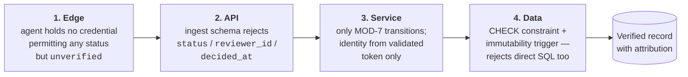

| Layer | Removable by | Detected by |
|---|---|---|
| Edge | Agent compromise | Bypass suite: authenticate as agent, attempt a decision → 403 (TRD §19.4) |
| API | A refactor of the ingest schema | Bypass suite: set `status` via ingest → 400 |
| Service | A refactor of the decision service | Bypass suite: supply `reviewer_id` in body → 400 |
| **Data** | **Only a deliberate, reviewable migration** | Bypass suite: direct SQL insert of a verified event with null `reviewer_id` → database rejects |

> **Why the data layer is the one that matters.** The first three are one careless refactor away from being gone, and a refactor is not a reviewable event. Removing the fourth requires an Alembic migration, which is a T2 change at minimum and T3 because it touches a RULE_BOOK §6 enforcement point ([GOVERNANCE.md](GOVERNANCE.md) §8.2). The guarantee survives because the cheapest way to remove it is still expensive.

## 4.3 The negative architecture

Several of the product's most important properties are held by things that **do not exist**. They are listed here because absence is invisible in a diagram, and an absent thing is easy to add back by accident.

| Absent by design | Rule | What would re-introduce it |
|---|---|---|
| Any person or worker entity | BR-006, RULE_BOOK §3.2 | A `persons` table, a tracking ID, a re-identification embedding |
| Any per-person counter, duration or rate | BR-002, BR-P-03 `[PROPOSED]` | A "time in zone per individual" report; a reviewer-productivity log line (TRD §15.3) |
| Any outbound consequence path | BR-003, BR-N-01 | An HTTP client to an HR system; a webhook with a configurable URL |
| Any bulk-disposition interface | BR-V-02 `[PROPOSED]` | A `PATCH /events` route; a "select all" control in the UI |
| Any confidence-based auto-disposition | BR-V-03 `[PROPOSED]` | A threshold above which an event skips the queue |
| Any audio path | BR-P-01 `[PROPOSED]` | An audio codec in the edge dependency tree |
| Any video egress from site | BR-008 | A clip-upload feature; a "send to support" diagnostic |
| Any supervisor override | BR-V-04 `[PROPOSED]` | An admin endpoint that rewrites a decision |

Enforcement of this list is a CI fitness function, not a review habit — see **ADR-011** and §10.4 FF-5.

## 4.4 Architectural patterns in use

| Pattern | Applied to | Why here |
|---|---|---|
| **Two-plane split** | Whole system | BR-008 as topology (TD-002) |
| **Transactional outbox** | Edge → control plane | At-least-once delivery without a broker (TD-007) |
| **Idempotent receiver** | Ingest | Client-generated `event_id` makes retry safe |
| **Layered architecture** | Control plane | TRD §6.1; business rules sit between service and repository |
| **Repository with enforced filter** | Reporting | BR-R-01 is enforced in the repository, so no caller can bypass it (TRD §6.4) |
| **Optimistic concurrency** | Decision | Two reviewers, one event → exactly one succeeds |
| **Snapshot-on-write** | `rule_snapshot` | The rule as it fired must survive later edits — audit, not optimisation |
| **Fail-safe (not fail-silent)** | Edge degradation | BR-012: every failure yields a recorded gap or a visible alert |
| **Pull-only configuration** | Control → edge | No inbound path to the site (ADR-008, ADR-010) |

---

# 5. Building Block View

## 5.1 Level 1 — Containers (C4 L2)

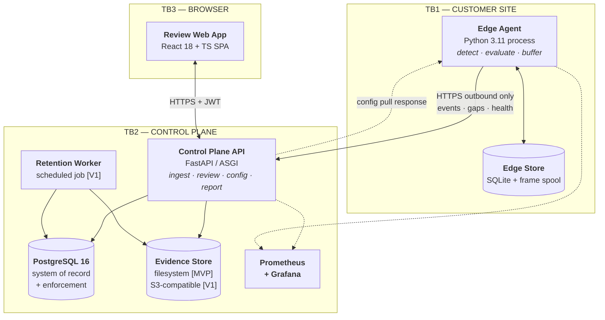

| Container | Responsibility | Technology | Scope |
|---|---|---|---|
| **Edge Agent** | Connect to cameras, sample, infer, evaluate rules deterministically, build candidates, buffer, publish | Python 3.11, OpenCV/FFmpeg, ONNX Runtime | `[MVP]` |
| **Edge Store** | Durable outbox for events, gaps and health; frame spool | SQLite 3 + local files — **not a system of record** | `[MVP]` |
| **Control Plane API** | Authenticate, ingest, serve the queue, apply decisions, configure, report | FastAPI, SQLAlchemy 2 | `[MVP]` |
| **Retention Worker** | Enforce per-site retention; record every deletion | Python scheduled job, single instance | `[V1]` |
| **PostgreSQL** | System of record **and** enforcement point for BR-004/005/AU-01/AU-02 | PostgreSQL 16 | `[MVP]` |
| **Evidence Store** | One still image per event, behind a storage interface | Filesystem → S3-compatible | `[MVP]` → `[V1]` |
| **Review Web App** | Keyboard-first review, configuration, reporting | React 18 + TS + Vite + Tailwind | `[MVP]` |
| **Prometheus + Grafana** | Metrics and alerting | Self-hosted in-stack | `[MVP]` basic |

## 5.2 Level 2 — Edge Agent, whitebox (C4 L3)

Modules are TRD §4's MOD-1…MOD-5; their responsibilities are **not** restated. What is new here is the internal contract between them and the failure propagation path.

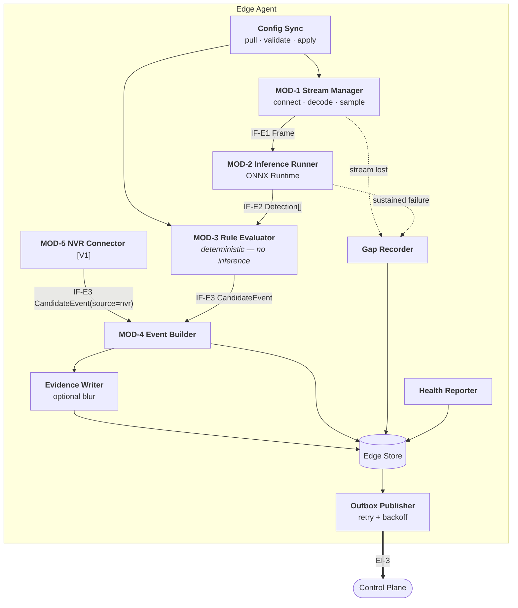

**Boundary rule made explicit:** the arrow `IR → RE` is the last point at which a model output participates. Everything downstream of it is deterministic code (BR-D-03 `[PROPOSED]`, TRD §5.1). A pull request that introduces any inference below that line is a rule violation, not a design preference.

## 5.3 Level 2 — Control Plane, whitebox (C4 L3)

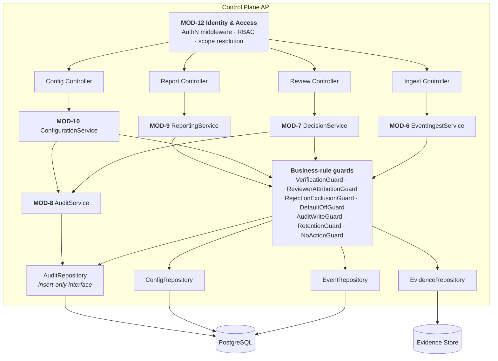

**Two structural properties worth naming:**

1. **`AuditRepository` exposes no update or delete method at all** (TRD §6.4). The append-only guarantee therefore holds twice: once because the interface has no way to express the operation, and once because a trigger rejects it. Only the second survives a direct database connection.
2. **`DecisionService` and `AuditService` share one transaction.** This is not a service-layer convention — it is BR-AU-03 `[PROPOSED]`, and its failure branch (§6.3) is the reason the pairing exists.

## 5.4 Interface catalogue — internal contracts

> **New in this document.** The TRD specifies external APIs in §10 but leaves internal contracts implicit. A receiving team cannot replace a module without them ([GOVERNANCE.md](GOVERNANCE.md) §19.2).

| ID | Provider → Consumer | Sync | Payload | Error semantics | Idempotent |
|---|---|---|---|---|---|
| **IF-E1** | MOD-1 → MOD-2 | In-process, backpressured | `Frame(camera_id, captured_at, image, sequence)` | Decode error → drop frame, increment counter, continue | n/a |
| **IF-E2** | MOD-2 → MOD-3 | In-process | `Detection(class, bbox, confidence, model_version_id, frame_ref)` | Inference exception → drop frame, count; sustained → `degraded` + gap | n/a |
| **IF-E3** | MOD-3 / MOD-5 → MOD-4 | In-process | `CandidateEvent(event_id, camera_id, zone_id, rule_id, rule_snapshot, occurred_at, confidence, source)` | Malformed rule config → rule inactive + error logged. **Never a default rule** (BR-001) | Yes — `event_id` is generated here |
| **IF-E4** | MOD-4 → Edge Store | Local transaction | Outbox row + evidence file | Write failure → event is not acknowledged upstream | Yes |
| **IF-E5** | Edge Store → Publisher → EI-3 | Async, at-least-once | Batched events, gaps, health | 5xx / timeout → retry with backoff, indefinitely. 422 → park as permanently invalid, alert | **Yes — dedup at receiver** |
| **IF-C1** | MOD-6 → EventRepository | Sync, one transaction per event | Candidate row + evidence key | Duplicate `event_id` → return existing (200), create nothing | Yes |
| **IF-C2** | MOD-7 → MOD-8 | Sync, **same transaction** | Decision + audit entry | Audit write failure → **entire decision rolls back** | No — one decision per event |
| **IF-C3** | MOD-10 → MOD-8 | Sync, **same transaction** | Config mutation + audit entry | Audit write failure → config change rolls back (BR-C-01 `[PROPOSED]`) | No |
| **IF-C4** | MOD-9 → EventRepository | Sync, read-only | Filter always includes `status IN ('accepted','corrected')` | — | Yes |
| **IF-C5** | MOD-11 → EventRepository + EvidenceRepository | Batched, per-batch transaction | Deletions + audit entries | Partial deletion → retried next run; audit records only what was deleted | Yes |
| **IF-X1** | Control plane → Edge | **Pull only** — agent requests | Config document + version | Agent keeps last-known-good on any failure | Yes |

## 5.5 Level 3 — the two blocks worth decomposing

Only two internal blocks carry enough rule weight to justify a third level.

### MOD-3 Rule Evaluator `[MVP]`

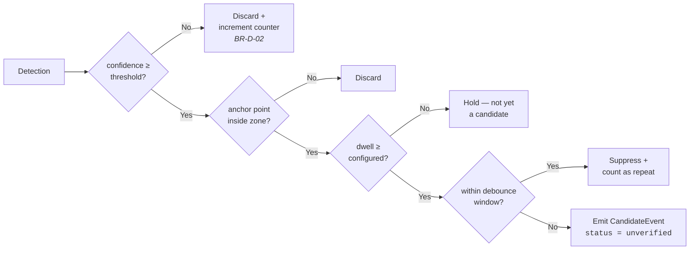

This is [RULE_BOOK.md](RULE_BOOK.md) §5.2 decision table D1 rendered as structure. The two `Discard` branches **increment counters** rather than vanishing — BR-D-02 `[PROPOSED]` exists precisely so that "we saw nothing" and "we suppressed everything" are distinguishable after the fact.

### MOD-7 Decision path `[MVP]`

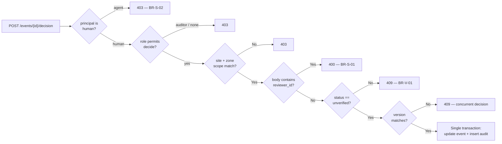

This is [RULE_BOOK.md](RULE_BOOK.md) §5.3 decision table D2 rendered as structure. **Every branch that returns 4xx is a rule, not an error case** — which is why each is a row in the bypass suite (Appendix B).

---

# 6. Runtime View

> **Largely new in this document.** [TRD.md](TRD.md) §11.3 carries one runtime scenario (verification). The scenarios that carry the most architectural risk — partition recovery, degradation, configuration propagation — had no runtime description at all.

Eight scenarios. Each states what it proves.

## 6.1 RS-1 — Candidate event, happy path `[MVP]`

**Proves:** the deterministic boundary holds and the event arrives exactly once.

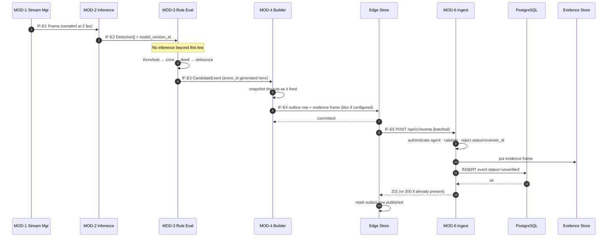

**Note step 6.** The rule is snapshotted at the edge, at detection time — not resolved at read time in the control plane. If the rule is later edited or deleted, the historical event still shows what actually fired. This is why `rule_id` is nullable and `rule_snapshot` is not (see [DATABASE.md](DATABASE.md)).

## 6.2 RS-2 — Network partition and recovery `[MVP]`

**Proves:** D-4 — no event is lost, no event is double-recorded, and the outbox cannot silently overflow.

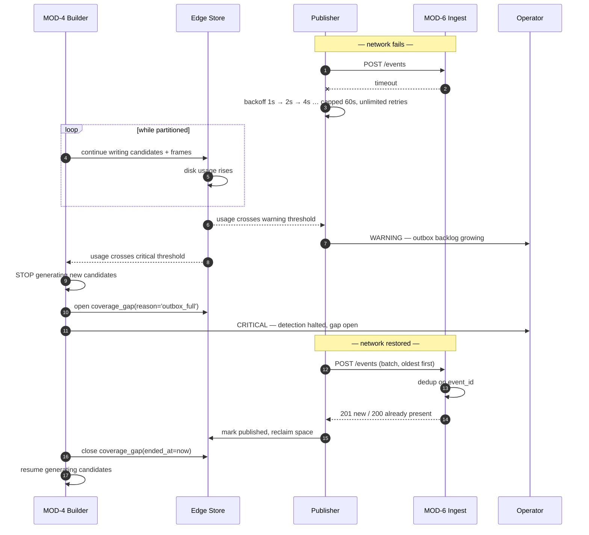

**Three properties this scenario fixes, none of which were previously written down:**

| Property | Why it matters |
|---|---|
| Backlog is drained **oldest-first** | Preserves the reviewer's chronological context; a queue that arrives newest-first is unreadable after an outage |
| Reaching the disk cap **halts detection and opens a gap** | BR-W-02 `[PROPOSED]` — the alternative, dropping the oldest buffered events, would make the record silently incomplete |
| Recovery is **idempotent by `event_id`** | The publisher may retry a batch it already delivered; a duplicate returns 200 with the existing record, never a second row |

**Open:** the warning and critical thresholds, and the disk quota that defines them, are `[OPEN — PRD OQ-4]`. They cannot be set before event volume per shift is measured. See §11 R-3.

## 6.3 RS-3 — Human decision `[MVP]`

The happy path is [TRD.md](TRD.md) §11.3 and is **not duplicated here.** What follows is its failure envelope, which the TRD does not enumerate.

| # | Failure at | Behaviour | Rule | Reviewer sees |
|---|---|---|---|---|
| F-1 | Audit insert fails | **Whole transaction rolls back.** No decision row exists. | BR-AU-03 `[PROPOSED]` | 500 + "decision not recorded, retry" |
| F-2 | `version` stale — another reviewer decided first | Update matches zero rows; transaction aborts | BR-V-01 `[PROPOSED]` | 409 + the existing decision and its reviewer |
| F-3 | Event already terminal | Rejected before the transaction opens | BR-V-01 `[PROPOSED]` | 409 |
| F-4 | Access token expired mid-decision | 401; the SPA holds the draft locally and replays after re-auth | BR-S-01 | Re-auth prompt, decision preserved |
| F-5 | Body carries `reviewer_id` | Rejected at validation, before any service is entered | BR-S-01 | 400 |
| F-6 | Evidence frame unretrievable | **Decision controls stay disabled**; the reviewer is told the evidence is missing | DP-2 | Explicit "evidence unavailable" state |
| F-7 | Database unreachable | 503; nothing is written | — | Retry banner |

> **F-1 is the one to defend in review.** "Write the decision, retry the audit later" is the obvious optimisation and it is prohibited: a decision that cannot be audited must not exist. The failure mode of the alternative is a verified record with no provenance — precisely the artefact the product exists to prevent.
>
> **F-6 is a product decision expressed in the runtime view.** A decision taken without the reviewer having seen the evidence is attribution without basis. Confirm against PRD DP-2 — see `AMD-ARCH-05`.

## 6.4 RS-4 — Configuration change and propagation `[MVP]`

**Proves:** rule activation is explicit and attributable (BR-C-02 `[PROPOSED]`), and that propagation delay is bounded and visible rather than assumed to be zero.

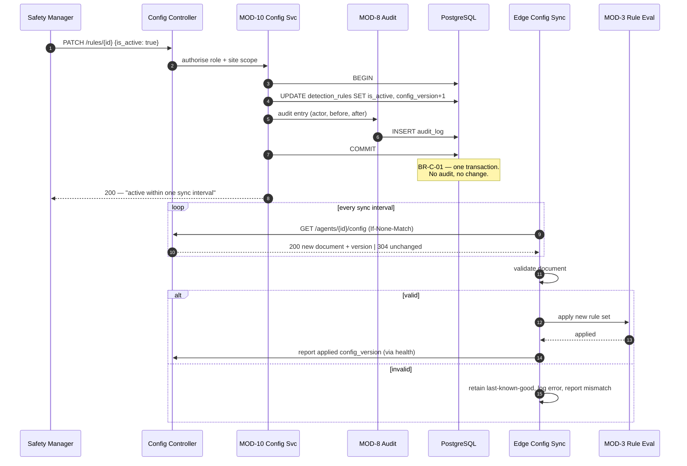

**The property this makes explicit:** activation is **eventually** consistent with a bound of one sync interval, and the agent reports the config version it is actually running. Two consequences that were previously unstated:

- **Deactivating a rule is not instantaneous.** Events may arrive from a rule deactivated moments earlier. They are legitimate — the `rule_snapshot` shows the rule as it was when it fired. The UI must not treat them as an error.
- **A site's true monitored scope is what the agents report, not what the database says.** The health payload carries the applied `config_version`; a mismatch persisting beyond one interval is an alertable condition. Without this, BR-001's guarantee is asserted from the control plane's intent rather than the edge's reality.

Sync interval value: `[OPEN]`. Design intent is tens of seconds, not minutes. See ADR-008.

## 6.5 RS-5 — Stream loss and coverage gap `[MVP]`

**Proves:** D-5 / BR-W-01 `[PROPOSED]` — availability of analysis is recorded, never inferred.

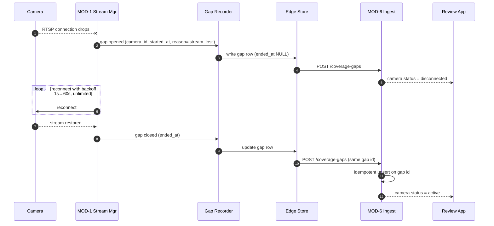

**The reporting consequence, which is the whole point:** a report showing zero events over a period must be readable together with the coverage gaps for that period. Without the gap record, "nothing happened" and "we were not watching" are indistinguishable — and they are opposite conclusions ([TRD.md](TRD.md) §9.7). Every report surface that shows an event count must therefore also show gap coverage for the same window; this is an architectural obligation on MOD-9, not a UI nicety.

**Gap causes and who records them:**

| Reason | Recorded by | Closes when |
|---|---|---|
| `stream_lost` | MOD-1 | Stream reconnects |
| `inference_failure` | MOD-2 | Inference recovers below the failure threshold |
| `agent_down` | **Control plane**, from missed health beats | Health resumes |
| `outbox_full` | MOD-4 | Backlog drains below threshold |

> `agent_down` is the only gap the edge cannot record, because a dead agent writes nothing. It is inferred at the control plane from missed health beats — which means the health-beat interval sets the resolution of that gap. This is a real limitation and is stated rather than hidden.

## 6.6 RS-6 — Inference degradation and fail-safe `[MVP]`

**Proves:** BR-012 — the system fails safe, and never fails silent.

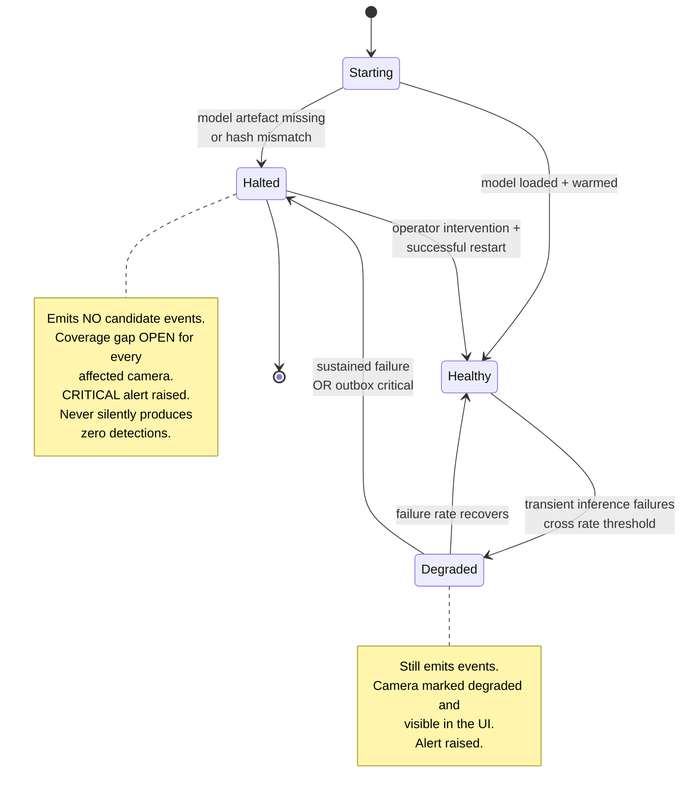

**The single most dangerous failure this design excludes:** an agent that loads no model, throws no error, and returns zero detections forever. Operationally it is indistinguishable from a safe site. The structure excludes it in three places — the agent refuses to start without a verified model artefact (TRD §5.6); `Halted` opens a coverage gap for every affected camera; and the control plane raises an alert on missed health beats. **A halted agent is loud.**

> `Degraded → Halted` on sustained failure is a deliberate choice of *fewer events* over *wrong events*. It also means a degrading model can stop a site's monitoring — an availability cost accepted knowingly, because BR-012 says the site's existing controls remain exactly as effective as before.

## 6.7 RS-7 — Model version rollout and rollback `[MVP]`

**Proves:** traceability of every detection to a model version (BR-D-01 `[PROPOSED]`), and that rollback is cheap.

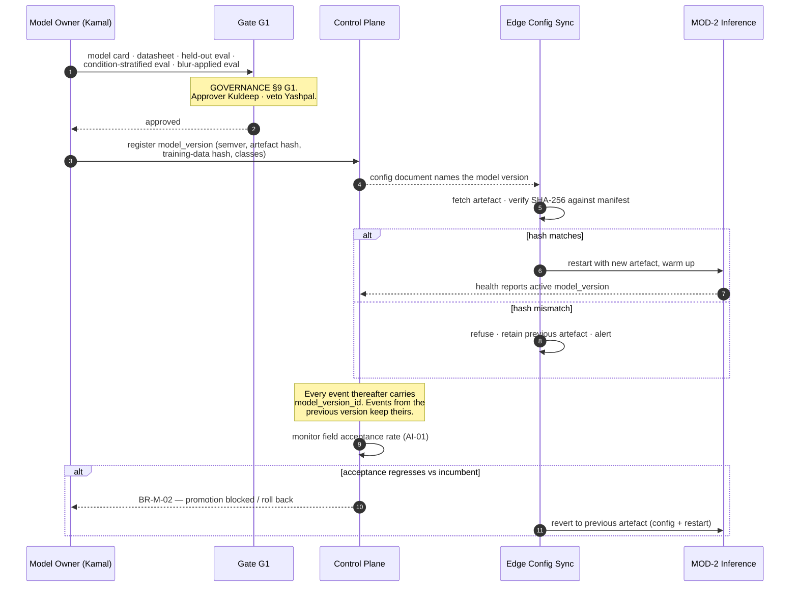

**Why `model_version_id` is on the event row and not derived:** if a version is later found defective, the affected events must be identifiable exactly. Deriving the version from a deployment timeline is an approximation, and an approximation is not evidence. The previous artefact is retained so rollback is a config change plus a restart, not a rebuild.

## 6.8 RS-8 — Retention run `[V1]`

**Proves:** BR-009 — deletion is enforced *and recorded*; and BR-AU-04 `[PROPOSED]` — the audit outlives what it audits.

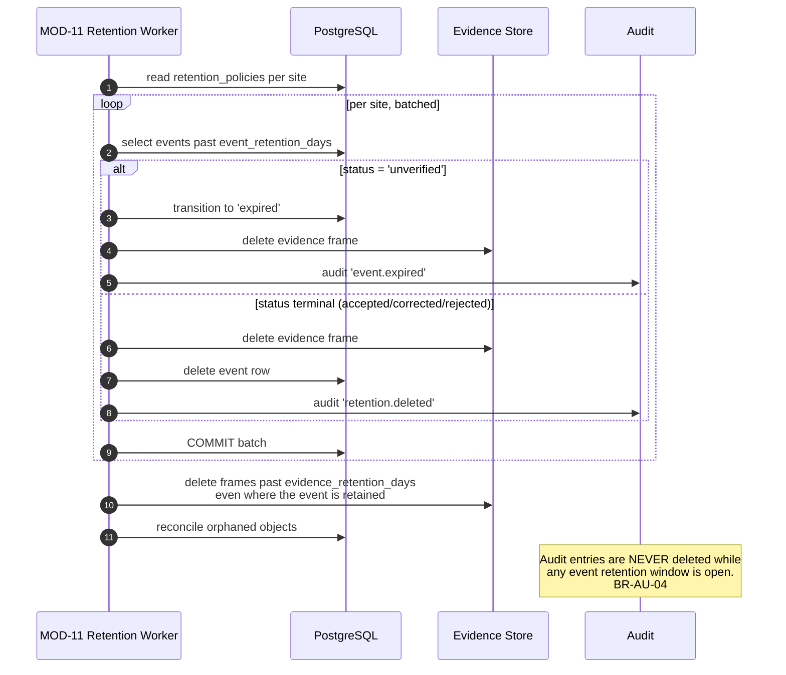

**Expiry is not deletion.** An expired candidate is a *recorded outcome* — "no reviewer reached this in time" — and per [RULE_BOOK.md](RULE_BOOK.md) §3.1 it is explicitly "a recorded outcome, not a deletion". Its evidence frame goes; the row stays until its own retention elapses. Deleting expired candidates silently would make reviewer under-capacity invisible, which is the exact failure BR-W-02 `[PROPOSED]` exists to prevent.

**Aggregate counts survive deletion.** Per [RULE_BOOK.md](RULE_BOOK.md) §8.1, rejection counts persist after the underlying records are deleted, because the counts contain no personal data. Where those counts are materialised is a data-model decision — see [DATABASE.md](DATABASE.md).

**MVP consequence:** MOD-11 and `retention_policies` are `[V1]`. In `[MVP]` there is **no automated retention enforcement and no mechanism that can set `expired`.** Pilot retention is handled by setting a short period manually and by the pilot's own data agreement (TRD §13.3). BR-009 is an `ACTIVE STRONG` rule with no technical enforcement point at MVP — this is a known, temporary gap and is recorded in §11 R-5 and `AMD-DB-03`.

---

# 7. Deployment View

## 7.1 MVP / pilot — single node `[MVP]`

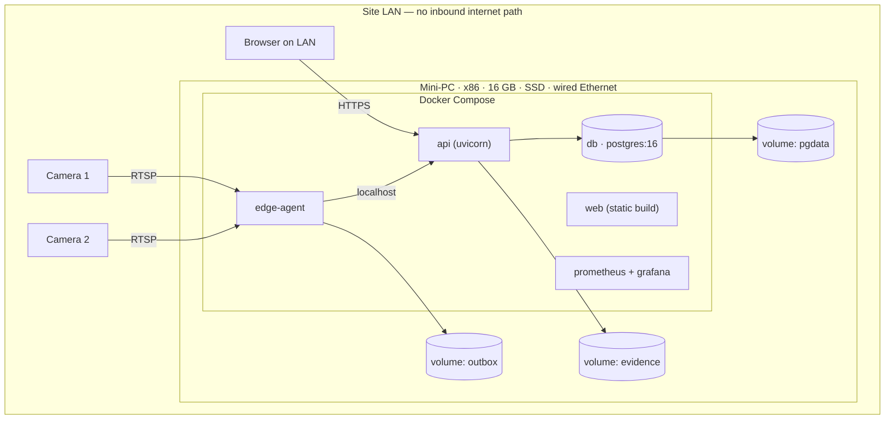

| Property | Value | Consequence |
|---|---|---|
| Planes co-located | Both on one host | BR-008 holds absolutely — nothing leaves the site at all |
| External exposure | **None** | Remote support is impossible by construction; on-site or customer-mediated access only |
| Backup | Nightly database dump to a separate volume | Single-host failure loses at most one day; acceptable for pilot, **not** for `[V1]` |
| TLS | Self-signed or internal CA on the LAN | Browser trust must be configured per site — a real onboarding cost (PRD P-06) |

> **The MVP topology is not a scaled-down production system; it is a different system.** It has no network partition between planes, so RS-2 cannot occur naturally and must be tested with a synthetic fault (TRD §19.5). Treating pilot stability as evidence of production resilience would be a category error.

## 7.2 Production — distributed `[V1]`

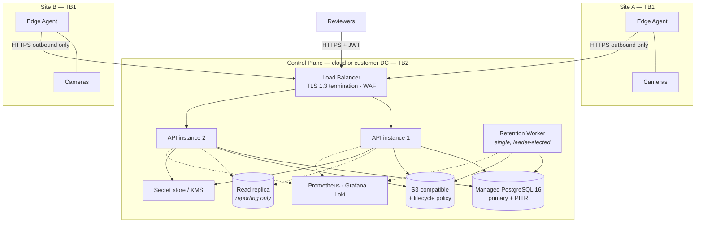

| Node | Scaling | Constraint |
|---|---|---|
| Edge agent | Per site; add agents per camera group. Share nothing. | Cameras per device `[OPEN — PRD OQ-9]` — benchmark, never assume |
| API | Stateless; add instances | None material — the workload is I/O-bound |
| PostgreSQL | Single write primary; read replica for reporting | Write volume across many sites is the eventual limit → sharding by site `[V2+]` |
| Retention Worker | **Exactly one instance**, leader-elected | Concurrent deletion is not desirable; it also makes deletion auditing racy |
| Evidence store | Independent | Growth is bounded only by retention enforcement |

## 7.3 Network flows

| Flow | Direction | Port / protocol | Initiated by | Notes |
|---|---|---|---|---|
| Camera → Edge | Inbound to agent | 554/TCP RTSP (or vendor) | Agent | Site LAN only; credentials from local encrypted config |
| Edge → Control plane | **Outbound only** | 443/TCP HTTPS | **Agent** | Events, gaps, health, config pull. No inbound path exists. |
| Browser → Control plane | Inbound | 443/TCP HTTPS | Browser | JWT; CORS allowlist; CSP |
| API → Database | Internal | 5432/TCP, TLS | API | Least-privilege role — see [DATABASE.md](DATABASE.md) |
| API → Evidence store | Internal / outbound | 443/TCP | API | Filesystem at `[MVP]` |
| Scrape → both planes | Inbound, internal | HTTP metrics | Prometheus | Never exposed publicly |

> **"Outbound only" is the property P-4 (IT/Network Admin) will interrogate first**, and it is the objection most likely to stop a deployment (PRD §6.4). It is worth stating in the customer's own terms: *Guardian Lens requires no firewall rule permitting inbound traffic to your site, and no VPN.* The cost of that property is recorded in ADR-010.

## 7.4 Environments

Not restated — [TRD.md](TRD.md) §13.1 is authoritative. One architectural note: the **CI environment has no camera**, so a recorded video file replaces the live stream. This tests the workflow, not the detector, and is legitimate for exactly that reason ([TRD.md](TRD.md) §13.2). No claim about detection quality may be drawn from a CI run.

---

# 8. Crosscutting Concepts

## 8.1 Persistence

Deferred entirely to **[DATABASE.md](DATABASE.md)**, which is normative for the data model, constraints, indexes, migration and retention mechanics. Two architectural properties belong here rather than there:

1. **The database is an enforcement point, not a store.** Reversing TD-005 (PostgreSQL) does not merely change technology — it removes the fourth defence layer in §4.2 and demotes quality goal 1 from *guaranteed* to *asserted*. Any proposal to change the primary datastore is T3 by definition.
2. **The edge store is not a system of record.** SQLite at the edge is a durable buffer. Data it holds is either delivered or explicitly accounted for as a gap; it is never the only copy of something the customer is entitled to.

## 8.2 Security and threat model

> **New in this document, and required for gate G0** ([GOVERNANCE.md](GOVERNANCE.md) §9: *"Security architecture, threat model and key management documented and reviewed"*). [TRD.md](TRD.md) §12.1 identifies trust boundaries; it does not enumerate threats against them. Controls below are cited to TRD §12 where they exist; where they do not, the gap is stated.

### 8.2.1 Trust boundaries

| ID | Boundary | Crossing | Assets on the inside |
|---|---|---|---|
| **TB1** | Customer site | Camera → Agent (RTSP, LAN) | Raw video, camera credentials, model artefact, outbox |
| **TB2** | Control plane | Agent → API; API → data stores | Verified records, audit log, evidence frames, user credentials |
| **TB3** | User browser | Browser → API | Session token, queue contents, evidence frames |
| **TB4** | Operator / supply chain | Deploy, dependencies, images, migrations | Everything — this boundary crosses the other three |

### 8.2.2 STRIDE per boundary

| # | Boundary | STRIDE | Threat | Control | Residual |
|---|---|---|---|---|---|
| T-01 | TB1 | **S** | Attacker on the site LAN impersonates a camera and feeds fabricated frames | Cameras are configured explicitly; unknown sources are not polled | **Real.** RTSP offers no source authentication. Consequence is limited to false candidates a human must reject. `[OPEN]` |
| T-02 | TB1 | **I** | Camera credentials read from the agent host | AES-256-GCM at rest, key from the secret store (TRD §12.4); never transmitted to the control plane; never logged (TRD §15.3) | Host compromise exposes the decryption path. BR-S-03 `[PROPOSED]` |
| T-03 | TB1 | **T** | Model artefact swapped for one with prohibited capability | SHA-256 verified against the manifest on load (TRD §12.6 A08); agent refuses to start on mismatch | Depends on manifest integrity — see T-14 |
| T-04 | TB1→TB2 | **S** | Stolen agent credential used to inject events | TLS 1.3 + agent credential (TRD §12.2); mTLS `[V1]`; rate limit 1000/min/agent (TRD §12.7) | **Real.** A stolen credential injects plausible candidates and consumes reviewer capacity. **It cannot verify anything** (BR-S-02 `[PROPOSED]`). No volume-anomaly detection is specified — see §11 R-6 |
| T-05 | TB1→TB2 | **T** | Event payload tampered in transit | TLS 1.3 | Accepted |
| T-06 | TB1→TB2 | **D** | Agent floods ingest | Per-agent rate limit; outbox backpressure | Accepted |
| T-07 | TB1→TB2 | **E** | Agent principal attempts to decide an event | Agent principals are a **separate table** from users; no role can be granted to one. Bypass suite asserts 403. | Structurally excluded (BR-S-02 `[PROPOSED]`) |
| T-08 | TB3 | **S** | Credential stuffing / session theft | Argon2id; 5/min/IP login limit; 15-min access token; rotating refresh with reuse detection (TRD §12.2, §12.7) | Accepted |
| T-09 | TB3 | **R** | Reviewer denies making a decision | Identity from token only (BR-S-01); decision immutable by trigger (BR-AU-02); audit entry in the same transaction | **Gap: the audit log has no integrity chaining.** See T-12 |
| T-10 | TB3 | **I** | Evidence frame retrieved by an out-of-scope user | Object-level authorisation check (TRD §12.3); repository scope filter | **Depends on the evidence key being unguessable** — a [DATABASE.md](DATABASE.md) decision. Direct-object-reference risk if keys are sequential |
| T-11 | TB3 | **E** | Reviewer acts outside site/zone scope | Route-level role assertion **plus** repository-level scope filter, so a controller bug alone cannot leak (TRD §12.3) | Accepted — two independent layers |
| T-12 | TB2 | **T/R** | Privileged database user edits or deletes audit rows | Trigger rejects UPDATE/DELETE via any application path (BR-AU-01) | **Real and unmitigated.** A superuser can drop the trigger. No hash chain, no WORM storage, no off-box audit replication. See §11 R-1 |
| T-13 | TB2 | **I** | Backup or replica read outside controls | Backups encrypted with a separate key (TRD §12.4); read replica is reporting-only | Replica access control is `[OPEN]` at `[V1]` |
| T-14 | TB4 | **T** | Malicious or vulnerable dependency; unsigned image | Dependency scanning, pinned versions, secret scanning, Bandit/Semgrep every CI run (TRD §12.8); signed images `[V1]` | Accepted at `[MVP]`; image signing is a `[V1]` commitment |
| T-15 | TB4 | **T** | Migration silently drops a rule-enforcing constraint | T2/T3 change control ([GOVERNANCE.md](GOVERNANCE.md) §8.2); bypass suite must pass **unmodified**; suite and code may not change in one PR | Strong — this is the cheapest control in the system and the easiest to lose |
| T-16 | TB4 | **E** | Prohibited capability enters the dependency graph | Fitness function FF-5 asserts the denylist in CI (ADR-011) | Requires the denylist to be maintained; a novel library name evades it |

### 8.2.3 Two findings worth escalating

| Finding | Why it matters | Proposal |
|---|---|---|
| **T-12 — audit integrity depends on nobody having database superuser** | Quality goal 1 is *auditability*, and the product's value proposition is a defensible record. Against an insider with database administration rights, the current design offers deterrence, not evidence. | `[V1]`: hash-chain `audit_log` rows (each row carries the hash of the previous), and replicate the chain head off-box daily. Neither is expensive. Raise as an ADR before G7. |
| **T-04 — no anomaly detection on agent event volume** | A stolen agent credential produces plausible events indefinitely. The damage is reviewer capacity — which [TRD.md](TRD.md) §18.3 identifies as the binding constraint on the whole product. | Alert on per-agent event rate deviating from its own trailing baseline. Cheap, and it also catches a misconfigured rule, which is the far more likely cause. |

## 8.3 Identity, sessions and key management

Mechanisms are [TRD.md](TRD.md) §12.2 and §12.5 and are not restated. The architectural properties:

| Property | Statement |
|---|---|
| **Two principal types, structurally separated** | `users` and `agents` are different tables with different credential columns. An agent cannot be granted a role because the role-grant relation does not reference it. BR-S-02 `[PROPOSED]` is a schema property, not a policy. |
| **Reviewer identity is never an input** | It is resolved from the validated token by MOD-12 and passed to MOD-7 as a server-side value. No interface accepts it. |
| **Key custody** | JWT private key never leaves the control plane. Camera-credential decryption key lives in the secret store, and the *decrypting* component is the edge agent — the control plane can store a camera credential it cannot read. |
| **No secret in the repository at any phase** | Enforced by a pre-commit secret scanner plus CI (TRD §12.5). |
| **Rotation** | 90d database, 180d JWT with overlap, 365d or on-compromise for agents (TRD §12.5). All `[V1]`; at `[MVP]` rotation is manual and that is a stated limitation. |

## 8.4 Error handling and degradation

The system has one governing rule for failure: **every failure produces either a recorded gap or a visible alert. There is no state in which the system appears to be watching but is not** (TRD §5.6; BR-W-03 `[PROPOSED]`).

| Class | Example | Behaviour | Visible where |
|---|---|---|---|
| Transient, single-item | One frame fails to decode | Drop, count, continue | Metrics only |
| Transient, sustained | Inference failure rate crosses threshold | `Degraded`; camera marked; alert | UI + alert |
| Structural | Model artefact missing or hash mismatch | Refuse to start; `Halted` | Alert; gap for every camera |
| Connectivity | Control plane unreachable | Buffer; retry indefinitely | Metrics; alert on backlog |
| Capacity | Outbox at disk cap | **Halt detection**, open gap | Critical alert |
| Data-layer refusal | CHECK or trigger rejects a write | Transaction fails; nothing partial persists | 4xx/5xx + error log |

**The anti-pattern this excludes:** a `try/except` that swallows an inference or write failure and continues. It converts a loud failure into a silent one, and every silent failure in this product is indistinguishable from a safe site.

## 8.5 Prohibited capabilities as an enforced concept

BR-002, BR-003, BR-006 and BR-P-01 `[PROPOSED]` are guaranteed by *absence*, and absence decays silently. The architecture therefore treats the prohibition list as an artefact with a test (ADR-011):

| Check | Mechanism | Rule |
|---|---|---|
| No face-recognition / re-identification / biometric / emotion library in either plane's dependency graph | CI denylist assertion over the resolved lock file | BR-006 |
| No audio codec or capture dependency at the edge | Same | BR-P-01 `[PROPOSED]` |
| No HTTP client bound to an HR, performance or disciplinary endpoint; no configurable outbound webhook | Static analysis of the integration layer (`NoActionGuard`, TRD §6.3) | BR-003 |
| No schema column expressing a per-person measure | Schema review at **every** migration (RULE_BOOK §6) + bypass-suite query attempt | BR-002 |
| No bulk-decision route registered | Route-table assertion → 404 | BR-V-02 `[PROPOSED]` |

## 8.6 Privacy by construction

| Concern | Structural answer |
|---|---|
| Can the system identify a worker? | No entity exists to attach an identity to. RULE_BOOK §3.2 has no *worker is identified* fact type — a feature requiring it cannot even be expressed. |
| Can it measure an individual? | No column, no endpoint, no aggregate. Extended to **logs** — a "user X reviewed 47 events" line is a productivity metric and is prohibited (TRD §15.3). |
| How much imagery leaves the site? | One still frame per event, optionally face-blurred, and the transport is configurable. Never video, never audio. |
| What does the worker know? | Worker notice before go-live, and consultation where representation exists — BR-P-02 `[PROPOSED]`, gate G3. **This has no technical enforcement point and cannot acquire one** (RULE_BOOK §6). |
| What is the accuracy cost of blurring? | Real and measured with blurring applied, never averaged away (BR-M-04 `[PROPOSED]`). See §10.3 T-4. |

## 8.7 Observability

Channels, formats and prohibitions are [TRD.md](TRD.md) §15–§16 and are not restated. Architecturally:

- **The audit trail is a database table, not a log file** (TRD §15.5). Files rotate, truncate and get lost; the audit trail is a product feature. Logs are an operational aid and are never the record.
- **Four separate log channels** exist so the audit channel stays usable for its purpose; mixing them destroys that.
- **A metric that would constitute a per-person measure is prohibited exactly as a feature would be.** The prohibition follows the data, not the surface it appears on.

## 8.8 Time

See **ADR-007**. Summary: `occurred_at` comes from the edge clock and is what the reviewer is shown; `received_at` comes from the control plane and is what ordering and retention use. Both are stored, both are `TIMESTAMPTZ`, and a skew beyond tolerance is an alertable condition rather than a silent correction. Display is in the **site's** IANA timezone, not the viewer's (NFR-L-02).

## 8.9 Configuration management

| Property | Value |
|---|---|
| Direction | **Pull only** — the agent requests; the control plane never pushes (ADR-008, ADR-010) |
| Consistency | Eventual, bounded by one sync interval; the applied version is reported back in health |
| Failure behaviour | Invalid or unreachable configuration → **retain last-known-good**, log, report mismatch. Never fall back to a default rule set — that would violate BR-001. |
| Attribution | Every change carries the acting user and writes an audit entry in the same transaction (BR-010, BR-C-01 `[PROPOSED]`) |
| Secrets in config | Camera credentials are delivered encrypted and decrypted only at the edge |

---

# 9. Architecture Decisions

## 9.1 How decisions are recorded

Per [GOVERNANCE.md](GOVERNANCE.md) §8.5: Nygard four-part format — **Status · Context · Decision · Consequences** — numbered `ADR-nnn`, append-only. A superseded ADR is marked superseded, never deleted.

**Numbering is one sequence across the project.** [GOVERNANCE.md](GOVERNANCE.md) §19.3 issued ADR-001…ADR-006. This document continues at **ADR-007**. The register below is the index; the body of each ADR lives in whichever document is normative for its subject, so no decision is written twice.

The TRD's Technical Decisions Register (TD-001…TD-017) is the **seed set** and is migrated to individual ADRs at the first architectural change ([GOVERNANCE.md](GOVERNANCE.md) §8.5). It is not migrated here, because migrating it now would create a second copy of seventeen decisions that are already recorded and stable.

## 9.2 Decision register

| ID | Decision | Status | Body lives in |
|---|---|---|---|
| ADR-001…006 | Governance decisions | Accepted | [GOVERNANCE.md](GOVERNANCE.md) §19.3 |
| TD-001…017 | Technology and topology seed set | Accepted | [TRD.md](TRD.md), Technical Decisions Register |
| **ADR-007** | Time authority: edge clock for observation, control-plane clock for ordering | Accepted | §9.3 below |
| **ADR-008** | Configuration is pull-only with bounded staleness | Accepted | §9.4 below |
| **ADR-009** | The edge agent has one explicit operating-state machine | Accepted | §9.5 below |
| **ADR-010** | No inbound path to the customer site, ever | Accepted | §9.6 below |
| **ADR-011** | Prohibited capabilities are enforced by a CI fitness function, not by review | Accepted | §9.7 below |
| **ADR-012** | Multi-site isolation is logical, not physical | Accepted | §9.8 below |
| **ADR-013** | Evidence presence is a precondition of a decision | **Proposed** — needs PRD confirmation | §9.9 below |
| **ADR-014** | Event identity is client-generated and time-ordered | Accepted | [DATABASE.md](DATABASE.md) |
| **ADR-015** | Audit integrity is chained and replicated off-box `[V1]` | **Proposed** — raised by T-12 | [DATABASE.md](DATABASE.md) |

## 9.3 ADR-007 — Time authority

**Status:** Accepted.

**Context.** Events carry both `occurred_at` (when the condition was observed) and `received_at` (when the control plane received it). [TRD.md](TRD.md) §9.5 defines both columns but does not say which is authoritative for what. Edge devices sit on customer networks that may lack NTP; clock skew is not hypothetical. Three things depend on the answer: what the reviewer sees, how the queue orders, and when retention fires.

**Decision.**

| Purpose | Authoritative clock | Why |
|---|---|---|
| What the reviewer is shown | **`occurred_at`** — edge clock | It is what the customer's own records and CCTV timeline will say |
| Queue ordering and pagination cursors | **`received_at`** — control-plane clock | Monotonic per receiver; immune to edge skew and to backlog replay |
| Retention window start | **`received_at`** | Retention must not be shortened or extended by a wrong edge clock |
| Reporting period boundaries | **`occurred_at`**, rendered in the **site's** timezone | A shift report must align with the shift |

Skew is measured on every health beat as `received_at − sent_at`. Beyond tolerance, the agent is marked `degraded` and an alert is raised. **Timestamps are never silently corrected** — a corrected timestamp is a fabricated observation.

**Consequences.**
- Both timestamps are stored, always, and neither is derived from the other.
- After an outage, replayed events have old `occurred_at` and new `received_at`. The queue shows them in arrival order with their true observation time — and the UI must make the delay visible, or a reviewer will read a stale event as current.
- Reporting over a period is not identical to reporting over an ingest window. Any report stating a period must say which basis it used (BR-R-02).
- Skew tolerance value is `[OPEN]`; design intent is seconds, not minutes.

## 9.4 ADR-008 — Configuration is pull-only with bounded staleness

**Status:** Accepted.

**Context.** The control plane must deliver rule, zone, camera and model configuration to agents. Push requires an inbound path to the site or a persistent connection; pull requires accepting delay. BR-001 makes activation state a rule-critical property, so how it propagates is not merely operational.

**Decision.** Agents **pull** configuration on an interval, using conditional requests. The control plane never initiates. The agent validates every document, applies it atomically, retains the last-known-good on any failure, and **reports the applied `config_version` in its health beat.**

**Consequences.**
- Activation and deactivation are eventually consistent, bounded by one sync interval. A rule deactivated at 09:00:00 may still fire at 09:00:20; the resulting event is legitimate and carries the rule snapshot proving what fired.
- The control plane's view of a site's monitored scope is an *intention*. The agent's reported `config_version` is the *fact*. A mismatch persisting beyond one interval is alertable — without this, BR-001 is asserted rather than observed.
- No inbound firewall rule, no VPN, no persistent socket (see ADR-010).
- Emergency deactivation is not instantaneous. If a customer ever requires instant stop, that is a new capability requiring its own decision — not a tuning change.
- Interval value `[OPEN]`; design intent tens of seconds.

## 9.5 ADR-009 — One explicit agent operating-state machine

**Status:** Accepted.

**Context.** [TRD.md](TRD.md) §5.6 lists fallback behaviours per failure, and §9.9 gives agents a `status` of `active`/`degraded`/`offline`. Between them there is no single definition of which conditions cause which transitions, so "degraded" means different things in different modules and nothing enforces that a halted agent is loud.

**Decision.** The agent has exactly one operating state — `Starting` · `Healthy` · `Degraded` · `Halted` — with the transitions in §6.6. Every module reports conditions into it; no module decides independently whether to keep emitting. Entering `Halted` **always** opens a coverage gap for every affected camera and raises a critical alert.

**Consequences.**
- "Is this site being watched?" has exactly one answer, and it is queryable.
- Sustained degradation stops event generation for a camera. Fewer events is a deliberate choice over wrong events (BR-012).
- The agent-reported state and the control-plane-inferred state (from missed health beats) can disagree; the control plane treats missing health as `agent_down` regardless of last reported state, because a dead agent's last word is not evidence of its current condition.
- Failure-rate thresholds for `Healthy → Degraded → Halted` are `[OPEN]` and must be set from pilot data.

## 9.6 ADR-010 — No inbound path to the customer site

**Status:** Accepted.

**Context.** Persona P-4 (IT/Network Admin) holds an effective veto on deployment, and their primary objection is inbound access (PRD §6.4). Remote support, remote debugging and push configuration all want an inbound path.

**Decision.** All site-originated communication is outbound-initiated over HTTPS on 443. **No inbound path is required, requested or supported** — no VPN, no reverse tunnel, no remote shell, no push channel.

**Consequences.**
- The strongest deployment argument available to the product: *no firewall change is required.*
- **Remote diagnosis is impossible.** Support depends on what the agent chooses to report — health, metrics, structured logs. Diagnostic richness is therefore an architectural requirement, not a nice-to-have.
- Agent updates are pull-based and cannot be forced. A fleet-wide urgent fix propagates at the pull interval, and an offline agent updates when it returns.
- A future "remote support session" feature would reverse this decision, not extend it, and needs its own ADR plus a security review — because it also creates the first path by which video could be requested from a site (BR-008).

## 9.7 ADR-011 — Prohibited capabilities enforced by a CI fitness function

**Status:** Accepted.

**Context.** Four `ABSOLUTE` rules are guaranteed by absence (§4.3). [TRD.md](TRD.md) assigns these to "dependency review" and "code review". Review is a human process with variable attention; absence decays quietly, and nobody notices the day it stops being true.

**Decision.** The prohibition list is a maintained artefact with an executable check that runs on **every** CI execution, alongside the business-rule bypass suite. It asserts the denylist over resolved lock files, the absence of an outbound consequence integration, and the absence of a bulk-decision route.

**Consequences.**
- A prohibited capability entering the dependency graph fails the build rather than surviving to review.
- The denylist is itself maintained — a novel library name evades it. The check reduces the failure rate; it does not eliminate the failure mode. Schema review at every migration remains mandatory (RULE_BOOK §6).
- Per [GOVERNANCE.md](GOVERNANCE.md) §8.2, this check may not be modified in the same pull request as the code it constrains. A PR touching both is automatically T3 and must be split.

## 9.8 ADR-012 — Multi-site isolation is logical, not physical

**Status:** Accepted.

**Context.** [RULE_BOOK.md](RULE_BOOK.md) §3.1 defines a site as single-tenant in v1. `[V1]` serves multiple sites from one control plane. Physical isolation (database per customer) is the strongest option and the most expensive to operate with five people.

**Decision.** One control plane, one database. Isolation is by `site_id`, enforced at the **repository layer** so that every query is scoped regardless of caller, with role grants scoped by site from the start (`user_roles` carries `site_id`).

**Consequences.**
- Repository-level scoping means an authorisation bug in a controller cannot leak across sites — the layer below has already filtered (TRD §12.3).
- Cross-site data exposure becomes a single-defect risk rather than an impossibility. The bypass suite must include a cross-site read attempt.
- A customer contractually requiring physical isolation triggers a separate deployment of the whole control plane, not a code change. Priced and scoped as such.
- No schema migration is needed to add sites — site scoping exists from `[MVP]` even though `[MVP]` has one site.

## 9.9 ADR-013 — Evidence presence is a precondition of a decision

**Status:** **Proposed.** Requires product confirmation — see `AMD-ARCH-05`.

**Context.** [TRD.md](TRD.md) §2.1 describes the evidence frame as optional ("at most one still image per event"), and `events.evidence_ref` is nullable. Meanwhile the product's core claim is an attributable human judgement. A decision taken with no evidence available is attribution without basis — and the reviewer may not even know the evidence was missing rather than absent by configuration.

**Decision (proposed).** Where a site has evidence transport **enabled**, the review interface must not enable decision controls until the evidence frame has loaded; failure to retrieve it is shown explicitly (§6.3 F-6). Where a site has evidence transport **disabled** by configuration, the review interface states that no evidence exists for the site, so the reviewer knows they are deciding on metadata alone.

**Consequences.**
- Evidence retrieval sits on the critical path for reviewer latency (quality goal 3), which raises the importance of §10.2 QS-3.
- A site that disables evidence transport gets a materially weaker record. That is the customer's decision to make knowingly — it should not be discoverable only by noticing blank frames.
- **Needs PRD confirmation**, because "may a reviewer decide with no evidence?" is a product question, not an architecture question.

---

# 10. Quality Requirements

## 10.1 Quality tree

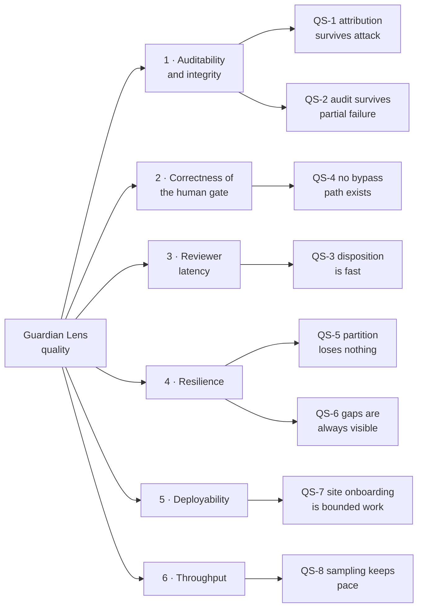

## 10.2 Quality scenarios

> **New in this document.** [TRD.md](TRD.md) §1.3 ranks quality attributes but states none in a testable form. A ranked list cannot fail a test.
>
> Where a target depends on a measurement that does not yet exist, the row says `[OPEN]` with its closure reference. Per BR-M-01 `[PROPOSED]` and AP-2, inventing a number here would be worse than leaving it open.

| ID | Attribute | Stimulus | Environment | Response | Measure |
|---|---|---|---|---|---|
| **QS-1** | Integrity | An actor with API access and a valid session attempts to create a verified record with no reviewer, alter a decision, or modify the audit log | Any environment, including production | Every attempt is refused by the data layer, not merely by the application | **100% of bypass-suite attempts refused, every CI run.** A single failure blocks release regardless of feature completeness (TRD §19.4) |
| **QS-2** | Integrity | The audit insert fails during a decision | Under load or database contention | The decision transaction rolls back completely; no orphan record | **Zero** decision rows without a corresponding audit row, asserted by integration test (TRD §19.3) |
| **QS-3** | Reviewer latency | A reviewer opens the queue and disposes of one event | Pilot site, expected volume, keyboard-only | Queue lists, evidence loads, decision commits | Queue list **sub-second**; decision commit **sub-second**; end-to-end median disposition time `[OPEN — PRD P-02, GQ-3]`. GQ-3 also sets the floor **below** which the gate is presumed cosmetic |
| **QS-4** | Human gate | Any client attempts bulk disposition, confidence-based auto-approval, or decision as an agent principal | Any | The route does not exist (404), or the principal is refused (403) | **No such route in the route table; no such code path.** Asserted by route-table test and bypass suite |
| **QS-5** | Resilience | Network between planes fails for an extended period, then recovers | Pilot and production | Events buffer; on recovery all are delivered exactly once, oldest first | **Zero** lost events; **zero** duplicate rows; buffered duration until disk cap `[OPEN — PRD OQ-4]` |
| **QS-6** | Resilience | A camera stream drops, or the agent dies entirely | Any | A coverage gap is opened and is visible alongside any report covering that window | **100%** of analysis interruptions have a gap record. `agent_down` resolution is bounded by the health-beat interval |
| **QS-7** | Deployability | A new site with 1–3 cameras is onboarded | Field, by one engineer | Cameras configured, zones drawn, rules written and explicitly enabled | Effort per site `[OPEN — PRD P-06]`. **This metric determines whether Guardian Lens is software or a services business** |
| **QS-8** | Throughput | Cameras stream continuously at the configured sample rate | Target edge hardware | Inference keeps pace without frame-queue growth | Cameras per device `[OPEN — PRD OQ-9]` — **benchmarked on real hardware, never estimated** |

## 10.3 Sensitivity and tradeoff points

ATAM terminology: a **sensitivity point** is where one decision strongly determines one quality attribute; a **tradeoff point** is where a decision moves two attributes in opposite directions. Tradeoff points are where architecture arguments actually happen, so they are named in advance.

| ID | Type | Point | Affects | Note |
|---|---|---|---|---|
| **S-1** | Sensitivity | TD-002 split plane | BR-008 compliance; reviewer latency; deployability | Reversing it breaks BR-008 as a *topological* guarantee and reduces it to policy. Highest-cost reversal in the system. |
| **S-2** | Sensitivity | TD-005 PostgreSQL as an enforcement point | Quality goal 1 | Any datastore change removes defence layer 4 (§4.2). T3 by definition. |
| **S-3** | Sensitivity | Repository-level scope filtering | Cross-site isolation (ADR-012) | The single layer standing between a controller bug and a cross-customer leak. |
| **T-1** | **Tradeoff** | Evidence frame transport on/off | Privacy (BR-008) ↕ record quality and reviewer confidence | Off maximises privacy and produces a weaker record. Must be the customer's informed choice — ADR-013. |
| **T-2** | **Tradeoff** | Sample rate (default 2 fps) | Inference cost / cameras per device ↕ probability of observing a brief exception | Higher rate finds more and costs linearly more. Closure needs OQ-9 and OQ-4 together. |
| **T-3** | **Tradeoff** | Confidence threshold | Reviewer load ↕ missed exceptions | **The product's central tension** (RULE_BOOK §8.1: BR-004 vs P-01). Resolution is *fewer and better candidates*, never a weaker gate. Raising the threshold to protect reviewers is a safety decision, not a tuning decision. |
| **T-4** | **Tradeoff** | Face blurring on/off | Privacy ↕ detection accuracy on the helmet class | The cost is real, measured with blurring applied, and stated to the customer — never averaged away (BR-M-04 `[PROPOSED]`, RULE_BOOK §8.1). |
| **T-5** | **Tradeoff** | Outbox disk cap behaviour | Event completeness ↕ continuity of detection | Halting detection preserves the record's integrity and stops monitoring. Dropping old events would keep monitoring and silently corrupt the record. **Halting is correct** (BR-W-02 `[PROPOSED]`). |
| **T-6** | **Tradeoff** | Config pull interval | Activation latency ↕ request load and battery/CPU at edge | Bounded staleness is accepted; see ADR-008. |
| **R-1** | Risk | Single write primary | Availability of ingest and decision | Acceptable at expected volume; sharding by site is `[V2+]` (TRD §18.4). |

## 10.4 Architecture fitness functions

Executable checks that keep the architecture true over time. Each runs in CI; each maps to a scenario or a rule.

| ID | Fitness function | Fails when | Covers |
|---|---|---|---|
| **FF-1** | Business-rule bypass suite (TRD §19.4) | Any ABSOLUTE rule becomes violable via API or direct SQL | QS-1, QS-4 |
| **FF-2** | Transaction-pairing test | A decision row exists without its audit row, or a config change without its audit row | QS-2, BR-AU-03/BR-C-01 `[PROPOSED]` |
| **FF-3** | Route-table assertion | A bulk-decision or per-person-aggregate route is registered | QS-4, BR-V-02/BR-002 |
| **FF-4** | Layer-dependency assertion | A controller imports a repository directly, or a repository contains a business decision (TRD §6.1) | Maintainability of §4.2 |
| **FF-5** | Prohibited-capability denylist over lock files | A biometric, re-identification, emotion or audio dependency appears | ADR-011, BR-006/BR-P-01 |
| **FF-6** | Outbound-integration static analysis (`NoActionGuard`) | Any HR/performance/disciplinary client or configurable outbound webhook exists | BR-003 |
| **FF-7** | Report-filter query-builder test | A report query omits `status IN ('accepted','corrected')` | BR-R-01 |
| **FF-8** | Clean-instance test | A freshly provisioned site has any active rule or emits any event | BR-001 |
| **FF-9** | Cross-site read attempt | A scoped principal can read another site's events or evidence | ADR-012, S-3 |
| **FF-10** | Idempotent-ingest replay test | Re-submitting a delivered batch creates a duplicate row | QS-5 |

> **FF-1 and the rest are never modified in the same change as the code they constrain** ([GOVERNANCE.md](GOVERNANCE.md) §8.2). A pull request touching both is automatically T3 and must be split.

---

# 11. Risks and Technical Debt

Engineering risks are [TRD.md](TRD.md) §21 and technical debt is §22; neither is restated. Listed here are only risks **created by, or visible from, the architecture itself** — those a reader of TRD §21 would not find.

| ID | Risk | Impact | Likelihood | Response |
|---|---|---|---|---|
| **R-1** | **Audit integrity depends on database administrative access being trustworthy.** No hash chain, no WORM, no off-box replication (T-12) | Undermines quality goal 1 and the product's core claim against an insider | Low, high consequence | Raise ADR-015 before G7: chain `audit_log` rows and replicate the chain head off-box. Cheap and closes the gap. |
| **R-2** | Coverage-gap fidelity for `agent_down` is bounded by the health-beat interval | A short outage may be under-recorded, weakening BR-W-01 `[PROPOSED]` | Medium | Set the interval from pilot data; state the resolution limit in the report UI rather than implying precision |
| **R-3** | **Outbox thresholds cannot be set before event volume is known** (`[OPEN — PRD OQ-4]`) | Either premature halting, or a disk full before the alert is useful | High until OQ-4 closes | Measure across a full shift of recorded footage during pilot; treat current values as provisional and log every threshold crossing |
| **R-4** | Reviewer capacity is the binding constraint, and no architectural change relieves it (TRD §18.3) | Product abandonment — PRD RD-01, the highest-rated adoption risk | High | Structural response only: fewer and better candidates via T-3. **Scaling infrastructure here would be scaling the wrong thing.** |
| **R-5** | **BR-009 has no technical enforcement point at `[MVP]`** — MOD-11 and `retention_policies` are `[V1]`, so nothing can set `expired` | An `ACTIVE STRONG` rule is unenforced during pilot, when real customer footage first exists | Certain, by design | Short manual retention during pilot (TRD §13.3) plus the pilot data agreement; MOD-11 lands before the first non-pilot site. Recorded as `AMD-DB-03`. |
| **R-6** | No anomaly detection on per-agent event volume (T-04) | A stolen credential or a misconfigured rule consumes reviewer capacity invisibly | Medium — misconfiguration is far likelier than theft | Alert on deviation from each agent's own trailing baseline |
| **R-7** | Self-signed or internal-CA TLS at `[MVP]` requires per-site browser trust configuration | Onboarding friction, feeding QS-7 and PRD P-06 | Certain at `[MVP]` | Document as an onboarding step and measure its cost during pilot; it is part of the answer to "software or services?" |
| **R-8** | Pilot topology has no inter-plane network partition, so RS-2 never occurs naturally | False confidence in resilience carried into `[V1]` | Medium | Fault injection is mandatory in CI and in UAT (TRD §19.5); pilot stability is **not** evidence of production resilience |

### Architecture-level debt accepted deliberately

| Debt | Why accepted | Repayment trigger |
|---|---|---|
| Single control-plane database, no sharding | Correct at expected volume; sharding now would be speculative | Write volume across sites approaches the primary's limit (`[V2+]`) |
| No message broker | Outbox provides the same delivery guarantee with one fewer component to operate (TD-007) | Sustained high volume across many sites |
| Manual key rotation at `[MVP]` | Automated rotation needs a managed secret store, which is `[V1]` infrastructure | `[V1]` |
| Report aggregates not materialised | Premature before OQ-4 volume figures exist (TRD §17.4) | Report latency becomes visible to users |

---

# 12. Glossary

The normative vocabulary is [RULE_BOOK.md](RULE_BOOK.md) §3.1 (terms) and §3.2 (fact types) and is **not duplicated here** — a second copy of a definition is a second thing that can drift. Terms used in this document that are architectural rather than business:

| Term | Meaning here |
|---|---|
| **Plane** | One of the two independently deployable halves: edge plane (on site) and control plane (central) |
| **Container** (C4) | An independently deployable and runnable unit — a process, a database, a browser app. Not a Docker container, though here they mostly coincide |
| **Building block** (arc42) | A structural element at any level of decomposition |
| **Trust boundary** | A line across which the identity or intent of the caller cannot be assumed |
| **Fitness function** | An executable check asserting that an architectural property still holds |
| **Sensitivity point** | A decision that strongly determines one quality attribute |
| **Tradeoff point** | A decision that moves two quality attributes in opposite directions |
| **Bounded staleness** | Configuration is eventually consistent within a known maximum delay |
| **Negative architecture** | Properties held by the deliberate absence of a component, field or route (§4.3) |
| **Last-known-good** | The configuration or artefact retained when a new one fails validation |

---

# Appendix A — Amendments proposed to the TRD

**These are not edits.** [GOVERNANCE.md](GOVERNANCE.md) §19.1 assigns [TRD.md](TRD.md) to Kapil under ADR + T2/T3 change control. Each item below is a proposed amendment for the owner to accept, reject or defer. Rejections should be recorded, not discarded ([GOVERNANCE.md](GOVERNANCE.md) §8.3).

| ID | TRD ref | Issue | Proposed amendment | Tier |
|---|---|---|---|---|
| **AMD-ARCH-01** | §2 | TRD §2 begins at the container level; there is no system context view, so the set of external systems — and the set deliberately excluded — is not stated as a boundary anywhere | Add a pointer from §2 to ARCHITECTURE.md §3, or absorb the context view | T1 |
| **AMD-ARCH-02** | §2, §11 | Only one runtime scenario exists (§11.3, verification). Partition recovery, degradation and configuration propagation — the three highest-risk behaviours — have no runtime description | Mark §11 as a summary view of ARCHITECTURE.md §6 | T1 |
| **AMD-ARCH-03** | §9.5, §17.2 | `occurred_at` and `received_at` are both defined but neither is declared authoritative for display, ordering or retention. Edge clock skew is unhandled | Adopt ADR-007; reference it from §9.5 | **T2** — affects retention logic |
| **AMD-ARCH-04** | §5.6, §9.9 | Fallback behaviours are listed per failure, and `agents.status` has three values, but no single state machine defines the transitions. "Degraded" is under-specified | Adopt ADR-009; reference from §5.6 | T1 |
| **AMD-ARCH-05** | §2.1, §9.5 | The evidence frame is described as optional and `evidence_ref` is nullable, but the TRD does not say whether a decision may be taken with no evidence | Confirm ADR-013 against PRD DP-2 and F-6; if confirmed, state the precondition in §7.1 and §11.3 | **T3** — touches the verification path |
| **AMD-ARCH-06** | §12.1 | Trust boundaries are identified; no threat enumeration exists. G0 requires a documented, reviewed threat model | Mark §12.1 as a summary view of ARCHITECTURE.md §8.2 | T1 |
| **AMD-ARCH-07** | §12, §15.5 | The audit log is trigger-protected against application paths but has no integrity chaining or off-box replication, so it does not withstand a privileged insider (T-12) | Adopt ADR-015 as a `[V1]` commitment before G7 | **T3** — touches BR-AU-01 enforcement |
| **AMD-ARCH-08** | §5.6, §9.7 | `agent_down` is a `coverage_gaps` reason, but a dead agent cannot write it. Nothing states that the control plane infers it from missed health beats, or that gap resolution is bounded by the beat interval | State the inference and its resolution limit in §5.6 and §9.7 | T1 |
| **AMD-ARCH-09** | §3, §12.8 | Prohibited capabilities (BR-002/003/006, BR-P-01) are assigned to "dependency review" and "code review" with no executable check | Adopt ADR-011; add FF-5 and FF-6 to the §12.8 activity table | **T3** — touches ABSOLUTE-rule enforcement |
| **AMD-ARCH-10** | §1.3, §17 | Quality attributes are ranked but not stated in testable form; §17 asserts no numbers, correctly, but leaves no scenario structure to fill once measurements exist | Mark §1.3 as a summary view of ARCHITECTURE.md §10.2, so pilot measurements have a defined home | T1 |

---

# Appendix B — Rule-to-component enforcement map

[RULE_BOOK.md](RULE_BOOK.md) §6 is the normative rule-to-enforcement matrix and its column headings are *layers*. This appendix resolves those layers to **named components and named tests**, so a reviewer assessing T3 impact can identify exactly what a change touches. Where the two disagree, RULE_BOOK.md §6 prevails.

| Rule | Edge component | Control-plane component | Data layer | Fitness function |
|---|---|---|---|---|
| **BR-001** | Config Sync — no rules until first pull; MOD-3 never defaults | MOD-10 Configuration Service | `detection_rules.is_active` default FALSE | FF-8 clean instance |
| **BR-002** | — | No endpoint, no aggregate | **No such column exists** | FF-3 route table; schema review every migration |
| **BR-003** | — | **No integration layer exists** | — | FF-6 `NoActionGuard` |
| **BR-004** | MOD-4 emits `unverified` only | MOD-6 rejects `status`; **only MOD-7** transitions | CHECK constraint | FF-1 bypass suite |
| **BR-005** | — | MOD-12 resolves identity; MOD-7 applies it | NOT NULL + CHECK | FF-1 |
| **BR-006** | MOD-2 loads the detection model only; startup manifest assertion | — | **No identity field exists** | FF-5 denylist |
| **BR-007** | — | MOD-9 repository filter | Row retained as `rejected` | FF-7 query builder |
| **BR-008** | MOD-1/MOD-2 edge-resident; no egress of video | Control plane has no stream ingress and no decoder | — | Network capture at deployment; E2E |
| **BR-009** | — | MOD-11 Retention Worker `[V1]` | Deletion audited | Time-shifted fixture · **absent at `[MVP]`** — see R-5 |
| **BR-010** | — | MOD-8 Audit Service, same transaction | Trigger | FF-2 |
| **BR-011** | — | MOD-10 reference field on rule | — | Onboarding review flags absence |
| **BR-012** | Operating-state machine (ADR-009) — `Halted` emits nothing, loudly | Alerting on missed health | — | Fault injection |
| **BR-S-01** | — | MOD-12 → MOD-7; body `reviewer_id` rejected at validation | — | FF-1 |
| **BR-S-02** `[P]` | — | Agent principals cannot hold roles | **Separate tables; no grant relation** | FF-1 (agent attempts a decision → 403) |
| **BR-V-02** `[P]` | — | **Route does not exist → 404** | — | FF-3 |
| **BR-W-01** `[P]` | Gap Recorder (MOD-1/2/4) | MOD-6 gap ingest; `agent_down` inferred from health | `coverage_gaps` row | QS-6 |
| **BR-AU-01** | — | `AuditRepository` exposes no update/delete | **Trigger rejects UPDATE/DELETE** | FF-1 · **residual risk R-1** |
| **BR-AU-03** `[P]` | — | MOD-7 + MOD-8, one transaction | Rollback on audit failure | FF-2 |
| **BR-C-01** `[P]` | — | MOD-10 + MOD-8, one transaction | Rollback on audit failure | FF-2 |
| **BR-D-03** `[P]` | **MOD-3 contains no inference** — the IF-E2 boundary | — | — | Code review of the deterministic path |
| **BR-M-01** `[P]` | — | — | — | **None possible.** Named approver on every outbound artefact ([GOVERNANCE.md](GOVERNANCE.md) §6.4) |
| **BR-P-02** `[P]` | — | — | — | **None possible.** Gate G3 |

`[P]` = `PROPOSED`; carries no force until ratified ([RULE_BOOK.md](RULE_BOOK.md) §10).

> **The last two rows are the ones to read twice.** They have no technical enforcement point and cannot acquire one. They are exactly as binding as the CHECK constraints above them, and considerably easier to break — which is why [GOVERNANCE.md](GOVERNANCE.md) exists.

---

# Appendix C — Open items

Nothing here is resolved by assumption. Per [GOVERNANCE.md](GOVERNANCE.md) G-5, `[OPEN]` is a legitimate terminal state until evidence exists.

| ID | Open question | Blocks | Closed by | Reference |
|---|---|---|---|---|
| OA-1 | Cameras per edge device | QS-8, sizing, hardware selection | Benchmark on target hardware | PRD OQ-9 |
| OA-2 | Candidate events per shift | Outbox thresholds (R-3), reviewer load model, capacity | Detector run across a full shift of recorded footage | PRD OQ-4 |
| OA-3 | Condition → queue latency target | QS-3 | Pilot measurement | PRD OQ-8 |
| OA-4 | Config sync interval and skew tolerance | ADR-007, ADR-008 | Pilot | — |
| OA-5 | Degradation thresholds (`Healthy → Degraded → Halted`) | ADR-009 | Pilot | — |
| OA-6 | Median-review-time floor below which the gate is presumed cosmetic | QS-3 | Measured, then set — not invented | GOVERNANCE GQ-3 |
| OA-7 | May a reviewer decide with no evidence frame? | ADR-013, AMD-ARCH-05 | Product decision | PRD DP-2, F-6 |
| OA-8 | NVR interface specifics per device | EI-2, MOD-5 | Camera and NVR audit at 3+ sites | PRD OQ-2 |
| OA-9 | Jurisdictional obligations for the first deployment | G0, §2.4 | External legal review | GOVERNANCE GQ-1, GQ-6 |

---

# Change log

| Version | Date | Change | Author | Reviewed by |
|---|---|---|---|---|
| 1.0 | 2026-08-08 | Initial architecture description. arc42 structure, C4 levels 1–3, eight runtime scenarios, STRIDE threat model, ADR-007…ADR-013, quality scenarios and fitness functions. Ten proposed TRD amendments in Appendix A. | — | — |

# Sign-off

| Role | Name | Confirms | Date |
|---|---|---|---|
| Engineering owner | Kapil | The structure is buildable by this team, and Appendix A has been actioned or explicitly deferred | |
| Test & Verification / challenge role | Yashpal | Every quality scenario and fitness function in §10 is executable, and §8.2 residual risks are accepted knowingly | |
| AI Engineering / model owner | Kamal | §6.7 model lifecycle and the IF-E2 determinism boundary match how models are actually built and shipped | |
| Product Owner | Kuldeep | §8.2 and §8.3 are sufficient for the G0 security evidence requirement, and ADR-013 has a product answer | |
