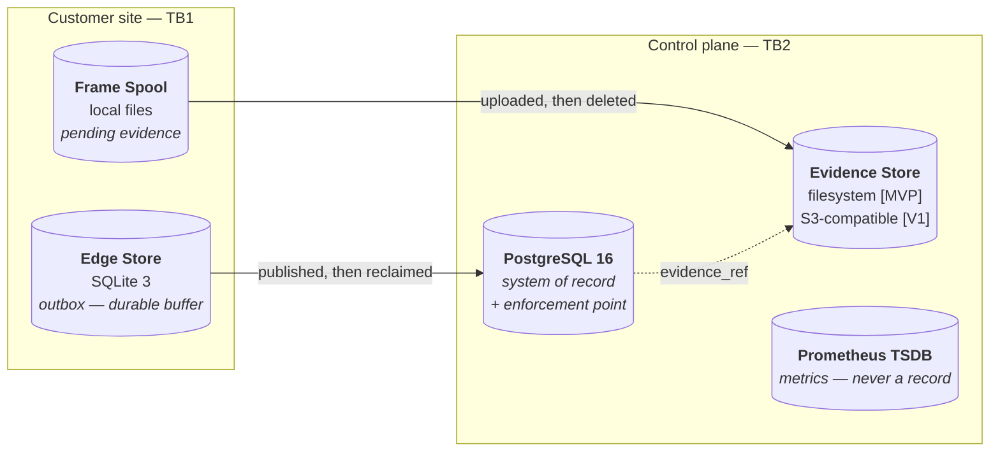
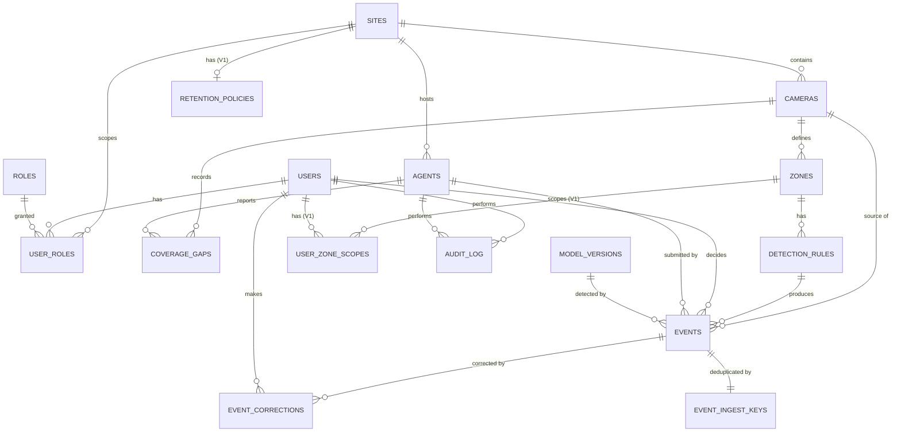
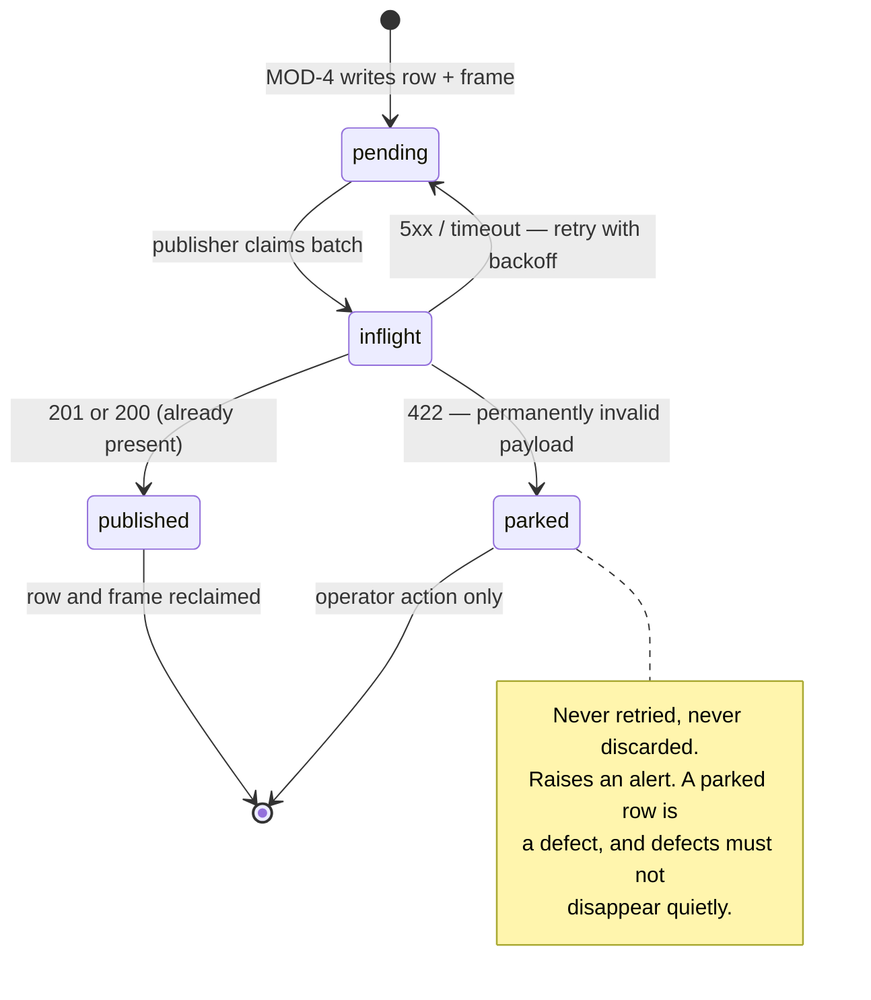
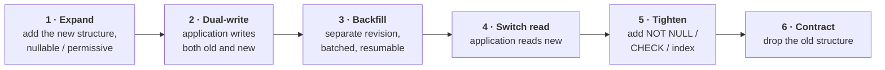

# Guardian Lens — Database Design

**The normative data model: stores, schema, constraints, indexes, classification, retention, migration and operations**

| Field | Value |
|---|---|
| Document | Database Design Specification |
| Version | 1.0 |
| Status | For engineering review |
| Programme phase | Week 3 — Govern · 8 August 2026 |
| Owner | Kapil (Engineering) — same owner as [TRD.md](TRD.md), per [GOVERNANCE.md](GOVERNANCE.md) §19.1 |
| Change control | Schema migration is **T2** minimum ([GOVERNANCE.md](GOVERNANCE.md) §8.2). Any change touching a constraint, trigger or column named in [RULE_BOOK.md](RULE_BOOK.md) §6 is **T3** and requires an explicit statement of which rules are affected and how they remain true. |
| Inputs | [PRD.md](PRD.md) v1.0 · [TRD.md](TRD.md) v1.0 §8–9 · [RULE_BOOK.md](RULE_BOOK.md) v1.0 · [GOVERNANCE.md](GOVERNANCE.md) v1.0 |
| Companion | [ARCHITECTURE.md](ARCHITECTURE.md) — normative for the components that read and write these stores |
| Platform | PostgreSQL 16 (TD-005) · SQLite 3 at the edge (TD-006) |

---

## Authority

**This document is the normative source for the Guardian Lens data model.**

| Relationship | Which prevails |
|---|---|
| This document vs **[TRD.md](TRD.md) §8 and §9** | **This document.** TRD §8–9 are summary views. Divergences are listed as numbered amendments in Appendix A for the TRD owner to action. |
| This document vs **[TRD.md](TRD.md) elsewhere** | **The TRD.** |
| This document vs **[ARCHITECTURE.md](ARCHITECTURE.md)** | **ARCHITECTURE.md** on components, runtime behaviour, deployment and threat model. **This document** on anything persisted. |
| This document vs **[RULE_BOOK.md](RULE_BOOK.md)** | **RULE_BOOK.md** on *what a rule requires*. **This document** on *how it is enforced in the data layer* (RULE_BOOK.md §0, Manifesto Article 4.5). |
| This document vs **[PRD.md](PRD.md)** | **The PRD.** |
| This document vs **[GOVERNANCE.md](GOVERNANCE.md)** | **GOVERNANCE.md** on who may change any of it. |

> **This document does not amend the TRD.** Where analysis here contradicts TRD §8–9, it is recorded as `AMD-DB-nn` in **Appendix A** and actioned by the owner.

## What this document is not

**Every SQL block in this document is a specification, not a migration.** No block here is intended to be executed against any database. Migrations are generated under Alembic as a separate, later change (§13) — a T2 change under [GOVERNANCE.md](GOVERNANCE.md) §8.2, and only after gate **G0** has been passed. A document gets reviewed; a script gets applied. These are not the same artefact and must not be confused.

Gate G0 has **not** been passed, and 25 of the 45 rules in [RULE_BOOK.md](RULE_BOOK.md) are still `PROPOSED` and carry no force until ratified. Rules in that state are marked `[PROPOSED]` inline throughout.

## Conventions

| Convention | Rule |
|---|---|
| Scope tags | `[MVP]` · `[V1]` · `[V2+]` · `[OPEN]`, used exactly as in [TRD.md](TRD.md) |
| Table names | `snake_case`, plural |
| Column names | `snake_case`, singular; foreign keys are `<entity>_id` |
| Timestamps | **`TIMESTAMPTZ` without exception.** A naive timestamp in this system is a defect |
| Constraint prefixes | `pk_` · `fk_` · `uq_` · `chk_` · `idx_` · `trg_` · `fn_` |
| Booleans | Positive phrasing (`is_active`, never `is_not_active`) |
| Enumerated values | `VARCHAR` + `CHECK`, not native `ENUM` — see §6.5 |
| Money, PII | None. There is no payment data and, by construction, no person data — §4 |

---

# 1. Data Architecture

## 1.1 The four stores



| Store | Role | System of record? | Retention authority |
|---|---|---|---|
| **PostgreSQL 16** | Events, decisions, configuration, identity, audit | **Yes — the only one** | `retention_policies` per site (§9) |
| **Evidence Store** | One still image per event | No — the row is the record; the frame is an attachment | Same policy, independently shorter window permitted |
| **Edge Store (SQLite)** | Durable outbox for events, gaps, health | **No.** A buffer. Rows are deleted once published | Bounded by disk quota, not by time (§11) |
| **Prometheus TSDB** | Operational metrics | **No, and never.** A metric is never evidence | Local retention, operational only |

**Two properties that constrain everything downstream:**

1. **Nothing in the edge store is the only copy of something a customer is entitled to.** It is either delivered to PostgreSQL, or its absence is accounted for by a `coverage_gaps` row. There is no third outcome.
2. **A metric is never a record.** "How many events did this site have?" is answered from `events`, never from Prometheus. Metrics are lossy, unaudited and locally retained; using one as evidence would defeat the product's entire proposition.

## 1.2 What may cross the site boundary, in data terms

This is BR-008 and BR-P-01 `[PROPOSED]` expressed as a column list rather than as policy.

| May cross TB1→TB2 | Must never cross |
|---|---|
| Structured candidate event fields (§5.5) | Video, in any form or container |
| One JPEG evidence frame per event, optionally face-blurred | Audio, in any form |
| Coverage-gap records | Camera credentials (encrypted or not) — they are decrypted only at the edge |
| Agent health and applied configuration version | Any frame not associated with a candidate event |
| Below-threshold and debounce **counts**, aggregated | Any per-person identifier, embedding or track ID |

---

# 2. Conceptual Model

Entities correspond one-to-one with the vocabulary in [RULE_BOOK.md](RULE_BOOK.md) §3.1, which is normative. **Definitions are not repeated here** — a second copy of a definition is a second thing that can drift. What is added is the persistence consequence of each.

| Entity | RULE_BOOK term | Persistence consequence |
|---|---|---|
| `sites` | Site | Isolation boundary; every scoped query filters on it (ADR-012) |
| `cameras` | Camera | Holds an encrypted credential the control plane cannot read |
| `zones` | Zone | Geometry in a **normalised** coordinate space, so it survives a resolution change |
| `detection_rules` | Detection Rule | `is_active` defaults FALSE — BR-001 lives in a column default |
| `events` | Candidate Event **and** Verified Record | **One table, status-driven.** See §3.3 |
| `event_corrections` | *(part of Decision)* | Field-level, insert-only; the model's original value is retained |
| `coverage_gaps` | Coverage Gap | Recorded, never inferred — the row is the whole point |
| `users` | Reviewer | Identity that will appear on every record they decide |
| `roles`, `user_roles` | *(authorisation)* | Site-scoped from `[MVP]`, so `[V1]` needs no migration |
| `agents` | Agent | A **separate principal table** — this is what makes BR-S-02 structural |
| `model_versions` | Model Version | Recorded against every event, never derived from a deployment timeline |
| `audit_log` | Audit Entry | Append-only; the product's evidentiary backbone |
| `retention_policies` | Retention Period | `[V1]` — see the gap recorded in §9.5 |
| `user_zone_scopes` | *(scope refinement)* | `[V1]`; absence of a row means site-wide, subject to role |
| **`event_ingest_keys`** | *(idempotency)* | **New** — required once `events` is partitioned. §3.5 |
| **`event_daily_counts`** | *(derived)* | **New** — lets aggregate counts survive record deletion. RULE_BOOK §8.1 |

## 2.1 The entity that deliberately does not exist

There is no `persons`, `workers`, `tracks`, `identities` or `embeddings` table, and there never will be. [RULE_BOOK.md](RULE_BOOK.md) §3.2 contains no *worker is identified* fact type and no *worker has activity measure* fact type, so a feature requiring one **cannot be expressed in the product's own vocabulary**. This is not a filter to be maintained; it is an absence to be preserved. See §4.

---

# 3. Logical Model

## 3.1 Entity relationships



Two corrections against [TRD.md](TRD.md) §8.2 are embedded above:

| Correction | Reason | Amendment |
|---|---|---|
| `EVENTS ||--o{ EVENT_CORRECTIONS` (was `o|`) | Corrections are **field-level** (TRD §9.6), so one event may have several — one per corrected field | `AMD-DB-02` |
| `AGENTS ||--o{ COVERAGE_GAPS` added | An `agent_down` gap has no camera attribution problem but does need an agent; and gaps must be reportable per site | `AMD-DB-10` |

## 3.2 Cardinality and integrity

| Parent | Child | Cardinality | ON DELETE | Why |
|---|---|---|---|---|
| `sites` | `cameras` | 1..N | **RESTRICT** | A site with cameras cannot be deleted; removing a site must be a deliberate, staged decommission |
| `cameras` | `zones` | 1..N | **RESTRICT** | Same |
| `zones` | `detection_rules` | 1..N | **RESTRICT** | A rule cannot outlive its zone, but nor may a zone vanish under live rules |
| `cameras` | `events` | 1..N | **RESTRICT** | Deleting a camera must never delete history |
| `detection_rules` | `events` | 0..N | **SET NULL** | `rule_id` is nullable so historical events survive rule deletion; `rule_snapshot` preserves what fired |
| `model_versions` | `events` | 0..N | **RESTRICT** | A model version is never deleted while any event references it — that link is evidence |
| `agents` | `events` | 1..N | **RESTRICT** | Provenance must survive agent decommission |
| `users` | `events` (reviewer) | 0..N | **RESTRICT** | **A reviewer can never be deleted while attributed to a record.** Deactivate instead (`is_active = FALSE`) |
| `events` | `event_corrections` | 0..N | **CASCADE** | A correction has no meaning without its event; the event's own deletion is retention-governed and audited |
| `events` | `event_ingest_keys` | 1..1 | **No FK — deliberately** | See §3.5. A foreign key to a partitioned `events` would block `DROP PARTITION`, which is the whole reason for partitioning. Consistency is maintained by the ingest transaction and reconciled by the retention sweep |
| `users`/`agents` | `audit_log` | 0..N | **RESTRICT** | Nothing may orphan an audit entry |
| `sites` | `retention_policies` | 0..1 | **CASCADE** | Policy is meaningless without its site |

> **`ON DELETE` behaviour is specified nowhere in [TRD.md](TRD.md) §9** (`AMD-DB-06`). The default in most ORM-generated schemas is `NO ACTION`, and the most commonly hand-written is `CASCADE`. **`CASCADE` from `cameras` or `users` to `events` would be a rule violation** — it would let a configuration action silently delete verified records (BR-007) and their attribution (BR-AU-02). Every relation above is therefore stated explicitly, and `RESTRICT` is the default posture.

## 3.3 Why candidate and verified records share one table

`events` holds both a Candidate Event and a Verified Record, distinguished by `status`. The alternative — promoting a row into a separate `verified_events` table on decision — was considered and rejected:

| Consideration | One table (chosen) | Two tables |
|---|---|---|
| Enforcing BR-005 | A single CHECK constraint covers every state | Needs a constraint on one table plus an assurance that the promotion path is the only writer |
| Enforcing BR-004 | The transition is a status change guarded at four layers | A copy operation, which is far easier to reproduce accidentally elsewhere |
| Rejections retained and visible (BR-007) | Naturally — a rejected row simply stays | Needs a third table, or rejections live in the candidate table and look like arrears |
| Audit of the transition | `before_state` / `after_state` on one row | Two rows, in two tables, for one act |
| Queue performance as verified volume grows | Solved by a partial index (§7.2) | Naturally partitioned |

The deciding factor is the second row. **BR-004 is enforced most strongly when there is only one write path to guard**, and a status transition is a narrower target than a cross-table copy.

## 3.4 Identity strategy — ADR-014

**Status:** Accepted. Register: [ARCHITECTURE.md](ARCHITECTURE.md) §9.2.

**Context.** Events originate at the edge, may be delivered more than once (at-least-once, [ARCHITECTURE.md](ARCHITECTURE.md) §6.2), and must be deduplicated at the receiver. [TRD.md](TRD.md) §9.5 gives `events` two identifiers: a server `id` and a client-generated `event_id` with a UNIQUE constraint. Whether both are needed, and what UUID version to use, is unstated.

**Decision.**

| Identifier | Generated by | Version | Purpose |
|---|---|---|---|
| `events.id` | **Control plane** | UUIDv4 (`gen_random_uuid()`) | Primary key. Server-controlled, so an untrusted principal never chooses a primary-key value |
| `events.event_id` | **Edge agent** | **UUIDv7** | Idempotency key. Time-ordered, so ingest-time inserts have index locality |
| All other tables | Control plane | UUIDv4 | Low volume; ordering brings no benefit |

Both identifiers are retained. The client key is untrusted input and is treated as such: it is unique-constrained and used for deduplication, but nothing else in the schema references it.

**Consequences.**
- **PostgreSQL 16 has no native `uuidv7()`** (it arrives in PostgreSQL 18). v7 values are generated in the edge agent's application code. The database default remains `gen_random_uuid()` for server-side rows, which is v4 — this asymmetry is deliberate and documented rather than papered over.
- A malicious agent can choose its own `event_id` values and could, in principle, collide with another agent's. The consequence is a rejected duplicate, not a corrupted record, because `event_id` is never a foreign key target.
- **Once `events` is partitioned (§15.4), a bare `UNIQUE (event_id)` becomes impossible** — PostgreSQL requires a unique constraint on a partitioned table to include the partition key. See §3.5.

## 3.5 Idempotency under partitioning — `event_ingest_keys`

> **A consequence [TRD.md](TRD.md) §9.5 does not anticipate.** `uq_events_event_id` is the sole mechanism preventing duplicate ingestion on retry, and it silently stops being possible the moment `events` is range-partitioned by `received_at`. A unique index on a partitioned table must include the partition key, so the best available becomes `UNIQUE (received_at, event_id)` — which permits the *same* `event_id` in two different partitions. That is not idempotency; it is idempotency that fails precisely during a network partition, when replayed events straddle a partition boundary. Recorded as `AMD-DB-06`.

**Resolution.** A small, **non-partitioned** table carries the uniqueness:

| Column | Type | Note |
|---|---|---|
| `event_id` | UUID **PK** | The client-generated key. Uniqueness lives here, permanently |
| `event_pk` | UUID | The `events.id` it resolved to |
| `received_at` | TIMESTAMPTZ | Enables locating the partition holding the event |

Ingest inserts into `event_ingest_keys` first, in the same transaction. A unique violation means "already ingested" and the service returns the existing record with 200, creating nothing — [ARCHITECTURE.md](ARCHITECTURE.md) IF-C1. The table is narrow and prunable in step with retention.

**`event_pk` carries no foreign key**, deliberately. A foreign key into a partitioned `events` table would prevent `DROP PARTITION` — and cheap partition-drop is the entire reason for partitioning (§15.4). The invariant is held by the ingest transaction, and the retention sweep prunes keys for events it deletes in the same batch. Integrity check 6 in §16.3 verifies it after any restore.

At `[MVP]`, `events` is not partitioned and `uq_events_event_id` is sufficient. `event_ingest_keys` is introduced **with** partitioning, not before — but the ingest service is written against it from day one so partitioning is a data change rather than a logic change.

---

# 4. The Negative Schema

> **New in this document.** Four `ABSOLUTE` rules are guaranteed by the *absence* of schema, and [RULE_BOOK.md](RULE_BOOK.md) §6 assigns their enforcement to "schema review at every migration". A review needs something to review against. This section is that artefact.

## 4.1 Columns and tables that must never exist

| Prohibited | Rule | What it would look like if someone added it |
|---|---|---|
| Any table representing a person in frame | BR-006 | `persons`, `workers`, `subjects`, `individuals`, `identities` |
| Any biometric or re-identification value | BR-006 | `face_embedding`, `gait_signature`, `person_descriptor`, `reid_vector` |
| Any cross-frame person association | BR-006 | `track_id`, `person_id`, `subject_ref` on `events` or any detection table |
| Any per-person measure | BR-002 | `dwell_seconds_per_person`, `idle_time`, `productivity_score`, `presence_duration`, `work_rate` |
| Any per-person aggregate, view or materialised view | BR-P-03 `[PROPOSED]` | A view grouping by anything that resolves to an individual |
| Any consequence linkage | BR-003 | `disciplinary_action_id`, `hr_case_ref`, `escalation_id`, `notified_manager_id` |
| Any outbound-webhook configuration | BR-003, BR-N-01 | `webhook_url` on `sites` or `detection_rules` |
| Any audio artefact | BR-P-01 `[PROPOSED]` | `audio_ref`, `audio_clip_key`, `decibel_level` |
| Any video artefact | BR-008 | `video_ref`, `clip_key`, `recording_url` |
| Any auto-disposition marker | BR-V-03 `[PROPOSED]` | `auto_accepted`, `auto_resolved_at`, `system_decided` |
| Any reviewer-productivity field | BR-002 | `events_reviewed_today` on `users`; extends to logs and metrics, not just tables |

## 4.2 Two traps that look harmless

| Looks like | Actually is | Why it is caught here |
|---|---|---|
| `users.events_reviewed_count`, "just for the dashboard" | **An individual productivity metric** | BR-002 is not limited to workers. [TRD.md](TRD.md) §15.3 already extends it to log lines; it extends to columns identically |
| `events.person_bbox_history`, "just for better evidence" | **A cross-frame person association** | The moment a bounding box is linked across frames, a track exists; a track is an unnamed person, and BR-006 does not care whether the name is known |

## 4.3 The migration review checklist

Applied at **every** migration, per [RULE_BOOK.md](RULE_BOOK.md) §6. A migration that cannot answer all seven is not approved.

1. Does this migration add any column, table, view or index matching §4.1?
2. Does it drop, weaken or rename any constraint or trigger named in §6?
3. Does it change `ON DELETE` behaviour on any relation in §3.2?
4. Does it alter the nullability of `reviewer_id`, `decided_at`, `decision_type` or `status` on `events`?
5. Does it touch `audit_log` in any way other than adding a nullable column?
6. Does it change retention, expiry or deletion semantics (§9)?
7. Which [RULE_BOOK.md](RULE_BOOK.md) rules does it affect, and how does each remain true?

**Any "yes" to 1–6 makes the change T3** ([GOVERNANCE.md](GOVERNANCE.md) §8.2), requiring SARB review and the Decide holder. Question 7 is mandatory on every T3 RFC regardless ([GOVERNANCE.md](GOVERNANCE.md) §8.3).

---

# 5. Physical Schema

**DDL appears once, in Appendix B.** This section carries the column dictionary and the reasoning; constraint and trigger bodies are in §6. Nothing is written twice.

## 5.1 Delta from TRD §9

Additions and changes against [TRD.md](TRD.md) §9, each traced to a rule or gate. Nothing is added for tidiness.

| Change | Table | Driver | Amendment |
|---|---|---|---|
| `activated_by`, `activated_at`, `deactivated_at` | `detection_rules` | BR-C-02 `[PROPOSED]`, gate G2 — activation must be attributable in the row, not only in the audit log | `AMD-DB-07` |
| `config_version` | `detection_rules`, `sites` | ADR-008 — agents report the version they applied | `AMD-DB-11` |
| `model_card_ref`, `datasheet_ref`, `approved_by`, `approved_at` | `model_versions` | Gate G1 requires a complete model card and datasheet per release | `AMD-DB-08` |
| `evidence_state` | `events` | Distinguishes "never had a frame" from "frame deleted per retention" | `AMD-DB-12` |
| `site_id`, `agent_id` | `coverage_gaps` | `agent_down` gaps have no camera; gap reporting is per site | `AMD-DB-10` |
| `applied_config_version`, `last_health_at`, `clock_skew_ms` | `agents` | ADR-007 skew detection, ADR-008 applied-version reporting | `AMD-DB-11` |
| `chk_expired_has_no_reviewer` | `events` | The TRD's `expired` CHECK branch permits an attached reviewer | `AMD-DB-04` |
| `trg_events_site_consistency` | `events` | TRD §8.3 promises this trigger but never defines it | `AMD-DB-05` |
| `event_ingest_keys` table | new | Idempotency survives partitioning (§3.5) | `AMD-DB-06` |
| `event_daily_counts` table | new | Aggregate counts survive record deletion (RULE_BOOK §8.1) | `AMD-DB-14` |
| `uq_coverage_gaps_open` | `coverage_gaps` | Nothing prevents two simultaneous open gaps for one camera | `AMD-DB-15` |
| `trg_audit_no_truncate` | `audit_log` | A row-level trigger does not fire on `TRUNCATE`; the existing protection has a hole the bypass suite does not test | `AMD-DB-16` |
| `prev_hash`, `entry_hash` `[V1]` | `audit_log` | ADR-015 — audit integrity against a privileged insider (T-12) | `AMD-DB-09` |

## 5.2 `sites` `[MVP]`

| Column | Type | Null | Default | Note |
|---|---|---|---|---|
| `id` | UUID | No | `gen_random_uuid()` | PK |
| `name` | VARCHAR(200) | No | | Display name |
| `timezone` | VARCHAR(64) | No | | **IANA name**, e.g. `Asia/Kolkata`. NFR-L-02 |
| `config_version` | BIGINT | No | `1` | Incremented on any change affecting agent configuration |
| `created_at` / `updated_at` | TIMESTAMPTZ | No | `now()` | |

**Why the timezone lives here and not on the user.** Reporting periods are shift boundaries, and a shift belongs to a site, not to whoever opens the report. A manager in another timezone must see the site's shift, or the report describes a period that never existed (ADR-007).

## 5.3 `cameras` `[MVP]`

| Column | Type | Null | Default | Note |
|---|---|---|---|---|
| `id` | UUID | No | `gen_random_uuid()` | PK |
| `site_id` | UUID | No | | FK → `sites`, RESTRICT |
| `name` | VARCHAR(200) | No | | Human label, e.g. "Bay 3 entrance" |
| `location_description` | TEXT | Yes | | Reviewer context |
| `stream_url_encrypted` | BYTEA | No | | **AES-256-GCM ciphertext** of the RTSP URL including credentials |
| `stream_url_key_id` | VARCHAR(64) | No | | Which key encrypted it — makes rotation possible without re-entry |
| `stream_profile` | VARCHAR(20) | No | `'secondary'` | `primary` \| `secondary`. FR-007 |
| `sample_rate_fps` | NUMERIC(4,2) | No | `2.00` | TRD §5.2 |
| `status` | VARCHAR(20) | No | `'active'` | `active` \| `degraded` \| `disconnected` \| `disabled` |
| `created_at` / `updated_at` | TIMESTAMPTZ | No | `now()` | |

**On `stream_url_encrypted`.** BR-S-03 `[PROPOSED]` requires that camera credentials are never retrievable in plaintext through any interface. Three properties make that structural rather than procedural:

1. The column is `BYTEA` ciphertext. There is no plaintext column to leak.
2. **The decryption key lives at the edge, not in the control plane.** The control plane stores a credential it cannot read.
3. No API response schema includes this column, and the column is on the log denylist (TRD §15.3).

`stream_url_key_id` is an addition: without it, rotating the encryption key means re-entering every camera credential by hand at every site.

## 5.4 `zones` and `detection_rules` `[MVP]`

**`zones`**

| Column | Type | Null | Default | Note |
|---|---|---|---|---|
| `id` | UUID | No | `gen_random_uuid()` | PK |
| `camera_id` | UUID | No | | FK → `cameras`, RESTRICT |
| `name` | VARCHAR(200) | No | | |
| `polygon` | JSONB | No | | Vertex array `[[x,y],…]` in **normalised 0–1 space** |
| `created_at` / `updated_at` | TIMESTAMPTZ | No | `now()` | |

Normalised coordinates mean a camera resolution or stream-profile change does not silently move every zone. A pixel-space polygon would — and it would do so without any error, producing wrong events that look correct.

**`detection_rules`**

| Column | Type | Null | Default | Note |
|---|---|---|---|---|
| `id` | UUID | No | `gen_random_uuid()` | PK |
| `zone_id` | UUID | No | | FK → `zones`, RESTRICT. `chk_rule_requires_zone` is redundant given NOT NULL — see §6.6 |
| `rule_type` | VARCHAR(50) | No | | `ppe_helmet` \| `zone_entry` |
| **`is_active`** | BOOLEAN | No | **`FALSE`** | **BR-001 lives in this default** |
| `confidence_threshold` | NUMERIC(4,3) | No | | `[OPEN — PRD OQ-4/OQ-5]`; set from pilot data, never from a published benchmark |
| `debounce_seconds` | INTEGER | No | | Suppresses repeats of a continuing condition |
| `dwell_seconds` | INTEGER | Yes | | Minimum duration before firing |
| `written_rule_reference` | TEXT | Yes | | The customer's own written rule — BR-011 (ADVISORY, so nullable) |
| `human_readable` | TEXT | No | | Plain-language text shown to the reviewer — DP-6 |
| `created_by` | UUID | No | | FK → `users`, RESTRICT |
| **`activated_by`** | UUID | Yes | | FK → `users`. **NOT NULL whenever `is_active`** — see §6.4 |
| **`activated_at`** | TIMESTAMPTZ | Yes | | Same |
| **`deactivated_at`** | TIMESTAMPTZ | Yes | | Last deactivation, for the configuration timeline |
| `config_version` | BIGINT | No | `1` | Bumped on every change; drives agent sync |
| `created_at` / `updated_at` | TIMESTAMPTZ | No | `now()` | |

> **Why `activated_by` is added.** BR-C-02 `[PROPOSED]` states there is *no path by which a detection rule becomes active without a named user having activated it*, and gate **G2** makes rule activation a customer-approved event. In [TRD.md](TRD.md) §9.4 the only person recorded is `created_by`, so the activation fact exists solely in `audit_log`. That is a real audit trail, but it means answering *"who turned this on?"* requires reconstructing history rather than reading the row — and it means a defect that skips the audit write leaves activation entirely unattributed. Putting the answer in the row makes the attribution a **constraint** (§6.4) rather than a reconstruction. `AMD-DB-07`.

## 5.5 `events` `[MVP]` — the core table

| Column | Type | Null | Default | Note |
|---|---|---|---|---|
| `id` | UUID | No | `gen_random_uuid()` | PK, server-generated (ADR-014) |
| `event_id` | UUID | No | | Client-generated UUIDv7 idempotency key |
| `site_id` | UUID | No | | FK → `sites`. Denormalised; kept true by trigger (§6.3) |
| `camera_id` | UUID | No | | FK → `cameras`, RESTRICT |
| `zone_id` | UUID | Yes | | FK → `zones`. Null where there is no zone context |
| `rule_id` | UUID | Yes | | FK → `detection_rules`, **SET NULL** — history survives rule deletion |
| `rule_snapshot` | JSONB | No | | **The rule as it was at detection time.** Audit requirement, not an optimisation |
| `source` | VARCHAR(20) | No | `'guardian_lens'` | `guardian_lens` \| `nvr`. FR-032 |
| `agent_id` | UUID | No | | FK → `agents`, RESTRICT |
| `model_version_id` | UUID | Yes | | FK → `model_versions`, RESTRICT. Null only for `source='nvr'` — see §6.4 |
| `confidence` | NUMERIC(4,3) | Yes | | Null only for `source='nvr'` |
| `occurred_at` | TIMESTAMPTZ | No | | **Edge clock** — what the reviewer sees (ADR-007) |
| `received_at` | TIMESTAMPTZ | No | `now()` | **Control-plane clock** — ordering, retention, partition key (ADR-007) |
| `evidence_ref` | TEXT | Yes | | Object-store key |
| `evidence_state` | VARCHAR(20) | No | `'present'` | `present` \| `none` \| `deleted` \| `failed` |
| `evidence_blurred` | BOOLEAN | No | `FALSE` | Whether face blurring was applied |
| **`status`** | VARCHAR(20) | No | `'unverified'` | `unverified` \| `accepted` \| `rejected` \| `corrected` \| `expired` |
| **`reviewer_id`** | UUID | Yes* | | FK → `users`, RESTRICT. *Constrained by `chk_decided_requires_reviewer` |
| **`decided_at`** | TIMESTAMPTZ | Yes* | | *Same |
| `decision_type` | VARCHAR(20) | Yes | | `accept` \| `reject` \| `correct` |
| `rejection_reason` | TEXT | Yes | | Mandatory when `status='rejected'` — FR-043 |
| `version` | INTEGER | No | `1` | Optimistic concurrency (MOD-7) |
| `created_at` | TIMESTAMPTZ | No | `now()` | |

### Why `evidence_state` is added

`evidence_ref` alone cannot answer a question the audit trail must answer. A null `evidence_ref` today could mean any of four different things:

| `evidence_state` | Meaning | Reviewer sees |
|---|---|---|
| `present` | Frame stored and retrievable | The frame |
| `none` | The site has evidence transport disabled — no frame was ever captured | "No evidence is captured at this site" |
| `deleted` | Frame removed by retention enforcement while the row was retained | "Evidence removed per retention policy on \<date\>" |
| `failed` | Upload or storage failed; the event exists, the frame does not | "Evidence unavailable — storage failure" |

Without this distinction, an inspector reading a two-year-old accepted record cannot tell whether the reviewer saw a frame and it was later deleted, or never saw one at all. Those support very different conclusions about the decision's basis, and the difference is exactly what [ARCHITECTURE.md](ARCHITECTURE.md) ADR-013 turns on. `AMD-DB-12`.

### Why `rule_snapshot` is NOT NULL while `rule_id` is nullable

If the rule is edited, historical events must still show **what actually fired**. If the rule is deleted, `rule_id` becomes NULL and the snapshot is the only remaining record of the rule. Making the snapshot nullable would permit an event whose provenance is unreconstructible. `rule_snapshot` is written by the edge at detection time ([ARCHITECTURE.md](ARCHITECTURE.md) §6.1 step 6), not resolved at read time.

## 5.6 `event_corrections` `[MVP]`

| Column | Type | Null | Default | Note |
|---|---|---|---|---|
| `id` | UUID | No | `gen_random_uuid()` | PK |
| `event_id` | UUID | No | | FK → `events.id`, CASCADE |
| `field_name` | VARCHAR(64) | No | | Which field was corrected |
| `original_value` | TEXT | No | | **Model output, retained** |
| `corrected_value` | TEXT | No | | Reviewer's value |
| `corrected_by` | UUID | No | | FK → `users`, RESTRICT |
| `corrected_at` | TIMESTAMPTZ | No | `now()` | |

**Insert-only.** No update or delete path is exposed, matching `AuditRepository`'s posture ([TRD.md](TRD.md) §6.4). Retaining `original_value` is what makes AI-01…AI-04 (field acceptance rate) measurable at all — deleting the model's original output would destroy the only ground truth the product ever collects.

**One event, many corrections** — one row per corrected field. This is the cardinality correction in §3.1 (`AMD-DB-02`).

## 5.7 `coverage_gaps` `[MVP]`

| Column | Type | Null | Default | Note |
|---|---|---|---|---|
| `id` | UUID | No | | PK — **generated at the edge** where the gap is observed |
| `site_id` | UUID | No | | FK → `sites`. **Added** — gap reporting is per site |
| `camera_id` | UUID | Yes | | FK → `cameras`. **Now nullable** — an `agent_down` gap affects the agent, not one camera |
| `agent_id` | UUID | No | | FK → `agents`. **Added** |
| `started_at` | TIMESTAMPTZ | No | | |
| `ended_at` | TIMESTAMPTZ | Yes | | Null while ongoing |
| `reason` | VARCHAR(50) | No | | `stream_lost` \| `inference_failure` \| `agent_down` \| `outbox_full` |
| `detail` | TEXT | Yes | | |
| `recorded_by` | VARCHAR(20) | No | | `agent` \| `control_plane` — **who observed it** |

> **Why this table exists at all.** FR-005 requires that gaps are *recorded*, not inferred. Without it, a report showing zero events could mean "nothing happened" or "we were not watching" — opposite conclusions ([TRD.md](TRD.md) §9.7).

**Three additions, each with a reason:**

- **`agent_id` and a nullable `camera_id`.** [TRD.md](TRD.md) §9.7 makes `camera_id` NOT NULL, but `agent_down` is a listed reason — and a dead agent has no camera to attribute the gap to, nor any ability to write the row. `AMD-DB-10`.
- **`recorded_by`.** `agent_down` is the one gap the edge cannot record; the control plane infers it from missed health beats, so its **resolution is bounded by the health-beat interval** ([ARCHITECTURE.md](ARCHITECTURE.md) §6.5, R-2). A gap inferred at coarse resolution must be distinguishable from one observed directly, or reports imply a precision the data does not have.
- **`uq_coverage_gaps_open`** (§6.6). Nothing currently prevents two simultaneously open gaps for the same camera and reason, which would double-count unavailability in any coverage report. `AMD-DB-15`.

## 5.8 Identity: `users`, `roles`, `user_roles`, `agents` `[MVP]`

**`users`**

| Column | Type | Null | Default | Note |
|---|---|---|---|---|
| `id` | UUID | No | `gen_random_uuid()` | PK |
| `email` | CITEXT | No | | UNIQUE. Requires the `citext` extension |
| `full_name` | VARCHAR(200) | No | | **Appears on every record they verify** |
| `password_hash` | TEXT | Yes | | Argon2id. Null when federated `[V1]` |
| `external_idp_subject` | TEXT | Yes | | OIDC subject `[V1]`. UNIQUE where not null |
| `is_active` | BOOLEAN | No | `TRUE` | **Deactivation, never deletion** — see §3.2 |
| `created_at` / `updated_at` | TIMESTAMPTZ | No | `now()` | |

`chk_users_has_credential`: at least one of `password_hash` or `external_idp_subject` must be present, so a user with no authentication path cannot exist.

**`roles`** — seeded, not user-created. Permissions per [TRD.md](TRD.md) §12.3.

| `name` | Queue read | Decide | Config | Users | Retention | Audit read |
|---|---|---|---|---|---|---|
| `reviewer` | scoped | scoped | — | — | — | — |
| `safety_manager` | ✔ | ✔ | zones, rules | — | — | ✔ |
| `site_admin` | ✔ | ✔ | all | ✔ | ✔ | ✔ |
| `auditor` | ✔ read-only | **—** | — | — | — | ✔ |

**`user_roles`** — composite PK `(user_id, role_id, site_id)`.

`site_id` is **NOT NULL**. [TRD.md](TRD.md) §9.8 does not state its nullability, and a nullable `site_id` in a composite primary key is a defect waiting to happen: PostgreSQL primary keys forbid nulls, so a "global role" expressed as `site_id IS NULL` would be **silently impossible to insert** — the grant would appear to be configured and would not exist. A cross-site principal is expressed as multiple rows, one per site. `AMD-DB-13`.

**`agents`**

| Column | Type | Null | Default | Note |
|---|---|---|---|---|
| `id` | UUID | No | `gen_random_uuid()` | PK |
| `site_id` | UUID | No | | FK → `sites`, RESTRICT |
| `name` | VARCHAR(200) | No | | |
| `credential_hash` | TEXT | No | | Argon2id. **No review permission, ever** |
| `last_seen_at` | TIMESTAMPTZ | Yes | | |
| `last_health_at` | TIMESTAMPTZ | Yes | | **Added** — drives `agent_down` inference |
| `agent_version` | VARCHAR(40) | Yes | | |
| `applied_config_version` | BIGINT | Yes | | **Added** — ADR-008; the version the agent is actually running |
| `clock_skew_ms` | INTEGER | Yes | | **Added** — ADR-007; measured on each health beat |
| `status` | VARCHAR(20) | No | `'offline'` | `active` \| `degraded` \| `offline` |

### BR-S-02 is a schema property, not a policy

> **`agents` and `users` are separate tables, and `user_roles.user_id` references `users` only.** There is no column anywhere in the schema through which an agent principal could be granted a role. A fully compromised edge agent cannot verify an event, because the grant relation it would need does not exist. This is why BR-S-02 `[PROPOSED]` is listed with a data-layer enforcement point in [RULE_BOOK.md](RULE_BOOK.md) §6 — and it is the strongest form of enforcement available, since removing it would require dropping and rebuilding the authorisation model rather than changing a check.

## 5.9 `model_versions` `[MVP]`

| Column | Type | Null | Default | Note |
|---|---|---|---|---|
| `id` | UUID | No | `gen_random_uuid()` | PK |
| `version` | VARCHAR(40) | No | | UNIQUE. Semantic version |
| `artefact_hash` | TEXT | No | | **SHA-256 of the ONNX file** — verified on load (TRD §12.6 A08) |
| `training_data_hash` | TEXT | Yes | | Reproducibility |
| `classes` | JSONB | No | | Class list |
| `model_card_ref` | TEXT | Yes | | **Added** — G1 requires a complete model card |
| `datasheet_ref` | TEXT | Yes | | **Added** — G1 requires a datasheet per training source |
| `approved_by` | UUID | Yes | | **Added** — FK → `users`. The named G1 approver |
| `approved_at` | TIMESTAMPTZ | Yes | | **Added** |
| `deployed_at` | TIMESTAMPTZ | Yes | | |
| `notes` | TEXT | Yes | | Known weak conditions — TRD §5.8 |

`chk_model_deployed_requires_approval`: `deployed_at IS NULL OR (approved_by IS NOT NULL AND model_card_ref IS NOT NULL)`.

> **Why gate G1 gets a constraint.** [GOVERNANCE.md](GOVERNANCE.md) §9 requires a complete model card, a dataset datasheet, held-out evaluation and condition-stratified evaluation before any model version reaches any site — with a named approver and a named veto holder. In [TRD.md](TRD.md) §9.10 none of that has a home in the schema, so the gate is enforced entirely by process. Process is exactly what erodes under delivery pressure. The constraint does not verify that the model card is *good* — nothing in a database can — but it makes deploying a model version with **no recorded approver at all** impossible. `AMD-DB-08`.

## 5.10 `audit_log` `[MVP]`

| Column | Type | Null | Default | Note |
|---|---|---|---|---|
| `id` | BIGSERIAL | No | | PK |
| `actor_user_id` | UUID | Yes | | FK → `users`, RESTRICT. Null for system actions |
| `actor_agent_id` | UUID | Yes | | FK → `agents`, RESTRICT |
| `action` | VARCHAR(64) | No | | `rule.activated`, `event.decided`, `retention.deleted`, … |
| `entity_type` | VARCHAR(50) | No | | |
| `entity_id` | UUID | Yes | | Null for entities without a UUID key (§5.10.1) |
| `entity_key` | TEXT | Yes | | **Added** — textual key for composite-PK entities |
| `before_state` | JSONB | Yes | | |
| `after_state` | JSONB | Yes | | |
| `ip_address` | INET | Yes | | |
| `occurred_at` | TIMESTAMPTZ | No | `now()` | |
| `prev_hash` `[V1]` | BYTEA | Yes | | ADR-015 |
| `entry_hash` `[V1]` | BYTEA | Yes | | ADR-015 |

`chk_audit_has_actor`: exactly one of `actor_user_id` / `actor_agent_id` is set, **or** both are null and `action` begins with `system.` — so an audit entry can never have an unexplained absence of actor.

### 5.10.1 Why `entity_key` is added

`entity_id` is a UUID, but not every auditable entity has a UUID primary key. `user_roles` has a composite key `(user_id, role_id, site_id)` — and granting or revoking a role is precisely the kind of scope change BR-010 requires to be logged and attributable. With a UUID-only column, that audit entry cannot identify what was changed. `entity_key` carries a canonical textual key for those cases. `AMD-DB-13`.

## 5.11 `retention_policies` and `user_zone_scopes` `[V1]`

**`retention_policies`** — `id`, `site_id` (UNIQUE, CASCADE), `event_retention_days`, `evidence_retention_days`, `audit_retention_days`, `updated_by`, `updated_at`.

`chk_audit_retention_not_shorter`: `audit_retention_days >= event_retention_days` — BR-AU-04 `[PROPOSED]` as a constraint. An audit trail shorter-lived than the records it audits is not an audit trail, and this is the kind of misconfiguration that only becomes visible years later, at exactly the moment the audit trail is needed.

Evidence retention **may** be shorter than event retention: many customers will want the record kept and the image removed early. The reverse is meaningless and is rejected by `chk_evidence_retention_not_longer`.

**`user_zone_scopes`** — composite PK `(user_id, zone_id)`, both CASCADE. **Absence of any row for a user means site-wide scope, subject to role.** This inversion is deliberate — the alternative, requiring an explicit row per zone, would mean a partially-configured user silently sees nothing, and "the system showed me an empty queue" is indistinguishable from "there was nothing to review".

## 5.12 `event_daily_counts` `[V1]`

Aggregate counts that survive deletion of the underlying rows.

| Column | Type | Note |
|---|---|---|
| `site_id`, `zone_id`, `rule_type`, `bucket_date`, `status` | — | Composite PK |
| `event_count` | INTEGER | Count of events in that bucket |
| `computed_at` | TIMESTAMPTZ | |

> **Why this exists.** [RULE_BOOK.md](RULE_BOOK.md) §8.1 resolves the tension between BR-007 (rejections retained and visible) and BR-009 (delete on retention elapse) as: *"Aggregate rejection counts survive deletion of the underlying records; the counts contain no personal data."* There is currently no table in which those counts could survive. Once the rows are gone the counts are gone with them, and the agreed resolution is unimplementable. `AMD-DB-14`.

**This table is bound by §4.1.** Its grain is site / zone / rule-type / date — never anything that resolves to an individual. Adding a person-resolving dimension here would violate BR-002 and BR-P-03 `[PROPOSED]` exactly as adding one to `events` would.

---

# 6. Constraints and Triggers

**This section is the heart of the schema.** These are [RULE_BOOK.md](RULE_BOOK.md)'s `ABSOLUTE` rules made structurally impossible to violate, and they are the fourth defence layer in [ARCHITECTURE.md](ARCHITECTURE.md) §4.2. **They must never be removed to simplify a migration.**

## 6.1 The verification constraints — BR-004, BR-005

```sql
-- SPECIFICATION, NOT A MIGRATION.
-- events: the constraints that make BR-004 and BR-005 structural.

CONSTRAINT chk_decided_requires_reviewer CHECK (
    (status = 'unverified'
        AND reviewer_id IS NULL
        AND decided_at IS NULL
        AND decision_type IS NULL)
    OR
    (status IN ('accepted', 'rejected', 'corrected')
        AND reviewer_id  IS NOT NULL
        AND decided_at   IS NOT NULL
        AND decision_type IS NOT NULL)
    OR
    (status = 'expired'
        AND reviewer_id  IS NULL       -- added: see AMD-DB-04
        AND decided_at   IS NULL
        AND decision_type IS NULL)
),

CONSTRAINT chk_rejection_has_reason CHECK (
    status <> 'rejected' OR rejection_reason IS NOT NULL
),

CONSTRAINT chk_status_valid CHECK (
    status IN ('unverified','accepted','rejected','corrected','expired')
),

CONSTRAINT chk_decision_type_valid CHECK (
    decision_type IS NULL OR decision_type IN ('accept','reject','correct')
)
```

**Read `chk_decided_requires_reviewer` in both directions.** It enforces two rules at once:

- **BR-005** — a decided row *must* carry its reviewer. This is the direction everyone expects.
- **BR-004** — an `unverified` row *must not* carry one. This is the direction that matters more, because it forbids pre-filled attribution: a row cannot be prepared with a reviewer already attached and then flipped to `accepted` by something that is not the decision path.

> [TRD.md](TRD.md) §8.4 lists these as **two separately named constraints**, `chk_decided_requires_reviewer` and `chk_unverified_has_no_reviewer`, and [RULE_BOOK.md](RULE_BOOK.md) §6 cites a "CHECK constraint" as BR-004's data-layer enforcement point. In [TRD.md](TRD.md) §9.5 there is only one constraint; the second name does not exist. **The behaviour is present** — the first branch covers it — but any bypass test, migration review or audit that searches for `chk_unverified_has_no_reviewer` will not find it and may reasonably conclude the enforcement is missing. `AMD-DB-01`.

### The expired branch

[TRD.md](TRD.md) §9.5 writes the third branch as bare `(status = 'expired')`, which permits an expired row to carry a `reviewer_id`, a `decided_at` and a `decision_type`. That combination asserts something false: that a reviewer decided an event which by definition **no reviewer reached in time** ([RULE_BOOK.md](RULE_BOOK.md) §3.1, "Expiry"). It also creates a path to a row that reads as decided while being excluded from reports. Tightened above. `AMD-DB-04`.

## 6.2 Immutability of a decision — BR-AU-02, BR-V-01

```sql
-- SPECIFICATION, NOT A MIGRATION.

CREATE OR REPLACE FUNCTION fn_events_immutable_decision()
RETURNS TRIGGER AS $$
BEGIN
    IF OLD.reviewer_id IS NOT NULL
       AND NEW.reviewer_id IS DISTINCT FROM OLD.reviewer_id THEN
        RAISE EXCEPTION 'reviewer_id is immutable once set (BR-AU-02)'
            USING ERRCODE = 'restrict_violation';
    END IF;

    IF OLD.decided_at IS NOT NULL
       AND NEW.decided_at IS DISTINCT FROM OLD.decided_at THEN
        RAISE EXCEPTION 'decided_at is immutable once set (BR-AU-02)'
            USING ERRCODE = 'restrict_violation';
    END IF;

    IF OLD.decision_type IS NOT NULL
       AND NEW.decision_type IS DISTINCT FROM OLD.decision_type THEN
        RAISE EXCEPTION 'decision_type is immutable once set (BR-AU-02)'
            USING ERRCODE = 'restrict_violation';
    END IF;

    -- A terminal event may never return to unverified (BR-V-01).
    IF OLD.status <> 'unverified' AND NEW.status = 'unverified' THEN
        RAISE EXCEPTION 'a decided event cannot be reopened (BR-V-01)'
            USING ERRCODE = 'restrict_violation';
    END IF;

    RETURN NEW;
END;
$$ LANGUAGE plpgsql;

CREATE TRIGGER trg_events_immutable_decision
    BEFORE UPDATE ON events
    FOR EACH ROW EXECUTE FUNCTION fn_events_immutable_decision();
```

The final clause is an addition. Without it, `UPDATE events SET status='unverified'` on a decided row passes every constraint above — `reviewer_id` and `decided_at` are unchanged, so the immutability checks do not fire, and `chk_decided_requires_reviewer`'s first branch requires them to be **null**, so the update fails on the CHECK. The check therefore catches it *today*, but for an incidental reason: the guarantee is a side effect of a constraint written for a different purpose. Stating it explicitly means the property survives a future edit to that CHECK.

**A reviewer error is corrected by a new correcting record referencing the original; the original remains** ([TRD.md](TRD.md) §11.4). An audit trail that can be edited is not an audit trail.

## 6.3 Denormalisation consistency — the trigger TRD §8.3 promises

[TRD.md](TRD.md) §8.3 justifies denormalising `site_id` onto `events` and states it is *"enforced consistent by trigger"*. No such trigger is defined anywhere in §9. Without it the denormalisation is an unenforced invariant — and a wrong `site_id` silently misfiles an event into another site's reports, which under ADR-012 is a cross-site data-integrity failure. `AMD-DB-05`.

```sql
-- SPECIFICATION, NOT A MIGRATION.

CREATE OR REPLACE FUNCTION fn_events_site_consistency()
RETURNS TRIGGER AS $$
DECLARE
    v_camera_site UUID;
BEGIN
    SELECT site_id INTO v_camera_site FROM cameras WHERE id = NEW.camera_id;

    IF v_camera_site IS NULL THEN
        RAISE EXCEPTION 'unknown camera_id %', NEW.camera_id
            USING ERRCODE = 'foreign_key_violation';
    END IF;

    IF NEW.site_id IS NULL THEN
        NEW.site_id := v_camera_site;                   -- derive
    ELSIF NEW.site_id IS DISTINCT FROM v_camera_site THEN
        RAISE EXCEPTION
            'events.site_id (%) does not match cameras.site_id (%)',
            NEW.site_id, v_camera_site
            USING ERRCODE = 'check_violation';
    END IF;

    RETURN NEW;
END;
$$ LANGUAGE plpgsql;

CREATE TRIGGER trg_events_site_consistency
    BEFORE INSERT OR UPDATE OF site_id, camera_id ON events
    FOR EACH ROW EXECUTE FUNCTION fn_events_site_consistency();
```

**Derive when absent, reject when contradictory.** Silently overwriting a supplied-but-wrong value would hide a caller defect; rejecting it surfaces one.

## 6.4 Conditional-presence constraints

```sql
-- SPECIFICATION, NOT A MIGRATION.

-- detection_rules: an active rule always names who activated it (BR-C-02).
CONSTRAINT chk_active_rule_has_activator CHECK (
    is_active = FALSE
    OR (activated_by IS NOT NULL AND activated_at IS NOT NULL)
),

-- events: only NVR-sourced events may lack a model version (BR-D-01, FR-013).
CONSTRAINT chk_model_version_required CHECK (
    source = 'nvr' OR model_version_id IS NOT NULL
),
CONSTRAINT chk_confidence_required CHECK (
    source = 'nvr' OR confidence IS NOT NULL
),
CONSTRAINT chk_source_valid CHECK (source IN ('guardian_lens','nvr')),

-- events: evidence_state and evidence_ref must agree.
CONSTRAINT chk_evidence_state_coherent CHECK (
    (evidence_state = 'present' AND evidence_ref IS NOT NULL)
    OR (evidence_state IN ('none','deleted','failed') AND evidence_ref IS NULL)
),

-- model_versions: nothing deploys without a recorded G1 approver.
CONSTRAINT chk_model_deployed_requires_approval CHECK (
    deployed_at IS NULL
    OR (approved_by IS NOT NULL AND model_card_ref IS NOT NULL)
),

-- retention_policies: the audit outlives what it audits (BR-AU-04).
CONSTRAINT chk_audit_retention_not_shorter CHECK (
    audit_retention_days >= event_retention_days
),
CONSTRAINT chk_evidence_retention_not_longer CHECK (
    evidence_retention_days <= event_retention_days
),

-- users: no user without an authentication path.
CONSTRAINT chk_users_has_credential CHECK (
    password_hash IS NOT NULL OR external_idp_subject IS NOT NULL
),

-- audit_log: an actor, or an explicit system action.
CONSTRAINT chk_audit_has_actor CHECK (
    (actor_user_id IS NOT NULL AND actor_agent_id IS NULL)
    OR (actor_user_id IS NULL AND actor_agent_id IS NOT NULL)
    OR (actor_user_id IS NULL AND actor_agent_id IS NULL
        AND action LIKE 'system.%')
)
```

`chk_model_version_required` deserves a note: BR-D-01 `[PROPOSED]` requires **every** detection to carry the model version that produced it. [TRD.md](TRD.md) §9.5 makes `model_version_id` nullable "for NVR-sourced events", which is correct — but a bare nullable column also permits a Guardian Lens event with no model version, and that event's provenance is unreconstructible. The constraint permits the null exactly where it is legitimate and nowhere else.

## 6.5 Why `VARCHAR` + `CHECK` rather than native `ENUM`

| Consideration | `VARCHAR` + `CHECK` | Native `ENUM` |
|---|---|---|
| Adding a value | `ALTER … DROP/ADD CONSTRAINT` — visible in review, reversible | `ALTER TYPE … ADD VALUE` — **cannot run inside a transaction block** in older versions, and cannot be removed at all |
| Removing a value | Straightforward | Effectively impossible without recreating the type |
| Visibility in a migration diff | The full allowed set appears in the constraint | The type change is easy to miss |
| Rule-review relevance | **Decisive** — `status` values are rule-bearing | — |

The deciding factor is the last row. Adding a value to `events.status` — say, `auto_accepted` — would be a direct BR-004 violation, and it must appear in a migration diff as an unmistakable rewrite of a named constraint, not as a one-line type alteration.

## 6.6 Full constraint inventory

| Constraint | Table | Enforces | Behaviour on violation |
|---|---|---|---|
| `chk_decided_requires_reviewer` | `events` | **BR-004, BR-005** | Insert or update fails |
| `chk_rejection_has_reason` | `events` | FR-043 | Insert or update fails |
| `chk_status_valid`, `chk_decision_type_valid` | `events` | Vocabulary | Insert or update fails |
| `chk_model_version_required`, `chk_confidence_required` | `events` | BR-D-01 `[P]` | Insert fails |
| `chk_evidence_state_coherent` | `events` | Evidence provenance | Insert or update fails |
| `uq_events_event_id` | `events` `[MVP]` | Idempotency | Duplicate rejected → ingest returns the existing row |
| `pk_event_ingest_keys` | `event_ingest_keys` `[V1]` | Idempotency under partitioning | Same |
| `chk_active_rule_has_activator` | `detection_rules` | BR-C-02 `[P]`, G2 | Update fails |
| `chk_rule_requires_zone` | `detection_rules` | Coherence | **Redundant** — `zone_id` is NOT NULL with an FK. Retained as a named artefact because [TRD.md](TRD.md) §8.4 and review checklists reference the name |
| `chk_model_deployed_requires_approval` | `model_versions` | Gate G1 | Update fails |
| `chk_audit_retention_not_shorter` | `retention_policies` | BR-AU-04 `[P]` | Insert or update fails |
| `chk_evidence_retention_not_longer` | `retention_policies` | Coherence | Insert or update fails |
| `chk_users_has_credential` | `users` | Auth integrity | Insert or update fails |
| `chk_audit_has_actor` | `audit_log` | BR-010 | Insert fails |
| `uq_coverage_gaps_open` | `coverage_gaps` | No double-counted unavailability | Second open gap rejected |
| `trg_events_immutable_decision` | `events` | **BR-AU-02, BR-V-01 `[P]`** | Update rejected |
| `trg_events_site_consistency` | `events` | TRD §8.3 invariant | Derived, or rejected if contradictory |
| `trg_audit_append_only` | `audit_log` | **BR-AU-01** | `UPDATE`, `DELETE` and `TRUNCATE` rejected |
| `trg_audit_chain` `[V1]` | `audit_log` | ADR-015 | Computes the chain value |

`uq_coverage_gaps_open` is a partial unique index rather than a constraint, since it applies only to open gaps:

```sql
-- SPECIFICATION, NOT A MIGRATION.
CREATE UNIQUE INDEX uq_coverage_gaps_open
    ON coverage_gaps (agent_id, COALESCE(camera_id, '00000000-0000-0000-0000-000000000000'::uuid), reason)
    WHERE ended_at IS NULL;
```

---

# 7. Indexing and Query Patterns

Indexes exist to serve named queries. An index without a query is speculative cost, and a query without an index is a future incident.

## 7.1 The hot queries

| ID | Query | Caller | Frequency | Index |
|---|---|---|---|---|
| **Q-1** | Review queue: unverified events for a site, newest first, cursor-paginated | MOD-7 | **Highest** — every reviewer, continuously | `idx_events_queue` |
| **Q-2** | Single event with camera, zone, rule snapshot and evidence key | MOD-7 | Per disposition | PK |
| **Q-3** | Verified events for a site over a period | MOD-9 | Per report | `idx_events_site_occurred` |
| **Q-4** | Aggregation by zone and rule over a period | MOD-9 | Per report | `idx_events_zone_rule` |
| **Q-5** | Reviewer activity over a period | MOD-9, audit | Occasional | `idx_events_reviewer` |
| **Q-6** | Idempotency probe on `event_id` | MOD-6 | **Per ingested event** | `uq_events_event_id` / `pk_event_ingest_keys` |
| **Q-7** | Audit entries for an entity, newest first | MOD-8 | Occasional, must never be slow | `idx_audit_entity_time` |
| **Q-8** | Coverage gaps overlapping a reporting window | MOD-9 | Per report | `idx_gaps_site_period` |
| **Q-9** | Retention sweep: events past their window | MOD-11 `[V1]` | Scheduled | `idx_events_received` |
| **Q-10** | Agent configuration for one agent | MOD-10 | Per sync interval per agent | FKs |

## 7.2 Index definitions

```sql
-- SPECIFICATION, NOT A MIGRATION.

-- Q-1. Partial: the queue query touches only unverified rows, so the index
-- stays small forever regardless of how much verified history accumulates.
CREATE INDEX idx_events_queue
    ON events (site_id, occurred_at DESC)
    WHERE status = 'unverified';

-- Q-3. Reporting reads only verified rows (BR-R-01), so the index says so too.
CREATE INDEX idx_events_site_occurred
    ON events (site_id, occurred_at DESC)
    WHERE status IN ('accepted','corrected');

-- Q-4.
CREATE INDEX idx_events_zone_rule
    ON events (zone_id, rule_id, occurred_at DESC);

-- Q-5.
CREATE INDEX idx_events_reviewer
    ON events (reviewer_id, decided_at DESC)
    WHERE reviewer_id IS NOT NULL;

-- Q-6.
CREATE UNIQUE INDEX uq_events_event_id ON events (event_id);   -- [MVP]

-- Q-7.
CREATE INDEX idx_audit_entity_time
    ON audit_log (entity_type, entity_id, occurred_at DESC);

-- Q-8.
CREATE INDEX idx_gaps_site_period
    ON coverage_gaps (site_id, started_at DESC);
CREATE INDEX idx_gaps_open
    ON coverage_gaps (agent_id) WHERE ended_at IS NULL;

-- Q-9.
CREATE INDEX idx_events_received ON events (received_at);

-- Supporting.
CREATE INDEX idx_cameras_site ON cameras (site_id);
CREATE INDEX idx_zones_camera ON zones (camera_id);
CREATE INDEX idx_rules_zone_active ON detection_rules (zone_id) WHERE is_active;
CREATE INDEX idx_corrections_event ON event_corrections (event_id);
CREATE INDEX idx_user_roles_site ON user_roles (site_id, user_id);
```

**`idx_events_queue` is the single most important index in the system.** The queue is the product's hottest read path and the one a reviewer experiences directly (quality goal 3). Because it is partial, its size is proportional to the *undisposed backlog*, not to total history — so queue performance stays flat as the site accumulates years of verified records. This is [TRD.md](TRD.md) §17.4's "partial index on `status='unverified'`" made concrete, with `site_id` leading so the scope filter (ADR-012) is served by the same index.

**`idx_events_site_occurred` is also partial**, which [TRD.md](TRD.md) §8.5 does not specify. Since every reporting query filters `status IN ('accepted','corrected')` at the repository layer (BR-R-01, [TRD.md](TRD.md) §6.4), a full index would carry rejected, expired and unverified rows that no report can ever read.

## 7.3 Anti-patterns to reject in review

| Pattern | Why it is rejected |
|---|---|
| `OFFSET`-based pagination on the queue | The queue moves under the reader as decisions land; a reviewer sees duplicates and skips. **Cursor pagination on `(received_at, id)`** ([TRD.md](TRD.md) §17.4) |
| `SELECT *` on `events` | Pulls `rule_snapshot` JSONB into every queue row — the queue never needs it |
| A report query without a status filter | Rejected by FF-7 ([ARCHITECTURE.md](ARCHITECTURE.md) §10.4) before it reaches review |
| An index on `status` alone | Two values dominate; the planner will not use it. Compose with `site_id` and a time column |
| A `GROUP BY` that resolves to an individual | §4.1 |

---

# 8. Data Classification and PII Map

> **New in this document, and required for gate G0.** [GOVERNANCE.md](GOVERNANCE.md) §9 requires a DPIA-equivalent for the target jurisdiction before any customer-site work, and a DPIA cannot be written without knowing which columns hold personal data. [GOVERNANCE.md](GOVERNANCE.md) §13 covers data governance policy; the column-level map did not exist.

## 8.1 Classification scheme

| Class | Meaning | Handling |
|---|---|---|
| **C0 — Public** | Non-sensitive configuration | Standard |
| **C1 — Internal** | Operational data, no personal element | Standard |
| **C2 — Personal (staff)** | Identifies a Guardian Lens **user** | Access-controlled, audited, deletion-restricted while attributed |
| **C3 — Personal (imagery)** | May depict an identifiable person — **workers**, who are not users and are never named | Shortest retention, optional blurring, strictest access |
| **C4 — Secret** | Credential or key material | Encrypted at rest, never logged, never returned by any API |

## 8.2 Column-level map

| Table.column | Class | Personal data? | Whose? | Retention class | Notes |
|---|---|---|---|---|---|
| `sites.*` | C0/C1 | No | — | Indefinite | |
| `cameras.name`, `.location_description` | C1 | No | — | Indefinite | Location of a camera, not of a person |
| `cameras.stream_url_encrypted` | **C4** | No | — | Indefinite | AES-256-GCM; **never** returned by any API, never logged |
| `zones.polygon` | C1 | No | — | Indefinite | Geometry |
| `detection_rules.*` | C1 | No | — | Indefinite | `activated_by` is C2 |
| `events.evidence_ref` | C1 | No | — | Per policy | A key; the **object** it points to is C3 |
| **Evidence frame object** | **C3** | **Yes — potentially** | **Worker (P-5)** | **Shortest window** | May depict an identifiable person. Optional face blurring. **The only C3 asset in the system** |
| `events.reviewer_id`, `.decided_at` | **C2** | Yes | Guardian Lens user | Per policy, ≥ event retention | The attribution that is the product |
| `events.rule_snapshot`, `.confidence`, `.occurred_at` | C1 | No | — | Per policy | Describes a condition, not a person |
| `event_corrections.original_value`, `.corrected_value` | C1 | No | — | Per policy | Class labels, not identities |
| `event_corrections.corrected_by` | C2 | Yes | User | Per policy | |
| `coverage_gaps.*` | C1 | No | — | Per policy | |
| `users.email`, `.full_name` | **C2** | **Yes** | User | While active + audit window | `full_name` appears on every record they verify |
| `users.password_hash` | **C4** | — | — | While active | Argon2id |
| `agents.credential_hash` | **C4** | — | — | While active | |
| `model_versions.*` | C1 | No | — | Indefinite | Never deleted while any event references it |
| `audit_log.actor_user_id`, `.ip_address` | **C2** | **Yes** | User | ≥ event retention (BR-AU-04 `[P]`) | |
| `audit_log.before_state`, `.after_state` | C1–C2 | Inherits | — | Same | **Never** contains C3 imagery or C4 secrets — see §8.3 |

## 8.3 Three properties that fall out of this map

1. **There is exactly one C3 asset in the entire system, and it is not in the database.** It is the evidence frame object. Everything in PostgreSQL that relates to a worker is a description of a *condition* — a class, a confidence, a zone, a time — with no person attached. This is BR-002 and BR-006 visible at column level, and it is the strongest single argument available in a DPIA.
2. **The most personal data the database holds is about Guardian Lens's own users, not about workers.** `users.full_name` and `events.reviewer_id` are C2 and cannot be deleted while attributed (§3.2). That is a deliberate inversion: the people the system records by name are the people accountable for its decisions.
3. **`audit_log.before_state` / `after_state` must never capture a C4 or C3 value.** A naive "log the whole row" implementation of BR-010 would copy `stream_url_encrypted` into a JSONB column with none of that column's protections — turning the audit log into the credential store's weakest replica. The audit writer therefore operates on a **field allowlist per entity type**, never on a whole row. This is a data-layer requirement, not an application preference.

---

# 9. Retention, Expiry and Deletion

## 9.1 What retention applies to

| Asset | Window | Terminal action |
|---|---|---|
| `events` rows | `event_retention_days` | Deleted; deletion audited |
| Evidence frame objects | `evidence_retention_days` (≤ event window) | Deleted; `evidence_state = 'deleted'` |
| `audit_log` rows | `audit_retention_days` (≥ event window) | Deleted only after every event window it covers has closed |
| `event_daily_counts` | **Indefinite** | Never deleted — no personal data |
| `coverage_gaps` | Same as events | Deleted with the period |
| `model_versions` | **Indefinite while referenced** | Never deleted while any event references it |

## 9.2 Expiry is not deletion

Per [RULE_BOOK.md](RULE_BOOK.md) §3.1, Expiry is *"the terminal state of a Candidate Event whose retention period elapsed before any Reviewer decided it. **A recorded outcome, not a deletion.**"*

| | Expiry | Deletion |
|---|---|---|
| Trigger | Retention elapsed **while unverified** | Retention elapsed, any status |
| Row | **Retained**, `status='expired'` | Removed |
| Evidence frame | Deleted; `evidence_state='deleted'` | Deleted |
| Reviewer attribution | **None, and none permitted** (§6.1) | n/a |
| Audit entry | `event.expired` | `retention.deleted` |
| Appears in reports | No (BR-R-01) | n/a |
| Why | Reviewer under-capacity must stay **visible** | The customer's retention right |

**Deleting expired candidates silently would erase the evidence of the product's own central risk.** PRD RD-01 identifies reviewer load as the highest-rated adoption risk; a queue that outruns its reviewers is exactly what `expired` records. Making them vanish would make the failure invisible at precisely the moment it matters, which is what BR-W-02 `[PROPOSED]` exists to prevent.

## 9.3 The retention decision table

Implements [RULE_BOOK.md](RULE_BOOK.md) §5.5 (D4). Hit policy **F** — first match wins.

| # | Age vs window | Status | Action | Audited | Rule |
|---|---|---|---|---|---|
| 1 | Within | any | Retain | — | BR-009 |
| 2 | Evidence window elapsed, event window not | any | Delete frame; `evidence_state='deleted'` | **Yes** | BR-009 |
| 3 | Event window elapsed | `unverified` | → `expired`; delete frame | **Yes** | BR-W-02 `[P]`, BR-009 |
| 4 | Event window elapsed | `accepted`/`corrected`/`rejected`/`expired` | Increment `event_daily_counts`, then delete row and frame | **Yes** | BR-009, NFR-AUD-03 |
| 5 | Audit window elapsed | `audit_log` | **Do not delete** while any event window is open | — | BR-AU-04 `[P]` |

**Row 4's ordering is not incidental.** The aggregate must be incremented **before** the row is deleted and in the same transaction, or the count is lost with the record and [RULE_BOOK.md](RULE_BOOK.md) §8.1's resolution of the BR-007/BR-009 tension silently stops working.

## 9.4 Deletion is recorded

BR-009 requires that *every deletion is recorded*. Two properties follow:

- **The audit entry is written for what was actually deleted, never for what was attempted** ([TRD.md](TRD.md) §4, MOD-11). A partial batch produces an audit entry covering the deleted subset; the remainder is retried on the next run.
- **The audit entry must not reproduce the deleted data.** Copying a full row into `after_state` while deleting it defeats the deletion entirely. The entry records identifiers, status, period and count — never the content. This is the same allowlist discipline as §8.3, applied in the opposite direction.

## 9.5 The MVP gap, stated plainly

`retention_policies` and MOD-11 are `[V1]`. At `[MVP]`:

- There is **no automated retention enforcement**.
- There is **no mechanism that can set `status='expired'`** — nothing writes that value, so it is unreachable despite being a valid `[MVP]` status.
- **BR-009 is an `ACTIVE`, `STRONG` rule with no technical enforcement point during the pilot** — which is when real customer footage first exists.

The compensating controls are a deliberately short manual retention setting and the pilot's data agreement ([TRD.md](TRD.md) §13.3). This is a genuine, temporary gap and is recorded rather than smoothed over: `AMD-DB-03`, and R-5 in [ARCHITECTURE.md](ARCHITECTURE.md) §11. **MOD-11 must land before the first non-pilot site.**

---

# 10. Audit Data Model

## 10.1 Append-only, twice

```sql
-- SPECIFICATION, NOT A MIGRATION.

CREATE OR REPLACE FUNCTION fn_audit_append_only()
RETURNS TRIGGER AS $$
BEGIN
    RAISE EXCEPTION 'audit_log is append-only (BR-AU-01); % rejected', TG_OP
        USING ERRCODE = 'restrict_violation';
END;
$$ LANGUAGE plpgsql;

CREATE TRIGGER trg_audit_append_only
    BEFORE UPDATE OR DELETE ON audit_log
    FOR EACH ROW EXECUTE FUNCTION fn_audit_append_only();

-- Row-level triggers do not fire on TRUNCATE. Without this second
-- trigger, TRUNCATE audit_log succeeds silently.
CREATE TRIGGER trg_audit_no_truncate
    BEFORE TRUNCATE ON audit_log
    FOR EACH STATEMENT EXECUTE FUNCTION fn_audit_append_only();
```

**The `TRUNCATE` trigger is not a detail.** A row-level `BEFORE UPDATE OR DELETE` trigger — which is what [TRD.md](TRD.md) §9.11 specifies — does not fire on `TRUNCATE`. The bypass suite tests `UPDATE` and `DELETE` ([TRD.md](TRD.md) §19.4) and would pass while `TRUNCATE audit_log` erased the entire trail. The statement-level trigger closes it, and a `TRUNCATE` attempt belongs in the bypass suite (§18).

The guarantee holds twice: `AuditRepository` exposes no update or delete method at all ([TRD.md](TRD.md) §6.4), and the triggers reject the operation regardless of caller. **Only the second survives a direct database connection.**

## 10.2 What the audit log does not survive — ADR-015

**Status: Proposed.** Raised by threat T-12 ([ARCHITECTURE.md](ARCHITECTURE.md) §8.2). Register entry: [ARCHITECTURE.md](ARCHITECTURE.md) §9.2.

**Context.** Triggers protect against every *application* path. They do not protect against a principal holding database administrative rights, who can `ALTER TABLE … DISABLE TRIGGER`, modify rows, and re-enable it. Nothing in the current design would show that this happened. Quality goal 1 is *auditability*, and the product's proposition is a **defensible** record — so against an insider the current design offers deterrence, not evidence.

**Decision (proposed), `[V1]`.** Add tamper-evidence:

1. Each `audit_log` row carries `entry_hash = SHA-256(canonical fields ‖ prev_hash)`.
2. A **periodic Merkle checkpoint** — the root over each interval's rows — is signed and shipped off-box, e.g. hourly.
3. Verification recomputes the chain and compares against the published checkpoints.

**Why checkpointing rather than a strict serial chain.** A strict `prev_hash` chain requires a single global ordering of inserts, which serialises every audit write — and audit writes share a transaction with every decision ([ARCHITECTURE.md](ARCHITECTURE.md) IF-C2). That would convert a concurrency-friendly write path into a globally serialised one, directly harming quality goal 3. Per-interval Merkle roots give the same tamper-evidence with no serialisation: rows within an interval need no ordering relative to each other, only membership in the root.

**Consequences.**
- Tampering becomes **detectable**. It does not become impossible — nothing on a machine an adversary administers can be impossible — but "the audit trail cannot be silently altered" becomes a claim that can be demonstrated.
- The signing key must live outside the database host, or the property is circular.
- Checkpoint interval sets the tamper-detection window and is `[OPEN]`.
- `[MVP]` retains the current posture, and R-1 in [ARCHITECTURE.md](ARCHITECTURE.md) §11 records the residual risk honestly.

## 10.3 What must be audited

| Action | Written by | `before_state` | `after_state` |
|---|---|---|---|
| `event.decided` | MOD-7 + MOD-8, **one transaction** | status, version | status, reviewer, decision, timestamp |
| `event.corrected` | Same | Original field values | Corrected values |
| `event.expired` | MOD-11 `[V1]` | status | status |
| `retention.deleted` | MOD-11 `[V1]` | Identifiers, status, period, **count only** | — |
| `rule.activated` / `rule.deactivated` | MOD-10 | `is_active`, threshold, debounce | Same, after |
| `rule.created` / `rule.updated` | MOD-10 | Allowlisted fields | Same |
| `camera.created` / `.updated` / `.disabled` | MOD-10 | Allowlisted — **never** `stream_url_encrypted` | Same |
| `zone.created` / `.updated` | MOD-10 | Polygon | Polygon |
| `retention.policy_changed` | MOD-10 | Days | Days |
| `user.role_granted` / `.revoked` | MOD-12 | Role, site — via `entity_key` (§5.10.1) | Same |
| `user.created` / `.deactivated` | MOD-12 | Allowlisted — **never** `password_hash` | Same |
| `model.registered` / `.deployed` | MOD-10 | Version, hashes, approver | Same |
| `auth.login_failed` (repeated) | MOD-12 | — | Attempt metadata |

**Every row above is written in the same transaction as the change it records.** BR-AU-03 and BR-C-01 `[PROPOSED]`: a change that cannot be audited must not take effect.

## 10.4 What must never enter the audit log

`stream_url_encrypted` · `password_hash` · `credential_hash` · JWT or refresh-token material · evidence frame binary content · **any per-person activity aggregate** ([TRD.md](TRD.md) §15.3 — "user X reviewed 47 events today" is an individual productivity metric, prohibited in the audit log exactly as it is prohibited in the product).

---

# 11. Edge Store — SQLite `[MVP]`

> **Entirely new in this document.** TD-006 selects SQLite as the edge outbox and [TRD.md](TRD.md) §4 (MOD-4) describes its behaviour, but **no schema for it exists anywhere.** The outbox is the sole mechanism standing between a network outage and permanent event loss ([ARCHITECTURE.md](ARCHITECTURE.md) §6.2), and it was unspecified.

## 11.1 Position and posture

| Property | Value |
|---|---|
| Role | Durable buffer. **Not a system of record** |
| Bound | Disk quota, not time |
| Lifetime of a row | Until published and acknowledged, then reclaimed |
| Journal mode | WAL — concurrent reader while the publisher writes |
| Synchronous | `FULL` on the outbox. Losing acknowledged events to a power cut would defeat the entire purpose |
| Encryption | Filesystem-level on the agent host. Payloads carry no camera credentials |

## 11.2 Schema

```sql
-- SPECIFICATION, NOT A MIGRATION.  SQLite 3, edge agent local store.

PRAGMA journal_mode = WAL;
PRAGMA synchronous  = FULL;
PRAGMA foreign_keys = ON;

-- Unified outbox. Events, gaps and health share one delivery mechanism so
-- there is exactly one retry, ordering and backpressure implementation.
CREATE TABLE outbox (
    id              INTEGER PRIMARY KEY AUTOINCREMENT,  -- delivery order
    kind            TEXT    NOT NULL
                    CHECK (kind IN ('event','coverage_gap','health')),
    idempotency_key TEXT    NOT NULL,   -- UUIDv7 for events; gap id for gaps
    payload         TEXT    NOT NULL,   -- canonical JSON
    evidence_path   TEXT,               -- local frame file, events only
    created_at      TEXT    NOT NULL,   -- ISO-8601 UTC, edge clock
    state           TEXT    NOT NULL DEFAULT 'pending'
                    CHECK (state IN ('pending','inflight','published','parked')),
    attempts        INTEGER NOT NULL DEFAULT 0,
    last_attempt_at TEXT,
    last_error      TEXT,
    UNIQUE (kind, idempotency_key)
);

CREATE INDEX idx_outbox_pending ON outbox (id) WHERE state = 'pending';
CREATE INDEX idx_outbox_parked  ON outbox (id) WHERE state = 'parked';

-- Applied configuration, so a restart does not lose it and an unreachable
-- control plane never causes a fallback to defaults (BR-001).
CREATE TABLE agent_config (
    id                  INTEGER PRIMARY KEY CHECK (id = 1),  -- single row
    config_version      INTEGER NOT NULL,
    document            TEXT    NOT NULL,   -- validated config JSON
    applied_at          TEXT    NOT NULL,
    last_fetch_at       TEXT,
    last_fetch_error    TEXT
);

-- Open coverage gaps, so a gap survives an agent restart.
CREATE TABLE open_gaps (
    gap_id      TEXT PRIMARY KEY,      -- UUID, generated here
    camera_id   TEXT,                  -- NULL for agent-scope gaps
    reason      TEXT NOT NULL,
    started_at  TEXT NOT NULL
);

-- Suppression counters. BR-D-02: a discarded detection is counted,
-- never silently dropped. Aggregated, never per-person.
CREATE TABLE detection_counters (
    bucket_start        TEXT NOT NULL,   -- hour bucket, ISO-8601 UTC
    camera_id           TEXT NOT NULL,
    rule_id             TEXT,
    below_threshold     INTEGER NOT NULL DEFAULT 0,
    outside_zone        INTEGER NOT NULL DEFAULT 0,
    debounce_suppressed INTEGER NOT NULL DEFAULT 0,
    dwell_unmet         INTEGER NOT NULL DEFAULT 0,
    PRIMARY KEY (bucket_start, camera_id, rule_id)
);
```

## 11.3 Outbox state machine



| Transition | Trigger | Note |
|---|---|---|
| `pending → inflight` | Publisher claims a batch, **oldest `id` first** | `AUTOINCREMENT` gives strict delivery ordering; a reviewer needs chronological context after an outage |
| `inflight → published` | 201, **or 200 meaning already present** | 200 is a success. The receiver deduplicated; the event exists exactly once |
| `inflight → pending` | 5xx, timeout, connection failure | Backoff 1s → 2s → 4s … capped 60s, **unlimited retries** ([TRD.md](TRD.md) §5.6) |
| `inflight → parked` | 422 validation failure | The payload will never become valid. Retrying forever would block the queue behind a poison row |
| `published → reclaimed` | After the frame upload is confirmed | Row and local frame deleted together |

## 11.4 Backpressure and the disk cap

| Threshold | Action |
|---|---|
| Warning | Alert: outbox backlog growing |
| Critical | **Stop generating new candidates**; open a `coverage_gap(reason='outbox_full')`; raise a critical alert |
| Recovery | Backlog drains below the warning level → close the gap, resume generation |

> **Guardian Lens halts detection rather than dropping buffered events.** The alternative — evicting the oldest rows to make room — keeps monitoring alive while silently corrupting the record, and a corrupted record is the one outcome this product exists to prevent. A recorded gap is honest; a silently incomplete record is not. This is tradeoff point T-5 ([ARCHITECTURE.md](ARCHITECTURE.md) §10.3) and it resolves in favour of the record every time.

Threshold values are `[OPEN — PRD OQ-4]`: they cannot be set before candidate volume per shift is measured. See R-3.

## 11.5 What the edge store must never contain

Video, in any form · audio, in any form · any frame not attached to a candidate event · decrypted camera credentials at rest (they are held in process memory only) · any per-person identifier, embedding or track.

---

# 12. Evidence Store

## 12.1 Key convention

```
evidence/{site_id}/{yyyy}/{mm}/{dd}/{event_uuid}-{random_suffix}.jpg
```

| Element | Purpose |
|---|---|
| `site_id` prefix | Bulk lifecycle and access policy per site; supports per-site export and deletion |
| Date path | Retention sweeps and object-store lifecycle rules operate on prefixes |
| `event_uuid` | Traceability back to the row |
| **`random_suffix`** | **Unguessability** — 128 bits of entropy |

> **The random suffix is a security control, not decoration.** Threat T-10 ([ARCHITECTURE.md](ARCHITECTURE.md) §8.2) is an insecure direct object reference: if a key can be derived from an event UUID a user already legitimately holds, then any authorisation defect on the evidence route becomes bulk enumeration of a site's imagery — the C3 asset (§8.2). With the suffix, the object-level authorisation check ([TRD.md](TRD.md) §12.3) has an unguessable key behind it as a second layer. Never store evidence under a predictable key.

## 12.2 Object properties

| Property | Value |
|---|---|
| Format | JPEG, single frame. **Never a container format, never multi-frame** |
| Mutability | **Immutable.** A frame is never re-written; a re-blurred frame is a new object and the old is deleted |
| Encryption | Filesystem `[MVP]` → SSE-S3 or SSE-KMS `[V1]` ([TRD.md](TRD.md) §12.4) |
| Access | Object-level authorisation on every retrieval; no public URL, no long-lived signed URL |
| Cache | `private, max-age=300` — content is immutable, so caching is safe and helps QS-3 |
| Lifecycle | Retention-driven, aligned to `evidence_retention_days` |

## 12.3 Row and object lifecycle

| Row state | Object state | `evidence_state` | Valid? |
|---|---|---|---|
| Exists | Exists | `present` | ✔ |
| Exists | Never created (site disabled transport) | `none` | ✔ |
| Exists | Deleted by retention | `deleted` | ✔ |
| Exists | Upload failed | `failed` | ✔ — alertable |
| Exists | **Missing, state says `present`** | — | ✘ **Reconciliation defect** |
| **Deleted** | Exists | — | ✘ **Orphan** |

The last two rows are why reconciliation exists. Two scheduled jobs `[V1]`:

- **Orphan sweep** — objects with no referencing row, older than a grace period, are deleted and the deletion audited.
- **Dangling-reference sweep** — rows with `evidence_state='present'` whose object is absent are set to `failed` and alerted. **The row is never deleted to resolve the inconsistency** — the event is the record; the frame is an attachment.

---

# 13. Migration Strategy

## 13.1 Rules

| Rule | Statement |
|---|---|
| **Tool** | Alembic, one revision per change, linear history, no branching in `main` |
| **Direction** | **Forward-only in production.** A `downgrade()` is written and tested in CI, and is a development convenience — production rollback is restore-from-backup plus replay, not a down-migration |
| **Atomicity** | One logical change per revision. A revision that alters three tables for three reasons cannot be reviewed or reverted cleanly |
| **Data migrations** | Separate revision from schema migrations, always. Mixing them makes a partial failure unrecoverable |
| **Constraint changes** | **Never bundled.** A revision that touches any §6 constraint touches nothing else |
| **Bypass suite** | Runs against the migrated schema on every CI execution and **must pass unmodified** ([GOVERNANCE.md](GOVERNANCE.md) §8.2) |
| **Review** | The §4.3 checklist is completed on every revision, and its answers go in the RFC |
| **Baseline** | Revision `0001` creates the full `[MVP]` schema including every constraint and trigger in §6. The rules are present from the first row, not added later |

## 13.2 Expand / contract

Any change that would break a running deployment is executed in phases, never in one step.



**Steps 1 and 6 are separate deployments, never the same one.** Between them the schema tolerates both application versions, which is what makes a rolling deploy or a rollback survivable.

| Operation | Safe? | Correct approach |
|---|---|---|
| Add a nullable column | Yes | Direct |
| Add a column with a default | Yes on PG 11+ | Direct — no table rewrite |
| Add `NOT NULL` | **No** | Backfill, then `SET NOT NULL` with a validated CHECK first |
| Add a CHECK constraint | **No** on a large table | `ADD CONSTRAINT … NOT VALID`, then `VALIDATE CONSTRAINT` — avoids a long exclusive lock |
| Add an index | **No** | `CREATE INDEX CONCURRENTLY`, outside a transaction |
| Rename a column | **No** | Expand/contract. A rename is a break disguised as a one-liner |
| Change a column type | **No** | New column, backfill, switch, drop |
| Drop a column | **No** | Stop writing, deploy, then drop in a later revision |

## 13.3 Migrations that are never approved

| Never | Why |
|---|---|
| Dropping or weakening any §6 constraint or trigger to make a migration pass | The migration is wrong, not the constraint. [TRD.md](TRD.md) §8.4: *"not optional and must not be removed to simplify a migration"* |
| `ALTER TABLE audit_log DISABLE TRIGGER` | Even temporarily. If a migration needs this, redesign the migration |
| Adding a value to `events.status` | Rule-bearing (§6.5); a T4 rule change, not a schema change |
| Any column matching §4.1 | ABSOLUTE rule violation |
| Changing `ON DELETE` from `RESTRICT` to `CASCADE` on any relation reaching `events` or `audit_log` | Creates a path by which configuration deletes evidence |
| A revision that also modifies the bypass suite | Automatically T3 and **must be split** ([GOVERNANCE.md](GOVERNANCE.md) §8.2) |

## 13.4 Baseline revision plan

Revision order is constrained by foreign keys, and the dependency is **not** the obvious one: `detection_rules.created_by` and `model_versions.approved_by` reference `users`, while `user_roles.site_id` references `sites`. Identity must therefore be split across two revisions, before and after configuration — creating the whole of identity first would fail on `user_roles`, and creating the whole of configuration first would fail on `detection_rules`.

| Rev | Content | Tier |
|---|---|---|
| `0001` | Extension `citext`; `users`, `roles` + seed roles | T2 |
| `0002` | `sites`, `cameras`, `zones`, `detection_rules` | T2 |
| `0003` | `user_roles`, `agents` | T2 |
| `0004` | `model_versions` | T2 |
| `0005` | `events` with **every** §6.1 and §6.4 constraint | **T3** |
| `0006` | `audit_log` + append-only and no-truncate triggers | **T3** |
| `0007` | `event_corrections`, `coverage_gaps` | T2 |
| `0008` | Triggers: immutable decision, site consistency, `updated_at` touch | **T3** |
| `0009` | Indexes (§7.2) | T2 |
| `0101` `[V1]` | `retention_policies`, `user_zone_scopes` | T2 |
| `0102` `[V1]` | `event_daily_counts` | T2 |
| `0103` `[V1]` | `event_ingest_keys`; `events` partitioning | **T3** — changes the idempotency mechanism (§3.5) |
| `0104` `[V1]` | `audit_log` chain columns + checkpointing (ADR-015) | **T3** |

---

# 14. Seed and Reference Data

| Data | Content | When |
|---|---|---|
| `roles` | `reviewer`, `safety_manager`, `site_admin`, `auditor` — fixed IDs so grants are portable across environments | Baseline migration |
| Bootstrap `site_admin` | Created by an operator command with a password set at first login. **Never a default credential** ([TRD.md](TRD.md) §12.6 A05) | Deployment |
| `model_versions` | **None.** A model version is registered only after gate G1 | — |
| `sites`, `cameras`, `zones` | **None.** Configured during onboarding | — |
| `detection_rules` | **None, ever.** A seeded rule would violate BR-001 outright | — |

> **A fresh Guardian Lens instance has no detection rule, no camera and no site.** It cannot produce a candidate event, because there is nothing configured to produce one from. This is BR-001 as a property of the seed data, and it is what fitness function FF-8 (clean-instance test) asserts.

---

# 15. Volumetrics and Capacity

> **No forecast is given here.** Candidate events per shift is `[OPEN — PRD OQ-4]` and is, per [TRD.md](TRD.md) §17.1, *"the critical unknown"*. What follows is a **parametric model** so that the moment OQ-4 is measured, sizing follows arithmetic rather than a new investigation. The illustrative arithmetic in §15.2 is a worked example of the formula, **not a prediction**, and no figure from it may appear in customer-facing material (BR-M-01 `[PROPOSED]`).

## 15.1 The model

| Quantity | Formula |
|---|---|
| Events per site per day | `E = C × R × H` |
| `events` row storage | `≈ 1.2 KB/row` (fixed columns) `+ |rule_snapshot| JSONB` |
| Evidence storage per day | `E × S` |
| `audit_log` rows per day | `≈ E × 1.1` (one per decision, plus configuration changes) |
| Annual row count | `E × 365`, less deletions once retention is enforced |

| Parameter | Meaning | Status |
|---|---|---|
| `C` | Cameras per site | Known per deployment |
| `R` | **Candidate events per camera per hour** | **`[OPEN — PRD OQ-4]`** |
| `H` | Monitored hours per day | Known per deployment |
| `S` | Evidence frame size | ~150–400 KB, JPEG at typical camera resolutions |

## 15.2 Worked example — arithmetic, not a forecast

Substituting `C = 3`, `H = 16`, and `R` at three arbitrary values purely to show the shape of the curve:

| `R` | Events/day | Events/year | `events` size/yr | Evidence/yr at 250 KB |
|---|---|---|---|---|
| 1 | 48 | ~17,500 | ~25 MB | ~4.4 GB |
| 10 | 480 | ~175,000 | ~250 MB | ~44 GB |
| 50 | 2,400 | ~876,000 | ~1.2 GB | ~219 GB |

**Two observations that hold regardless of `R`:**

1. **Evidence storage dominates the database by two to three orders of magnitude.** Retention enforcement (MOD-11) is therefore a cost control as much as a privacy control — which sharpens the `[MVP]` gap in §9.5.
2. **The row counts are unremarkable for PostgreSQL at every value of `R` shown.** Even the highest row is under a million rows per site per year. **The binding constraint on this system is human review capacity, not database capacity** ([TRD.md](TRD.md) §18.3) — and the middle column is the one that should alarm anyone, because it is the number of events a human must dispose of.

## 15.3 What each parameter blocks

| Unknown | Blocks | Closed by |
|---|---|---|
| `R` — events per camera per hour | Outbox thresholds (§11.4), evidence budgets, reviewer load model, partition sizing | Detector run across a full shift of recorded footage (PRD OQ-4) |
| Cameras per edge device | Site hardware selection | Benchmark on target hardware (PRD OQ-9) |
| Retention days | Steady-state storage | Customer consultation + legal review (PRD OQ-10, GOVERNANCE GQ-5) |

## 15.4 Partitioning `[V1]`

**Trigger point:** when `events` approaches a size at which retention deletion or reporting aggregation causes visible latency. Not before — premature partitioning adds operational complexity for no benefit, and it **changes the idempotency mechanism** (§3.5).

| Decision | Value |
|---|---|
| Table | `events` only. Nothing else approaches the volume |
| Strategy | RANGE on **`received_at`** — control-plane clock, so an edge clock error cannot misfile a row into the wrong partition (ADR-007) |
| Granularity | Monthly |
| Retention | `DROP PARTITION` instead of bulk `DELETE` — orders of magnitude cheaper, but the audit entry must still record what was removed (§9.4) |
| **Consequence** | `uq_events_event_id` becomes impossible; `event_ingest_keys` (§3.5) takes over. **This is the reason partitioning is T3, not T2.** |

---

# 16. Backup, Restore and Recovery

## 16.1 Targets

| Environment | RPO | RTO | Mechanism |
|---|---|---|---|
| Pilot `[MVP]` | 24 h | Best effort | Nightly `pg_dump` to a separate volume ([TRD.md](TRD.md) §13.3) |
| Production `[V1]` | **≤ 5 min** | ≤ 1 h | Managed PostgreSQL, continuous WAL archiving, point-in-time recovery |
| Evidence store `[V1]` | Object versioning | — | Lifecycle policy aligned to retention |

> **The pilot's 24-hour RPO is a known limitation, not a target.** Losing a day of decisions means losing a day of *human judgements that cannot be reconstructed* — the reviewer's reasoning is not recoverable from the candidate. This is acceptable during pilot only because pilot data is explicitly provisional; it is **not** acceptable for a paying site, and the `[V1]` figures are a precondition of gate G7, not an aspiration.

## 16.2 Backup properties

| Property | Requirement |
|---|---|
| Encryption | Encrypted with a key **separate** from the database's own ([TRD.md](TRD.md) §12.4) |
| Scope | Full database including `audit_log`. Excluding the audit log from backups would be a data-integrity failure |
| Evidence store | Backed up on its own schedule; a database restore alone leaves `evidence_state='present'` rows pointing at absent objects (§12.3) |
| Restore drill | **Quarterly, to a scratch environment, timed.** An untested backup is a belief, not a control |
| Verification | Post-restore integrity checks (§16.3) run as part of every drill |

## 16.3 Post-restore integrity checks

Run after every restore, in this order. Each maps to a rule that a restore could quietly violate.

| # | Check | Rule |
|---|---|---|
| 1 | No `events` row violates `chk_decided_requires_reviewer` | BR-004, BR-005 |
| 2 | No decided event lacks a corresponding `audit_log` entry | BR-AU-03 `[P]` |
| 3 | `audit_log` chain verifies against published checkpoints `[V1]` | ADR-015 |
| 4 | Every `events.site_id` matches its camera's site | §6.3 |
| 5 | No `evidence_state='present'` row has a missing object | §12.3 |
| 6 | No `event_id` appears twice | §3.5 |
| 7 | Row counts and max `id` reconcile against the pre-restore checkpoint | Completeness |

**Check 3 is the one that gives a restore evidentiary standing.** Without a chain, a restored audit log is a copy of a database, and there is no way to demonstrate it is *the same* audit log. With one, it is verifiable — which is exactly the difference between a record and a claim, and therefore exactly the product's proposition applied to its own recovery.

---

# 17. Database Access Control

> **New in this document.** [TRD.md](TRD.md) §12.1 requires a *"least-privilege database role"* without saying what the privileges are. A least-privilege role that is never specified becomes the owner role in practice.

## 17.1 Roles

| Role | Used by | Grants |
|---|---|---|
| `gl_owner` | **Migrations only.** Never by a running service | DDL on the schema |
| `gl_app` | API instances | `SELECT`, `INSERT`, `UPDATE` on operational tables; `INSERT` **only** on `audit_log`; **no DDL**; no `DELETE` on `events` |
| `gl_retention` | Retention worker `[V1]` | `gl_app` plus `DELETE` on `events`, `event_corrections`, `coverage_gaps` |
| `gl_readonly` | Reporting replica, analytics `[V1]` | `SELECT` on operational tables. **No access to `users.password_hash`, `agents.credential_hash` or `cameras.stream_url_encrypted`** — granted per column |
| `gl_backup` | Backup process | `SELECT` on everything; `CONNECT` from the backup host only |

```sql
-- SPECIFICATION, NOT A MIGRATION.

REVOKE ALL ON ALL TABLES IN SCHEMA public FROM PUBLIC;

-- The application may append to the audit log and nothing else.
GRANT INSERT ON audit_log TO gl_app;
GRANT SELECT ON audit_log TO gl_app;   -- read for GET /api/v1/audit
-- No UPDATE. No DELETE. No TRUNCATE. Not granted, and additionally
-- rejected by trigger (§10.1) for any principal that acquires them.

-- The application may not delete events; only the retention worker may,
-- and only as part of an audited run.
GRANT SELECT, INSERT, UPDATE ON events TO gl_app;
GRANT DELETE ON events TO gl_retention;

-- Secrets are withheld from the read-only role at column granularity.
GRANT SELECT (id, site_id, name, location_description, stream_profile,
              sample_rate_fps, status, created_at, updated_at)
    ON cameras TO gl_readonly;
```

## 17.2 Why the separation is worth the operational cost

| Separation | Prevents |
|---|---|
| `gl_app` cannot `DELETE` from `events` | An application defect, or an injection that survives parameterisation, cannot destroy verified records. Deletion is a **scheduled, audited operation by a distinct principal**, never an ad-hoc consequence of a request |
| `gl_app` cannot `UPDATE` or `DELETE` on `audit_log` | Defence in depth with §10.1. Trigger *and* grant, so removing either alone changes nothing |
| No service runs as `gl_owner` | A compromised API cannot drop a constraint or disable a trigger — the mitigation for T-12's most likely non-insider path |
| `gl_readonly` has column-level grants | A reporting replica cannot become a credential-exfiltration surface (T-13) |

---

# 18. Test Data and the Data-Layer Bypass Suite

## 18.1 Fixtures

| Fixture | Contents | Used by |
|---|---|---|
| `clean_instance` | Extensions, seeded roles, one bootstrap admin. **No site, no camera, no rule** | FF-8 clean-instance test (BR-001) |
| `single_site` | One site, one camera, one zone, one **inactive** rule | Most integration tests |
| `active_rule` | As above, rule explicitly activated with `activated_by` set | Ingest and queue tests |
| `queue_depth` | 200 unverified events across two cameras | Q-1 performance, cursor pagination |
| `decided_history` | Mixed accepted / rejected / corrected with reviewers and audit entries | Reporting, BR-R-01 |
| `retention_ready` | Time-shifted rows past a short retention window | MOD-11 `[V1]` |
| `two_sites` | Two sites, users scoped to one each | FF-9 cross-site read attempt |
| `partitioned` `[V1]` | Events straddling a partition boundary with a replayed `event_id` | §3.5 idempotency |

**No fixture contains real footage or a real person.** Evidence frames in fixtures are synthetic images.

## 18.2 The data-layer half of the bypass suite

[TRD.md](TRD.md) §19.4 is the normative suite. These are the attempts executed **as direct SQL**, bypassing the application entirely — the only way to test whether the fourth defence layer is real.

| # | Attempt (direct SQL) | Must result in | Rule |
|---|---|---|---|
| DB-1 | `INSERT` an event with `status='accepted'`, `reviewer_id` NULL | `chk_decided_requires_reviewer` violation | BR-005 |
| DB-2 | `INSERT` an event with `status='unverified'` and a `reviewer_id` | Same constraint violation | **BR-004** |
| DB-3 | `UPDATE events SET reviewer_id = <other>` on a decided row | `trg_events_immutable_decision` rejects | BR-AU-02 |
| DB-4 | `UPDATE events SET decided_at = …` on a decided row | Trigger rejects | BR-AU-02 |
| DB-5 | `UPDATE events SET status='unverified'` on a decided row | Trigger rejects (§6.2) | BR-V-01 `[P]` |
| DB-6 | `UPDATE audit_log SET …` | `trg_audit_append_only` rejects | BR-AU-01 |
| DB-7 | `DELETE FROM audit_log` | Trigger rejects | BR-AU-01 |
| DB-8 | **`TRUNCATE audit_log`** | `trg_audit_no_truncate` rejects | **BR-AU-01 — §10.1** |
| DB-9 | `INSERT` an event whose `site_id` differs from its camera's | `trg_events_site_consistency` rejects | §6.3 |
| DB-10 | `INSERT` a duplicate `event_id` | Unique violation | Idempotency |
| DB-11 | `UPDATE detection_rules SET is_active=TRUE` with `activated_by` NULL | `chk_active_rule_has_activator` rejects | BR-C-02 `[P]` |
| DB-12 | `INSERT` a Guardian Lens event with `model_version_id` NULL | `chk_model_version_required` rejects | BR-D-01 `[P]` |
| DB-13 | `UPDATE model_versions SET deployed_at=now()` with no approver | `chk_model_deployed_requires_approval` rejects | Gate G1 |
| DB-14 | `INSERT` a `retention_policies` row with audit window < event window | `chk_audit_retention_not_shorter` rejects | BR-AU-04 `[P]` |
| DB-15 | Grant a role to an agent principal | **No such column exists.** The statement cannot be written | BR-S-02 `[P]` |
| DB-16 | Query any per-person aggregate | **No such column exists** | BR-002 |
| DB-17 | As `gl_app`, `DELETE FROM events` | Permission denied | §17 |
| DB-18 | As `gl_app`, `ALTER TABLE audit_log DISABLE TRIGGER ALL` | Permission denied | §17, T-12 |
| DB-19 | `INSERT` a second open gap for the same agent, camera and reason | `uq_coverage_gaps_open` rejects | §6.6 |
| DB-20 | `INSERT` an expired event carrying a `reviewer_id` | `chk_decided_requires_reviewer` rejects | `AMD-DB-04` |

**DB-8, DB-15 and DB-16 are the three worth reading twice.** DB-8 closes a gap the existing suite does not cover. DB-15 and DB-16 cannot be executed at all — the statement is unwritable, because the column does not exist. **That is the strongest form of enforcement in this document**, and it is why §4 (the negative schema) is a section rather than a footnote.

---

# 19. Open Items

Nothing here is resolved by assumption. Per [GOVERNANCE.md](GOVERNANCE.md) G-5, `[OPEN]` is a legitimate terminal state until evidence exists.

| ID | Open question | Blocks | Closed by | Reference |
|---|---|---|---|---|
| OD-1 | Candidate events per camera per hour (`R`) | §15 sizing, §11.4 thresholds, partition granularity | Detector run over a full shift of recorded footage | PRD OQ-4 |
| OD-2 | Retention periods customers actually require | §9, evidence budgets, `[V1]` defaults | Site consultation + legal review | PRD OQ-10, GOVERNANCE GQ-5 |
| OD-3 | Default confidence threshold | `detection_rules.confidence_threshold` | Pilot data — **never a published benchmark** | PRD OQ-4/OQ-5 |
| OD-4 | Audit checkpoint interval | ADR-015 tamper-detection window | Security review before G7 | §10.2 |
| OD-5 | Partition granularity and the trigger point | §15.4 | Measured growth, not anticipated growth | — |
| OD-6 | Whether DPDP Act 2023 imposes obligations on worker footage that §8 does not meet | **G0** | External legal review | GOVERNANCE GQ-6 |
| OD-7 | Evidence frame size distribution at real sites | §15 evidence budgets | Pilot measurement | — |

---

# Appendix A — Amendments proposed to the TRD

**These are not edits.** [GOVERNANCE.md](GOVERNANCE.md) §19.1 assigns [TRD.md](TRD.md) to Kapil under ADR + T2/T3 change control. Each is a proposed amendment for the owner to accept, reject or defer; rejections are recorded, not discarded ([GOVERNANCE.md](GOVERNANCE.md) §8.3).

| ID | TRD ref | Issue | Proposed amendment | Tier |
|---|---|---|---|---|
| **AMD-DB-01** | §8.4, §9.5 | `chk_unverified_has_no_reviewer` is named in §8.4 and its behaviour is cited by [RULE_BOOK.md](RULE_BOOK.md) §6 as BR-004's data-layer enforcement, but no constraint of that name exists in §9.5 — it is folded into `chk_decided_requires_reviewer`. Any test or audit searching for the name concludes the enforcement is missing | Either split the constraint in two, or correct §8.4 to name only the constraint that exists. **Prefer splitting** — one constraint per rule is easier to cite and harder to weaken by accident | **T3** |
| **AMD-DB-02** | §8.2 | ER diagram shows `EVENTS ||--o| EVENT_CORRECTIONS` (0..1); §9.6 is field-level, so it is 0..N | Correct the cardinality | T1 |
| **AMD-DB-03** | §9.12, §4 MOD-11 | `retention_policies` and MOD-11 are `[V1]`, but `expired` is an `[MVP]` status. Nothing can set it at `[MVP]`, so BR-009 (`ACTIVE`, `STRONG`) has no technical enforcement point during the pilot — when real footage first exists | State the gap and its compensating controls explicitly in §9 and §13.3; commit MOD-11 before the first non-pilot site | **T2** |
| **AMD-DB-04** | §9.5 | The `status='expired'` branch of `chk_decided_requires_reviewer` is unqualified, permitting an expired row to carry a reviewer, timestamp and decision type — asserting a decision that by definition never happened | Tighten the branch as in §6.1 | **T3** |
| **AMD-DB-05** | §8.3, §9.5 | §8.3 states the `site_id` denormalisation is *"enforced consistent by trigger"*; no such trigger is defined. A wrong `site_id` misfiles an event into another site's reports | Adopt `trg_events_site_consistency` (§6.3) | **T3** |
| **AMD-DB-06** | §9.5 | No `ON DELETE` behaviour is stated on any FK. `CASCADE` from `cameras` or `users` to `events` would let configuration silently delete verified records and their attribution. Separately, `uq_events_event_id` becomes impossible once `events` is partitioned | Adopt §3.2 explicitly, and §3.5's `event_ingest_keys` before partitioning | **T3** |
| **AMD-DB-07** | §9.4 | `detection_rules` records `created_by` but not who activated the rule or when. BR-C-02 `[P]` and gate G2 therefore rely entirely on `audit_log`; a defect that skips the audit write leaves activation unattributed | Add `activated_by` / `activated_at` / `deactivated_at` and `chk_active_rule_has_activator` | **T3** |
| **AMD-DB-08** | §9.10 | `model_versions` has no model-card or datasheet reference and no approver, though gate G1 requires all three before a model reaches any site | Add `model_card_ref`, `datasheet_ref`, `approved_by`, `approved_at` and `chk_model_deployed_requires_approval` | **T2** |
| **AMD-DB-09** | §9.11 | `audit_log` is trigger-protected against application paths but has no tamper-evidence, so it does not withstand a principal with database administrative rights (T-12) | Adopt ADR-015 (§10.2) as a `[V1]` commitment before G7 | **T3** |
| **AMD-DB-10** | §9.7 | `coverage_gaps.camera_id` is NOT NULL, but `agent_down` is a listed reason and a dead agent has no camera to attribute and no ability to write the row. No `site_id` for reporting; no record of who observed the gap | Add `site_id`, `agent_id`, `recorded_by`; make `camera_id` nullable | **T2** |
| **AMD-DB-11** | §9.9, §9.4 | Nothing records the configuration version an agent has actually applied, so BR-001's guarantee is asserted from control-plane intent rather than observed at the edge. No clock-skew record either | Add `config_version` to `sites`/`detection_rules`; `applied_config_version`, `last_health_at`, `clock_skew_ms` to `agents` | **T2** |
| **AMD-DB-12** | §9.5 | `evidence_ref` alone cannot distinguish "never captured", "deleted per retention" and "storage failed". An inspector cannot tell whether a reviewer saw a frame | Add `evidence_state` and `chk_evidence_state_coherent` | **T2** |
| **AMD-DB-13** | §9.8, §9.11 | `user_roles.site_id` nullability is unstated; as part of a composite PK a null is silently impossible, so a "global role" would appear configured and not exist. Separately, `audit_log.entity_id` is UUID-only and cannot identify a composite-key entity such as a role grant | State `site_id` NOT NULL; add `audit_log.entity_key` | **T2** |
| **AMD-DB-14** | §9, §8.1 of RULE_BOOK | [RULE_BOOK.md](RULE_BOOK.md) §8.1 resolves the BR-007/BR-009 tension by having aggregate counts survive record deletion. No table exists in which they could survive | Add `event_daily_counts` `[V1]`, incremented before deletion in the same transaction | **T2** |
| **AMD-DB-15** | §9.7 | Nothing prevents two simultaneously open coverage gaps for the same camera and reason, which double-counts unavailability in coverage reporting | Add the partial unique index `uq_coverage_gaps_open` | T1 |
| **AMD-DB-16** | §9.11, §19.4 | The append-only trigger is row-level `BEFORE UPDATE OR DELETE`, which **does not fire on `TRUNCATE`**. The bypass suite tests `UPDATE` and `DELETE` and would pass while `TRUNCATE audit_log` erased the trail | Add a statement-level `BEFORE TRUNCATE` trigger and bypass case DB-8 | **T3** |

---

# Appendix B — Consolidated DDL specification

**Specification, not a migration.** This listing exists so a reviewer can read the whole schema in one place. Constraint and trigger bodies are in §6 and §10.1 and are **not repeated here** — they are referenced by name.

```sql
-- ============================================================
-- Guardian Lens — control-plane schema
-- SPECIFICATION ONLY. Not a migration. Not to be executed.
-- PostgreSQL 16.  Scope: [MVP] unless marked.
--
-- Tables below are grouped BY SUBJECT for readability. This is NOT
-- a valid creation order — identity and configuration are mutually
-- dependent (detection_rules.created_by -> users; user_roles.site_id
-- -> sites). Creation order is the revision sequence in §13.4.
-- ============================================================

-- gen_random_uuid() is core from PostgreSQL 13, so pgcrypto is not
-- required for UUIDs on 16. Declared only if crypto functions are
-- otherwise needed; drop it if they are not.
CREATE EXTENSION IF NOT EXISTS citext;     -- case-insensitive email

-- ---------- configuration ----------

CREATE TABLE sites (
    id             UUID PRIMARY KEY DEFAULT gen_random_uuid(),
    name           VARCHAR(200) NOT NULL,
    timezone       VARCHAR(64)  NOT NULL,          -- IANA
    config_version BIGINT       NOT NULL DEFAULT 1,
    created_at     TIMESTAMPTZ  NOT NULL DEFAULT now(),
    updated_at     TIMESTAMPTZ  NOT NULL DEFAULT now()
);

CREATE TABLE cameras (
    id                   UUID PRIMARY KEY DEFAULT gen_random_uuid(),
    site_id              UUID NOT NULL REFERENCES sites(id) ON DELETE RESTRICT,
    name                 VARCHAR(200) NOT NULL,
    location_description TEXT,
    stream_url_encrypted BYTEA        NOT NULL,      -- AES-256-GCM
    stream_url_key_id    VARCHAR(64)  NOT NULL,
    stream_profile       VARCHAR(20)  NOT NULL DEFAULT 'secondary'
                         CHECK (stream_profile IN ('primary','secondary')),
    sample_rate_fps      NUMERIC(4,2) NOT NULL DEFAULT 2.00,
    status               VARCHAR(20)  NOT NULL DEFAULT 'active'
                         CHECK (status IN ('active','degraded',
                                           'disconnected','disabled')),
    created_at           TIMESTAMPTZ  NOT NULL DEFAULT now(),
    updated_at           TIMESTAMPTZ  NOT NULL DEFAULT now()
);

CREATE TABLE zones (
    id         UUID PRIMARY KEY DEFAULT gen_random_uuid(),
    camera_id  UUID NOT NULL REFERENCES cameras(id) ON DELETE RESTRICT,
    name       VARCHAR(200) NOT NULL,
    polygon    JSONB        NOT NULL,     -- [[x,y],…] normalised 0–1
    created_at TIMESTAMPTZ  NOT NULL DEFAULT now(),
    updated_at TIMESTAMPTZ  NOT NULL DEFAULT now()
);

CREATE TABLE detection_rules (
    id                    UUID PRIMARY KEY DEFAULT gen_random_uuid(),
    zone_id               UUID NOT NULL REFERENCES zones(id) ON DELETE RESTRICT,
    rule_type             VARCHAR(50)  NOT NULL,
    is_active             BOOLEAN      NOT NULL DEFAULT FALSE,   -- BR-001
    confidence_threshold  NUMERIC(4,3) NOT NULL,
    debounce_seconds      INTEGER      NOT NULL,
    dwell_seconds         INTEGER,
    written_rule_reference TEXT,                                  -- BR-011
    human_readable        TEXT         NOT NULL,                  -- DP-6
    created_by            UUID NOT NULL REFERENCES users(id) ON DELETE RESTRICT,
    activated_by          UUID REFERENCES users(id) ON DELETE RESTRICT,
    activated_at          TIMESTAMPTZ,
    deactivated_at        TIMESTAMPTZ,
    config_version        BIGINT       NOT NULL DEFAULT 1,
    created_at            TIMESTAMPTZ  NOT NULL DEFAULT now(),
    updated_at            TIMESTAMPTZ  NOT NULL DEFAULT now(),
    CONSTRAINT chk_active_rule_has_activator CHECK (...)   -- §6.4
);

-- ---------- identity ----------

CREATE TABLE users (
    id                   UUID PRIMARY KEY DEFAULT gen_random_uuid(),
    email                CITEXT       NOT NULL UNIQUE,
    full_name            VARCHAR(200) NOT NULL,
    password_hash        TEXT,                       -- Argon2id
    external_idp_subject TEXT UNIQUE,                -- [V1] OIDC
    is_active            BOOLEAN      NOT NULL DEFAULT TRUE,
    created_at           TIMESTAMPTZ  NOT NULL DEFAULT now(),
    updated_at           TIMESTAMPTZ  NOT NULL DEFAULT now(),
    CONSTRAINT chk_users_has_credential CHECK (...)   -- §6.4
);

CREATE TABLE roles (
    id   UUID PRIMARY KEY DEFAULT gen_random_uuid(),
    name VARCHAR(50) NOT NULL UNIQUE
         CHECK (name IN ('reviewer','safety_manager','site_admin','auditor'))
);

CREATE TABLE user_roles (
    user_id UUID NOT NULL REFERENCES users(id) ON DELETE RESTRICT,
    role_id UUID NOT NULL REFERENCES roles(id) ON DELETE RESTRICT,
    site_id UUID NOT NULL REFERENCES sites(id) ON DELETE RESTRICT,
    granted_by UUID REFERENCES users(id) ON DELETE RESTRICT,
    granted_at TIMESTAMPTZ NOT NULL DEFAULT now(),
    PRIMARY KEY (user_id, role_id, site_id)
);
-- NOTE: no equivalent relation exists for agents. BR-S-02 is structural.

CREATE TABLE agents (
    id                     UUID PRIMARY KEY DEFAULT gen_random_uuid(),
    site_id                UUID NOT NULL REFERENCES sites(id) ON DELETE RESTRICT,
    name                   VARCHAR(200) NOT NULL,
    credential_hash        TEXT         NOT NULL,     -- Argon2id
    last_seen_at           TIMESTAMPTZ,
    last_health_at         TIMESTAMPTZ,
    agent_version          VARCHAR(40),
    applied_config_version BIGINT,
    clock_skew_ms          INTEGER,
    status                 VARCHAR(20)  NOT NULL DEFAULT 'offline'
                           CHECK (status IN ('active','degraded','offline'))
);

CREATE TABLE model_versions (
    id                 UUID PRIMARY KEY DEFAULT gen_random_uuid(),
    version            VARCHAR(40) NOT NULL UNIQUE,
    artefact_hash      TEXT        NOT NULL,          -- SHA-256 of ONNX
    training_data_hash TEXT,
    classes            JSONB       NOT NULL,
    model_card_ref     TEXT,                          -- G1
    datasheet_ref      TEXT,                          -- G1
    approved_by        UUID REFERENCES users(id) ON DELETE RESTRICT,
    approved_at        TIMESTAMPTZ,
    deployed_at        TIMESTAMPTZ,
    notes              TEXT,
    CONSTRAINT chk_model_deployed_requires_approval CHECK (...)  -- §6.4
);

-- ---------- events ----------

CREATE TABLE events (
    id                UUID PRIMARY KEY DEFAULT gen_random_uuid(),
    event_id          UUID        NOT NULL,           -- UUIDv7 from edge
    site_id           UUID        NOT NULL REFERENCES sites(id) ON DELETE RESTRICT,
    camera_id         UUID        NOT NULL REFERENCES cameras(id) ON DELETE RESTRICT,
    zone_id           UUID        REFERENCES zones(id) ON DELETE RESTRICT,
    rule_id           UUID        REFERENCES detection_rules(id) ON DELETE SET NULL,
    rule_snapshot     JSONB       NOT NULL,           -- the rule as it fired
    source            VARCHAR(20) NOT NULL DEFAULT 'guardian_lens',
    agent_id          UUID        NOT NULL REFERENCES agents(id) ON DELETE RESTRICT,
    model_version_id  UUID        REFERENCES model_versions(id) ON DELETE RESTRICT,
    confidence        NUMERIC(4,3),
    occurred_at       TIMESTAMPTZ NOT NULL,           -- edge clock
    received_at       TIMESTAMPTZ NOT NULL DEFAULT now(),  -- control plane
    evidence_ref      TEXT,
    evidence_state    VARCHAR(20) NOT NULL DEFAULT 'present'
                      CHECK (evidence_state IN ('present','none','deleted','failed')),
    evidence_blurred  BOOLEAN     NOT NULL DEFAULT FALSE,
    status            VARCHAR(20) NOT NULL DEFAULT 'unverified',
    reviewer_id       UUID        REFERENCES users(id) ON DELETE RESTRICT,
    decided_at        TIMESTAMPTZ,
    decision_type     VARCHAR(20),
    rejection_reason  TEXT,
    version           INTEGER     NOT NULL DEFAULT 1,
    created_at        TIMESTAMPTZ NOT NULL DEFAULT now(),

    CONSTRAINT uq_events_event_id UNIQUE (event_id),          -- [MVP]; see §3.5
    CONSTRAINT chk_decided_requires_reviewer  CHECK (...),    -- §6.1  BR-004/005
    CONSTRAINT chk_rejection_has_reason       CHECK (...),    -- §6.1
    CONSTRAINT chk_status_valid               CHECK (...),    -- §6.1
    CONSTRAINT chk_decision_type_valid        CHECK (...),    -- §6.1
    CONSTRAINT chk_model_version_required     CHECK (...),    -- §6.4
    CONSTRAINT chk_confidence_required        CHECK (...),    -- §6.4
    CONSTRAINT chk_source_valid               CHECK (...),    -- §6.4
    CONSTRAINT chk_evidence_state_coherent    CHECK (...)     -- §6.4
);
-- Triggers: trg_events_immutable_decision (§6.2)
--           trg_events_site_consistency    (§6.3)

CREATE TABLE event_corrections (
    id              UUID PRIMARY KEY DEFAULT gen_random_uuid(),
    event_id        UUID        NOT NULL REFERENCES events(id) ON DELETE CASCADE,
    field_name      VARCHAR(64) NOT NULL,
    original_value  TEXT        NOT NULL,     -- model output, retained
    corrected_value TEXT        NOT NULL,
    corrected_by    UUID        NOT NULL REFERENCES users(id) ON DELETE RESTRICT,
    corrected_at    TIMESTAMPTZ NOT NULL DEFAULT now()
);

CREATE TABLE coverage_gaps (
    id          UUID PRIMARY KEY,                    -- generated at the edge
    site_id     UUID        NOT NULL REFERENCES sites(id) ON DELETE RESTRICT,
    camera_id   UUID        REFERENCES cameras(id) ON DELETE RESTRICT,
    agent_id    UUID        NOT NULL REFERENCES agents(id) ON DELETE RESTRICT,
    started_at  TIMESTAMPTZ NOT NULL,
    ended_at    TIMESTAMPTZ,
    reason      VARCHAR(50) NOT NULL
                CHECK (reason IN ('stream_lost','inference_failure',
                                  'agent_down','outbox_full')),
    detail      TEXT,
    recorded_by VARCHAR(20) NOT NULL
                CHECK (recorded_by IN ('agent','control_plane'))
);
-- Partial unique index uq_coverage_gaps_open — §6.6

-- ---------- audit ----------

CREATE TABLE audit_log (
    id             BIGSERIAL PRIMARY KEY,
    actor_user_id  UUID REFERENCES users(id) ON DELETE RESTRICT,
    actor_agent_id UUID REFERENCES agents(id) ON DELETE RESTRICT,
    action         VARCHAR(64) NOT NULL,
    entity_type    VARCHAR(50) NOT NULL,
    entity_id      UUID,
    entity_key     TEXT,                    -- composite-key entities
    before_state   JSONB,                   -- field allowlist only — §8.3
    after_state    JSONB,
    ip_address     INET,
    occurred_at    TIMESTAMPTZ NOT NULL DEFAULT now(),
    prev_hash      BYTEA,                   -- [V1] ADR-015
    entry_hash     BYTEA,                   -- [V1] ADR-015
    CONSTRAINT chk_audit_has_actor CHECK (...)     -- §6.4
);
-- Triggers: trg_audit_append_only, trg_audit_no_truncate — §10.1

-- ---------- [V1] ----------

CREATE TABLE retention_policies (
    id                      UUID PRIMARY KEY DEFAULT gen_random_uuid(),
    site_id                 UUID NOT NULL UNIQUE
                            REFERENCES sites(id) ON DELETE CASCADE,
    event_retention_days    INTEGER NOT NULL,
    evidence_retention_days INTEGER NOT NULL,
    audit_retention_days    INTEGER NOT NULL,
    updated_by              UUID NOT NULL REFERENCES users(id) ON DELETE RESTRICT,
    updated_at              TIMESTAMPTZ NOT NULL DEFAULT now(),
    CONSTRAINT chk_audit_retention_not_shorter  CHECK (...),   -- §6.4
    CONSTRAINT chk_evidence_retention_not_longer CHECK (...)   -- §6.4
);

CREATE TABLE user_zone_scopes (
    user_id UUID NOT NULL REFERENCES users(id) ON DELETE CASCADE,
    zone_id UUID NOT NULL REFERENCES zones(id) ON DELETE CASCADE,
    PRIMARY KEY (user_id, zone_id)
);
-- No row for a user = site-wide scope, subject to role.

CREATE TABLE event_ingest_keys (            -- §3.5 — never partitioned
    event_id    UUID PRIMARY KEY,
    event_pk    UUID        NOT NULL,
    received_at TIMESTAMPTZ NOT NULL
);

CREATE TABLE event_daily_counts (           -- §5.12 — survives deletion
    site_id     UUID        NOT NULL REFERENCES sites(id) ON DELETE RESTRICT,
    zone_id     UUID,
    rule_type   VARCHAR(50) NOT NULL,
    bucket_date DATE        NOT NULL,
    status      VARCHAR(20) NOT NULL,
    event_count INTEGER     NOT NULL DEFAULT 0,
    computed_at TIMESTAMPTZ NOT NULL DEFAULT now(),
    PRIMARY KEY (site_id, zone_id, rule_type, bucket_date, status)
);

-- ============================================================
-- Tables that do not exist, and never will:
--   persons · workers · identities · face_embeddings · tracks
--   activity_metrics · productivity_scores
--   hr_integrations · disciplinary_actions · outbound_webhooks
--   audio_clips · video_clips
-- See §4. Their absence is BR-002, BR-003, BR-006, BR-P-01
-- and BR-008 enforced in the only way that cannot be refactored away.
-- ============================================================
```

---

# Change log

| Version | Date | Change | Author | Reviewed by |
|---|---|---|---|---|
| 1.0 | 2026-08-08 | Initial database design. Four-store data architecture, negative schema, physical schema with constraint and trigger specifications, PII map, retention mechanics, edge SQLite store, evidence store, migration strategy, volumetric model, backup and recovery, database access control, data-layer bypass suite. ADR-014 and ADR-015. Sixteen proposed TRD amendments in Appendix A. | — | — |

# Sign-off

| Role | Name | Confirms | Date |
|---|---|---|---|
| Engineering owner | Kapil | The schema is implementable, and Appendix A has been actioned or explicitly deferred | |
| Test & Verification / challenge role | Yashpal | Every case in §18.2 is executable, and the `[MVP]` gaps in §9.5 and §10.2 are accepted knowingly | |
| AI Engineering / model owner | Kamal | `model_versions` and the G1 constraint match how models are actually approved and shipped | |
| Product Owner | Kuldeep | §8 (data classification) is sufficient input for the DPIA required by gate G0 | |
