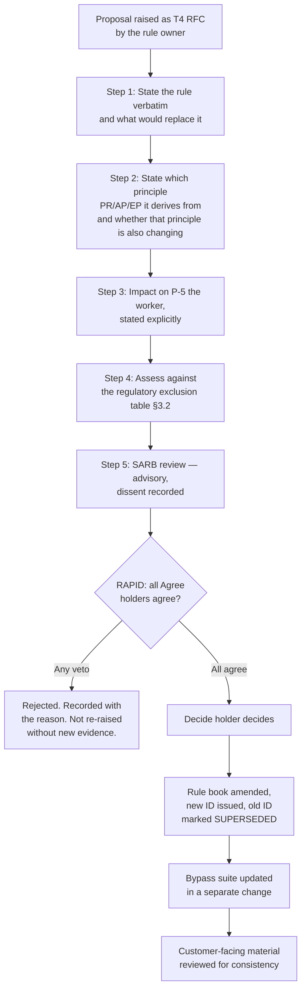

# Guardian Lens — Governance

**Decision rights, accountability, approval gates and control over everything the rule book states**

| Field | Value |
|---|---|
| Document | Governance Document |
| Version | 1.0 |
| Status | For founder, engineering and stakeholder ratification |
| Programme phase | Week 3 — Govern · 8 August 2026 |
| Inputs | PRD v1.0 · TRD v1.0 · [RULE_BOOK.md](RULE_BOOK.md) v1.0 · Research set D00–D18 |
| Companion | [RULE_BOOK.md](RULE_BOOK.md) — *what* must be true. This document is *who decides*. |
| Authority | This document governs how the PRD, TRD and Rule Book may be changed. It does not restate their content and never overrides a rule. Where governance and a rule appear to conflict, **the rule prevails and the governance process is corrected.** |
| Framework basis | NIST AI RMF 1.0 (Govern/Map/Measure/Manage) · ISO/IEC 42001:2023 clause structure · SR 11-7 model-risk pillars · Model Cards · Datasheets for Datasets · RACI / DACI / RAPID · ITIL change enablement |

---

## 1. Why this is a separate document

A rule book states what the system must do. It is testable, numbered and enforceable. Governance states **who has the authority to change those rules, by what process, and who must sign off.** A document that mixes the two can neither be obeyed nor audited.

```
Principles  →  Policy  →  Standard / Rule  →  Procedure  →  Guideline
    ↑            ↑              ↑                 ↑             ↑
    └────────────┴──────────────┴─────────────────┴─────────────┘
                            GOVERNANCE
              decides who may write, change, approve or waive
                        any layer above
```

| This document answers | This document does **not** answer |
|---|---|
| Who owns each rule | What each rule says → RULE_BOOK.md |
| Who may change an ABSOLUTE rule, and who can veto | How a rule is technically enforced → TRD |
| What must be true before a model reaches production | How the model is built → TRD §5 |
| Who approves a site go-live | How a site is onboarded → PRD §7.6 |
| What counts as an incident and who reports it | Which failures the system handles → TRD §5.6 |
| Which artefacts are controlled documents | Their contents |

---

## 2. Scope, and proportionality

Guardian Lens is a **pre-pilot product built by five people**, with zero customers, zero deployments and no revenue. Governance appropriate to a regulated enterprise deployed across fifty sites would not be followed here, and governance that is not followed is worse than none — it produces a document that describes a fiction.

This document therefore specifies **two tiers.** Every control below is marked with the tier it applies from.

| Tier | Applies | Meaning |
|---|---|---|
| **`[MVG]`** | **Now, pre-pilot and during the first pilot** | Minimum viable governance. Non-negotiable at any scale. If it is marked MVG and it is not happening, work stops. |
| **`[V1]`** | From Production v1 / second paying site | Full control set. Designed for now, operated later. |

> **The proportionality test used throughout:** would the absence of this control allow an ABSOLUTE rule to be broken without anyone noticing? If yes, it is `[MVG]`. If it merely makes things tidier, it is `[V1]`.

---

## 3. Regulatory posture

> **This section corrects the working assumption the governance research was built on.** The research framed Guardian Lens as a biometric, high-risk EU AI Act system. It is not, and treating it as one would import obligations that do not attach while distracting from the ones that do.

### 3.1 Where the first deployment actually is

The entire evidence base — ASI factory counts, NCRB and DGFASLI accident data, Factories Act registration as the site-qualification criterion — points at **India** as the first market. The governing instruments there are the **Factories Act 1948** and state factory rules, the **Digital Personal Data Protection Act 2023**, and the **IT Act 2000** and its rules. The EU AI Act, UK ICO guidance and EU works-council co-determination regimes apply to **no known Guardian Lens deployment** at the date of this document.

| Instrument | Applicability | Use in this programme |
|---|---|---|
| Factories Act 1948 + state rules (India) | **Likely — first market** | Defines the site qualification criterion. Employer duties remain the employer's (PRD §14.5). |
| DPDP Act 2023 (India) | **Likely** | Notice, purpose limitation, retention. Directly engaged by footage of workers. |
| EU AI Act | **Conditional** — only on an EU deployment or an EU-market placement | Adopted as a **design reference** now; becomes binding only on that trigger. §3.3. |
| UK ICO *Data protection and monitoring workers* (Oct 2023) | Not binding outside the UK | Adopted as the **design standard** for worker monitoring regardless — it is the best-articulated public guidance in the category. |
| EU works-council / co-determination | Not applicable absent an EU deployment | The **principle** (consult before installing) is adopted unconditionally as BR-P-02. |
| ISO/IEC 42001:2023 | Voluntary, certifiable | Used as the **skeleton** for this document. Certification is not pursued pre-revenue. |
| NIST AI RMF 1.0 | Voluntary, non-certifiable | Used as the **functional structure** (Govern / Map / Measure / Manage). |

`[OPEN — PRD OQ-6]` **Jurisdiction-specific legal review is required per deployment and is not a product feature.** No claim of compliance with any regime is made — BR-M-05.

### 3.2 The high-risk classification question

The research assumed Annex III high-risk status. That assumption should not be adopted without review, because Guardian Lens has been **deliberately designed to sit outside it**:

| Annex III / Article | Trigger | Guardian Lens |
|---|---|---|
| Annex III 1(a) — remote biometric identification | Biometric identification of natural persons | **Excluded by BR-006.** No facial recognition, no biometric templating, no identity field in the schema. |
| Annex III 4(a)/(b) — employment, worker management | Systems used to evaluate performance or behaviour, or to make decisions affecting terms of work | **Excluded by BR-002 and BR-003.** No activity or productivity measurement; no code path to any consequence for a worker. |
| Article 5(1)(f) — prohibited practice | Emotion inference in the workplace | **Excluded by BR-006.** No emotion classification exists. |

> **The design already answers the regulatory question.** The exclusions in the rule book were written as product ethics, and they happen to be the same exclusions that keep the system out of the highest-obligation categories. That is worth stating to a buyer, and worth protecting: **RD-05 — scope creep reintroduces surveillance — is simultaneously the product risk and the regulatory risk.** Every rule-change proposal must be assessed against this table (§8.4, step 4).

### 3.3 Article 14 human oversight — adopted as a design standard, not as an obligation

EU AI Act Article 14 requires that high-risk systems be effectively overseen by natural persons, that overseers understand the system's limitations, **remain aware of automation bias**, and can disregard, override or reverse output. Guardian Lens is architecturally stronger than this: there is no output to override, because nothing is recorded until a human decides. Article 14's substance is adopted in full as the design standard for the verification gate (§11).

**Article 14(5) — confirmation by two competent natural persons — is deliberately NOT adopted.** It attaches to remote biometric identification under Annex III 1(a). Guardian Lens performs none (BR-006). Adopting it voluntarily would double the reviewer workload that RD-01 and P-01 identify as the product's primary abandonment risk. This is a recorded decision, not an oversight — see ADR-003 (§19.3).

### 3.4 Article 73 incident reporting — conditional, with an unconditional internal floor

Article 73's deadlines (15 days, 10 days for a death, 2 days for widespread infringement or critical-infrastructure disruption) apply from 2 August 2026 to providers of high-risk systems placed on the EU market. **They do not currently attach to Guardian Lens.** The Commission's implementing guidance and reporting template were issued in draft on 26 September 2025 with consultation closing 7 November 2025 and must be re-verified before being cited as settled.

Regardless of applicability, §14 sets **internal reporting deadlines that apply unconditionally**, at or inside those clocks. If Guardian Lens ever enters EU scope, the internal process already meets the requirement rather than needing to be invented under a 15-day clock.

---

## 4. AI system inventory entry

*(NIST AI RMF Govern 1.6 — a documented inventory with a named accountable owner. ISO/IEC 42001 Clause 4.)* `[MVG]`

| Field | Value |
|---|---|
| System ID | GL-001 |
| Name | Guardian Lens |
| Purpose | Detect visually identifiable safety-rule exceptions on existing customer cameras and route every candidate to an authorised human before any record exists |
| AI component | Single fine-tuned YOLO-family object detector. **Perception only.** Everything after detection is deterministic (BR-D-03). |
| Intended users | Safety/EHS officers, shift supervisors, site administrators at industrial and warehouse sites |
| Affected parties **who are not users** | **Workers in monitored areas (P-5).** They have no interface, no account, and can block deployment. |
| Autonomy level | **None.** No output of the model produces any effect without a human decision (BR-004). |
| Deployment status | Pre-pilot. Zero sites live. |
| Accountable owner | Kuldeep — Product Owner |
| Technical owner (model) | Kamal — AI Engineering |
| Technical owner (system) | Kapil — Engineering / Integration |
| Independent challenge | Yashpal — Test & Verification (see §6.5 on the independence limitation) |
| Data categories processed | Video frames of workplaces containing images of people; structured event metadata; no identity, no biometrics, no audio |
| Highest-severity risks | RA-01 false positives consume the benefit · RD-01 reviewers abandon the queue · RD-03 worker resistance · RT-01 camera readiness unknown |
| Impact assessment status | **Not yet performed.** Gate G0 — §9. |
| Review cadence | Quarterly, or on any material change — §17 |

---

## 5. Governance principles

The product principles (PR-1…PR-7), AI principles (AP-1…AP-6) and ethical principles (EP-1…EP-6) in PRD §4 are the substance and are not restated. These five apply to **how decisions about the product are made.**

| # | Principle | Consequence |
|---|---|---|
| G-1 | **Every rule has a named owner** | An unowned rule is an unenforced rule. §6.3. |
| G-2 | **The party who bears the cost has a voice; the party who bears the risk has a veto** | P-2 bears the reviewer workload; P-5 bears the exposure and cannot be traded off. §6.4. |
| G-3 | **Decisions are recorded where they are made, not reconstructed afterwards** | ADRs for architecture, RFCs for change, a gate register for approvals. §8, §9, §19. |
| G-4 | **Governance is proportionate and honest about its limits** | Two tiers (§2). Where independence is unavailable in a five-person team, the gap is stated, not papered over. §6.5. |
| G-5 | **Absence of evidence is recorded as absence, not resolved by assumption** | Carried directly from the research method: `[OPEN]` is a legitimate terminal state. |

---

## 6. Decision rights

### 6.1 Which framework applies to which decision

Three frameworks, used for genuinely different things. Applying one framework to everything is how governance becomes theatre.

| Decision class | Framework | Why | Examples |
|---|---|---|---|
| **Execution / delivery** | **RACI** | Task ownership, one accountable per task | Building a feature, running the camera audit, writing a test suite |
| **Product decisions** | **DACI** | Fast, one driver, one approver | Feature scope, UI approach, roadmap sequencing, pricing presentation |
| **High-consequence decisions** | **RAPID** | Multiple genuine veto holders | Changing an ABSOLUTE rule, first go-live, model promotion to a live site, expanding detection scope, any H4 analytics work |

### 6.2 RACI — execution `[MVG]`

| Activity | Kuldeep | Mayank | Kapil | Kamal | Yashpal |
|---|---|---|---|---|---|
| Product scope and roadmap | **A/R** | C | C | C | I |
| Rule book maintenance | **A** | C | C | C | **R** |
| Architecture and technical decisions | A | C | **R** | C | I |
| Detection model development | I | C | C | **A/R** | C |
| Model evaluation and accuracy measurement | I | C | I | R | **A** |
| Business-rule bypass suite | I | I | C | I | **A/R** |
| Camera audit and site feasibility | A | I | **R** | R | I |
| Buyer interviews and validation | **A** | **R** | I | I | I |
| Worker notice and consultation material | **A/R** | C | I | I | C |
| Incident register | A | I | R | R | **R** |
| Customer-facing claims review (BR-M-01, BR-M-05) | **A** | R | I | C | **C — challenge role** |
| Security architecture | A | I | **R** | C | C |
| Data retention configuration per site | **A** | I | R | I | I |

**A** = Accountable (exactly one per row) · **R** = Responsible · **C** = Consulted · **I** = Informed

### 6.3 Rule ownership `[MVG]`

Per G-1. The owner is accountable for the rule remaining true, and is the person a reviewer asks first.

| Rule set | Owner | Challenge role |
|---|---|---|
| BR-001, BR-010, BR-C-* — configuration and scope | Kuldeep | Yashpal |
| BR-002, BR-003, BR-006, BR-P-* — privacy and exclusions | **Kuldeep** — cannot be delegated to engineering | Yashpal |
| BR-004, BR-005, BR-007, BR-V-*, BR-W-* — the verification gate | Kapil | Yashpal |
| BR-008, BR-S-*, BR-AU-* — security and audit | Kapil | Kamal |
| BR-D-*, BR-M-* — detection and model claims | Kamal | Yashpal |
| BR-R-* — reporting | Mayank | Kuldeep |
| BR-011, BR-012 — positioning and site basis | Kuldeep | Mayank |

> **BR-002, BR-003 and BR-006 are owned by the product owner, not by engineering, on purpose.** These are the rules under commercial pressure. The person who will be asked by a customer for "just one more detection type" must be the person accountable for refusing.

### 6.4 RAPID — high-consequence decisions `[MVG]`

| Role | Meaning |
|---|---|
| **R**ecommend | Drives the proposal, gathers the evidence, runs the process |
| **A**gree | **Formal veto.** Must agree for the decision to proceed. |
| **P**erform | Executes once decided |
| **I**nput | Consulted; no veto |
| **D**ecide | Makes the call; single named person |

| Decision | Recommend | **Agree (veto)** | Input | Decide | Perform |
|---|---|---|---|---|---|
| Change or retire an **ABSOLUTE** rule | Rule owner | **Yashpal (verification)** · **Worker representative or safety lead at the affected site** · **Legal/DPO once appointed** | All team | **Kuldeep** | Rule owner |
| First site go-live | Kapil | **Yashpal** · **Site safety owner (customer)** · **Worker representative (customer)** | Kamal, Mayank | Kuldeep | Kapil |
| Promote a model version to a live site | Kamal | **Yashpal** | Kapil | Kuldeep | Kamal |
| Add a detection class | Kamal | **Yashpal** · **Site safety owner** | Kuldeep, Mayank | Kuldeep | Kamal |
| Enable any suppression/triage layer (BR-A-01) | Kamal | **Yashpal** · **Kuldeep** | All | Kuldeep | Kamal |
| Begin H4 operations-analytics work | Mayank | **Kuldeep** · **Yashpal** | All | Kuldeep | — |
| Publish any accuracy figure (BR-M-01) | Kamal | **Yashpal** | Mayank | **Kuldeep** | Kuldeep |
| Enable an off-site video path at a site (BR-008 deviation) | Kapil | **Kuldeep** · **Customer IT owner (P-4)** | Yashpal | Kuldeep | Kapil |

> **The veto roles are the whole point of using RAPID here.** G-2 says the party bearing the risk holds the veto. For every rule protecting workers, that party is not on the team. Until a site exists, **Yashpal holds a standing proxy veto** on all worker-protection rules by virtue of the challenge role — recorded in §6.5 as a known compromise, not presented as adequate.

### 6.5 The independence problem, stated plainly `[MVG]`

SR 11-7 rests on **effective challenge through independent validation** — a reviewer with authority, competence and incentive to say no, who did not build the thing. A five-person team with three builders cannot supply this. Pretending otherwise would be the single most dishonest thing in this document.

| Gap | Reality | Mitigation now `[MVG]` | Resolution `[V1]` |
|---|---|---|---|
| No independent model validator | Kamal builds and evaluates the model | **Yashpal owns model evaluation accountability (§6.2) and holds a veto on promotion.** He did not build it and his research role (D08) was adversarial verification. | External or separately reporting validator before the second paying site |
| No legal / DPO function | None appointed | **Every `[OPEN]` legal item stays `[OPEN]`. No compliance claim is made (BR-M-05).** Legal review commissioned before the first pilot at a customer site. | Named external counsel per jurisdiction |
| No worker representative | No site exists | **Site safety owner and worker representative acquire veto rights at go-live** (§6.4) and BR-P-02 makes consultation a hard gate. | Standing consultation at each site |
| Reviewer and approver overlap | Kuldeep decides most RAPID rows | Veto holders are never Kuldeep on worker-protection rules | Separate the product-owner and approver roles |

---

## 7. Governance bodies

### 7.1 Safety & AI Review Board (SARB) `[MVG]`

| Attribute | Value |
|---|---|
| Purpose | Reviews everything that touches the rule book, the model, worker impact or an approval gate |
| Membership | All five team members. Site safety owner and worker representative attend from first pilot onward. External legal attends by exception. |
| Cadence | Fortnightly `[MVG]` → weekly during any active pilot `[V1]` |
| Quorum | Product owner + rule owner + the challenge role for the item under review. **Three, and never without the challenge role.** |
| Authority | **Advisory.** The board advises; the named Decide holder in §6.4 decides. A board that "approves" diffuses accountability until nobody holds it. |
| Standing agenda | 1. Open incidents · 2. Gate requests · 3. Rule change RFCs · 4. Model performance and acceptance rate · 5. `[OPEN]` items and whether any has been resolved by assumption · 6. Waivers in force |
| Record | Minutes with decisions, dissent and named owners. Dissent is recorded, not resolved into consensus. |

### 7.2 Change Advisory Board / change enablement `[V1]`

Not stood up as a separate body pre-pilot — the SARB absorbs it. From Production v1:

| Attribute | Value |
|---|---|
| Purpose | Assesses normal changes to production systems |
| Membership | Engineering owner, model owner, test owner, product owner |
| Authority | **Advisory.** Final authority rests with the named Change Manager (Kapil). Per ITIL, a CAB advises — it is not a Change Approval Board. |
| Emergency CAB (ECAB) | The minimum set of people with the knowledge and authority to implement the fix. Documentation and a post-implementation review are completed **after** the fact, never skipped. |

---

## 8. Change control

### 8.1 Change types `[MVG]`

| Type | Definition | Approval | Examples |
|---|---|---|---|
| **Standard** | Pre-approved, low-risk, repeatable, no rule impact | None — proceed | Dependency patch, documentation fix, test addition, log-level change |
| **Normal** | Assessed, then approved before implementation | Per §8.2 risk tier | Feature work, schema migration, config-service change, threshold default change |
| **Emergency** | Restores service or closes a live security or safety exposure | ECAB; post-implementation review within 2 working days | Production outage, active vulnerability, an ABSOLUTE rule found to be violable |

### 8.2 Normal-change risk tiers `[MVG]`

| Tier | Trigger | Approver | Extra requirement |
|---|---|---|---|
| **T1 — routine** | No rule impact, no schema change, no model change | Peer review on the pull request | — |
| **T2 — elevated** | Schema migration, auth change, retention logic, reporting logic | Engineering owner + test owner | Bypass suite must pass unmodified |
| **T3 — rule-adjacent** | Touches any enforcement point in RULE_BOOK.md §6 | SARB review → Decide holder | Explicit statement of which rules are affected and how they remain true |
| **T4 — rule change** | Changes what a rule says | §8.4 | RAPID |

> **The bypass suite (TRD §19.4) is never modified in the same change as the code it tests.** A pull request touching both is automatically T3 and must be split. This is the single cheapest control in this document and the easiest one to lose.

### 8.3 Request for Change (RFC) contents `[MVG]`

Every Normal change at T2 or above carries an RFC. Kept deliberately short — an RFC nobody writes governs nothing.

| Field | Required |
|---|---|
| Unique ID and date | Yes |
| Requester and change owner | Yes |
| Description and business case | Yes |
| **Rules affected, and how each remains true** | **Yes — T3/T4** |
| Risk and back-out plan | Yes |
| Test evidence | Yes |
| Approver and decision, with date | Yes |
| Reason for rejection, where rejected | Yes — rejections are recorded, not discarded |

### 8.4 Changing an ABSOLUTE rule `[MVG]`

The heaviest process in this document, deliberately. It exists to make crossing a boundary a **visible decision rather than a drift** (RD-05).



**Four things that can never change an ABSOLUTE rule:** a configuration setting, a feature flag, a support decision, or a hotfix. If any of those could, it was never ABSOLUTE.

### 8.5 Architecture Decision Records `[MVG]`

Nygard four-part format — **Status · Context · Decision · Consequences** — numbered `ADR-nnnn`, stored in version control beside the code, append-only. A superseded ADR is marked superseded, never deleted. The TRD's Technical Decisions Register (TD-001…TD-017) is the seed set and is migrated to individual ADRs at the first architectural change.

---

## 9. Approval gate register

The core operational content of this document. Each gate has entry criteria, required evidence, a named approver and named veto holders. **A gate with no evidence requirement is a signature, not a gate.**

| Gate | Name | Applies from | Approver | Veto |
|---|---|---|---|---|
| **G0** | Pre-pilot readiness | Before any customer-site work | Kuldeep | Yashpal |
| **G1** | Model release | Every model version reaching any site | Kuldeep | Yashpal |
| **G2** | Rule activation at a site | Every detection rule enabled | Site safety owner (customer) | — |
| **G3** | Site go-live | Every site | Kuldeep | Yashpal · Site safety owner · Worker representative |
| **G4** | Detection class expansion | Every new class | Kuldeep | Yashpal · Site safety owner |
| **G5** | Suppression / triage layer | If ever built | Kuldeep | Yashpal · Kuldeep |
| **G6** | Scope expansion (H2/H3/H4) | Every horizon entry | Kuldeep | Yashpal |
| **G7** | Production deployment | Every production release `[V1]` | Kapil | Yashpal |

### G0 — Pre-pilot readiness `[MVG]`

| Required evidence | Rule / source |
|---|---|
| AI system impact assessment complete (§12) | ISO 42001 6.1.4 |
| DPIA-equivalent complete for the target jurisdiction | ICO guidance; DPDP Act |
| Security architecture, threat model and key management documented and reviewed | PRD OQ-12, NFR-SEC-06 |
| Business-rule bypass suite passing, covering every ABSOLUTE rule | TRD §19.4 |
| Rule book ratified — no rule left `PROPOSED` | RULE_BOOK.md §10 |
| Camera audit complete at 3+ sites | RT-01, A-1, OQ-2 |
| Worker notice material drafted | BR-P-02, EP-4 |

### G1 — Model release `[MVG]`

*(SR 11-7 three pillars: development · independent challenge · governance. See §10.)*

| Required evidence | Rule / source |
|---|---|
| **Model card complete — including the limitations and risks sections** | §10.3 |
| **Dataset datasheet complete for every training source** | §10.4 |
| Held-out evaluation: precision, recall, mAP per class | TRD §19.7 |
| Condition-stratified evaluation: lighting, occlusion, angle, PPE colour — **documented, not averaged** | TRD §5.8 |
| Blur-interaction evaluation if blurring is enabled at the target site | BR-M-04 |
| Field acceptance rate does not regress against the incumbent | **BR-M-02**, AI-06 |
| Model artefact versioned with training-data hash; previous artefact retained for rollback | BR-D-01, TRD §5.7 |
| Independent challenge sign-off | §6.5 |

### G2 — Rule activation at a site `[MVG]`

| Required evidence | Rule |
|---|---|
| Written Site Safety Rule referenced | BR-011 |
| Zone defined and confirmed by the site safety owner | BR-001 |
| Activation is explicit, by a named user, audited in the same transaction | BR-C-01, BR-C-02, BR-010 |
| Projected candidate volume assessed against reviewer capacity | P-01, RD-01 |

### G3 — Site go-live `[MVG]`

| Required evidence | Rule |
|---|---|
| **Worker notice communicated: what is monitored, where, why, who sees it, how long it is kept** | **BR-P-02**, EP-4 |
| **Where representation exists, consultation completed before installation** | **BR-P-02** |
| Supervised observation mode run — baseline event volume measured before any queue is handed to a reviewer | F-16, PRD §7.6 step 8 |
| Reviewers named, trained, and able to demonstrate they can reject and correct, not only accept | §11 |
| Retention period configured and confirmed by the customer | BR-009 |
| Local processing confirmed by network capture | BR-008 |
| Onboarding material contains no claim that the product replaces any control | BR-012 |
| Legal review for the jurisdiction complete | OQ-6, RC-01 |

> **G3 is the gate that can be lost under commercial pressure.** Every criterion above is checkable in an afternoon except the consultation, which cannot be compressed. That is exactly why it is a veto item held by the party it protects.

### G5 — Suppression / triage layer `[MVG-conditional]`

| Required evidence | Rule |
|---|---|
| Every suppression logged with the reason | **BR-A-01** |
| Periodic human audit process defined, with a named auditor and cadence, **before the layer ships** | BR-A-01, AP-5 |
| Demonstrated that no category of event can be suppressed invisibly | RA-05 |

### G6 — Scope expansion `[MVG]`

| Required evidence | Rule |
|---|---|
| Assessment against the regulatory exclusion table (§3.2) | RD-05 |
| Assessment against BR-002, BR-003, BR-006 — does this create an individual-attribution path? | BR-P-03 |
| For H4 analytics: **its own problem statement, personas and traceability gate.** H4 does not inherit v1's. | PRD §5.5 |
| Worker impact stated explicitly | G-2 |

---

## 10. Model governance

### 10.1 Three pillars (SR 11-7, adapted)

| Pillar | Guardian Lens implementation | Tier |
|---|---|---|
| **1. Development, implementation and use** | TRD §5.7 model lifecycle · versioned artefacts with training-data hash · documented labelling standard as a deliverable · rollback by config change | `[MVG]` |
| **2. Effective challenge through independent validation** | Held-out evaluation → real-site-footage evaluation → condition-stratified evaluation → field acceptance rate → regression gate. Challenge role held by Yashpal with a promotion veto — **with the independence limitation stated in §6.5** | `[MVG]` |
| **3. Governance, policies and controls** | This document · the inventory entry (§4) · G1 gate · named owners (§6.3) | `[MVG]` |

> **"We bought it" is not a defence.** The base weights are pretrained, the datasets are public, the runtime is third-party. Every one remains Guardian Lens's responsibility. §16.

### 10.2 Chain of custody and promotion `[V1]`

| Control | Requirement |
|---|---|
| Model registry | Every artefact registered with version, training-data hash, evaluation results and approver |
| Promotion gate | Staging → production requires G1 sign-off recorded in the registry |
| Separation of duties | Kamal develops and trains · Kapil deploys · **Yashpal reviews and can block** · Kuldeep approves release |
| Artefact integrity | Checksums on model artefacts; a mismatch fails agent start |
| Audit log | Every promotion, rollback and approval recorded with actor and timestamp |
| **Deployment ≠ release** | An artefact may be deployed to an edge device and remain inactive behind configuration. **Release is the act of pointing a site's active configuration at it, and that is what G1 gates.** Staged rollout: one site, observe, then fleet (TRD §14.4). |

### 10.3 Model card — mandatory contents `[MVG]`

Mitchell et al. (FAT* '19) structure. **A model card with an empty limitations section does not satisfy G1.** Empirical studies consistently find risk and limitation sections under-completed; this is the specific failure this control exists to prevent.

| Section | Guardian Lens requirement |
|---|---|
| Model details | Architecture, version, training-data hash, owner, licence, contact |
| Intended use | PPE-class detection producing **candidates for human review**. Nothing else. |
| **Out-of-scope uses** | **Named explicitly:** identification, activity measurement, any automated consequence, any use as a safety control |
| Factors | Lighting, occlusion, camera angle and distance, PPE colour variation. **Never demographic factors — the system holds no such data (BR-006), and constructing them would violate it.** |
| Metrics | Precision, recall, mAP per class; field acceptance rate |
| Evaluation data | Held-out set and real-site footage, described separately |
| Training data | Source datasets, licences, hash |
| Quantitative analyses | **Disaggregated by condition**, not a single headline figure |
| Ethical considerations | Worker impact; the human gate; what happens when the model is wrong |
| **Caveats and recommendations** | **Known weak conditions stated. Mandatory. A card without this fails G1.** |

### 10.4 Dataset datasheet — mandatory contents `[MVG]`

Gebru et al. (CACM, Dec 2021), seven areas — **Motivation · Composition · Collection process · Preprocessing/labelling · Uses · Distribution · Maintenance.** Required for every training source, public or site-derived.

For **site-derived footage** `[V1]` these additional questions are mandatory and answered before any frame is used for training:

| Question | Why |
|---|---|
| Is there a written data agreement with the customer? | TRD §5.8 makes this a condition |
| Were workers notified that footage may be used for model improvement? | BR-P-02; the original notice may not cover it |
| Can the customer withdraw the data, and what happens to models trained on it? | DPDP Act; retention authority §13 |
| Does any frame permit identification of an individual? | BR-006; excluded if so |
| Retention period for training footage, separate from event retention | BR-009 |

---

## 11. Human oversight governance

Article 14's substance, adopted as the design standard (§3.3). This section governs **the thing the whole product rests on**, and it is the section most likely to be true on paper and false in practice.

### 11.1 What the verifier must have `[MVG]`

| Requirement | Implementation |
|---|---|
| **Competence** | Named reviewers only. Role-based, site- and zone-scoped (TRD §12.3). Identity from the authenticated session, never supplied (BR-S-01). |
| **Training** | Before any reviewer takes a live queue: what the model can and cannot see; what the known weak conditions are (from the model card); that rejecting is a correct and expected outcome; that the queue depth is honest (DP-4). |
| **Interface** | One screen, one decision (DP-1). Frame, time, camera, zone and rule visible together. Keyboard-operable (NFR-ACC-01). |
| **Authority to disregard** | Structural: nothing exists to override, because nothing is recorded until the reviewer decides. There is no auto-accept state and no escalation state (TRD §11.2). |
| **Awareness of automation bias** | §11.2 — the measures below. |

### 11.2 Automation-bias controls — the rubber-stamping problem `[MVG]`

The failure mode is not that the gate is absent. It is that the gate becomes **cosmetic**: a reviewer under time pressure accepting everything the machine proposes. Article 14(4) names this — over-reliance on output — and it is the specific way Guardian Lens's differentiator dies quietly while every metric still looks fine.

| Control | Mechanism | Owner |
|---|---|---|
| **No bulk disposition** | BR-V-02 — the route does not exist | Kapil |
| **Confidence never orders away judgement** | BR-V-03. Confidence may annotate; it may never auto-approve | Kamal |
| **Rubber-stamping indicators, monitored** | Reviewer-level acceptance rate approaching 100%, **and** median review time falling below a floor established in pilot, **together**, trigger a SARB review of that site's queue | Yashpal |
| **Rejection is normal and visible** | Rejection rate reported to the customer (BR-R-03). A site with a near-zero rejection rate is a warning, not a success | Mayank |
| **Reviewer load stays survivable** | P-01 measured before scaling; supervised observation mode establishes the baseline before any queue goes live | Kuldeep |
| **Training states it explicitly** | Reviewers are told the model's measured weak conditions and that disagreeing with it is the job | Kuldeep |

> **The metric nobody else in this category publishes is reviewer load, and the metric that reveals a fake gate is review time.** Both are measured in the pilot. If median review time is a second and a half, the gate is decoration and the product's only differentiator is gone — regardless of what the acceptance rate says.

---

## 12. Risk management and impact assessment

### 12.1 AI system impact assessment `[MVG]`

*(ISO/IEC 42001 6.1.4 establishes it; 8.4 performs it. The requirement with no ISO 27001 equivalent.)*

| Attribute | Value |
|---|---|
| Trigger | Before G0; then on any G4 or G6 gate, and annually |
| Owner | Kuldeep |
| Must cover | Purpose and necessity · affected parties **including non-users (P-5)** · what could go wrong for a worker · error consequences in both directions (false positive → wasted reviewer time; false negative → a hazard unrecorded, and **existing controls unchanged** per BR-012) · data categories · retention · the exclusions and how they are enforced |
| Output | A written assessment, reviewed by SARB, with actions tracked to closure |
| Status | **Not yet performed.** Blocks G0. |

### 12.2 Risk register governance `[MVG]`

The registers in PRD §16 (RB, RT, RA, RC, RD) are the source. Governance adds:

| Control | Requirement |
|---|---|
| Each risk carries a named owner | SARB assigns; unowned risks are reassigned at each review |
| **HIGH risks are reviewed at every SARB meeting** | RT-01, RA-01, RA-02, RD-01, RD-02, RB-01, RB-02, RB-03, RA-05 |
| A risk may not be closed by assumption | G-5. It closes on evidence or it stays open. |
| New risks are raised by anyone, at any time | No gatekeeping on raising |
| Assumptions (PRD §17) carry tests, and untested assumptions are reported as untested | A-1…A-9 |

---

## 13. Data governance

*(DAMA-DMBOK: data governance at the hub — accountability, policy, decision rights, escalation, metrics.)*

### 13.1 Classification `[MVG]`

| Category | Class | Handling |
|---|---|---|
| Raw video stream | **Highest sensitivity** | Never leaves the site (BR-008). Never persisted beyond frame sampling. Never crosses a trust boundary. |
| Evidence frame | High | Single still per event. Encrypted at rest. Deleted on retention elapse. Optional blurring (F-14). |
| Event metadata | Medium | Zone, rule, time, confidence, model version. No identity. Crosses the trust boundary. |
| Reviewer identity | Medium | Business-user personal data. Mandatory on every record (BR-005) and immutable (BR-AU-02). |
| Audit log | High — integrity-critical | Append-only. Retention never shorter than event retention (BR-AU-04). |
| Camera credentials | **Highest sensitivity** | Encrypted; never retrievable in plaintext (BR-S-03). |
| Training footage `[V1]` | Highest | Written data agreement required; datasheet required (§10.4). |
| **Worker identity** | **Does not exist** | No such field. No such fact type. Not a control — an absence. |

### 13.2 Roles `[MVG]`

| Role | Holder | Authority |
|---|---|---|
| Data owner (product) | Kuldeep | Classification, retention policy defaults, approval of any new data category |
| Data steward (technical) | Kapil | Implementation of classification, encryption, deletion |
| **Retention authority** | **The customer, per site** | Sets the period (BR-009). Guardian Lens enforces; it does not decide. |
| **Deletion authorisation** | Automatic on retention elapse; **manual deletion requires the site admin and is audited** | BR-009, NFR-AUD-03 |
| Training-data approver `[V1]` | Kuldeep, with Kamal | No site footage enters training without a written agreement and a datasheet |

> **The retention authority sits with the customer, not with us.** That is a governance decision with a commercial cost — it makes retention a per-site conversation rather than a product default — and it is the correct one for P-4 and P-5. Recorded as ADR-004.

---

## 14. Incident management

### 14.1 Definitions `[MVG]`

Aligned to the OECD AI Incidents and Hazards Monitor and the AI Incident Database (Responsible AI Collaborative), which define an AI incident as an alleged harm or near-harm event to people, property or the environment where an AI system is implicated.

| Term | Guardian Lens definition |
|---|---|
| **AI incident** | An event in which Guardian Lens contributed to, or failed to prevent contributing to, harm or near-harm — including a wrong record about a person, or a safety record so incomplete it misled a decision |
| **AI hazard** | A condition that could plausibly lead to an incident but has not yet — e.g. a model regression detected before a wrong record was produced |
| **Rule violation** | Any instance in which an ABSOLUTE rule was found to be violable, whether or not it was violated. **Treated at incident severity regardless of impact.** |
| **Not an incident** | A false positive correctly rejected by a reviewer. That is the system working as designed and is measured as AI-01, not reported. |

### 14.2 Severity and internal deadlines `[MVG]`

These deadlines apply **unconditionally**, independent of whether EU AI Act Article 73 ever attaches (§3.4). They are set at or inside its clocks so that entering EU scope requires no new process.

| Severity | Definition | Internal report to SARB | External |
|---|---|---|---|
| **S1** | Death or serious injury where Guardian Lens output was implicated · an ABSOLUTE rule found violable in production · unauthorised disclosure of footage | **Immediately, and within 24 hours in writing** | Customer immediately. Regulator per jurisdiction — Art. 73's 10-day death clock and 2-day critical-infrastructure clock adopted as internal ceilings |
| **S2** | A verified record found to be materially wrong · a model regression reaching a live site · retention or deletion failure | **Within 2 working days** | Customer within 5 days. 15-day ceiling adopted |
| **S3** | Coverage gap not recorded · audit entry missing · a STRONG rule deviation without a waiver | Next SARB meeting | Customer at next review |
| **S4** | Hazard — detected before impact | Logged; reviewed at next SARB | — |

### 14.3 Incident register `[MVG]`

| Field | Required |
|---|---|
| ID, date detected, date occurred | Yes |
| Severity, and who assigned it | Yes |
| Description, and **which rule or control failed** | Yes |
| Affected parties — including workers, named as a category never as individuals | Yes |
| Immediate action, root cause, corrective action, verification that it worked | Yes |
| Whether external reporting was required, and what was reported | Yes |
| Closed by, date | Yes |

> **An incomplete initial report filed on time beats a complete one filed late.** Both Article 73 and good practice allow a follow-up. The register records both.

---

## 15. Monitoring and measurement

*(NIST AI RMF Measure and Manage.)*

| What | Metric | Cadence | Escalation trigger | Tier |
|---|---|---|---|---|
| Human gate integrity | P-03 record completeness | Continuous | **Anything below 100% is S1.** The core claim is broken. | `[MVG]` |
| Reviewer load | P-01 events per reviewer per shift | Per shift | Above the pilot-established threshold → SARB | `[MVG]` |
| Rubber-stamping | P-02 median review time · reviewer acceptance rate | Weekly | Both at their extremes together → SARB review of that site | `[MVG]` |
| Model performance | AI-01 field acceptance rate | Continuous | Regression vs incumbent → rollback (BR-M-02) | `[MVG]` |
| Model drift by location | AI-02, AI-03 rejection rate by camera and rule | Weekly | Disproportionate rate → configuration review | `[MVG]` |
| Coverage honesty | O-01, O-02 stream uptime and gap duration | Continuous | Unrecorded gap → S3 | `[MVG]` |
| Deletion compliance | O-04 | Monthly | Any failure → S2 | `[MVG]` |
| Audit completeness | O-05 | Monthly | Any change without an actor → S3 | `[MVG]` |
| Worker acceptance | PK-07 | Per pilot review | **Failure halts the pilot.** Nothing else matters. | `[MVG]` |
| Configuration effort | P-06 hours per site | Per site | Not falling site 1→5 → business-model review | `[V1]` |

---

## 16. Third-party and supply chain

*(NIST Govern 6. "We bought it" is not a defence.)* `[MVG]`

| Dependency | Risk | Control |
|---|---|---|
| Pretrained YOLO-family weights | Unknown training data, licence terms | Licence recorded; datasheet covers provenance; evaluated on our own data before use |
| Public PPE datasets | Unknown collection consent, distribution shift | Datasheet per dataset (§10.4); condition-stratified evaluation exposes distribution gaps |
| ONNX Runtime / inference stack | Supply-chain compromise | Pinned versions and base-image digests; dependency and secret scanning in CI |
| Customer NVR analytics (event source) | Events consumed from a third party we did not build | **Consumed events are candidates like any other and go through the same human gate.** No NVR event becomes a record without verification. |
| Camera firmware and ONVIF conformance | Variable quality (RT-05) | Treated as best-effort with a manual RTSP fallback; verified during camera audit |
| Cloud provider | Lock-in | Provider-agnostic architecture (TD-017) |

---

## 17. Governance cadence

| Activity | Frequency | Owner | Tier |
|---|---|---|---|
| SARB meeting | Fortnightly → weekly during a pilot | Kuldeep | `[MVG]` |
| Rule book review — every rule still true, still needed, still owned | Quarterly, and before every gate | Yashpal | `[MVG]` |
| `[OPEN]` item review — has any been resolved by assumption? | Every SARB | Kuldeep | `[MVG]` |
| Risk register review — all HIGH items | Every SARB | Kuldeep | `[MVG]` |
| Waivers in force — still justified? | Every SARB | Kuldeep | `[MVG]` |
| AI system inventory entry review | Quarterly | Kuldeep | `[MVG]` |
| Impact assessment refresh | Annually, and on G4/G6 | Kuldeep | `[MVG]` |
| Model card and datasheet review | Every G1 | Kamal | `[MVG]` |
| Governance document review | Quarterly | Kuldeep | `[MVG]` |
| Legal review per jurisdiction | Per deployment | External | `[V1]` |

---

## 18. Exceptions and waivers

| Rule class | Waivable? | By whom | Recorded |
|---|---|---|---|
| **ABSOLUTE** | **Never.** Not by a customer, not for a deal, not temporarily. Change it under §8.4 or comply. | — | — |
| **STRONG** | Yes, per site, with a documented customer-specific decision | Kuldeep, with the rule owner consulted | Waiver register: rule, site, reason, expiry, approver |
| **ADVISORY** | Yes, with the absence flagged at onboarding | Rule owner | Onboarding record |

**Every waiver carries an expiry date.** A waiver without one is a rule change made by omission — which is precisely the drift RD-05 describes. Waivers in force are reviewed at every SARB meeting (§17).

---

## 19. Controlled documents and handoff

### 19.1 The controlled set `[MVG]`

Docs-as-code: Markdown in git, changed by pull request, reviewed like code, versioned with the product.

| Document | Owner | Change control |
|---|---|---|
| RULE_BOOK.md | Kuldeep | §8.4 for ABSOLUTE; §8.2 T3 otherwise |
| GOVERNANCE.md | Kuldeep | SARB review |
| PRD.md | Kuldeep | DACI |
| TRD.md | Kapil | ADR + T2/T3 |
| ADRs | Author | Append-only |
| Model cards | Kamal | Per G1 |
| Dataset datasheets | Kamal | Per G1 |
| Impact assessment / DPIA | Kuldeep | Per G0, annually |
| Incident register | Yashpal | Append-only |
| Waiver register | Kuldeep | SARB |
| Research set D00–D18 | Original owners | Frozen; corrections recorded, not overwritten |

### 19.2 Handoff completeness standard `[V1]`

A receiving team should be able to operate and extend Guardian Lens without asking a question that only a departed person can answer.

| Standard | Application |
|---|---|
| **arc42** (12 sections) | Architecture documentation. TRD already covers most; §9 Architecture Decisions maps to the ADR set, §12 Glossary maps to RULE_BOOK.md §3 vocabulary. |
| **C4 model** | Context / Container / Component diagrams. Populates arc42 §3, §5, §6, §7. TRD §2 already carries the container and component views. |
| **Diátaxis** | Four documentation types, never mixed on one page: tutorial (onboard a new team member) · how-to (operate, deploy, respond to an incident) · **reference (RULE_BOOK.md, API spec, model card)** · explanation (why the human gate exists). |
| ADRs | So the receiving team does not re-litigate settled decisions. |

### 19.3 Governance ADRs recorded in this document

| ID | Decision | Rationale |
|---|---|---|
| ADR-001 | Rule book and governance are separate documents | A merged document is neither testable nor auditable (§1) |
| ADR-002 | Existing `BR-*` identifiers retained rather than renumbered to `GL-R-*` | Preserves traceability into the PRD, TRD, schema constraints and CI suite (RULE_BOOK.md §2.1) |
| ADR-003 | **Two-person verification not adopted** | Article 14(5) attaches to remote biometric ID, which BR-006 excludes. Adopting it voluntarily would double the reviewer load that RD-01 identifies as the primary abandonment risk (§3.3) |
| ADR-004 | Retention authority sits with the customer | Correct for P-4 and P-5; accepted commercial cost of a per-site conversation (§13.2) |
| ADR-005 | Governance specified in two tiers, `[MVG]` and `[V1]` | Governance that is not proportionate is not followed, and unfollowed governance describes a fiction (§2) |
| ADR-006 | Independence limitation stated rather than papered over | A five-person team cannot supply SR 11-7 independent validation; claiming otherwise would be the least honest thing in this document (§6.5) |

---

## 20. What this document deliberately does not do

| Not done | Why |
|---|---|
| Pursue ISO/IEC 42001 certification | Certifiable, but pre-revenue with five people it would consume the pilot. The clause structure is used; the certificate is not pursued. Revisit at the second paying site. |
| Declare EU AI Act high-risk status | Not established, and the design deliberately sits outside Annex III (§3.2). Declaring it would import obligations that do not attach and would not make the product safer. |
| Adopt two-person verification | ADR-003 |
| Stand up a separate CAB pre-pilot | The SARB absorbs it. A second body among five people is ceremony. |
| Set numeric targets for oversight metrics | Same methodological position as the PRD: a target set before the first measurement is invented. Thresholds are established during the pilot and recorded here at that point. |
| Assign a DPO | No such person exists on the team. Recorded as a gap (§6.5), not as a filled role. |

---

## 21. Open governance questions

| ID | Question | Owner | How it gets answered | Blocks |
|---|---|---|---|---|
| GQ-1 | Which jurisdiction governs the first deployment, and what does it require? | Kuldeep / external legal | Legal review once the first site is identified | G0, G3, §3 |
| GQ-2 | Who holds the worker-representative veto at a site with no union or works council? | Kuldeep | Agreed with the customer at G3; a named worker, not a manager | G3 |
| GQ-3 | What is the median-review-time floor below which the gate is presumed cosmetic? | Yashpal | Measured in pilot, then set. Not invented. | §11.2 |
| GQ-4 | Who provides independent model validation from the second paying site? | Kuldeep | External or separately reporting appointment | §6.5, G1 |
| GQ-5 | What retention period do customers require, and what do their obligations demand? | Kuldeep / legal | Site consultation plus legal review (PRD OQ-10) | §13 |
| GQ-6 | Does the DPDP Act 2023 create obligations for footage of workers that the current design does not meet? | External legal | Legal review before G0 | G0 |

**None of these is resolved by assumption.** Per G-5, `[OPEN]` is a legitimate terminal state until evidence exists.

---

## 22. Sign-off

| Role | Name | Confirms | Date |
|---|---|---|---|
| Product Owner / accountable owner | Kuldeep | Decision rights, gates and vetoes are as stated, and will be honoured under commercial pressure | |
| Engineering / Change Manager | Kapil | Every technical gate is implementable and every enforcement point exists | |
| AI Engineering / model owner | Kamal | Model governance and G1 evidence requirements are achievable per release | |
| Test & Verification / challenge role | Yashpal | The vetoes assigned to this role are real, and will be used | |
| Validation | Mayank | Customer-facing controls match how buyers and sites actually operate | |

> **The test for this document:** if a customer offers a contract conditional on disabling one ABSOLUTE rule, does this document tell everyone exactly what happens, who decides, and who can stop it — without a meeting to work it out? If not, the governance is wrong, not the situation.
