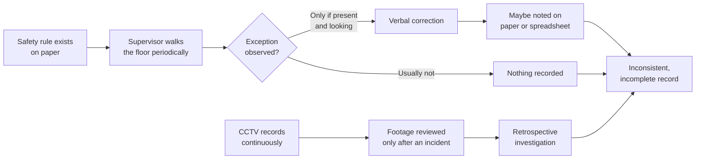
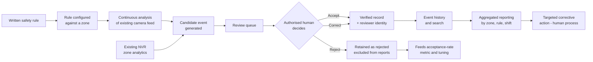
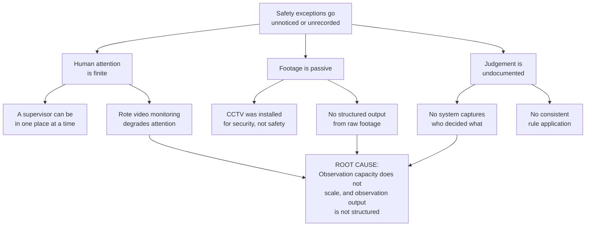
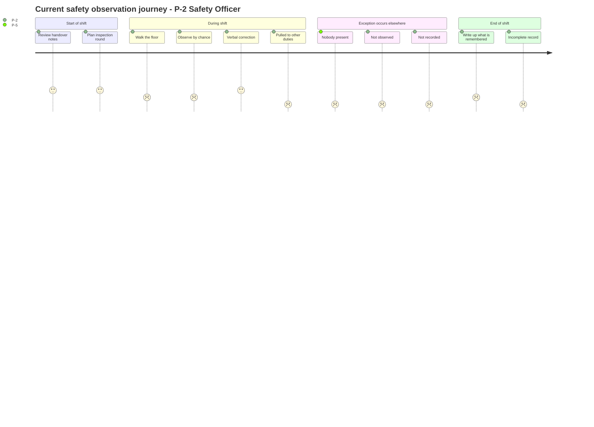
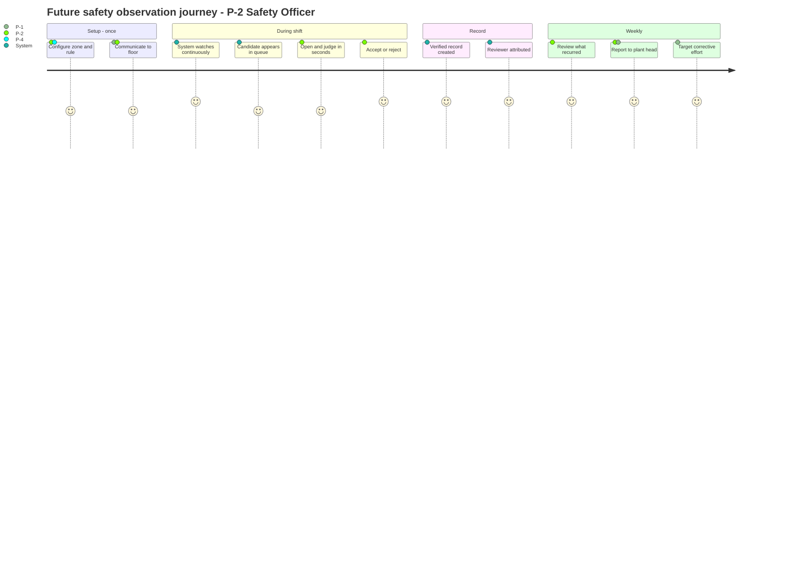
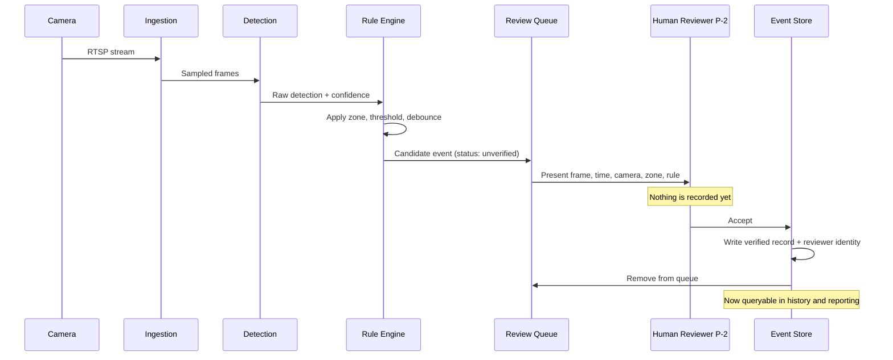
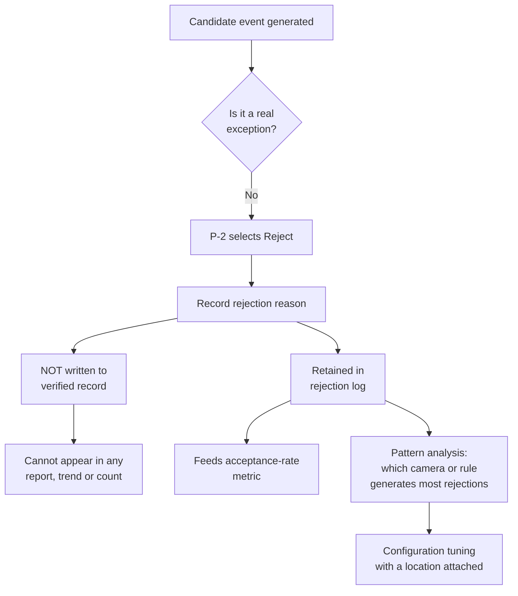
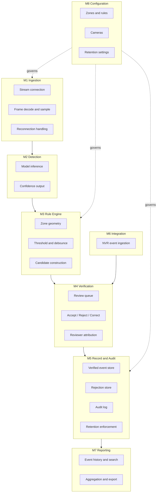
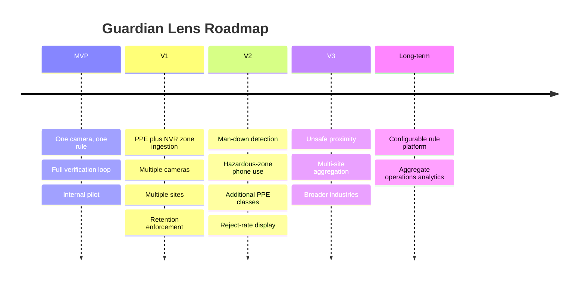

# Guardian Lens — Product Requirements Document

**Human-verified AI safety and compliance monitoring for existing workplace cameras**

| Field | Value |
|---|---|
| Document | Product Requirements Document (PRD) |
| Version | 1.0 |
| Status | For engineering, UI/UX, QA, AI engineering and stakeholder approval |
| Programme phase | Week 2 — Define · 15–21 July 2026 |
| Product scope | v1 = Safety and compliance. Operations analytics is Future Vision only (§5.5, §19). |
| Source of truth | Product Discovery research documents D00–D18 |
| Prepared for | Engineering, Design, QA, AI Engineering, Founders |

---

## Evidence Classification Convention

Every material statement in this document carries one of five classifications. This convention is used throughout and is not decorative — it determines what may be built on and what may not.

| Tag | Meaning | Permitted use |
|---|---|---|
| `[VALIDATED]` | Traceable to an authoritative, peer-reviewed or primary source. | May be relied upon in design decisions. |
| `[ASSUMPTION]` | A condition v1 depends on that has not been proven. | Must be tested. Tracked in §17. |
| `[HYPOTHESIS]` | Believed to be true based on reasoning, not evidence. | May inform design; must not be presented as fact. |
| `[FUTURE]` | Post-v1 vision. | Must not drive v1 engineering effort. |
| `[OPEN]` | Unknown. No source exists. | Tracked in §18. Never resolved by assumption. |

### Source document register

| ID | Document | Used in |
|---|---|---|
| D00 | Idea Blocking | §1–§5, §14, §19 |
| D01 | Market Research | §1, §2, §16 |
| D02 | Competitive Research | §3, §14, §16 |
| D03 | Problem Validation | §3, §15, §17 |
| D04 | Product Vision | §4, §14, §15 |
| D05 | Business Model | §1, §15, §16 |
| D06 | Initial Features | §9, §10 |
| D07 | Agentic Opportunity | §3, §4, §8 |
| D11 | PRD (structured draft) | §5, §11, §17, §18 |
| D12 | Personas | §6 |
| D13 | User Journeys | §7 |
| D14 | Feature Catalogue | §9, §10 |
| D15 | Product Boundaries | §5, §14 |
| D16 | Business Rules | §13 |
| D17 | Technical Appendix | §8, §11, §12 |
| D18 | Ditstek Pilot PRD | §10 Pilot Scope |

---

# 1. Executive Summary

## 1.1 Product Overview

Guardian Lens is a software layer that connects to the CCTV and IP cameras a workplace already owns, uses computer vision to identify safety-rule exceptions, and routes every candidate event to an authorised human for confirmation before it becomes a record.

The product does not replace the customer's cameras, their supervisors, or their existing safety controls. It converts footage that is currently reviewed only after an incident into a structured, human-verified record of what actually happened, where, and on which shift.

## 1.2 Vision

> A workplace where every safety-relevant event that a camera can see is noticed, judged by a person, and recorded as defensible evidence — and where nothing else about a worker is watched at all.

## 1.3 Mission

To turn the cameras a workplace already owns into a continuously watching, human-verified safety record — deliberately refusing to watch anything that is not a safety rule, and deliberately refusing to decide anything on its own.

## 1.4 Product Positioning

| Dimension | Position |
|---|---|
| Category | AI video analytics for environmental, health and safety (EHS) workflows |
| Positioning statement | The transparently priced, human-verified safety and compliance layer for workplaces the enterprise platforms do not serve — turning existing cameras and existing analytics into auditable safety evidence, where no event becomes a record until a named person has verified it. |
| Competes against | Manual safety inspection, clipboard-based observation, and passive CCTV reviewed only after incidents. `[VALIDATED — D02 §8]` |
| Does **not** compete against | Enterprise EHS platforms an SME will never evaluate; camera firmware analytics. |
| Layer position | Above the hardware. Zone detection belongs to the customer's NVR where present; verification, unified record and reporting belong to Guardian Lens. `[VALIDATED — D00 §3.1]` |

## 1.5 Target Industry

| Priority | Industry | Basis |
|---|---|---|
| Primary | Manufacturing and warehousing sites operating under statutory safety obligations, with documented PPE or restricted-zone rules | `[VALIDATED — D00 §4.1]` |
| Secondary | Logistics and distribution facilities | `[HYPOTHESIS]` |
| Deferred | Construction — different buyer, high site churn, frequently no permanent camera infrastructure | `[FUTURE — D15 §4]` |
| Deferred | Healthcare and laboratories — materially higher data-protection burden | `[FUTURE — D15 §4]` |

## 1.6 Target Customers

Small and medium industrial sites that satisfy five conditions. All five are required; a site failing any one is not addressable in v1. `[VALIDATED — D00 §4.1]`

| # | Condition |
|---|---|
| 1 | Compatible IP cameras already installed and positioned to view the relevant area |
| 2 | An explicit, written safety rule that can be represented visually |
| 3 | A named EHS, operations or facility-safety owner |
| 4 | Legal and organisational ability to run transparent video processing, including worker communication |
| 5 | Sufficient observation or review burden to justify evaluating a pilot |

## 1.7 Business Opportunity

### Validated

| Fact | Source |
|---|---|
| Approximately 2.93 million work-related deaths annually and over 395 million non-fatal work injuries (reference year 2019) | `[VALIDATED — ILO, via D03 §2]` |
| Of those deaths, ~2.6 million are disease-related and ~330,000 arise from occupational accidents | `[VALIDATED — ILO, via D03 §2]` |
| The category is commercially real: Intenseye USD 94.4M raised, Protex AI USD 36M, CompScience USD 27.6M | `[VALIDATED — D02 §3.1]` |
| Verified user reviews exist for the category, with mid-market representing 47.2% of one vendor's reviews | `[VALIDATED — D03 §5.2]` |
| Pricing is opaque across the category; almost no vendor publishes deployment pricing | `[VALIDATED — D02 §6]` |

### Not validated

| Claim | Status |
|---|---|
| Total addressable market for safety-specific video analytics | `[OPEN]` — no public source with a transparent definition exists `[D01 §4]` |
| Willingness to pay among target buyers | `[OPEN]` — no price benchmark, no buyer evidence `[D05 §2]` |
| Proportion of target sites with adequate camera coverage | `[OPEN]` — the single largest unknown in the model `[D01 §4.1]` |

> **No revenue projection appears in this document.** A projection requires a price, a conversion rate, a sales-cycle length and a churn assumption. None exists. `[D05 cover]`

## 1.8 Core Value Proposition

| Audience | Value delivered |
|---|---|
| The site | Continuous checking of defined safety rules without adding headcount, producing a record that is defensible to an auditor or insurer. |
| The safety officer | Coverage that does not depend on being physically present, and structured data on what recurs rather than recollection. |
| The worker | A hazard they are exposed to is more likely to be noticed and fixed — and they are never identified, scored, ranked or timed. |
| The buyer | A published price, evaluable without entering a sales process. `[VALIDATED as differentiator — D02 §6]` |

---

# 2. Product Analysis

## 2.1 Current Situation

Industrial sites already own camera infrastructure. That infrastructure is used predominantly for security and for retrospective incident investigation. Safety observation itself remains a human, periodic activity carried out by supervisors and EHS staff alongside competing production duties. `[HYPOTHESIS — D00 §5; to be confirmed in interviews]`

There is no single universal safety-observation process across sites, and no public dataset describes one. `[VALIDATED — D00 §5]`

## 2.2 The Problem

A workplace cannot continuously observe every camera feed it already owns. Safety-rule exceptions that are visually detectable are therefore identified inconsistently, late, or only during post-incident footage review.

## 2.3 The Opportunity

| Opportunity | Evidence |
|---|---|
| Existing camera infrastructure is under-used for safety | `[VALIDATED — every vendor in the category builds on installed cameras, D02 §4]` |
| Human governance of AI output is not marketed as core architecture by any competitor reviewed | `[VALIDATED — D02 §7.2]` |
| Pricing opacity creates a wedge for a transparently priced entrant | `[VALIDATED — D02 §6]` |
| Regulatory attention on occupational safety obligations is live | `[VALIDATED — D00 §10.1]` |

## 2.4 Business Need

| Need | Description |
|---|---|
| Coverage without headcount | Observation must scale beyond the number of people available to walk the floor. |
| Defensible evidence | Safety records must show who judged an event, not merely that a machine flagged it. |
| Targeted corrective effort | Sites need to know which exceptions recur, where, and on which shift. |
| Trust with the workforce | Any system observing people must be demonstrably narrow in scope, or it will be resisted. |

## 2.5 Why This Product Exists

Guardian Lens exists because three conditions hold simultaneously:

1. Machine perception can now identify safety conditions in raw video reliably enough to be useful. `[VALIDATED — D03 §3.1]`
2. No machine judgement should be recorded as fact about a person without a human confirming it. `[Product principle — D04 §4]`
3. Neither condition is served by existing products, which either alert without governance or price themselves beyond the target segment. `[VALIDATED — D02 §4, §6]`

## 2.6 Current Workflow

**Characteristics of the current workflow:**

| Attribute | Current state |
|---|---|
| Coverage | Partial — depends on who is present and where they look |
| Consistency | Low — judgement varies between reviewers and shifts |
| Record quality | Fragmented — paper, spreadsheet, or nothing |
| Use of footage | Reactive — reviewed after an incident, not before |
| Analysis | Difficult — underlying data is inconsistent or absent |

## 2.7 Future Workflow

**What changes:**

| Attribute | Current | Future |
|---|---|---|
| Observation | Periodic, presence-dependent | Continuous against configured rules |
| Detection | By chance | Consistent against the same rule regardless of shift |
| Judgement | In the moment, rarely recorded | Explicit, recorded, attributed |
| Recording | Paper, spreadsheet, or nothing | Structured verified event at the moment of review |
| Analysis | Difficult | Aggregation by zone, rule, shift becomes possible |
| Action | Human process | Unchanged — remains a human process |

> **The improvement claim is deliberately narrow:** consistency of observation and quality of the record. It is **not** a claim about fewer injuries. `[D04 §3]`

---

# 3. Problem Deep Dive

## 3.1 Problem Statement

> Workplace safety teams cannot continuously observe every camera feed they already own. Visually detectable safety-rule exceptions — initially missing required PPE and entry into configured restricted zones — are therefore identified inconsistently, late, or only during post-incident footage review. Guardian Lens analyses compatible existing camera feeds, produces candidate safety events, and requires an authorised human to accept, reject or correct each event before it enters a formal record.

### Problem elements

The statement decomposes into five testable elements. **Every v1 feature must trace to at least one.** These identifiers are used throughout this document.

| ID | Element | Consequence today |
|---|---|---|
| PE-1 | No one can continuously observe all relevant camera feeds during a shift | Exceptions are seen only by chance |
| PE-2 | Periodic inspection is by definition not continuous observation | Coverage depends on who is present and where they look |
| PE-3 | Recorded CCTV is reactive and does not produce a structured safety record | Footage is reviewed only after an incident |
| PE-4 | Manual judgement is inconsistent between reviewers and between shifts | The same condition is treated differently by different people |
| PE-5 | There is no consistent data on which exceptions recur, where, and on which shift | Corrective effort is untargeted |

## 3.2 Root Cause Analysis

| Level | Cause | Evidence |
|---|---|---|
| Symptom | Safety exceptions go unnoticed or unrecorded | `[HYPOTHESIS — D00 §6]` |
| Cause 1 | Human observation capacity is finite and competing with production duties | `[HYPOTHESIS]` |
| Cause 2 | Rote continuous video monitoring degrades human monitoring efficiency | `[VALIDATED — UIC School of Public Health, via D03 §6]` |
| Cause 3 | CCTV was installed for security and produces no structured safety output | `[HYPOTHESIS — D00 §5]` |
| Cause 4 | Informal judgement is not captured, so consistency cannot be measured | `[HYPOTHESIS]` |
| **Root cause** | **Observation capacity does not scale, and observation output is not structured** | Derived |

## 3.3 Pain Points

| ID | Pain point | Persona affected | Element |
|---|---|---|---|
| PP-1 | Cannot watch all relevant feeds during a shift | P-2, P-3 | PE-1 |
| PP-2 | Inspection rounds miss what happens between them | P-2 | PE-2 |
| PP-3 | Footage only helps after something has gone wrong | P-1, P-2 | PE-3 |
| PP-4 | Manual review consumes supervisor attention | P-2, P-3 | PE-1, PE-2 |
| PP-5 | Judgement differs between people and shifts | P-2 | PE-4 |
| PP-6 | No data on which exceptions recur or where | P-1, P-2 | PE-5 |
| PP-7 | Safety reporting depends on recollection | P-1 | PE-3, PE-5 |
| PP-8 | Being accountable for what could not be seen | P-2 | PE-1 |

> Only PP-5, PP-6 and PP-7 are genuinely differentiating. PP-1 to PP-4 are the standard category pitch used by every vendor and must not be presented as a Guardian Lens insight. `[D00 §6]`

## 3.4 Existing Solutions

| Solution class | Examples | What it does | Where it falls short |
|---|---|---|---|
| Manual inspection | Clipboard rounds, supervisor observation | Human judgement, contextual understanding | Not continuous; inconsistent; rarely recorded `[HYPOTHESIS]` |
| Passive CCTV | Any installed camera estate | Records everything | Reactive only; no structured safety output `[HYPOTHESIS]` |
| Camera firmware analytics | Hikvision AcuSense, Dahua IVS | Region-entrance and intrusion detection with human/vehicle classification, at camera or NVR level, at small incremental cost | Security-framed; no verification workflow; no safety record; no reviewer attribution `[VALIDATED — D02 §5.2]` |
| Funded EHS platforms | Intenseye, Voxel, Protex AI, CompScience, viAct, Buddywise | Broad detection catalogues, enterprise deployment | Enterprise-priced; pricing opaque; verification not marketed as core architecture `[VALIDATED — D02 §3.1, §4]` |
| Regional vendors | Multiple, incl. PPE detection over existing CCTV | Lower-cost detection | Detection-focused; verification and evidence layer not the proposition `[VALIDATED — D02 §3.2]` |

## 3.5 Current Limitations of Existing Solutions

| Limitation | Detail | Source |
|---|---|---|
| Detection is commoditised | PPE and helmet detection is a solved research problem with published implementations, including on low-cost edge hardware | `[VALIDATED — D02 §5.1]` |
| Displacement from below | Camera firmware already covers zone and intrusion detection on hardware customers own | `[VALIDATED — D02 §5.2]` |
| No independent accuracy benchmark | Every accuracy figure in circulation is vendor self-reported under undisclosed conditions | `[VALIDATED — D02 §2.2]` |
| Laboratory-to-field gap | Published performance figures are maxima from heterogeneous studies and are not directly comparable; real-world variability from illumination, occlusion, viewing angle and movement is substantial | `[VALIDATED — systematic review, D03 §3.4]` |
| Camera positioning unresolved | Optimal camera positioning, resolution and distance remain open research questions | `[VALIDATED — systematic review, D03 §3.4]` |
| Pricing opacity | Almost no vendor publishes deployment pricing; buyers must enter a sales process to learn cost | `[VALIDATED — D02 §6]` |

## 3.6 Why AI Is Required

AI is required for exactly one step: **perception**.

| Question | Answer |
|---|---|
| Why can conventional software not do this? | The input is raw pixels. "Is this person wearing a helmet" cannot be expressed as a rule over pixel values, because appearance varies with lighting, angle, distance, posture, colour and partial occlusion. |
| What class of problem is this? | A mapping from image to condition that must be learned from examples — the definition of the problem class machine learning exists to solve. |
| Is it feasible? | Yes. `[VALIDATED — D03 §3.1]` Peer-reviewed work reports mean average precision of 86.55% for the best-performing detector on a construction PPE dataset, and >92% accuracy for visually distinctive classes such as non-helmet. |
| What are the limits? | Visually ambiguous classes fall to ~83.5% under occlusion and visual ambiguity. `[VALIDATED — D03 §3.2]` |

> **The precise claim:** machine learning is necessary for perception. This is narrower and more defensible than "AI is necessary for workplace safety", and it is the only AI-necessity claim this product can support. `[D07 §1]`

### Where AI is deliberately not used

| Component | Approach | Reason |
|---|---|---|
| Zone geometry and boundary logic | Deterministic | Point-in-polygon is exact, instant and free. A model would be slower, costlier and occasionally wrong at something arithmetic solves perfectly. |
| Thresholds, debounce, dwell time | Deterministic | A customer must be able to read the rule that fired and change it. |
| Event record construction | Deterministic | Must be exactly reproducible for the audit trail to mean anything. |
| Retention and deletion | Deterministic | Deletion must be a guarantee, not a probability. |
| Access control and reviewer identity | Deterministic | Security-critical and exactly specifiable. |

`[VALIDATED as design position — D07 §5]`

## 3.7 Why Human Verification Exists

| Reason | Detail |
|---|---|
| Evidential integrity | A record showing that a named person confirmed an event is defensible in a way that a machine assertion is not. |
| Error tolerance | Published research documents substantial real-world performance variability. A human gate converts a detection error into a few seconds of review rather than a wrong outcome for a worker. `[VALIDATED — D03 §3.4]` |
| Worker trust | The system observes people. Automated consequences would make the product a monitoring tool. The gate is what keeps it a safety control. |
| Regulatory alignment | Where personal data informs a decision affecting a person, accuracy and completeness obligations may apply. A human-verified record supports this; an unverified machine record does not. `[VALIDATED — D00 §10.1]` |
| Differentiation | No competitor reviewed markets mandatory human verification as the defining architecture. `[VALIDATED — D02 §7.2]` |

## 3.8 Evidence Supporting the Problem

### Validated evidence

| Evidence | Class | Source |
|---|---|---|
| ~2.93M work-related deaths, >395M non-fatal injuries annually (ref. year 2019) | Authoritative | ILO `[D03 §2]` |
| ~2.6M disease-related vs ~330,000 accident deaths | Authoritative | ILO `[D03 §2]` |
| PPE detection is technically feasible; mAP 86.55% best-in-class on construction dataset | Peer-reviewed | `[D03 §3.1]` |
| Non-helmet detection >92%; visually ambiguous classes ~83.5% | Peer-reviewed | `[D03 §3.2]` |
| Helmet-class accuracy on blurred faces decreases by 7%; person and vest unaffected | Peer-reviewed | `[D03 §3.5]` |
| Rote continuous video monitoring degrades human monitoring efficiency | Academic / institutional | UIC School of Public Health `[D03 §6]` |
| Practitioners frame AI cameras as reducing reliance on walkarounds and periodic inspection | Professional body | NSC Safety Congress session reporting `[D03 §6]` |
| Organisations buy this category — named deployments and >USD 150M raised across three vendors | Vendor / funding data | `[D02 §3.1]` |
| Verified user reviews exist; mid-market 47.2% of one vendor's review base | Verified user reviews | G2 `[D03 §5.2]` |

### Explicitly rejected evidence

Claims encountered during research and refused because they could not be traced to a primary source: `[D02 §2.2, D08 §6]`

| Rejected claim | Reason |
|---|---|
| "AI safety monitoring reduces incident rates by up to 50% (McKinsey)" | Untraceable to any McKinsey publication |
| "Preventable injuries cost manufacturers [large sum] annually (National Safety Council)" | Untraceable to any NSC publication |
| "PPE compliance improves from 61% to 89% within 60 days" | Unsourced vendor marketing; no baseline or methodology |
| "Mature platforms deliver 95%+ accuracy with under 5% false positives" | Vendor marketing; no independent evaluation |
| Any Guardian Lens ROI, accuracy or incident-reduction figure | No pilot, no customer, no test exists |

---

# 4. Product Vision

## 4.1 Vision

> A workplace where every safety-relevant event that a camera can see is noticed, judged by a person, and recorded as defensible evidence — and where nothing else about a worker is watched at all.

## 4.2 Mission

To turn the cameras a workplace already owns into a continuously watching, human-verified safety record — deliberately refusing to watch anything that is not a safety rule, and deliberately refusing to decide anything on its own.

## 4.3 Product Principles

| # | Principle | Consequence |
|---|---|---|
| PR-1 | **The machine proposes, the person decides** | No detection becomes a record without human confirmation. Non-negotiable. |
| PR-2 | **Narrow by design, not by policy** | Out-of-scope capabilities are absent from the architecture, not disabled by a setting. |
| PR-3 | **The record is the product** | Detection is commoditised. Evidence integrity is what is defensible. |
| PR-4 | **Nothing is watched by default** | Every monitored rule is a deliberate customer act against a written site rule. |
| PR-5 | **Our errors stay visible** | Rejected candidates are retained and surfaced. The system's error rate is never hidden from the customer. |
| PR-6 | **Fail safe, never fail silent** | If detection is unavailable, existing controls remain exactly as effective. The product never substitutes for a physical or procedural control. |
| PR-7 | **Integrate protocols, not brands** | One ingestion layer built on open standards, not one integration per manufacturer. |

## 4.4 Guiding Philosophy

Guardian Lens is an **observation aid layered on top of existing controls**. It is not itself a control.

This has three consequences that constrain every design decision:

1. The product must never be positioned, configured or described as replacing supervision, training, risk assessment, machine guarding, barriers or PPE.
2. Its absence must never make a site less safe than it was before installation.
3. Its value is measured by the quality of the record it produces, not by the volume of events it generates.

## 4.5 Design Principles

| # | Principle | Application |
|---|---|---|
| DP-1 | One screen, one decision | The reviewer must see frame, time, camera, zone and rule together and decide without navigating away. |
| DP-2 | Speed of disposition is a safety feature | Median review time multiplies across a shift into whether the product is used at all. |
| DP-3 | No efficiency at the cost of integrity | Bulk-accept is excluded in v1 because it would create rubber-stamping and make PR-1 cosmetic. |
| DP-4 | Show the queue honestly | A hidden backlog destroys reviewer trust. Queue depth is always visible. |
| DP-5 | Silence is a feature | For P-3, occasional correct information and silence otherwise. Alert fatigue is a product failure. |
| DP-6 | Legible rules | A customer must be able to read the rule that fired, in plain terms. |

## 4.6 AI Principles

| # | Principle | Application |
|---|---|---|
| AP-1 | ML only where learning is required | Perception only. Everything on the safety path is deterministic. `[D07 §3]` |
| AP-2 | No accuracy claim without measurement | No performance figure is asserted until measured on real site footage. |
| AP-3 | The model never writes the record | Model output is a *candidate*. Only a human decision produces a record. |
| AP-4 | Confidence is an input to humans, not a substitute for them | A confidence value may order or annotate the queue. It may never auto-approve. |
| AP-5 | Suppression must be auditable | Any future filtering layer must log what was suppressed and why, and be subject to human audit. `[FUTURE — D07 §6, gate G5]` |
| AP-6 | No agentic claim | The product is a machine-learning perception product with a deterministic safety path. It is not an "agentic AI" product and will not be described as one. `[D07 §7]` |

## 4.7 Ethical Principles

| # | Principle | Enforcement |
|---|---|---|
| EP-1 | The worker is protected, never measured | No activity, productivity, idle-time or presence measurement at any horizon. BR-002. |
| EP-2 | No person is identified | No facial recognition, biometrics, emotion or gait classification. BR-006. |
| EP-3 | No machine-initiated consequence | No code path from detection to any consequence for a worker. BR-003. |
| EP-4 | Transparency precedes deployment | Worker notice exists and has been communicated before go-live. Release criterion. |
| EP-5 | Scope expansion is visible | Enabling a rule, camera or zone is logged and attributable. BR-010. |
| EP-6 | The customer controls the data | Retention configured per site; deletion verifiable; video processed locally by default. BR-008, BR-009. |

> **The test for this section:** could a worker representative read these principles and conclude that Guardian Lens is a safety control rather than a monitoring tool? If not, the principles are wrong — not the explanation of them. `[D16 §3]`

---

# 5. Product Scope

## 5.1 In Scope — v1

| Area | Detail |
|---|---|
| Sites | Industrial and warehouse environments with documented, written PPE or restricted-zone rules |
| Cameras | Existing compatible IP cameras via ONVIF Profile S (Open Network Video Interface Forum, Profile S) or RTSP (Real Time Streaming Protocol) |
| Detection owned | PPE-rule compliance. Helmet class in v1. |
| Detection integrated | Restricted-zone entry consumed from existing NVR analytics; Guardian Lens fallback only where none exists |
| Processing | Local or edge. Video does not need to leave the site. |
| Decision | Mandatory human accept / reject / correct before any record exists |
| Output | Verified event log with reviewer attribution, retained rejections, event history, aggregated reporting |
| Configuration | Per-site rules, zones and retention. Nothing enabled by default. |

## 5.2 Out of Scope — permanently, at every horizon

These are **not deferred**. No future business case reopens them, because each would change what kind of product Guardian Lens is. `[D15 §3]`

| Excluded | Reason | Enforced by |
|---|---|---|
| Individual activity, productivity, idle-time, presence-at-station, work-rate or output measurement | No safety justification exists. Would invert the product from a safety control into a monitoring tool. | BR-002 |
| Facial recognition, identity matching, biometric templates, emotion or gait classification | Creates identifiability and regulatory exposure without serving any in-scope use case. | BR-006 |
| Audio capture | No safety use case within the defined scope. Materially widens privacy exposure. | Architecture |
| Automatic disciplinary action, performance scoring, worker ranking, HR-system integration | The product produces reviewable evidence, not decisions about individuals. | BR-003 |
| Any claim that the product replaces supervision, training, risk assessment, guarding, barriers or PPE | Presenting it as a control would be unsafe as well as untrue. | BR-012 |
| Custom camera or IoT hardware | Contradicts the product premise that customers use cameras they already own. | Scope |
| Duplicating NVR zone detection where the customer's equipment already provides it | Selling what a customer already owns invites an immediate and damaging objection. | §5.6 |
| Consumer, domestic or public-space surveillance | Different domain, buyer and regulatory posture entirely. | Scope |

## 5.3 Phase 1 — MVP / Pilot

| Item | Detail |
|---|---|
| Detection | One class: helmet presence/absence |
| Zone events | Guardian Lens fallback detection; NVR ingestion if a compatible NVR is available |
| Cameras | One to three |
| Sites | One |
| Review | Full accept / reject / correct loop with reviewer attribution |
| Output | Event history, basic aggregated report |
| Goal | Prove the loop end-to-end and measure reviewer workload |

## 5.4 Phase 2 — Production v1

| Item | Detail |
|---|---|
| Detection | Helmet plus at least one further PPE class, gated on measured per-class accuracy |
| Zone events | NVR ingestion as the primary path |
| Cameras | Multiple per site |
| Sites | Multiple, single-tenant per site |
| Review | Reviewer roles and permissions; supervised observation mode |
| Output | Full reporting, retention enforcement, reject-rate visibility |
| Goal | Repeatable deployment with falling configuration effort |

## 5.5 Future Scope

`[FUTURE — none of this is a v1 requirement and no v1 engineering effort is justified by it]`

| Horizon | Contents | Gate to enter |
|---|---|---|
| H2 | Man-down / possible-collapse detection; phone use inside a designated hazardous zone | Separate feasibility validation per event type on real site footage; for phone use, a written customer rule for a mapped area |
| H3 | Unsafe proximity to machinery, vehicles, stairs; multi-site aggregation; broader industry coverage | Depth or calibrated geometry capability; demonstrated configuration repeatability |
| H4 | Operations and activity analytics — movement and flow, occupancy, space utilisation, process anomaly. **Aggregate and pattern-level only.** | Evidence of demand, which does not currently exist. Must satisfy BR-002. **Requires its own problem statement, personas and traceability gate — it does not inherit v1's.** |

> **On H4:** aggregate space-utilisation analytics and individual productivity monitoring are not points on the same spectrum. The first measures a space; the second measures a person. H4 is deferred and gated. Individual measurement is excluded and stays excluded. `[D15 §4]`

## 5.6 The Layer Position

| Layer | Owner |
|---|---|
| Zone and intrusion detection | The customer's existing NVR or camera firmware, where present |
| PPE compliance detection | Guardian Lens |
| Verification of every event, from either source | Guardian Lens |
| Unified record and audit trail | Guardian Lens |
| Reporting and trend analysis | Guardian Lens |

> Guardian Lens does not compete with embedded camera analytics. As on-device AI improves, the verification and evidence layer becomes more valuable, not less. `[D00 §3.1]`

---

# 6. User Personas

Five personas: one economic buyer, two users, one gatekeeper, one protected party.

`[HYPOTHESIS — D12 cover]` No persona has been validated through interview. Goals and frustrations are inferred from role, not observed. Tracked as OQ-3 in §18.

> **The asymmetry these personas expose:** the party who benefits most (P-5) is neither buyer nor user. The party absorbing the most new workload (P-2) is the daily user but not the buyer. The buyer (P-1) experiences neither directly. Any product whose costs and benefits fall on different people has an adoption problem, and this one does. `[D12 cover]`

## 6.1 P-1 — The Plant Head / Site Owner

> *"I need to know our safety rules are actually being followed — not that we have a policy saying they should be."*

| Dimension | Detail |
|---|---|
| **Role** | Economic buyer. Runs the site; accountable for output, cost and safety outcomes. Signs off purchases within a threshold. |
| **Goals** | Avoid a serious incident. Demonstrate diligence to an auditor, insurer or regulator. Avoid adding headcount. |
| **Responsibilities** | Site P&L, production targets, statutory safety compliance, capital and operating approvals, external audit response. |
| **Pain points** | Cannot tell whether rules are followed when nobody is watching. Safety reporting is retrospective and depends on recollection. Previous technology purchases promised more than they delivered. |
| **Motivations** | Risk reduction, defensibility, cost control, reputational protection. |
| **Daily activities** | Production review, staffing decisions, escalations, supplier and customer meetings, occasional floor walks. |
| **Technical skills** | Low to moderate. Consumes reports; does not operate systems. |
| **Frustrations** | Long sales processes, unclear pricing, implementations that consume staff time, anything creating an industrial-relations problem. |
| **Success criteria** | A short, credible report showing which exceptions recurred and what was done — without hiring anyone. |
| **v1 relationship** | Buys it. Reads reports (F-9). Rarely touches the review interface. |

## 6.2 P-2 — The Safety / EHS Officer

> *"I can be in one place at a time. I find out about most things afterwards."*

| Dimension | Detail |
|---|---|
| **Role** | **Primary daily user.** Owns safety day to day. |
| **Goals** | Catch exceptions before they become incidents. Spend time on areas that actually recur. Have evidence when raising an issue. |
| **Responsibilities** | Inspections, observation records, incident investigation, training delivery, statutory documentation, corrective-action tracking. |
| **Pain points** | Cannot observe continuously. Judgement calls inconsistent between shifts. No data on patterns. Accountable for what could not be seen. |
| **Motivations** | Genuine concern for worker safety; professional credibility; wanting evidence rather than opinion when escalating. |
| **Daily activities** | Floor rounds, toolbox talks, permit checks, incident paperwork, contractor induction, corrective-action chasing. |
| **Technical skills** | Moderate. Comfortable with spreadsheets and web applications; not a systems administrator. |
| **Frustrations** | A flood of false positives. **This is the abandonment risk** — every false positive costs their time by construction. If the queue exceeds what a shift absorbs, they stop using it and the product dies at that site. |
| **Success criteria** | A short queue of real events at a manageable pace, disposed of quickly, building into a record showing where recurring problems are. |
| **v1 relationship** | The central user. Uses F-5, F-6, F-7, F-8 constantly. The verification gate is their workload. |

## 6.3 P-3 — The Shift Supervisor

> *"If something is wrong in my area I want to know now, not at the end of the week."*

| Dimension | Detail |
|---|---|
| **Role** | Secondary user / alert recipient. Runs a production area during a shift. |
| **Goals** | Know about an exception in their zone close to when it happened. Resolve it without escalation. |
| **Responsibilities** | Production output for the shift, immediate response to floor issues, team direction, first-line safety intervention. |
| **Motivations** | Shift performance, avoiding escalation, team wellbeing, not being blamed for what happened on their watch. |
| **Daily activities** | Shift handover, line supervision, immediate problem-solving, staffing allocation, first-response to issues. |
| **Technical skills** | Low to moderate. Mobile-first; limited tolerance for desktop workflows mid-shift. |
| **Pain points** | Learning about problems after the fact. Alerts with no context or location. |
| **Frustrations** | Alert fatigue. A supervisor who learns to ignore the system is worse than one who never had it. |
| **Success criteria** | Occasional, specific, correct information about their own area — and silence otherwise. |
| **v1 relationship** | May hold reviewer rights for their zone (F-5). Live notification is deferred, so their v1 contact is limited — a deliberate constraint, not an oversight. |

## 6.4 P-4 — The IT / Network Administrator

> *"Anything that touches my network and streams video out to a vendor is going to be a difficult conversation."*

| Dimension | Detail |
|---|---|
| **Role** | Deployment gatekeeper. Owns the network, camera connectivity and security posture. |
| **Goals** | No new attack surface. No unexplained bandwidth. Systems they can patch, monitor and switch off. |
| **Responsibilities** | Network security, camera estate connectivity, credential management, patching, vendor system approval. |
| **Motivations** | Risk avoidance, operational control, maintainability, not being the cause of a breach. |
| **Daily activities** | Ticket resolution, patching, access management, infrastructure monitoring, vendor evaluation. |
| **Technical skills** | High. Often the only person who knows the camera inventory, models and credentials — frequently the fastest route to answering the camera-readiness question. |
| **Pain points** | Vendors who assume network access. Cloud dependencies with no local fallback. Undocumented ports and credential handling. |
| **Frustrations** | Being asked to approve systems whose data flows are not documented. |
| **Success criteria** | Local processing, documented ports, credentials they control, no outbound video. |
| **v1 relationship** | Not a user, but can veto deployment. Local inference (BR-008) and configurable retention (BR-009) exist substantially for this persona. |

## 6.5 P-5 — The Worker on the Floor

> *"Is this here to keep me safe, or to watch me?"*

| Dimension | Detail |
|---|---|
| **Role** | **Protected party — explicitly not a user.** Works in the monitored area, subject to the safety rules the system checks. |
| **Goals** | Not be injured. Not be measured, ranked or disciplined by a camera. Understand what is watched and why. |
| **Responsibilities** | Their own work; compliance with site safety rules; reporting hazards. |
| **Motivations** | Personal safety, job security, fair treatment, dignity at work. |
| **Daily activities** | Production tasks, equipment operation, movement through zones with differing rules, shift handover. |
| **Technical skills** | Not relevant — the persona has no interface. This is deliberate. |
| **Pain points** | Systems introduced without explanation. Being scored on things outside their control. Ambiguity about what is recorded and who sees it. |
| **Frustrations** | Monitoring that expands silently after introduction. |
| **Success criteria** | Clear notice, a narrow and stated scope, no individual scoring, and a human in the loop before anything is recorded about them. |
| **v1 relationship** | Never a user. **Can block deployment irrespective of the buyer's decision.** BR-002, BR-003 and BR-006 exist specifically to protect this persona, enforced architecturally rather than by policy. |

## 6.6 Persona Priority

| Persona | v1 priority | Rationale |
|---|---|---|
| P-2 Safety officer | **PRIMARY** | Every v1 design decision is judged against whether it keeps their workload survivable. If P-2 abandons the queue, nothing else matters. |
| P-1 Plant head | HIGH | Controls the purchase and reads the output. Served mainly through reporting. |
| P-5 Worker | HIGH | Cannot be traded off. Can block deployment. Protected by architectural constraints. |
| P-4 IT admin | MEDIUM | Cannot be ignored; addressed by local processing and documented interfaces. |
| P-3 Supervisor | LOW in v1 | Live notification deferred. Their journey is thin in v1 by design. |

---

# 7. User Journeys

## 7.1 Current Journey (as-is)

`[HYPOTHESIS — a process model to validate in interviews, not a measured baseline. OQ-1.]`

| Stage | What happens | Problem element |
|---|---|---|
| 1 | Safety rules exist in written policy | — |
| 2 | Supervisor or EHS staff carry out periodic rounds | PE-2 |
| 3 | Exceptions are observed only if someone is present and looking | PE-1 |
| 4 | Correction is usually verbal and unrecorded | PE-3, PE-4 |
| 5 | CCTV records continuously but is reviewed only after an incident | PE-3 |
| 6 | Record is fragmented across paper, spreadsheet or memory | PE-3, PE-5 |
| 7 | Analysis of recurring patterns is impractical | PE-5 |

## 7.2 Future Journey (to-be)

## 7.3 Happy Path — the core loop

**Actor:** P-2 · **Frequency:** many times per shift · **This is the journey the MVP demonstrates end to end.**

| # | Step | System response | Feature |
|---|---|---|---|
| 1 | A condition occurs in view of a configured camera | — | — |
| 2 | System detects a candidate condition | Inference runs locally on sampled frames | F-2 |
| 3 | Candidate event created | Structured object: timestamp, camera, zone, rule, source, confidence, frame reference | F-4 |
| 4 | Candidate appears in review queue | Ordered so the reviewer can work through it | F-5 |
| 5 | P-2 opens the candidate | Frame, time, location, rule shown on one screen | F-5 |
| 6 | P-2 accepts | Decision captured with reviewer identity | F-5 |
| 7 | Verified record written | Reviewer identity, decision type, decision time — mandatory | F-6 |
| 8 | Event enters history and reporting | Queryable by zone, rule, shift | F-8, F-9 |
| 9 | Action, if any, occurs outside the product | No system involvement | BR-003 |

## 7.4 Alternative Flow — correction

**Trigger:** something real happened, but the system labelled it wrongly.

| # | Step | System response |
|---|---|---|
| 1 | P-2 opens a candidate | Frame and metadata displayed |
| 2 | P-2 judges the detection partly wrong — e.g. correct rule, wrong zone | — |
| 3 | P-2 selects **Correct** and amends the field | Correction captured |
| 4 | System writes a verified record reflecting the **corrected** values | Original model output retained alongside the correction |
| 5 | Record carries reviewer identity and correction detail | F-6, BR-005 |

> The correction path exists because a binary accept/reject forces reviewers to discard partly-correct events, losing real safety information. `[Design decision — D13 J-2]`

## 7.5 Failure Flow — the rejection path

**Trigger:** the system generated a candidate that is not a real exception. **Frequency:** `[OPEN]` — and that is precisely why F-7 exists.

| # | Step | System response | Rule |
|---|---|---|---|
| 1 | Candidate generated that is not a real exception | Enters queue identically to a true event | — |
| 2 | P-2 reviews and rejects, with reason | One action, same interface, no separate workflow | F-5 |
| 3 | Candidate does **not** enter the verified record | Cannot appear in a report, trend or compliance extract | BR-004 |
| 4 | Rejection **is** retained and visible | System's own error rate stays observable to the customer | BR-007, F-7 |
| 5 | Rejection volume feeds the acceptance-rate metric | Falling rejection rate = improving system | §15 |
| 6 | Persistent rejection patterns inform tuning | Configuration problem with a location attached | — |

**Other failure modes and system responses:**

| Failure | System response |
|---|---|
| Camera stream drops | Automatic reconnection attempted without operator action. Gap recorded. `[FR-004]` |
| Camera unreachable beyond threshold | Health status surfaced; no false "all clear" implied |
| Inference unavailable | System fails safe — no events generated, existing controls unaffected. BR-012 |
| Review queue not cleared | Queue depth visible; backlog never hidden. DP-4 |
| Storage unavailable | Candidate generation halts rather than producing unrecorded events |
| NVR event source unavailable | Guardian Lens fallback detection where configured; otherwise the gap is recorded |

## 7.6 Journey — Onboarding a site

**Actors:** P-4, P-2 · **Frequency:** once per site

| # | Actor | Action | System response / feature |
|---|---|---|---|
| 1 | P-4 | Provides camera inventory: makes, models, locations, credentials | Manual in v1. Feasibility confirmed here, before software work — answers OQ-2 |
| 2 | P-4 | Creates dedicated camera account, grants network access | Documented ports and credential requirements. F-1 |
| 3 | P-2 + P-4 | Connects the first camera | System discovers stream via ONVIF or accepts direct RTSP address; confirms live frame. F-1 |
| 4 | P-2 | Defines monitored area, selects applicable rule | Nothing enabled by default — BR-001. F-10 |
| 5 | P-2 | Confirms the site's written safety rule the configuration corresponds to | Recorded against configuration. BR-011 |
| 6 | P-4 | Sets retention period | F-11, BR-009 |
| 7 | P-1 | Approves and communicates worker notice | Outside the product; a release criterion. EP-4 |
| 8 | P-2 | Runs supervised observation — events logged, no queue presented | Establishes baseline event volume before the queue goes live. F-16 |

> **Step 8 is deliberate.** Going straight from configuration to a live review queue risks discovering an unmanageable event volume after the reviewer has already lost confidence. `[D13 J-1]`

## 7.7 Journey — The worker's experience

**Actor:** P-5. This journey has no interface — which is the design intent. It is documented because P-5 can block deployment, and because an undesigned experience is still an experience.

| Stage | What happens |
|---|---|
| Before deployment | Notice given: what is monitored, in which areas, for what purpose, who can see it, how long it is kept. Where representation exists, consultation happens before installation. |
| During operation | The worker is within view of an analysed camera in a defined area. Not identified, not scored, not ranked, not timed. BR-006. |
| When an event is generated | Nothing happens automatically. A named human reviews it. BR-003. |
| If an event is verified | It enters a safety record attached to a zone and a rule. Any follow-up is a human process under existing site policy. |
| Ongoing | Scope does not expand silently. New rules require deliberate configuration (BR-001) and should be communicated on the same terms as the original notice. |

---

# 8. Product Modules

## M1 — Ingestion

| Attribute | Detail |
|---|---|
| **Purpose** | Obtain a reliable supply of frames from cameras the customer already owns. |
| **Responsibilities** | Connect via ONVIF Profile S or direct RTSP; decode; sample at a configured rate; detect and recover from dropped connections; report stream health. |
| **Business value** | Enables the entire product premise — no hardware replacement. Directly serves the "works with existing cameras" requirement. |
| **Dependencies** | Network access to camera streams; valid camera credentials; camera protocol support. |
| **Key constraint** | Battery-powered cameras frequently do not expose RTSP. Some cameras limit concurrent streams. `[VALIDATED — D17 §2.5]` |

## M2 — Detection

| Attribute | Detail |
|---|---|
| **Purpose** | Identify safety-relevant conditions in sampled frames. |
| **Responsibilities** | Run inference locally; output detections with confidence values; expose model version. |
| **Business value** | The perception capability without which no candidate event exists. |
| **Dependencies** | M1 for frames; local compute; trained model artefact. |
| **Key constraint** | Accuracy varies by class. Helmet is the evidence-backed v1 choice. No accuracy claim without measurement (AP-2). |

## M3 — Rule Engine

| Attribute | Detail |
|---|---|
| **Purpose** | Convert raw detections into meaningful candidate events by applying site configuration. |
| **Responsibilities** | Zone geometry evaluation; confidence thresholds; debounce and dwell time; candidate event construction with full metadata. |
| **Business value** | Makes detection legible and tunable. A customer can read the rule that fired (DP-6). |
| **Dependencies** | M2 for detections; M8 for zone and rule configuration. |
| **Key constraint** | **Deterministic by design.** No model may be used here. `[AP-1, D07 §5]` |

## M4 — Verification

| Attribute | Detail |
|---|---|
| **Purpose** | Ensure no machine output becomes a record without a human decision. |
| **Responsibilities** | Maintain the review queue; present sufficient context for in-place judgement; capture accept / reject / correct; attach reviewer identity and decision time. |
| **Business value** | **The core differentiator.** Converts a detection into defensible evidence. |
| **Dependencies** | M3 for candidates; M6 for ingested NVR events; authentication for reviewer identity. |
| **Key constraint** | Bulk-accept excluded in v1 (DP-3). No auto-approval path may exist (AP-4). |

## M5 — Record and Audit

| Attribute | Detail |
|---|---|
| **Purpose** | Hold the durable, attributable record that is the product's output. |
| **Responsibilities** | Persist verified events with reviewer attribution; persist rejections separately; maintain configuration and access audit log; enforce retention and verifiable deletion. |
| **Business value** | The record *is* the product (PR-3). Its integrity is what customers pay for. |
| **Dependencies** | M4 for decisions; M8 for retention configuration. |
| **Key constraint** | Reviewer fields non-nullable **at the data layer**, not the application layer — an application check can be bypassed by a future API. `[D17 §4]` |

## M6 — Integration

| Attribute | Detail |
|---|---|
| **Purpose** | Receive zone and intrusion events from the customer's existing NVR or camera analytics. |
| **Responsibilities** | Receive events over a documented interface; normalise into the internal candidate schema; retain source provenance. |
| **Business value** | Implements the layer position (§5.6) — Guardian Lens does not duplicate detection the customer already owns. |
| **Dependencies** | Availability and licensing of NVR analytics at the site — `[OPEN, OQ-2]`. |
| **Key constraint** | Reviewers must experience one workflow regardless of source, but provenance is retained in the record. |

## M7 — Reporting

| Attribute | Detail |
|---|---|
| **Purpose** | Turn individual verified records into evidence of what recurs and where. |
| **Responsibilities** | Event history with filtering; aggregation by zone, rule, shift and period; export. |
| **Business value** | Serves PE-5 and P-1 directly. This is what the buyer actually reads. |
| **Dependencies** | M5 for verified records. |
| **Key constraint** | Reports draw **only** from verified records. Rejections are excluded from all verified counts. BR-004, BR-007. |

## M8 — Configuration

| Attribute | Detail |
|---|---|
| **Purpose** | Let a site define what is watched, where, and for how long the record is kept. |
| **Responsibilities** | Camera registration; zone definition; rule enablement with written-rule reference; retention period; reviewer assignment. |
| **Business value** | Configuration effort per site is one of the two measurements that determine whether the business scales (§15). |
| **Dependencies** | Authentication and authorisation for attributable changes. |
| **Key constraint** | Nothing enabled by default (BR-001). Every change logged and attributable (BR-010). |
---

# 9. Feature Catalogue

## 9.1 Must-have features (F-1 to F-11)

Every Must feature traces to at least one problem element. A feature that cannot be traced is not a v1 feature.

---

### F-1 — Camera Stream Ingestion

| Field | Detail |
|---|---|
| **Description** | Connect to a compatible camera over ONVIF Profile S or a direct RTSP address and maintain a continuous supply of decoded frames. |
| **Business objective** | Enable deployment on existing camera infrastructure with no hardware replacement. |
| **Problem solved** | PE-1 — without a feed there is no continuous observation. Precondition for every other feature. |
| **User story** | As an **IT administrator (P-4)**, I want the system to connect to our existing cameras using standard protocols, so that we do not have to buy or install new hardware. |
| **Business value** | HIGH — the entire cost position depends on reusing installed cameras. |
| **Priority** | P0 |
| **MoSCoW** | MUST |
| **Acceptance criteria** | Given a compatible wired camera and valid credentials, when the stream address is supplied, then live frames are decoded continuously; and when the connection drops, then reconnection is attempted automatically without operator action; and stream health is observable. |
| **Dependencies** | Network access to camera; camera credentials; ONVIF/RTSP support on device. |
| **Future enhancements** | Automatic ONVIF discovery across a subnet; vendor-API ingestion for cloud-first platforms. `[FUTURE]` |

---

### F-2 — PPE Detection (Helmet)

| Field | Detail |
|---|---|
| **Description** | Detect helmet presence or absence on persons within a configured area. One class in v1. |
| **Business objective** | Provide the detection capability Guardian Lens owns, as distinct from those consumed from the customer's NVR. |
| **Problem solved** | PE-1, PE-2 — provides checking that runs through the shift rather than during rounds. |
| **User story** | As a **safety officer (P-2)**, I want the system to flag when someone is in the PPE-controlled area without a helmet, so that I learn about it during the shift rather than after an incident. |
| **Business value** | HIGH — the primary v1 detection and the basis of the safety proposition. |
| **Priority** | P0 |
| **MoSCoW** | MUST |
| **Acceptance criteria** | Given a configured area and a person in frame without a helmet, when inference runs, then a candidate event is produced carrying a confidence value and a frame reference; and the model version used is recorded against the event. |
| **Dependencies** | F-1 (frames); trained model artefact; local compute. |
| **Rationale for helmet-first** | Published research reports >92% accuracy for visually distinctive classes such as non-helmet, versus ~83.5% for visually ambiguous classes under occlusion. `[VALIDATED — D03 §3.2]` |
| **Future enhancements** | Vest, gloves, eye protection — each gated on measured per-class accuracy. `[FUTURE — H2]` |

---

### F-3 — NVR Zone-Event Ingestion

| Field | Detail |
|---|---|
| **Description** | Receive restricted-zone events from the site's existing NVR or camera analytics and route them through the same verification path as Guardian Lens detections. |
| **Business objective** | Implement the layer position — do not duplicate detection the customer already owns. |
| **Problem solved** | PE-1, PE-3 — brings existing detections into a structured record instead of leaving them as transient alarms. |
| **User story** | As a **plant head (P-1)**, I want the zone alarms our NVR already produces to become part of the same verified safety record, so that we have one record rather than two disconnected systems. |
| **Business value** | HIGH — differentiates Guardian Lens from a competing detector and neutralises the "our NVR already does this" objection. |
| **Priority** | P1 |
| **MoSCoW** | MUST |
| **Acceptance criteria** | Given an NVR emitting zone events over a documented interface, when an event is received, then it enters the same review queue as a Guardian Lens detection and is indistinguishable to the reviewer in workflow; and the event source is retained in the record. |
| **Dependencies** | Availability and licensing of NVR analytics at the site `[OPEN — OQ-2]`; documented NVR interface. |
| **Future enhancements** | Broader NVR vendor coverage; bidirectional acknowledgement. `[FUTURE]` |

---

### F-4 — Candidate Event Generation

| Field | Detail |
|---|---|
| **Description** | Convert a detection from any source into a structured record: timestamp, camera, zone, rule, source, confidence, frame reference. |
| **Business objective** | Make observation structured rather than transient. |
| **Problem solved** | PE-3 — converts an observation into a durable, queryable object. |
| **User story** | As a **safety officer (P-2)**, I want each flagged condition to arrive with its time, camera, zone and rule attached, so that I can judge it without hunting for context. |
| **Business value** | HIGH — the structural precondition for the record, the queue and all reporting. |
| **Priority** | P0 |
| **MoSCoW** | MUST |
| **Acceptance criteria** | Given any detection from any source, when the candidate is created, then all seven mandatory fields are populated; and the event is marked `unverified`; and it is not visible in any verified report. |
| **Dependencies** | F-2 or F-3. |
| **Future enhancements** | Additional context fields — shift identifier, weather, production state. `[FUTURE]` |

---

### F-5 — Human Review Interface

| Field | Detail |
|---|---|
| **Description** | Present candidate events to an authorised reviewer for accept, reject or correct, with sufficient context to decide in place. |
| **Business objective** | Deliver the core product commitment: the machine proposes, the person decides. |
| **Problem solved** | PE-4 — applies one explicit, recorded judgement in place of inconsistent informal ones. |
| **User story** | As a **safety officer (P-2)**, I want to see the frame, time, camera, zone and rule on one screen and accept, reject or correct in a single action, so that clearing the queue takes seconds per event rather than minutes. |
| **Business value** | **CRITICAL** — this is the differentiator. Without it Guardian Lens is an undifferentiated detector. |
| **Priority** | P0 |
| **MoSCoW** | MUST |
| **Acceptance criteria** | Given a candidate in the queue, when the reviewer opens it, then frame, time, camera, zone and rule are visible on one screen; and a decision can be recorded without navigating away or opening a second system; and queue depth is visible at all times; and no bulk-accept action exists. |
| **Dependencies** | F-4; authentication for reviewer identity. |
| **Future enhancements** | Keyboard-driven disposition; mobile review for P-3; reviewer-specific queue filtering. `[FUTURE]` |

---

### F-6 — Verified Event Store with Reviewer Attribution

| Field | Detail |
|---|---|
| **Description** | Persist accepted and corrected events with reviewer identity, decision type and decision time. |
| **Business objective** | Produce evidence that is defensible to an auditor, insurer or regulator. |
| **Problem solved** | PE-3, PE-4 — creates the durable record that footage alone does not produce. |
| **User story** | As a **plant head (P-1)**, I want every recorded safety event to show who confirmed it and when, so that our safety record is evidence rather than a machine assertion. |
| **Business value** | **CRITICAL** — the record is the product. |
| **Priority** | P0 |
| **MoSCoW** | MUST |
| **Acceptance criteria** | Given an accepted candidate, when it is written, then the record carries reviewer identity, decision type and decision timestamp; and **no write path exists** — including via API — that can create a verified record without them; and the constraint is enforced at the data layer. |
| **Dependencies** | F-5; persistent storage; authentication. |
| **Future enhancements** | Digital signing of records; export to external EHS systems. `[FUTURE]` |

---

### F-7 — Rejected-Candidate Retention

| Field | Detail |
|---|---|
| **Description** | Retain rejected candidates as rejected, visible to the customer, excluded from all verified reporting. |
| **Business objective** | Keep the system's own error rate observable rather than silently discarded. |
| **Problem solved** | PE-4 — makes reviewer judgement and system accuracy auditable. |
| **User story** | As a **plant head (P-1)**, I want to see how often the system was wrong, so that I can judge whether it is improving and whether to trust its output. |
| **Business value** | MEDIUM-HIGH — a genuine differentiator. No vendor reviewed publishes its own false-positive rate to customers. `[D04 §5]` |
| **Priority** | P1 |
| **MoSCoW** | MUST |
| **Acceptance criteria** | Given a rejected candidate, when reports are generated, then it does not appear in verified counts; and when the rejection log is opened, then it is present with its reviewer, reason and timestamp. |
| **Dependencies** | F-5, F-6. |
| **Future enhancements** | Rejection-pattern analysis by camera and rule; automated tuning suggestions. `[FUTURE]` |

---

### F-8 — Event History and Search

| Field | Detail |
|---|---|
| **Description** | Retrieve verified events filtered by zone, rule, shift and date range. |
| **Business objective** | Make the record usable rather than merely stored. |
| **Problem solved** | PE-5 — allows retrieval by the dimensions that matter for corrective action. |
| **User story** | As a **safety officer (P-2)**, I want to filter verified events by zone and date, so that I can see what has been happening in a specific area over time. |
| **Business value** | HIGH — without retrieval the record has no operational use. |
| **Priority** | P0 |
| **MoSCoW** | MUST |
| **Acceptance criteria** | Given verified events exist, when a filter is applied, then only matching events are returned; and each result links to its frame reference and reviewer. |
| **Dependencies** | F-6. |
| **Future enhancements** | Saved searches; cross-site search. `[FUTURE — H3]` |

---

### F-9 — Aggregated Reporting

| Field | Detail |
|---|---|
| **Description** | Summarise verified events by zone, rule and period, with export. |
| **Business objective** | Turn records into evidence of what recurs, so corrective effort can be targeted. |
| **Problem solved** | PE-5 — the step that converts data into insight. |
| **User story** | As a **plant head (P-1)**, I want a short report showing which exceptions recurred and where, so that I can direct corrective effort and demonstrate diligence externally. |
| **Business value** | HIGH — this is what the economic buyer actually reads. |
| **Priority** | P1 |
| **MoSCoW** | MUST |
| **Acceptance criteria** | Given a date range, when a report is generated, then counts are shown by zone and rule; and every line traces to verified events only; and the export states the period and the generating user; and rejected candidates are excluded from all counts. |
| **Dependencies** | F-6, F-8. |
| **Future enhancements** | Scheduled report delivery; trend visualisation; benchmark against prior periods. `[FUTURE]` |

---

### F-10 — Rule and Zone Configuration

| Field | Detail |
|---|---|
| **Description** | Define monitored areas and select which rules apply, per camera, per site. |
| **Business objective** | Ensure the system enforces the customer's written rules, not vendor assumptions. |
| **Problem solved** | PE-1, PE-2 — ensures what is watched matches the site's actual rules. |
| **User story** | As a **safety officer (P-2)**, I want to define exactly which area is monitored and which rule applies there, so that the system reflects our written safety policy. |
| **Business value** | HIGH — configuration effort per site is one of two measurements determining whether the business scales. |
| **Priority** | P0 |
| **MoSCoW** | MUST |
| **Acceptance criteria** | Given a new site, when no configuration has been made, then no rule is active and no events are generated; and when a rule is enabled, then the action is logged with the enabling user and timestamp; and a reference to the site's written rule may be recorded against the configuration. |
| **Dependencies** | F-1; authentication. |
| **Future enhancements** | Operator-drawn zone boundaries (F-13); rule templates by industry. `[FUTURE]` |

---

### F-11 — Retention Configuration

| Field | Detail |
|---|---|
| **Description** | Set and enforce a retention period per site, with verifiable deletion. |
| **Business objective** | Make the record lawful and defensible, and give the customer control of their data. |
| **Problem solved** | PE-3 — a record that cannot be lawfully retained is not usable evidence. |
| **User story** | As an **IT administrator (P-4)**, I want to set how long footage references and records are kept and verify that deletion happens, so that we meet our data-handling obligations. |
| **Business value** | MEDIUM-HIGH — a deployment prerequisite for P-4 and a trust requirement for P-5. |
| **Priority** | P1 |
| **MoSCoW** | MUST |
| **Acceptance criteria** | Given a configured retention period, when it elapses, then affected records and frame references are deleted; and the deletion is recorded in the audit log; and deletion is verifiable by the customer. |
| **Dependencies** | F-6; M8. |
| **Future enhancements** | Differential retention by event type or outcome. `[FUTURE]` |

---

## 9.2 Should-have features

| ID | Feature | Description | User story | MoSCoW | Why not Must |
|---|---|---|---|---|---|
| F-12 | Reviewer roles and permissions | Restrict who may verify events, scoped by zone or site | As a **plant head**, I want to control who can verify events, so that the record is only created by authorised staff | SHOULD | v1 pilots run with a small named reviewer set. Needed before multi-site, not before first pilot. |
| F-13 | Operator-drawn zone boundaries | Draw the monitored area on the camera view rather than configuring in text | As a **safety officer**, I want to draw the zone on the picture, so that setup is quick and unambiguous | SHOULD | Improves onboarding speed; does not change what the product proves. |
| F-14 | Face blurring in stored frames | Blur faces in retained frame references | As a **worker (P-5)**, I want my face obscured in stored evidence, so that the record cannot identify me personally | SHOULD | Strengthens privacy posture, but published research indicates a 7% accuracy cost on the helmet class — needs measurement before defaulting on. `[D03 §3.5]` |
| F-15 | Reject-rate display | Surface the system's own acceptance and rejection rates to the customer | As a **plant head**, I want to see how often the system is wrong, so that I can judge whether it is improving | SHOULD | A genuine differentiator, but meaningless on small samples. Valuable once a pilot accumulates volume. |
| F-16 | Supervised observation mode | Run detection and log candidates without presenting a live queue | As a **safety officer**, I want to see the event volume before I commit to clearing a queue, so that I am not overwhelmed on day one | SHOULD | Supports onboarding step 8. Should exist before first live pilot, not before MVP. |

## 9.3 Could-have features

| ID | Feature | Note | MoSCoW |
|---|---|---|---|
| F-17 | Live alert notification | Push alert to a supervisor channel or device. Deferred: adds an external dependency and alert-fatigue risk for P-3 without changing what v1 proves. | COULD |
| F-18 | Additional PPE classes | Vest, gloves, eye protection. Deferred because published accuracy varies sharply by class; helmet is the evidence-backed starting point. | COULD |
| F-19 | Shift-pattern awareness | Associate events with named shifts rather than raw timestamps. Improves PE-5 analysis; not required for it. | COULD |
| F-20 | Bulk disposition | Accept or reject multiple similar candidates at once. Genuine efficiency gain, but carries real risk of rubber-stamping that would undermine BR-004. | COULD |

## 9.4 Won't-have — this release

Two categories, and the distinction matters: **deferred** may return at a later horizon; **excluded** never does.

| Feature | Category | Reason |
|---|---|---|
| Man-down / possible-collapse detection | Deferred — H2 | Traces to PE-1 but fails feasibility. Vendor guidance documents degraded performance under occlusion and interrupted tracking, both routine on a factory floor. Needs its own labelled test set. `[D15 §4]` |
| Phone use in a hazardous zone | Deferred — H2 | Requires a written customer rule for a specific mapped area. Without that rule it is behaviour monitoring, not compliance. |
| Unsafe proximity to machinery or vehicles | Deferred — H3 | Requires depth or calibrated geometry rather than a single flat view. |
| Multi-site aggregation | Deferred — H3 | Requires more than one deployed site to exist. |
| Operations and activity analytics | Deferred — H4 | Does not trace to any v1 problem element. Requires its own problem statement and gate. Aggregate-only if pursued. |
| **Individual activity, idle-time, presence or productivity measurement** | **EXCLUDED** | Permanently out of scope at every horizon. No safety justification exists. Enforced by BR-002 architecturally, not by policy. |
| **Facial recognition, biometrics, emotion classification** | **EXCLUDED** | Creates identifiability without serving any v1 use case. BR-006. |
| **Audio capture** | **EXCLUDED** | No safety use case in the defined scope. |
| **Automatic action, HR integration, disciplinary workflow** | **EXCLUDED** | No code path may exist from detection to consequence. BR-003. |
| **Custom camera hardware** | **EXCLUDED** | Contradicts the premise that customers use cameras they already own. |
| **Competing zone detection where NVR analytics exist** | **EXCLUDED** | Duplicating firmware the customer already paid for. |

---

# 10. MVP Definition

## 10.1 MoSCoW summary

| Priority | Features | Count |
|---|---|---|
| **MUST** | F-1 … F-11 | 11 |
| **SHOULD** | F-12 … F-16 | 5 |
| **COULD** | F-17 … F-20 | 4 |
| **WON'T (this release)** | 11 items — 5 deferred, 6 excluded | 11 |

## 10.2 Is the MVP truly minimal?

| Feature | Could v1 ship without it? | Verdict |
|---|---|---|
| F-1 Ingestion | No — no feed, no product | Required |
| F-2 PPE detection | No — nothing to verify | Required |
| F-3 NVR ingestion | **Yes for MVP**, no for Production v1 | **Deferred to Phase 2** where no NVR is available at the pilot site |
| F-4 Candidate generation | No — nothing structured to review | Required |
| F-5 Review interface | No — this *is* the product | Required |
| F-6 Verified store | No — no record, no value | Required |
| F-7 Rejection retention | Arguably yes, but it is a differentiator and cheap once F-6 exists | Required |
| F-8 History | No — the record must be retrievable | Required |
| F-9 Reporting | **Basic form only** for MVP | Reduced scope in MVP |
| F-10 Configuration | Minimum viable form — single zone, single rule | Reduced scope in MVP |
| F-11 Retention | **Yes for MVP** (short fixed period acceptable), no for Production | Reduced scope in MVP |

> **Minimality test result:** the MVP is F-1, F-2, F-4, F-5, F-6, F-7, F-8 in full, with F-9, F-10 and F-11 in reduced form, and F-3 conditional on NVR availability. This is the smallest set that still demonstrates the central claim.

## 10.3 Pilot Scope — first deployment

`[Source: D18 — Pilot PRD]`

The first deployment is an internal pilot at the company's own premises. This is deliberate: it finds edge cases in a forgiving environment before a customer sees the product.

| Aspect | Pilot scope |
|---|---|
| Site | One floor, own premises |
| Cameras | Start with one; extend to two or three only once the first is stable |
| Real rule tested | Restricted-zone entry (e.g. server room, records area) — a genuine existing access rule |
| Staged tests | PPE and man-down, run deliberately outside working hours where possible |
| Review | Full loop, with a named person clearing the queue daily |
| Duration | Several consecutive days of live use minimum |
| Key output | A written edge-case and false-positive log |

### What the pilot can and cannot prove

| What | Testable? | How |
|---|---|---|
| Restricted-zone entry | YES — real | A genuine access rule, now monitored |
| Full workflow — detect, review, verify, record | YES — real | Works identically in an office and a factory |
| Camera integration and stream reliability | YES — real | Running for days rather than minutes |
| False positives and edge cases | YES — real | **The main prize of the pilot** |
| Reviewer workload | YES — real | Events per day and time per disposition |
| PPE detection | STAGED only | A person wears a helmet to generate test events. Proves the detector runs; does not prove factory accuracy. |
| Whether a customer will pay | **NO** | Internal pilot is not an independent customer |
| Factory-condition accuracy | **NO** | Needs dust, machinery, industrial lighting, real PPE use |

> **The right split:** the internal pilot proves the platform. A factory pilot later proves the detection. `[D18 §2]`

### Pilot exit criteria

| # | Criterion |
|---|---|
| 1 | The system runs for several consecutive days without manual restarts |
| 2 | Real events are detected, reviewed by a human, and land in the record with the reviewer's name |
| 3 | Event volume per day and median disposition time are **measured** |
| 4 | A written edge-case and false-positive log exists |
| 5 | The reviewer can use the review screen without being trained twice |
| 6 | Stakeholders can look at the output and say whether it is useful |
| 7 | Nobody on the floor feels surveilled |

## 10.4 Production Scope — v1

| Aspect | Production v1 |
|---|---|
| Features | All MUST features in full; SHOULD features F-12, F-16 minimum |
| Detection | Helmet, plus additional classes only where per-class accuracy has been measured |
| Zone events | NVR ingestion as primary path where available |
| Cameras | Multiple per site |
| Sites | Multiple, single-tenant per site |
| Retention | Fully configurable with verifiable deletion |
| Entry criteria | Pilot exit criteria met; camera-readiness answered (OQ-2); reviewer workload within a shift's absorption (OQ-4) |

## 10.5 Future Releases

| Release | Contents | Gate |
|---|---|---|
| V2 | Man-down detection; hazardous-zone phone use; additional PPE classes; reject-rate display; live notification | Per-capability feasibility validation on real site footage |
| V3 | Unsafe proximity; multi-site aggregation; broader industry coverage | Depth/geometry capability; demonstrated configuration repeatability |
| Long-term | Configurable platform where a site defines its own visually detectable rules | Configuration repeatability without bespoke engineering |
| `[FUTURE]` H4 | Aggregate operations analytics | Own problem statement, own personas, own traceability gate. Does not inherit v1's. |

---

# 11. Functional Requirements

Requirements are grouped by module. Each carries a unique identifier, a priority and a traceability reference.

## 11.1 Ingestion (M1)

| ID | Requirement | Priority | Traces to |
|---|---|---|---|
| FR-001 | The system shall connect to a camera stream using RTSP given a stream URL and credentials. | P0 | F-1 |
| FR-002 | The system shall support ONVIF Profile S device discovery and capability query as an alternative to a manually supplied RTSP URL. | P1 | F-1 |
| FR-003 | The system shall decode frames from a connected stream and sample them at a configurable rate. | P0 | F-1 |
| FR-004 | The system shall detect a dropped stream connection and attempt automatic reconnection without operator intervention. | P0 | F-1 |
| FR-005 | The system shall record a gap in coverage when a stream is unavailable, and shall not imply continuous coverage during that period. | P0 | F-1, BR-012 |
| FR-006 | The system shall expose per-camera stream health status (connected, degraded, disconnected). | P1 | F-1 |
| FR-007 | The system shall support configuration of which stream profile (primary or secondary) is used for inference. | P2 | F-1 |

## 11.2 Detection (M2)

| ID | Requirement | Priority | Traces to |
|---|---|---|---|
| FR-010 | The system shall run object detection inference on sampled frames locally, without transmitting raw video off site by default. | P0 | F-2, BR-008 |
| FR-011 | The system shall detect helmet presence or absence on persons within the frame. | P0 | F-2 |
| FR-012 | The system shall output a confidence value with every detection. | P0 | F-2 |
| FR-013 | The system shall record the model identifier and version against every detection it produces. | P1 | F-2, AP-2 |
| FR-014 | The system shall not perform facial recognition, biometric templating, emotion classification or gait analysis. | P0 | BR-006 |
| FR-015 | The system shall not compute, store or expose any per-person duration, count, rate or activity measure. | P0 | BR-002 |

## 11.3 Rule Engine (M3)

| ID | Requirement | Priority | Traces to |
|---|---|---|---|
| FR-020 | The system shall evaluate whether a detection falls within a configured zone using deterministic geometry. | P0 | F-4, AP-1 |
| FR-021 | The system shall apply a configurable confidence threshold below which a detection does not generate a candidate event. | P0 | F-4 |
| FR-022 | The system shall apply configurable debounce and dwell-time logic to prevent a single continuing condition generating repeated candidate events. | P0 | F-4 |
| FR-023 | The system shall construct a candidate event containing: event id, timestamp, camera id, zone id, rule id, source, confidence, frame reference. | P0 | F-4 |
| FR-024 | The system shall set every newly created candidate event to status `unverified`. | P0 | F-4, BR-004 |
| FR-025 | The system shall not use a machine-learning model to evaluate zone geometry, thresholds or dwell logic. | P0 | AP-1 |
| FR-026 | The system shall make the rule that produced a candidate event legible to the reviewer in plain terms. | P1 | DP-6 |

## 11.4 Integration (M6)

| ID | Requirement | Priority | Traces to |
|---|---|---|---|
| FR-030 | The system shall receive zone or intrusion events from an external NVR over a documented interface. | P1 | F-3 |
| FR-031 | The system shall normalise externally received events into the internal candidate event schema. | P1 | F-3 |
| FR-032 | The system shall retain the provenance of every event (internal detection or external source) in the record. | P1 | F-3 |
| FR-033 | The system shall present externally sourced and internally detected candidates identically in the reviewer workflow. | P1 | F-3 |

## 11.5 Verification (M4)

| ID | Requirement | Priority | Traces to |
|---|---|---|---|
| FR-040 | The system shall present unverified candidate events to authorised reviewers in a queue. | P0 | F-5 |
| FR-041 | The system shall display frame reference, timestamp, camera, zone and rule together on a single screen for each candidate. | P0 | F-5, DP-1 |
| FR-042 | The system shall allow a reviewer to accept a candidate event. | P0 | F-5 |
| FR-043 | The system shall allow a reviewer to reject a candidate event, capturing a rejection reason. | P0 | F-5, F-7 |
| FR-044 | The system shall allow a reviewer to correct a candidate event, amending the erroneous field while retaining the original model output. | P0 | F-5 |
| FR-045 | The system shall capture reviewer identity automatically from the authenticated session and shall not accept a typed reviewer name. | P0 | F-5, BR-005 |
| FR-046 | The system shall display current queue depth to the reviewer at all times. | P1 | DP-4 |
| FR-047 | The system shall not provide any bulk accept or bulk reject action in v1. | P0 | DP-3 |
| FR-048 | The system shall not provide any automatic approval, auto-accept or confidence-based bypass of human review. | P0 | AP-4, BR-004 |

## 11.6 Record and Audit (M5)

| ID | Requirement | Priority | Traces to |
|---|---|---|---|
| FR-050 | The system shall write a verified event record upon reviewer acceptance or correction. | P0 | F-6 |
| FR-051 | The system shall store reviewer identity, decision type and decision timestamp on every verified record. | P0 | F-6, BR-005 |
| FR-052 | The system shall enforce the presence of reviewer identity and decision type as a data-layer constraint, such that no write path — including direct API access — can create a verified record without them. | P0 | BR-005 |
| FR-053 | The system shall retain rejected candidates in a rejection store, with reviewer, reason and timestamp. | P0 | F-7, BR-007 |
| FR-054 | The system shall exclude rejected candidates from all verified counts, reports, trends and exports. | P0 | F-7, BR-004 |
| FR-055 | The system shall maintain an immutable audit log of configuration changes, rule activations, camera additions and retention changes, each with acting user and timestamp. | P0 | BR-010 |
| FR-056 | The system shall enforce the configured retention period by deleting expired records and frame references. | P1 | F-11, BR-009 |
| FR-057 | The system shall record every deletion event in the audit log. | P1 | F-11, BR-009 |
| FR-058 | The system shall not expose any interface that permits alteration of a verified record's reviewer identity or decision timestamp after creation. | P0 | BR-005 |

## 11.7 Reporting (M7)

| ID | Requirement | Priority | Traces to |
|---|---|---|---|
| FR-060 | The system shall allow retrieval of verified events filtered by zone, rule, date range and camera. | P0 | F-8 |
| FR-061 | The system shall link each retrieved event to its frame reference and reviewer. | P0 | F-8 |
| FR-062 | The system shall generate aggregate counts of verified events by zone, rule and period. | P1 | F-9 |
| FR-063 | The system shall support export of a report, stating the period covered and the generating user. | P1 | F-9 |
| FR-064 | The system shall draw report content exclusively from verified records. | P0 | BR-004, BR-007 |

## 11.8 Configuration (M8)

| ID | Requirement | Priority | Traces to |
|---|---|---|---|
| FR-070 | The system shall permit registration of a camera with an identifier, location description and stream configuration. | P0 | F-10 |
| FR-071 | The system shall permit definition of a zone against a camera view. | P0 | F-10 |
| FR-072 | The system shall permit enabling a detection rule against a defined zone. | P0 | F-10 |
| FR-073 | The system shall have no detection rule active on initial deployment, and shall generate no events until a rule is deliberately enabled. | P0 | BR-001 |
| FR-074 | The system shall permit recording a reference to the customer's written safety rule against each configured detection rule. | P2 | BR-011 |
| FR-075 | The system shall permit configuration of the retention period per site. | P1 | F-11 |
| FR-076 | The system shall log every configuration change with the acting user and timestamp. | P0 | BR-010 |

## 11.9 Cross-cutting

| ID | Requirement | Priority | Traces to |
|---|---|---|---|
| FR-080 | The system shall authenticate all users before granting access to any candidate event, verified record or configuration function. | P0 | BR-005 |
| FR-081 | The system shall provide no integration point, webhook, export or API to any HR, performance-management or disciplinary system. | P0 | BR-003 |
| FR-082 | The system shall not capture, process or store audio. | P0 | §5.2 |
| FR-083 | The system shall continue to allow existing site safety controls to operate unaffected if the system is unavailable, and shall not be configurable as a substitute for a physical or procedural control. | P0 | BR-012 |
| FR-084 | The system shall permit the customer to disable monitoring entirely without vendor involvement. | P1 | EP-6 |

---

# 12. Non-Functional Requirements

> **Important:** several NFR targets are marked `[OPEN]`. Setting a numeric target before the first measurement would be inventing a figure, which this document does not do. Targets are established during pilot and recorded here at that point. This is a deliberate methodological position, not an omission. `[AP-2]`

## 12.1 Performance

| ID | Requirement | Target |
|---|---|---|
| NFR-P-01 | Inference shall keep pace with the configured frame-sampling rate without unbounded queue growth. | Sustained, no backlog growth |
| NFR-P-02 | Time from condition occurring to candidate appearing in the review queue. | `[OPEN — OQ-8]` Measure in pilot |
| NFR-P-03 | Review screen shall load a candidate with its frame reference in a time that does not impede rapid disposition. | `[OPEN — OQ-8]` Measure in pilot; DP-2 makes this safety-relevant |
| NFR-P-04 | Report generation over a typical period shall complete without the user perceiving it as a batch operation. | `[OPEN]` |
| NFR-P-05 | Frame sampling rate shall be configurable to trade inference cost against detection latency. | Configurable |

## 12.2 Availability

| ID | Requirement | Target |
|---|---|---|
| NFR-A-01 | The system shall recover automatically from camera stream interruption. | Automatic, no operator action |
| NFR-A-02 | Availability target for the review and record services. | `[OPEN]` Set at Production v1; MVP has no SLA |
| NFR-A-03 | Loss of the detection pipeline shall not render previously verified records inaccessible. | Records remain readable |
| NFR-A-04 | The system shall fail safe: unavailability reduces observation but never reduces the effectiveness of existing site controls. | Absolute — BR-012 |

## 12.3 Reliability

| ID | Requirement | Target |
|---|---|---|
| NFR-R-01 | No verified record shall be lost once written. | Zero tolerance |
| NFR-R-02 | No candidate event shall be silently discarded without either a reviewer decision or an explicit recorded system reason. | Zero tolerance |
| NFR-R-03 | Coverage gaps shall be recorded rather than inferred. | Always recorded — FR-005 |
| NFR-R-04 | Detection accuracy in field conditions. | `[OPEN — OQ-5]` No claim until measured on real site footage |

## 12.4 Scalability

| ID | Requirement | Target |
|---|---|---|
| NFR-S-01 | Cameras supported per site deployment. | MVP: 1–3. Production v1: `[OPEN]` — depends on edge compute sizing, OQ-9 |
| NFR-S-02 | Architecture shall permit adding cameras without re-architecting the ingestion layer. | Design constraint |
| NFR-S-03 | Sites shall be independently deployable, single-tenant per site in v1. | Design constraint |
| NFR-S-04 | Multi-site aggregation. | `[FUTURE — H3]` Not a v1 requirement |
| NFR-S-05 | Per-site configuration effort shall fall materially between the first and fifth deployment. | `[ASSUMPTION A-5]` — measured, not assumed. This determines whether the model is software or services. |

## 12.5 Security

| ID | Requirement | Target |
|---|---|---|
| NFR-SEC-01 | All users shall be authenticated before accessing any event, record or configuration function. | Mandatory — FR-080 |
| NFR-SEC-02 | Camera credentials shall be stored encrypted and shall not be retrievable in plaintext through the interface. | Mandatory |
| NFR-SEC-03 | Data in transit within the deployment shall be encrypted. | Mandatory |
| NFR-SEC-04 | Data at rest, including frame references, shall be encrypted. | Mandatory |
| NFR-SEC-05 | The system shall not open inbound network paths from outside the customer network by default. | Design constraint — P-4 |
| NFR-SEC-06 | Detailed security architecture, key management and threat model. | `[OPEN]` — required before any customer-network pilot. Belongs in the TRD with a named reviewer. |

## 12.6 Privacy

| ID | Requirement | Target |
|---|---|---|
| NFR-PRIV-01 | Raw video shall not leave the customer network unless the customer explicitly enables an off-site path. | Mandatory — BR-008 |
| NFR-PRIV-02 | No facial recognition, biometric templating, emotion or gait classification shall exist in the system. | Absolute — BR-006 |
| NFR-PRIV-03 | No individual activity, productivity, presence or work-rate measure shall be computed, stored or exposed. | Absolute — BR-002 |
| NFR-PRIV-04 | Retention shall be configurable per site with verifiable deletion. | Mandatory — BR-009 |
| NFR-PRIV-05 | Face blurring shall be available as a configurable option on stored frames. | F-14 — SHOULD. Note measured 7% accuracy cost on helmet class. |
| NFR-PRIV-06 | Worker notice material shall exist and be communicated before go-live. | Release criterion — EP-4 |
| NFR-PRIV-07 | Applicability of jurisdiction-specific data-protection obligations. | `[OPEN]` — requires legal review per deployment. Not a product feature. |

## 12.7 Accessibility

| ID | Requirement | Target |
|---|---|---|
| NFR-ACC-01 | The review interface shall be operable by keyboard alone for the accept / reject / correct actions. | Mandatory — also serves DP-2 |
| NFR-ACC-02 | Colour shall not be the sole means of conveying event status or queue state. | Mandatory |
| NFR-ACC-03 | Text contrast shall meet WCAG 2.1 AA. | Target |
| NFR-ACC-04 | Full WCAG conformance level and audit scope. | `[OPEN]` — to be set before Production v1 |

## 12.8 Maintainability

| ID | Requirement | Target |
|---|---|---|
| NFR-M-01 | Model artefacts shall be versioned and the version recorded against every detection. | Mandatory — FR-013 |
| NFR-M-02 | Rule logic shall be readable and modifiable without model retraining. | Design constraint — AP-1 |
| NFR-M-03 | Configuration shall be exportable to support reproducing a site setup. | Target |
| NFR-M-04 | Deployment shall be reproducible from versioned configuration. | Target |

## 12.9 Auditability

| ID | Requirement | Target |
|---|---|---|
| NFR-AUD-01 | Every verified record shall be traceable to a named reviewer and a decision timestamp. | Absolute — BR-005 |
| NFR-AUD-02 | Every configuration change shall be attributable to a user and timestamp. | Mandatory — BR-010 |
| NFR-AUD-03 | Every deletion shall be recorded. | Mandatory — BR-009 |
| NFR-AUD-04 | The audit log shall be append-only and shall not be modifiable through the application interface. | Mandatory |
| NFR-AUD-05 | Rejected candidates shall remain queryable for audit while excluded from verified reporting. | Mandatory — BR-007 |

## 12.10 Localization

| ID | Requirement | Target |
|---|---|---|
| NFR-L-01 | Interface strings shall be externalised to permit translation without code change. | Design constraint |
| NFR-L-02 | Timestamps shall be stored in UTC and displayed in the site's configured local timezone. | Mandatory |
| NFR-L-03 | Date and number formatting shall follow site locale configuration. | Target |
| NFR-L-04 | Which languages are required at launch. | `[OPEN]` — depends on first customer geography |

---

# 13. Business Rules

Twelve rules, classified by enforcement level and organised by category. Rules marked **ABSOLUTE** cannot be disabled by any configuration, permission level, customer request or commercial pressure.

| Class | Meaning |
|---|---|
| **ABSOLUTE** | Impossible to violate through configuration, permission or API. Violation is a defect of the highest severity. |
| **STRONG** | Enforced by default. Deviation requires a documented, customer-specific decision recorded at deployment — never a support toggle. |
| **ADVISORY** | Expected practice, flagged when absent during onboarding, but does not block operation. |

## 13.1 Detection Rules

| ID | Rule | Class | Verified by |
|---|---|---|---|
| BR-001 | Nothing is monitored by default. No detection rule is active until a customer deliberately enables it against a named area. A newly deployed system generates no events. | ABSOLUTE | Deploy a clean instance; confirm zero rules active and zero events generated. |
| BR-002 | No individual activity or productivity measurement. The system must not detect, compute, store, display or export any measure of an individual's activity level, idle time, presence duration at a station, work rate or output — at any horizon, including future analytics. | ABSOLUTE | Schema review: no per-person duration, count or rate field exists. |
| BR-006 | No identification of individuals. No facial recognition, identity matching, biometric templating, emotion classification or gait analysis. The system detects a condition in a frame, not a named person. | ABSOLUTE | Confirm no identity or biometric model is loaded and no person-identity field exists in the event schema. |
| BR-011 | A configured detection rule should reference the customer's own written safety rule for that area. | ADVISORY | Configuration requires a reference field; absence is flagged during onboarding review. |

## 13.2 Workflow Rules

| ID | Rule | Class | Verified by |
|---|---|---|---|
| BR-004 | No record without human verification. A candidate event must not become a verified record, appear in any report, or contribute to any trend or count until an authorised human has accepted or corrected it. Rejected candidates never enter the verified record. | ABSOLUTE | Attempt to write a verified record via API without a reviewer decision — the write must fail. |
| BR-012 | The system fails safe. If detection is unavailable, the site's existing controls remain exactly as effective as before. The system must never be positioned or configured as a replacement for a physical or procedural control. | STRONG | Deployment documentation and onboarding material must state this. No feature may be described as replacing a control. |

## 13.3 Verification Rules

| ID | Rule | Class | Verified by |
|---|---|---|---|
| BR-005 | Every record carries its reviewer. Every verified record must carry reviewer identity, decision type and decision timestamp. No record may exist without them. | ABSOLUTE | Schema constraint: reviewer fields non-nullable. Attempt insertion without them — must be rejected **at the data layer**, not the application layer. |
| BR-007 | Rejections are retained and visible. Rejected candidates must be retained as rejected, excluded from verified reporting, and visible to the customer. | STRONG | Reject a candidate; confirm absence from verified reports and presence in the rejection log with reviewer and reason. |

## 13.4 Approval Rules

| ID | Rule | Class | Verified by |
|---|---|---|---|
| BR-003 | No automatic action against any person. No code path may exist from a detection or a verified event to any notification to HR, disciplinary workflow, performance system, or consequence for a worker. | ABSOLUTE | Code review of all outbound integrations. Confirm no integration point exists to any HR or performance system. |
| BR-A-01 | Any future automated suppression or triage layer that filters candidates before human review must log every suppression and be subject to periodic human audit. | ABSOLUTE `[FUTURE]` | Applies only if such a layer is ever built. Suppression logging is a condition of the layer existing at all. `[AP-5]` |

## 13.5 Security Rules

| ID | Rule | Class | Verified by |
|---|---|---|---|
| BR-008 | Local processing by default. Video is processed on site. Raw video must not leave the customer network unless the customer explicitly enables an off-site path. | STRONG | Network capture during operation: confirm no outbound raw video without explicit configuration. |
| BR-S-01 | Reviewer identity is derived from the authenticated session and can never be entered manually. | ABSOLUTE | Attempt to submit a decision with a supplied reviewer name — must be rejected. |

## 13.6 Configuration Rules

| ID | Rule | Class | Verified by |
|---|---|---|---|
| BR-001 | *(see §13.1)* Nothing is monitored by default. | ABSOLUTE | — |
| BR-010 | Scope changes are logged and attributable. Enabling a rule, adding a camera, changing a zone or altering retention must be recorded with the acting user and time. | STRONG | Change a rule; confirm an audit entry naming the user and the change. |
| BR-009 | Retention is customer-controlled and enforced. Retention period is configured per site. Elapsed records and frames are deleted, and deletion is recorded. | STRONG | Set a short retention window; confirm deletion occurs and is logged. |

## 13.7 Reporting Rules

| ID | Rule | Class | Verified by |
|---|---|---|---|
| BR-R-01 | Reports draw exclusively from verified records. Rejected and unverified candidates are excluded from every count, trend and export. | ABSOLUTE | Generate a report with known rejected candidates present; confirm exclusion. |
| BR-R-02 | Every exported report states the period covered and the generating user. | STRONG | Inspect export header. |

## 13.8 Audit Rules

| ID | Rule | Class | Verified by |
|---|---|---|---|
| BR-AU-01 | The audit log is append-only and not modifiable through the application interface. | ABSOLUTE | Attempt modification via interface and API — must fail. |
| BR-AU-02 | Verified records may not have reviewer identity or decision timestamp altered after creation. | ABSOLUTE | Attempt update — must be rejected. |
| BR-010 | *(see §13.6)* Scope changes are logged and attributable. | STRONG | — |

## 13.9 Notification Rules

| ID | Rule | Class | Verified by |
|---|---|---|---|
| BR-N-01 | No notification may be sent to any party other than an authorised reviewer or configured safety recipient. | ABSOLUTE | Confirm no recipient category exists for HR, management performance or external parties. |
| BR-N-02 | A notification may inform a human that a candidate awaits review. It may never communicate a verified outcome about an individual. | ABSOLUTE | Review notification templates. |
| BR-N-03 | Live notification is deferred from v1; where implemented, alert volume must be configurable to prevent alert fatigue. | STRONG `[FUTURE]` | Applies from F-17 onward. DP-5. |

## 13.10 Conflict Resolution

1. Where a business rule conflicts with a feature requirement, **the rule prevails** and the feature is redesigned.
2. Where a business rule conflicts with a customer request, **the rule prevails** and the limitation is stated plainly to the customer.
3. Where two rules conflict, **the more restrictive applies** until the conflict is resolved in writing.
4. An ABSOLUTE rule may only be changed by amending this document, with the change recorded and reviewed — **never** by a configuration change or a support decision.

---

# 14. Product Boundaries

## 14.1 What the product does

| Capability | Detail |
|---|---|
| Watches | Configured safety rules on existing camera feeds, continuously through the shift |
| Detects | PPE compliance (v1: helmet); consumes restricted-zone events from existing NVR analytics |
| Routes | Every candidate to an authorised human before anything is recorded |
| Records | Verified events with reviewer identity, decision and timestamp |
| Retains | Rejected candidates, visibly, excluded from verified reporting |
| Reports | Aggregated verified events by zone, rule, shift and period |
| Configures | Per-site rules, zones, retention — nothing enabled by default |

## 14.2 What the product does NOT do

| Does not | Reason |
|---|---|
| Prevent incidents | It is an observation aid, not a control |
| Replace supervision, training, risk assessment, guarding, barriers or PPE | Presenting it as a control would be unsafe as well as untrue — BR-012 |
| Measure any individual's activity, productivity, idle time, presence or output | No safety justification exists — BR-002 |
| Identify any person | No facial recognition, biometrics, emotion or gait analysis — BR-006 |
| Capture audio | No safety use case in the defined scope |
| Take any action against a worker | No code path from detection to consequence — BR-003 |
| Integrate with HR, performance or disciplinary systems | FR-081 |
| Duplicate zone detection the customer's NVR already provides | Selling what a customer already owns invites an immediate objection — §5.6 |
| Claim an accuracy figure without measurement | AP-2 |
| Build camera hardware | Contradicts the product premise |

## 14.3 AI Boundaries

| Boundary | Detail |
|---|---|
| ML is used for perception only | Recognising a condition in raw pixels. Nothing else. `[AP-1]` |
| The safety path is deterministic | Zone geometry, thresholds, dwell logic, event construction, audit trail — all deterministic. A model may not be used for any of them. `[FR-025]` |
| The model never writes the record | Model output is a *candidate*. Only a human decision produces a record. `[AP-3]` |
| Confidence never substitutes for a human | A confidence value may order or annotate the queue. It may never auto-approve. `[AP-4, FR-048]` |
| No agentic claim | The product is a machine-learning perception product with a deterministic safety path and a mandatory human gate. It is not an "agentic AI" product and will not be described as one. `[AP-6]` |
| Future agentic surface is narrow and gated | Three candidate areas exist — false-positive triage, report drafting, configuration assistance — all outside the detection loop, none in v1, all requiring human approval gates. `[FUTURE — D07 §4]` |

## 14.4 Privacy Boundaries

| Boundary | Detail |
|---|---|
| Detects conditions, not identities | The system detects a condition in a frame, not a named person |
| Local processing by default | Raw video does not leave the customer network unless explicitly enabled — BR-008 |
| Customer controls retention | Configurable per site, verifiable deletion — BR-009 |
| Notice precedes deployment | Worker notice exists and is communicated before go-live — EP-4 |
| Scope expansion is visible | Every rule, camera and zone change is logged and attributable — BR-010 |
| No aggregation into individual profiles | Even future aggregate analytics must have no individual attribution path — BR-002 |

## 14.5 Legal Boundaries

| Boundary | Detail |
|---|---|
| Employer obligations remain the employer's | Guardian Lens supports evidence; it does not discharge any statutory duty on the customer's behalf |
| Jurisdictional variation | Workplace monitoring obligations vary by jurisdiction. `[OPEN — OQ-6]` Legal review is required per deployment and is **not** a product feature |
| Not certified | The product may be *designed to align* with data-protection principles. It must never be described as certified or compliant with any specific regime without an actual certification |
| Where footage may identify individuals | Additional obligations may attach. This is a legal interpretation requiring case-specific review `[OPEN]` |
| Evidence status | The record is designed to be defensible. Whether it is admissible or sufficient in any specific proceeding is outside the product's control |

## 14.6 Technical Boundaries

| Boundary | Detail |
|---|---|
| Protocol dependency | ONVIF Profile S and RTSP. Conformance quality varies between manufacturers |
| Camera limitations | Battery-powered cameras frequently do not expose RTSP. Some cameras limit concurrent streams — cloud recording, local card recording and third-party streaming may not run simultaneously `[VALIDATED — D17 §2.5]` |
| Cloud-first platforms | Some do not expose RTSP at all. Integration would require vendor API and is out of v1 scope |
| Network dependency | Requires local network access to camera streams and a device capable of running inference on site |
| Detection ceiling | Only visually detectable conditions within adequate camera coverage. Camera positioning, resolution and distance are unresolved research questions `[VALIDATED — D03 §3.4]` |
| Single-tenant per site in v1 | Multi-site aggregation is `[FUTURE — H3]` |

---

# 15. Success Metrics

> No metric below carries a target value at MVP. Targets set before the first measurement would be invented. Baselines are established during pilot and recorded at that point. `[AP-2]`

## 15.1 Business KPIs

| ID | Metric | Definition | Target |
|---|---|---|---|
| B-01 | Sites deployed | Count of sites with at least one active rule and a live reviewer | Pilot: 1 |
| B-02 | Pilot-to-paid conversion | Proportion of pilots converting to any paid commitment | `[OPEN — OQ-7]` |
| B-03 | Annual contract value | Revenue per site per year | `[OPEN — OQ-7]` No price benchmark exists |
| B-04 | Cost to acquire a site | Fully loaded, including the pre-sale camera feasibility visit | `[OPEN]` |
| B-05 | Retention | Sites still actively using the system after a defined period | `[OPEN]` |

## 15.2 Product KPIs

| ID | Metric | Definition | Why it matters |
|---|---|---|---|
| P-01 | **Events per reviewer per shift** | Volume a reviewer must adjudicate | **The abandonment threshold.** Exceed it and the system is switched off. This is the single most important product metric. |
| P-02 | **Median review time per event** | Seconds from candidate appearing to disposition | Determines whether the product creates or consumes safety capacity — DP-2 |
| P-03 | Record completeness | Percentage of verified records carrying reviewer identity and decision | **Must be 100%.** Anything less breaks the core product claim |
| P-04 | Rule-exception recurrence | Whether the same verified exception repeats in the same zone over time | Tests whether the record produces insight, not just data — PE-5 |
| P-05 | Queue clearance rate | Proportion of candidates disposed within a shift | Backlog is an early abandonment signal |
| P-06 | **Configuration time per site** | Hours to onboard a site and tune its rules | **The services-versus-software test.** Decides whether the model scales |

## 15.3 AI KPIs

| ID | Metric | Definition | Target |
|---|---|---|---|
| AI-01 | **Reviewer acceptance rate** | Proportion of candidate events a reviewer accepts as real | The honest field accuracy measure, as distinct from a dataset score. `[OPEN]` until measured |
| AI-02 | Rejection rate by camera | Which cameras generate disproportionate false positives | Identifies configuration problems with a location attached |
| AI-03 | Rejection rate by rule | Which rules generate disproportionate false positives | Identifies rule-tuning needs |
| AI-04 | Correction rate | Proportion of events accepted but amended by the reviewer | Signals partially-correct detection — a distinct failure mode from false positives |
| AI-05 | Per-class detection accuracy on site footage | Measured precision and recall on labelled real-site data | `[OPEN — OQ-5]` **No accuracy claim may be made until this exists** |
| AI-06 | Model version performance delta | Change in acceptance rate between model versions | Prevents silent regression |

## 15.4 Operational KPIs

| ID | Metric | Definition |
|---|---|---|
| O-01 | Stream uptime | Percentage of configured time a camera stream was connected and analysed |
| O-02 | Coverage gap duration | Total recorded time where analysis was unavailable |
| O-03 | Reconnection success rate | Proportion of dropped connections recovered without operator action |
| O-04 | Deletion compliance | Proportion of expired records deleted within the configured window |
| O-05 | Audit log completeness | Proportion of configuration changes carrying an acting user |

## 15.5 Pilot KPIs

`[Source: D18 §7]` — deliberately simple. The pilot is about learning, not scoring.

| # | Criterion | Type |
|---|---|---|
| PK-01 | System runs several consecutive days without manual restarts | Binary |
| PK-02 | Real events detected, reviewed by a human, recorded with reviewer name | Binary |
| PK-03 | Events per day and median disposition time **measured** | Measurement |
| PK-04 | Written edge-case and false-positive log exists | Deliverable |
| PK-05 | Reviewer can use the interface without being trained twice | Qualitative |
| PK-06 | Stakeholders judge the output useful | Qualitative |
| PK-07 | **Nobody on the floor feels surveilled** | Qualitative — if this fails, nothing else matters |

---

# 16. Risks

## 16.1 Business Risks

| ID | Risk | Severity | Basis | Mitigation |
|---|---|---|---|---|
| RB-01 | No capability differentiation available | HIGH | Funded platforms, regional vendors, published research and camera firmware all cover detection `[D02 §4, §5]` | Compete on the human gate, evidence integrity and published pricing — not detection |
| RB-02 | Willingness to pay is entirely unproven | HIGH | No price benchmark, no buyer evidence `[D05 §2]` | Test with a small paid commitment, not expressions of interest |
| RB-03 | Enterprise buyers dominate the category | HIGH | Large enterprises hold the majority share of the broader market `[D01 §7.1]` | Explicitly target the underserved segment; do not compete for enterprise deals |
| RB-04 | Low-commitment pilot is already matched | MEDIUM | A competitor markets a zero-cost proof of concept `[D03 §4]` | Compete on what happens during and after the pilot, not on entry price |
| RB-05 | Delivery becomes services-heavy | MEDIUM-HIGH | Site-specific configuration required `[D02 §9]` | Measure configuration hours site 1 to 5 — P-06 |

## 16.2 Technical Risks

| ID | Risk | Severity | Basis | Mitigation |
|---|---|---|---|---|
| RT-01 | **Camera readiness at target sites is unknown** | **HIGH** | No public data; peer-reviewed reviews name camera positioning and resolution as unresolved `[D03 §3.4]` | Physical camera audit at three or more sites. **Cannot be researched — must be measured.** OQ-2 |
| RT-02 | NVR event ingestion may not be available or licensed | MEDIUM-HIGH | Untested dependency `[D00 §3.1]` | Record NVR make, model and analytics licensing during camera audit. Fallback detection where unavailable |
| RT-03 | Detection commoditisation | HIGH | PPE detection is a solved research problem with published implementations on low-cost hardware `[D02 §5.1]` | Do not claim defensibility on model accuracy — it will not survive technical due diligence |
| RT-04 | Displacement by camera firmware | HIGH | Camera vendors already provide zone detection and are extending into safety analytics `[D02 §5.2]` | Integrate with rather than duplicate; own the verification layer above |
| RT-05 | Protocol conformance varies | MEDIUM | ONVIF implementation quality differs between manufacturers `[D17 §2.5]` | Treat discovery as best-effort with a manual RTSP fallback path |
| RT-06 | Stream constraints on target cameras | MEDIUM | Concurrent stream limits; battery cameras often lack RTSP `[D17 §2.5]` | Verify before purchase or pilot commitment, not after |

## 16.3 AI Risks

| ID | Risk | Severity | Basis | Mitigation |
|---|---|---|---|---|
| RA-01 | **False positives consume the benefit** | **HIGH** | The design converts every detection error into reviewer labour by construction | Measure P-01 and AI-01 in pilot before scaling. Debounce logic (FR-022) targets the most likely cause |
| RA-02 | Laboratory-to-field accuracy gap | HIGH | Published figures are maxima from heterogeneous studies, not comparable; real-world variability substantial `[D03 §3.4]` | No accuracy claim until measured on real site footage — AP-2, AI-05 |
| RA-03 | Class-dependent accuracy variation | MEDIUM | >92% for non-helmet vs ~83.5% for visually ambiguous classes `[D03 §3.2]` | Helmet-first in v1; each additional class gated on measured accuracy |
| RA-04 | Privacy control degrades accuracy | MEDIUM | Face blurring reduces helmet-class accuracy by 7% `[D03 §3.5]` | Stated openly; measured before defaulting on; F-14 remains optional |
| RA-05 | Silent suppression by a future triage layer | HIGH `[FUTURE]` | An agentic filter could learn to suppress a category of event invisibly | BR-A-01: suppression logging and periodic human audit are conditions of such a layer existing at all |
| RA-06 | Model regression between versions | MEDIUM | Standard ML risk | AI-06 tracks acceptance-rate delta between versions |

## 16.4 Compliance Risks

| ID | Risk | Severity | Basis | Mitigation |
|---|---|---|---|---|
| RC-01 | Jurisdictional variation in monitoring law | MEDIUM-HIGH | Obligations differ by jurisdiction `[D00 §10.1]` | Legal review per deployment. Not a product feature. OQ-6 |
| RC-02 | Footage may attract data-protection obligations where it identifies individuals | MEDIUM-HIGH | Legal interpretation required `[D00 §10.1]` | No facial recognition, local processing, configurable retention, verifiable deletion |
| RC-03 | Over-claiming compliance | MEDIUM | Reputational and legal exposure | The product is *designed to align* with principles. It is never described as certified without an actual certification. §14.5 |
| RC-04 | Retention obligations conflict between customers | LOW-MEDIUM | Different sites, different requirements | Retention configurable per site — BR-009 |

## 16.5 Adoption Risks

| ID | Risk | Severity | Basis | Mitigation |
|---|---|---|---|---|
| RD-01 | **Reviewers abandon the queue** | **HIGH** | Every false positive costs P-2's time by construction. The primary persona is the one bearing the cost | Measure P-01 before scaling. Supervised observation mode (F-16) establishes volume before a queue is handed over |
| RD-02 | **Buyers experience verification as friction, not value** | **HIGH** | The entire differentiation thesis rests on buyers valuing the human gate. Unvalidated | Direct question in buyer interviews; reviewer observation during pilot. OQ-3 |
| RD-03 | Worker or representative resistance | MEDIUM-HIGH | The system observes people. Privacy and surveillance concerns are documented in the category `[D02 §9]` | Notice before go-live; narrow stated scope; architectural exclusions; PK-07 as a pilot gate |
| RD-04 | Cost-benefit asymmetry across stakeholders | MEDIUM-HIGH | The worker benefits, the safety officer bears the workload, the plant head pays | Make verification fast and low-friction. DP-1, DP-2 |
| RD-05 | Scope creep reintroduces surveillance | MEDIUM | Commercial pressure to add "one more" detection type is how a safety product becomes a monitoring product | Boundaries written with reasons attached (§14) so any crossing is a visible decision, not a drift |
| RD-06 | The governance position is copied | MEDIUM | Human verification is not technically hard; a larger competitor could adopt it | Defensibility is in being trusted for it first and building around it from the start, not in owning the idea |

---

# 17. Assumptions

Each assumption is a condition v1 depends on. Each is currently unproven and carries a test.

| ID | Assumption | Class | If false | Test |
|---|---|---|---|---|
| A-1 | Target sites have cameras positioned, resolved and networked well enough for reliable detection | `[ASSUMPTION]` | The product cannot deploy regardless of demand. **Highest-severity assumption.** | Physical camera audit at 3+ sites |
| A-2 | Sites can grant network access to camera streams without unacceptable IT friction | `[ASSUMPTION]` | Deployment cost rises sharply; IT becomes a blocker rather than a stakeholder | Camera audit with P-4 present |
| A-3 | Reviewers experience verification as a safeguard rather than as friction | `[ASSUMPTION]` | The core differentiator becomes the core objection | Buyer interviews; reviewer observation during pilot |
| A-4 | Candidate-event volume is low enough for a reviewer to absorb within a shift | `[ASSUMPTION]` | The design fails at scale irrespective of detection quality | Supervised observation mode before live queue — F-16 |
| A-5 | Per-site configuration effort falls materially between the first and fifth deployment | `[ASSUMPTION]` | Guardian Lens is a services business, not software | Measure configuration hours, sites 1 to 5 — P-06 |
| A-6 | Where NVR analytics exist, their events can be reliably received over a documented interface | `[ASSUMPTION]` | The layer position does not hold; fallback detection becomes the default | Technical test during camera audit |
| A-7 | Buyers will pay something for verified safety evidence | `[ASSUMPTION]` | No business model exists | Ask for a small paid commitment, not interest |
| A-8 | A written safety rule exists at target sites that can be represented visually | `[ASSUMPTION]` | Configuration has no legitimate basis; BR-011 cannot be satisfied | Confirm during buyer interviews |
| A-9 | Local edge compute is sufficient for the target camera count per site | `[ASSUMPTION]` | Hardware cost model invalid | Benchmark inference throughput on candidate hardware |

---

# 18. Open Questions

Questions with no current answer. **None is resolved by assumption.** Each names how it would be answered.

| ID | Question | Owner | How it gets answered | Blocks |
|---|---|---|---|---|
| OQ-1 | What is the actual current safety-observation process at target sites, and how much time does it consume? | Product | 5–8 buyer interviews. Ask about current practice **before** mentioning the product | §2.1, §7.1 accuracy |
| OQ-2 | What proportion of target sites have usable camera coverage of a PPE-controlled area, and which NVR interfaces are available and licensed? | Engineering | Physical camera audit at 3+ sites. **Cannot be researched — must be measured** | RT-01, A-1, F-3 |
| OQ-3 | Do buyers and reviewers value the verification gate, or resent it? | Product | Direct question in buyer interviews; reviewer observation during pilot | RD-02, the entire differentiation thesis |
| OQ-4 | What candidate-event volume does a real shift generate? | Engineering | Run the detector across a full shift of recorded footage and count adjudicable events | A-4, P-01, NFR sizing |
| OQ-5 | What is measured detection accuracy under real site conditions, per class? | AI Engineering | Labelled footage test on real site data | AI-05, RA-02, any accuracy claim |
| OQ-6 | Which jurisdiction-specific obligations apply to a given deployment? | Legal | Legal review per deployment. Not a product feature | RC-01, NFR-PRIV-07 |
| OQ-7 | What price is acceptable, and who approves it? | Commercial | Buyer interviews — ask who signed off the last comparable purchase | B-02, B-03 |
| OQ-8 | What latency targets are appropriate for detection-to-queue and review-screen load? | Engineering | Measure in pilot, then set | NFR-P-02, NFR-P-03 |
| OQ-9 | How many cameras can a single edge device support at the required sampling rate? | Engineering | Benchmark on candidate hardware | NFR-S-01, A-9 |
| OQ-10 | What retention period do customers require, and what do their obligations demand? | Product / Legal | Site consultation plus legal review | F-11, NFR-PRIV-04 |
| OQ-11 | Which languages are required at launch? | Product | Depends on first customer geography | NFR-L-04 |
| OQ-12 | What is the security architecture, threat model and key-management approach? | Architecture | **TRD deliverable.** Required before any customer-network pilot | NFR-SEC-06 |

---

# 19. Product Roadmap

| Stage | Contents | Entry gate |
|---|---|---|
| **MVP** | F-1, F-2, F-4, F-5, F-6, F-7, F-8 in full; F-9, F-10, F-11 reduced. One camera, one rule, internal pilot. | None — this is the starting point |
| **V1 (Production)** | All MUST features; F-12 and F-16; NVR ingestion primary; multi-camera; multi-site single-tenant; retention enforcement | Pilot exit criteria met; OQ-2 answered; OQ-4 measured |
| **V2** | Man-down detection; hazardous-zone phone use; additional PPE classes; reject-rate display; live notification | Per-capability feasibility validation on real site footage; for phone use, a written customer rule |
| **V3** | Unsafe proximity to machinery and vehicles; multi-site aggregation; broader industry coverage | Depth or calibrated geometry capability; demonstrated configuration repeatability |
| **Long-term** `[FUTURE]` | Configurable platform where a site defines its own visually detectable safety rules | Configuration repeatability without bespoke engineering |
| **H4** `[FUTURE]` | Aggregate operations and activity analytics — movement, occupancy, utilisation, process anomaly | Evidence of demand, which does not currently exist. **Own problem statement, personas and traceability gate. Does not inherit v1's.** Must satisfy BR-002 |

---

# 20. Final Quality Review

## ✓ Does every feature solve the original problem?

**YES.** All eleven MUST features trace to at least one problem element.

| Feature | PE-1 | PE-2 | PE-3 | PE-4 | PE-5 |
|---|:---:|:---:|:---:|:---:|:---:|
| F-1 Camera ingestion | ✔ | | | | |
| F-2 PPE detection | ✔ | ✔ | | | |
| F-3 NVR zone ingestion | ✔ | | ✔ | | |
| F-4 Candidate generation | | | ✔ | | |
| F-5 Review interface | | | | ✔ | |
| F-6 Verified store | | | ✔ | ✔ | |
| F-7 Rejection retention | | | | ✔ | |
| F-8 Event history | | | | | ✔ |
| F-9 Aggregated reporting | | | | | ✔ |
| F-10 Rule configuration | ✔ | ✔ | | | |
| F-11 Retention configuration | | | ✔ | | |

**Features rejected at this gate** — recorded to demonstrate the gate operated rather than being asserted:

| Candidate | Traceable? | Decision |
|---|---|---|
| Movement and flow analytics | No | Solves a different problem — space utilisation. Moved to `[FUTURE]` H4 |
| Occupancy and utilisation reporting | No | Same. Operations question, not safety observation |
| Desk presence, idle time, break tracking | No | **Rejected permanently.** Contradicts BR-002 |
| Individual worker performance scoring | No | **Rejected permanently.** No safety justification exists |
| Live alert notification | Weakly — PE-1 | Deferred, not rejected. Adds external dependency; not required to demonstrate the loop |
| Man-down detection | Yes — PE-1 | Traces cleanly but fails a *different* gate: feasibility. Deferred to V2 |
| Multi-site aggregation | Weakly — PE-5 | Deferred. Requires more than one site to exist |

## ✓ Is every feature traceable to research?

**YES.** Every feature, rule, metric and risk carries a source reference to D00–D18. The source register appears at the head of this document. No functionality has been invented; where information was missing, it appears in §18 Open Questions rather than as an assumption.

## ✓ Is the MVP truly minimal?

**YES** — verified in §10.2 by testing each feature against "could v1 ship without it?". The result: seven features in full, three in reduced form, one conditional. F-3 is deferred where no NVR exists at the pilot site. F-9, F-10 and F-11 ship in reduced form.

## ✓ Are product boundaries clearly defined?

**YES.** §14 defines what the product does, does not do, and will never do — across AI, privacy, legal and technical dimensions. The distinction between **deferred** (returns at a named horizon, with a gate) and **excluded** (never, at any horizon) is explicit and carries reasons.

## ✓ Are business rules complete?

**YES.** Twelve rules organised into the nine required categories, each with an enforcement class and a verification method. Six are ABSOLUTE and cannot be disabled by configuration, permission or customer request. Conflict resolution is specified in §13.10.

## ✓ Are personas aligned?

**YES.** Five personas, each with all nine required attributes. Priority is explicit (§6.6), and the cost-benefit asymmetry between them is stated rather than hidden — it is the central adoption constraint and is carried through to RD-04.

## ✓ Are user journeys consistent?

**YES.** Current, future, happy path, alternative flow and failure flow are documented (§7), each mapped to features and problem elements. System responses to failure are specified in §7.5. Journeys reference the same feature identifiers used in §9 and the same personas defined in §6.

---

## Approval

| Role | Name | Decision | Date |
|---|---|---|---|
| Product | | ☐ Approved ☐ Changes requested | |
| Engineering | | ☐ Approved ☐ Changes requested | |
| AI Engineering | | ☐ Approved ☐ Changes requested | |
| UI/UX | | ☐ Approved ☐ Changes requested | |
| QA | | ☐ Approved ☐ Changes requested | |
| Stakeholder / Founder | | ☐ Approved ☐ Changes requested | |

> **Next document:** Technical Requirement Document (TRD). The TRD takes this approved PRD as input. OQ-12 (security architecture), NFR-SEC-06, and the deployment topology deferred in D17 §7 are TRD deliverables.
