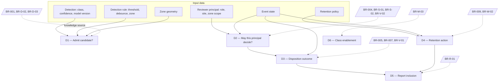
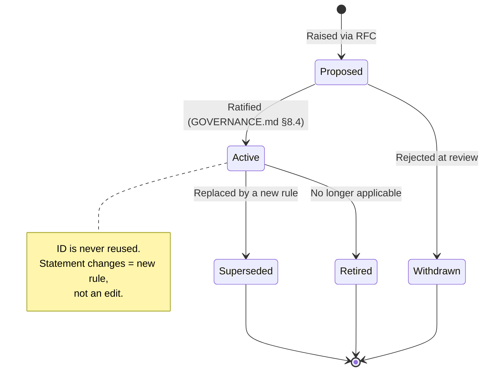

# Guardian Lens — Rule Book

**The normative catalogue of business rules, their vocabulary, their enforcement points and their tests**

| Field | Value |
|---|---|
| Document | Rule Book (Business Rules Catalogue) |
| Version | 1.0 |
| Status | For engineering, QA, AI engineering and stakeholder ratification |
| Programme phase | Week 3 — Govern · 8 August 2026 |
| Inputs | PRD v1.0 §4, §5, §12, §13, §14 · TRD v1.0 §1.2, §5, §11, §12, §19.4 · Research set D00–D18 |
| Companion | [GOVERNANCE.md](GOVERNANCE.md) — who may change these rules, and by what process |
| Authority | **This document is the normative source for business rules.** PRD §13 is a summary view of this catalogue. Where the two disagree, this document prevails and PRD §13 is corrected. Where this document and the TRD disagree on *what a rule requires*, this document prevails; where they disagree on *how it is enforced*, the TRD prevails. |
| Method basis | Business Rules Manifesto v2.0 (Business Rules Group, 2003) · OMG SBVR classification · OMG DMN decision tables |

---

## 0. What this document is, and what it is not

A rule book and a governance document are different artefacts and are deliberately kept apart. Merging them is the most common failure in this class of deliverable, because it produces a document that can neither be tested nor obeyed.

| Layer | Question it answers | Guardian Lens artefact |
|---|---|---|
| Principle | What do we believe? | PRD §4.3 (PR-1…PR-7), §4.6 (AP-1…AP-6), §4.7 (EP-1…EP-6) |
| Policy | Why is this mandatory? | PRD §4.4, §5.2, §14 — the boundaries with their reasons attached |
| Standard / Rule | **What must be true, always?** | **This document** |
| Procedure | How is it carried out, step by step? | TRD §11, §14, §20; operational runbooks |
| Guideline | What is recommended but not mandatory? | Rules classed ADVISORY here; design principles DP-1…DP-6 |
| **Governance** | **Who may write, change, approve or waive any of the above, and through what authority?** | **[GOVERNANCE.md](GOVERNANCE.md)** |

> **Business Rules Manifesto, Article 4.5:** *"A rule is distinct from any enforcement defined for it."* This document states each rule **and, separately, where it is enforced** (§9). The two are listed in different columns on purpose: a rule whose enforcement moves from the application layer to the database layer has not changed. A rule whose statement changes is a different rule and requires ratification under the governance process.

### This document does not

| Not here | Where it lives |
|---|---|
| Who approves a change to a rule | GOVERNANCE.md §6, §8 |
| How a model is promoted to production | GOVERNANCE.md §10 |
| Incident reporting obligations and deadlines | GOVERNANCE.md §14 |
| Legal applicability per jurisdiction | GOVERNANCE.md §3 — `[OPEN — PRD OQ-6]` |
| Implementation detail of any enforcement mechanism | TRD |

---

## 1. Rule classification scheme

Every rule in this catalogue carries **three independent classifications.** They answer different questions and must not be collapsed into one label.

### 1.1 Nature (SBVR) — what kind of proposition is this?

| Class | SBVR term | Meaning | Can a person violate it? |
|---|---|---|---|
| **DEF** | Definitional / structural (necessity) | Defines how Guardian Lens structures reality. True by construction. | No — violation is a defect, not misconduct |
| **BEH** | Behavioural / operative (obligation) | Governs the conduct of people or the organisation. | **Yes** — these are the rules a person can break |

> The distinction matters practically. A DEF rule is discharged by making the system incapable of the alternative. A BEH rule is discharged by training, review and audit — code alone cannot enforce it. Guardian Lens has more BEH rules than a first reading of the PRD suggests: "no accuracy claim without measurement" is a rule about *us*, not about the software.

### 1.2 Form — what does the rule do?

| Form | Meaning | Example shape |
|---|---|---|
| **CONSTRAINT** | Forbids a state or transition | "A verified record must not exist without a reviewer identity" |
| **DERIVATION** | Computes a value from other values | "Field acceptance rate = accepted ÷ (accepted + rejected)" |
| **ENABLER** | Permits or triggers an action when conditions hold | "A candidate enters the review queue when confidence ≥ threshold and dwell ≥ debounce" |

### 1.3 Enforcement class — how hard is it? *(carried forward unchanged from PRD §13)*

| Class | Meaning | Waivable? |
|---|---|---|
| **ABSOLUTE** | Impossible to violate through configuration, permission, API or support action. Violation is a defect of the highest severity. | **Never.** Not by a customer, not by a support decision, not by commercial pressure. Change requires amendment of this document under GOVERNANCE.md §8.4. |
| **STRONG** | Enforced by default. Deviation requires a documented, customer-specific decision recorded at deployment. | Only via a recorded waiver — GOVERNANCE.md §18 |
| **ADVISORY** | Expected practice, flagged when absent during onboarding, does not block operation. | Yes, with the absence flagged |

---

## 2. Rule anatomy

Every entry in the catalogue carries these fields. A rule missing any of them is not ratified and is not in force.

| Field | Purpose |
|---|---|
| **ID** | Unique, permanent, never reused. See §2.1. |
| **Statement** | Declarative, in business language, validatable by a non-engineer. Per Manifesto 4.1–4.2: if it cannot be expressed, it is not a rule. |
| **Nature / Form / Class** | The three classifications above |
| **Source authority** | Where the rule comes from — a principle, a regulation, a customer commitment, or a research finding |
| **Enforcement point(s)** | Where it is made true. Listed separately from the statement (Manifesto 4.5). |
| **Test** | The executable or observable check that proves it holds. Cross-referenced to TRD §19.4 where automated. |
| **Status** | `ACTIVE` · `PROPOSED` · `SUPERSEDED` · `RETIRED` |

### 2.1 Identifier convention — and why the PRD's IDs were kept

The research brief recommended `GL-R-001`-style identifiers. **That recommendation is rejected, deliberately.** `BR-001` … `BR-012` and the category-suffixed IDs are already referenced in PRD §5.2, §12, §14, in TRD §1.2 as architectural drivers, in database CHECK-constraint names, and in the CI bypass suite (TRD §19.4). Renumbering would break every one of those traces to gain nothing but cosmetic consistency. The rule book adopts the existing scheme and extends it.

| Prefix | Category | Range |
|---|---|---|
| `BR-0nn` | Core rules carried from PRD §13 | BR-001 … BR-012 |
| `BR-D-nn` | Detection | New in this document |
| `BR-W-nn` | Workflow and lifecycle | New |
| `BR-V-nn` | Verification | New |
| `BR-A-nn` | Approval and consequence | BR-A-01 from PRD |
| `BR-S-nn` | Security and identity | BR-S-01 from PRD |
| `BR-C-nn` | Configuration | New |
| `BR-R-nn` | Reporting | BR-R-01, BR-R-02 from PRD |
| `BR-AU-nn` | Audit | BR-AU-01, BR-AU-02 from PRD |
| `BR-N-nn` | Notification | BR-N-01 … BR-N-03 from PRD |
| `BR-P-nn` | Privacy and data | New |
| `BR-M-nn` | Model and claims | New |

Rules marked **`[NEW]`** below were extracted from the TRD, the NFRs or the product principles, where they were operative in practice but had never been written as a numbered, testable rule. They require ratification under GOVERNANCE.md §8.4 before they carry force. **They are not new commitments — they are existing commitments that were never written down.**

---

## 3. Vocabulary — terms and fact types

Per Manifesto 3.1, *"rules build on facts, and facts build on concepts as expressed by terms."* No rule below uses a term that is not defined here.

### 3.1 Terms

| Term | Definition |
|---|---|
| **Site** | A single physical customer location with its own configuration, retention policy and user set. Single-tenant in v1. |
| **Camera** | An existing customer-owned IP camera reachable over ONVIF Profile S or RTSP on the site LAN. |
| **Zone** | A named polygonal region defined on a camera's field of view, to which detection rules may be attached. |
| **Written Site Safety Rule** | The customer's own pre-existing documented safety requirement for an area — a paper or policy artefact that exists independently of Guardian Lens. |
| **Detection Rule** | A configured, named association of a zone, a detection class, a confidence threshold and a debounce interval, referencing a Written Site Safety Rule. |
| **Detection** | A single model output for a single sampled frame: class, bounding box, confidence, model version. Not an event. Not a record. |
| **Candidate Event** | A structured proposition that a safety-rule exception may have occurred, produced deterministically from one or more Detections or from an NVR event. Carries `status = unverified`. **A candidate is a claim, not a fact.** |
| **Evidence Frame** | The single stored still image associated with a candidate event. Not video. |
| **Reviewer** | A natural person holding an authenticated session with a role permitting decisions within a given site and zone scope. |
| **Decision** | An act by a Reviewer on a Candidate Event, of type `accept`, `reject` or `correct`. |
| **Verified Record** | A Candidate Event that a Reviewer has accepted or corrected, carrying reviewer identity, decision type and decision timestamp. **This is the only artefact Guardian Lens treats as a statement of fact.** |
| **Rejection** | A Candidate Event a Reviewer has determined was not a real exception. Retained, visible, excluded from verified reporting. |
| **Expiry** | The terminal state of a Candidate Event whose retention period elapsed before any Reviewer decided it. A recorded outcome, not a deletion. |
| **Coverage Gap** | A recorded interval during which a configured camera was not being analysed. Recorded, never inferred. |
| **Audit Entry** | An append-only record of a mutation, carrying actor, timestamp and before/after state. |
| **Retention Period** | The per-site configured duration after which records and frames are deleted, with the deletion recorded. |
| **Model Version** | A semantically versioned model artefact plus its training-data hash, recorded against every Detection. |
| **Worker** | A natural person present in a monitored area. **Never a user of the system, never an entity in the schema, never identified.** |
| **Agent** | The edge software principal. A machine identity that may create Candidate Events and nothing else. |

### 3.2 Fact types

These are the only relationships the rules may assert. A rule requiring a fact type not listed here is out of scope by construction.

| Fact type |
|---|
| camera *is installed at* site |
| zone *is defined on* camera |
| detection rule *applies to* zone |
| detection rule *references* written site safety rule |
| detection *is produced by* model version |
| candidate event *is produced by* detection rule |
| candidate event *has* evidence frame |
| reviewer *decides* candidate event |
| decision *produces* verified record **or** rejection |
| verified record *is attributed to* reviewer |
| audit entry *records* mutation *by* actor |
| retention period *applies to* site |
| coverage gap *applies to* camera *over* interval |

> **The fact types that deliberately do not exist:** *worker is identified*, *worker has activity measure*, *event triggers consequence*, *system notifies HR*. Their absence from this vocabulary is the product. A feature requiring one of them cannot be expressed in this language, and per Manifesto 4.2 therefore has no rule — which is the correct outcome, not a gap.

---

## 4. The rule catalogue

### 4.1 Foundational

| ID | Statement | Nature / Form / Class | Source authority | Status |
|---|---|---|---|---|
| **BR-001** | Nothing is monitored by default. No detection rule is active until a named user has deliberately enabled it against a named zone. A newly deployed system generates no candidate events. | DEF · CONSTRAINT · **ABSOLUTE** | PR-4, EP-5 · PRD §13.1 | ACTIVE |
| **BR-012** | The system fails safe. If detection is unavailable, the site's existing controls remain exactly as effective as before. Guardian Lens must never be positioned, configured or described as a replacement for a physical or procedural control. | BEH · CONSTRAINT · **STRONG** | PR-6, §4.4 · PRD §13.2 | ACTIVE |
| **BR-011** | A configured detection rule should reference the customer's own Written Site Safety Rule for that area. | BEH · CONSTRAINT · ADVISORY | PRD §13.1 · A-8 | ACTIVE |

### 4.2 Detection

| ID | Statement | Nature / Form / Class | Source authority | Status |
|---|---|---|---|---|
| **BR-002** | No individual activity or productivity measurement. The system must not detect, compute, store, display or export any measure of an individual's activity level, idle time, presence duration at a station, work rate or output — at any horizon, including future analytics. | DEF · CONSTRAINT · **ABSOLUTE** | EP-1 · PRD §5.2, §13.1 | ACTIVE |
| **BR-006** | No identification of individuals. No facial recognition, identity matching, biometric templating, emotion classification or gait analysis exists in the system. Guardian Lens detects a condition in a frame, not a named person. | DEF · CONSTRAINT · **ABSOLUTE** | EP-2 · PRD §5.2, §13.1 | ACTIVE |
| **BR-D-01** `[NEW]` | Every Detection carries the Model Version that produced it, and that version is recorded on every Candidate Event derived from it. | DEF · CONSTRAINT · **ABSOLUTE** | NFR-M-01, FR-013 · TRD §5.2 | PROPOSED |
| **BR-D-02** `[NEW]` | A detection below the configured confidence threshold is discarded **and counted**. It is never suppressed without a counter. | DEF · ENABLER · **STRONG** | AP-5, TRD §5.5 | PROPOSED |
| **BR-D-03** `[NEW]` | The safety path after detection is deterministic. Zone evaluation, thresholding, debounce, dwell and candidate construction must contain no inference. No model output may influence anything after the Detection is produced. | DEF · CONSTRAINT · **ABSOLUTE** | AP-1, FR-025 · TRD §5.1 | PROPOSED |

### 4.3 Workflow and lifecycle

| ID | Statement | Nature / Form / Class | Source authority | Status |
|---|---|---|---|---|
| **BR-004** | **No record without human verification.** A Candidate Event must not become a Verified Record, appear in any report, or contribute to any trend or count until an authorised Reviewer has accepted or corrected it. Rejected candidates never enter the verified record. | DEF · CONSTRAINT · **ABSOLUTE** | PR-1, AP-3 · PRD §13.2 | ACTIVE |
| **BR-W-01** `[NEW]` | Every Coverage Gap is recorded. Availability of analysis is never inferred from the absence of events. | DEF · CONSTRAINT · **ABSOLUTE** | NFR-R-03, FR-005 · TRD §5.6 | PROPOSED |
| **BR-W-02** `[NEW]` | No Candidate Event is silently discarded. Every candidate terminates in either a Reviewer decision or an explicitly recorded system outcome (`expired`, or a recorded system reason). | DEF · CONSTRAINT · **ABSOLUTE** | NFR-R-02 · TRD §11.2 | PROPOSED |
| **BR-W-03** `[NEW]` | Every failure mode produces either a recorded gap or a visible alert. There is no state in which the system appears to be watching but is not. | DEF · CONSTRAINT · **STRONG** | TRD §5.6 governing principle · DP-4 | PROPOSED |

### 4.4 Verification

| ID | Statement | Nature / Form / Class | Source authority | Status |
|---|---|---|---|---|
| **BR-005** | **Every record carries its reviewer.** Every Verified Record must carry reviewer identity, decision type and decision timestamp. No such record may exist without them. | DEF · CONSTRAINT · **ABSOLUTE** | PR-3, NFR-AUD-01 · PRD §13.3 | ACTIVE |
| **BR-007** | Rejections are retained and visible. Rejected candidates are retained as rejected, excluded from verified reporting, and visible to the customer. | DEF · CONSTRAINT · **STRONG** | PR-5 · PRD §13.3 | ACTIVE |
| **BR-V-01** `[NEW]` | A decided event is immutable. Reviewer identity and decision timestamp may never be altered after the decision. A reviewer error is addressed by a new correcting record referencing the original; the original remains. | DEF · CONSTRAINT · **ABSOLUTE** | BR-AU-02 · TRD §11.4 | PROPOSED |
| **BR-V-02** `[NEW]` | No bulk disposition. There is no interface, endpoint or mechanism by which more than one Candidate Event may be decided in a single act. | DEF · CONSTRAINT · **ABSOLUTE** | DP-3 · TRD §19.4 | PROPOSED |
| **BR-V-03** `[NEW]` | Confidence may order or annotate the review queue. It may never auto-approve, auto-reject-and-discard, or otherwise substitute for a Reviewer. | DEF · CONSTRAINT · **ABSOLUTE** | AP-4, FR-048 · TRD §5.5 | PROPOSED |
| **BR-V-04** `[NEW]` | There is no supervisor override of a Reviewer decision and no second-approver step in v1. Adding either is a rule change, not a feature. | DEF · CONSTRAINT · **STRONG** | TRD §11.4 | PROPOSED |

> **On BR-V-04 and two-person verification.** EU AI Act Article 14(5) requires confirmation by two competent natural persons — but only for **remote biometric identification** systems under Annex III 1(a). Guardian Lens performs no biometric identification (BR-006), so Article 14(5) does not attach. Adopting two-person verification anyway would double the reviewer workload the product's single highest adoption risk already depends on (RD-01, P-01). It is therefore deliberately **not** adopted. See GOVERNANCE.md §3.3.

### 4.5 Approval and consequence

| ID | Statement | Nature / Form / Class | Source authority | Status |
|---|---|---|---|---|
| **BR-003** | **No automatic action against any person.** No code path may exist from a Detection or a Verified Record to any notification to HR, disciplinary workflow, performance system, or any consequence for a Worker. | DEF · CONSTRAINT · **ABSOLUTE** | EP-3 · PRD §13.4 | ACTIVE |
| **BR-A-01** | Any future automated suppression or triage layer that filters candidates before human review must log every suppression and be subject to periodic human audit. Suppression logging is a condition of such a layer existing at all. | DEF · CONSTRAINT · **ABSOLUTE** `[FUTURE]` | AP-5 · PRD §13.4 · RA-05 | ACTIVE (conditional) |

### 4.6 Security and identity

| ID | Statement | Nature / Form / Class | Source authority | Status |
|---|---|---|---|---|
| **BR-008** | Local processing by default. Video is processed on site. Raw video must not leave the customer network unless the customer explicitly enables an off-site path. | DEF · CONSTRAINT · **STRONG** | EP-6, NFR-PRIV-01 · PRD §13.5 | ACTIVE |
| **BR-S-01** | Reviewer identity is derived from the authenticated session and can never be supplied by a client. | DEF · CONSTRAINT · **ABSOLUTE** | PRD §13.5 | ACTIVE |
| **BR-S-02** `[NEW]` | An Agent principal can never hold a reviewer role. Role assignment to agent principals is impossible at the data layer. A fully compromised edge agent cannot verify an event. | DEF · CONSTRAINT · **ABSOLUTE** | TRD §12.2, §12.3 | PROPOSED |
| **BR-S-03** `[NEW]` | Camera credentials are stored encrypted and are never retrievable in plaintext through any interface. | DEF · CONSTRAINT · **ABSOLUTE** | NFR-SEC-02 | PROPOSED |

### 4.7 Configuration

| ID | Statement | Nature / Form / Class | Source authority | Status |
|---|---|---|---|---|
| **BR-010** | Scope changes are logged and attributable. Enabling a rule, adding a camera, changing a zone or altering retention is recorded with the acting user and time. | DEF · CONSTRAINT · **STRONG** | EP-5, NFR-AUD-02 · PRD §13.6 | ACTIVE |
| **BR-C-01** `[NEW]` | A configuration change and its Audit Entry are written in a single transaction. A configuration change that cannot be audited must not take effect. | DEF · CONSTRAINT · **ABSOLUTE** | TRD §11.5, §19.4 | PROPOSED |
| **BR-C-02** `[NEW]` | Rule activation is always explicit. There is no path by which a detection rule becomes active without a named user having activated it. | DEF · CONSTRAINT · **ABSOLUTE** | BR-001 · TRD §11.5 | PROPOSED |

### 4.8 Privacy, data and retention

| ID | Statement | Nature / Form / Class | Source authority | Status |
|---|---|---|---|---|
| **BR-009** | Retention is customer-controlled and enforced. The retention period is configured per site; elapsed records and frames are deleted, and every deletion is recorded. | DEF · CONSTRAINT · **STRONG** | EP-6, NFR-PRIV-04 · PRD §13.6 | ACTIVE |
| **BR-P-01** `[NEW]` | No audio is captured, processed, stored or transmitted, at any horizon. | DEF · CONSTRAINT · **ABSOLUTE** | PRD §5.2 (previously enforced only by "Architecture") | PROPOSED |
| **BR-P-02** `[NEW]` | Worker notice exists and has been communicated before go-live at any site. Where worker representation exists, consultation occurs before installation. | BEH · CONSTRAINT · **ABSOLUTE** | EP-4, NFR-PRIV-06, PK-07 | PROPOSED |
| **BR-P-03** `[NEW]` | No aggregation, view, export or future analytic may produce an individual attribution path from any data Guardian Lens holds. | DEF · CONSTRAINT · **ABSOLUTE** | BR-002, PRD §14.4 | PROPOSED |

> **Why BR-P-01 and BR-P-02 are promoted to numbered rules.** Both were real commitments enforced by nothing testable — "Architecture" and "release criterion" respectively. A commitment with no ID cannot be cited in a review, cannot fail a test, and quietly disappears under delivery pressure. BR-P-02 in particular is the rule protecting PK-07, the pilot criterion on which the PRD says *"if this fails, nothing else matters."*

### 4.9 Reporting

| ID | Statement | Nature / Form / Class | Source authority | Status |
|---|---|---|---|---|
| **BR-R-01** | Reports draw exclusively from Verified Records. Rejected, expired and unverified candidates are excluded from every count, trend and export. | DEF · CONSTRAINT · **ABSOLUTE** | BR-004 · PRD §13.7 | ACTIVE |
| **BR-R-02** | Every exported report states the period covered and the generating user. | DEF · CONSTRAINT · **STRONG** | PRD §13.7 | ACTIVE |
| **BR-R-03** `[NEW]` | Reviewer acceptance rate and rejection counts are visible to the customer. The system's own error rate is never hidden. | DEF · DERIVATION · **STRONG** | PR-5, AI-01, F-7 | PROPOSED |

### 4.10 Audit

| ID | Statement | Nature / Form / Class | Source authority | Status |
|---|---|---|---|---|
| **BR-AU-01** | The audit log is append-only and not modifiable through any application interface or API. | DEF · CONSTRAINT · **ABSOLUTE** | NFR-AUD-04 · PRD §13.8 | ACTIVE |
| **BR-AU-02** | Verified Records may not have reviewer identity or decision timestamp altered after creation. | DEF · CONSTRAINT · **ABSOLUTE** | BR-005 · PRD §13.8 | ACTIVE |
| **BR-AU-03** `[NEW]` | A decision and its Audit Entry are written in a single transaction. **A decision that cannot be audited must not exist.** | DEF · CONSTRAINT · **ABSOLUTE** | TRD §11.3 | PROPOSED |
| **BR-AU-04** `[NEW]` | Audit retention is never shorter than event retention. | DEF · CONSTRAINT · **STRONG** | TRD §15.1 | PROPOSED |

### 4.11 Notification

| ID | Statement | Nature / Form / Class | Source authority | Status |
|---|---|---|---|---|
| **BR-N-01** | No notification may be sent to any party other than an authorised Reviewer or a configured safety recipient. No recipient category exists for HR, management performance or external parties. | DEF · CONSTRAINT · **ABSOLUTE** | BR-003 · PRD §13.9 | ACTIVE |
| **BR-N-02** | A notification may inform a human that a candidate awaits review. It may never communicate a verified outcome about an individual. | DEF · CONSTRAINT · **ABSOLUTE** | PRD §13.9 | ACTIVE |
| **BR-N-03** | Live notification is deferred from v1. Where implemented, alert volume must be configurable to prevent alert fatigue. | BEH · CONSTRAINT · **STRONG** `[FUTURE]` | DP-5 · PRD §13.9 | ACTIVE (conditional) |

### 4.12 Model and claims — rules that bind the organisation, not the software

These are **behavioural** rules. No code enforces them. They are enforced by review, by the gates in GOVERNANCE.md §9, and by named accountability.

| ID | Statement | Nature / Form / Class | Source authority | Status |
|---|---|---|---|---|
| **BR-M-01** `[NEW]` | No accuracy, precision, recall or incident-reduction figure may appear in any customer-facing, investor-facing or marketing material until it has been measured on labelled footage from a real deployment site. Published benchmark figures from research literature may never be presented as Guardian Lens's accuracy. | BEH · CONSTRAINT · **ABSOLUTE** | AP-2, RA-02, OQ-5 · TRD §19.7 | PROPOSED |
| **BR-M-02** `[NEW]` | A new Model Version may not be promoted if it reduces field acceptance rate against the incumbent version. | BEH · CONSTRAINT · **STRONG** | AI-06, RA-06 · TRD §5.7 | PROPOSED |
| **BR-M-03** `[NEW]` | Each additional detection class is gated on measured per-class accuracy on real site footage. No class is added speculatively. | BEH · ENABLER · **STRONG** | RA-03 · TRD §5.8 | PROPOSED |
| **BR-M-04** `[NEW]` | If face blurring is enabled at a site, the model must be evaluated **with blurring applied**. The known accuracy cost is stated to the customer, not averaged away. | BEH · CONSTRAINT · **STRONG** | RA-04, NFR-PRIV-05 · TRD §5.8 | PROPOSED |
| **BR-M-05** `[NEW]` | Guardian Lens is never described as certified or compliant with any regime it does not hold an actual certification for. It may be described as *designed to align with* stated principles. | BEH · CONSTRAINT · **ABSOLUTE** | RC-03 · PRD §14.5 | PROPOSED |
| **BR-M-06** `[NEW]` | Guardian Lens is not described as an agentic AI product. It is a machine-learning perception product with a deterministic safety path and a mandatory human gate. | BEH · CONSTRAINT · **STRONG** | AP-6 · PRD §14.3 | PROPOSED |

> **BR-M-01 is the rule most likely to be broken, and the cheapest to break.** It will be broken by a slide, not by a commit. It has no technical enforcement point and therefore needs a named approver on every outbound artefact — GOVERNANCE.md §6.4.

---

## 5. Decision logic (DMN)

Rules state what must be true. Decision tables state which outcome follows from which inputs. Per OMG DMN, each table below is simultaneously human-readable documentation and the specification of executable logic.

### 5.1 Decision Requirements Diagram

### 5.2 D1 — Admit candidate to the review queue

**Hit policy: F (first match wins).** Inputs evaluated in order.

| # | Rule active? | Confidence ≥ threshold? | Inside zone? | Dwell ≥ debounce? | **Outcome** | Rule |
|---|---|---|---|---|---|---|
| 1 | No | — | — | — | **No candidate.** Nothing recorded. | BR-001 |
| 2 | Yes | No | — | — | **Discard, increment below-threshold counter.** | BR-D-02 |
| 3 | Yes | Yes | No | — | **Discard.** Outside configured scope. | BR-001 |
| 4 | Yes | Yes | Yes | No | **Hold.** Not yet a candidate. | FR-022 |
| 5 | Yes | Yes | Yes | Yes | **Create candidate, `status = unverified`.** | BR-004 |

> Every branch of this table is deterministic. No model output participates after the confidence comparison in column 2 — that is BR-D-03 made visible.

### 5.3 D2 — May this principal decide this event?

**Hit policy: F.**

| # | Principal type | Role | Site/zone scope match? | Event status | **Outcome** | Rule |
|---|---|---|---|---|---|---|
| 1 | agent | — | — | — | **403.** An agent can never decide. | BR-S-02 |
| 2 | human | auditor | — | — | **403.** Read-only. | TRD §12.3 |
| 3 | human | reviewer / safety_manager / site_admin | No | — | **403.** Out of scope. | TRD §12.3 |
| 4 | human | reviewer / safety_manager / site_admin | Yes | not `unverified` | **409.** Already terminal; immutable. | BR-V-01 |
| 5 | human | reviewer / safety_manager / site_admin | Yes | `unverified` | **Permit — one event only.** Identity from token. | BR-S-01, BR-V-02 |

### 5.4 D3 — Disposition outcome

**Hit policy: U (unique).**

| # | Decision | **Resulting state** | In reports? | Reviewer attribution | Audit entry | Rule |
|---|---|---|---|---|---|---|
| 1 | accept | `accepted` | **Yes** | Mandatory | Same transaction | BR-005, BR-AU-03 |
| 2 | correct | `corrected` — original model output retained alongside the correction | **Yes** | Mandatory | Same transaction | BR-005, BR-007 |
| 3 | reject + reason | `rejected` | No — rejection log only | Mandatory | Same transaction | BR-007, BR-R-01 |
| 4 | *(no decision, retention elapsed)* | `expired` | No | None — recorded system outcome | Yes | BR-W-02 |

### 5.5 D4 — Retention action

**Hit policy: F.**

| # | Age vs retention period | Event state | **Action** | Recorded? | Rule |
|---|---|---|---|---|---|
| 1 | Within period | any | Retain | — | BR-009 |
| 2 | Elapsed | `unverified` | Transition to `expired`; delete evidence frame | **Yes** | BR-W-02, BR-009 |
| 3 | Elapsed | `accepted` / `corrected` / `rejected` | Delete record and frame per policy | **Yes — deletion is audited** | BR-009, NFR-AUD-03 |
| 4 | Elapsed | audit entries | **Do not delete** while any event retention window is open | — | BR-AU-04 |

### 5.6 D6 — May a new detection class be enabled?

**Hit policy: A (all conditions must hold).** This table is a governance gate expressed as rule logic; the approver is defined in GOVERNANCE.md §9 (Gate G4).

| Condition | Required value | Rule |
|---|---|---|
| Per-class precision and recall measured on real site footage | Exists | BR-M-03, AI-05 |
| Condition-stratified evaluation documented (lighting, occlusion, angle, colour) | Exists | TRD §19.7 |
| Evaluated with blurring applied, if blurring enabled at target site | Exists or N/A | BR-M-04 |
| Written Site Safety Rule exists for the class at the target site | Exists | BR-011 |
| Projected reviewer load impact assessed against P-01 | Assessed | RD-01 |

---

## 6. Rule-to-enforcement matrix

Per Manifesto 4.5, enforcement is stated **separately** from the rule. A rule may have several enforcement points; ABSOLUTE rules should have more than one, so that no single refactor can remove the guarantee.

| Rule | Edge | API | Service | Database | Process / review | CI test |
|---|---|---|---|---|---|---|
| BR-001 | Agent has no rules until config pull | — | Config service | — | Onboarding review | Clean-instance test |
| BR-002 | — | No such endpoint | — | **No such field exists** | Schema review at every migration | Bypass suite |
| BR-003 | — | **No such integration exists** | — | — | Code review of outbound layer | Bypass suite |
| BR-004 | Agent may emit only `unverified` | Ingest rejects `status` | Only MOD-7 transitions | **CHECK constraint** | — | Bypass suite |
| BR-005 | — | Rejects supplied `reviewer_id` | Identity from token | **NOT NULL + CHECK** | — | Bypass suite |
| BR-006 | No such model loaded | — | — | **No identity field exists** | Model artefact review | Bypass suite |
| BR-007 | — | — | Repository filter | Row retained | Reject-rate visible to customer | Bypass suite |
| BR-008 | Inference is edge-resident | Control plane accepts no stream | — | — | Network capture at deployment | E2E |
| BR-009 | — | — | Retention job | Deletion audited | Per-site config review | Time-shifted fixture |
| BR-010 | — | — | Same-transaction audit write | Trigger | — | Bypass suite |
| BR-011 | — | Reference field on rule | — | — | **Onboarding review flags absence** | — |
| BR-012 | Fail-safe on inference loss | — | — | — | **Sales and onboarding material review** | Fault-injection |
| BR-V-02 | — | **Route does not exist → 404** | — | — | — | Bypass suite |
| BR-AU-01 | — | — | — | **Trigger rejects UPDATE/DELETE** | — | Bypass suite |
| BR-AU-03 | — | — | Single transaction | Rollback on audit failure | — | Integration test |
| BR-M-01 | — | — | — | — | **Named approver on every outbound artefact** | None possible |
| BR-M-05 | — | — | — | — | **Named approver on every outbound artefact** | None possible |
| BR-P-02 | — | — | — | — | **Go-live gate G3** | None possible |

> **Read the last four rows carefully.** Five of the rules in this catalogue have **no technical enforcement point at all** and cannot acquire one. They are the rules about what we say and what we do before go-live. Those rules are exactly as binding as the database constraints and considerably easier to break. They are why the governance document exists.

---

## 7. Traceability

| Rule | PRD | TRD | Feature | Metric | Risk mitigated |
|---|---|---|---|---|---|
| BR-001 | §5.1, §13.1 | §11.5 | F-10 | O-05 | RD-05 |
| BR-002 | §5.2, §13.1 | §1.2, §8 | — | — | RD-03, RD-05 |
| BR-003 | §5.2, §13.4 | §1.2, §10.9 | — | — | RD-03 |
| BR-004 | §13.2 | §5.4, §11.1 | F-5, F-6 | P-03 | RD-02 |
| BR-005 | §13.3 | §5.4, §11.3 | F-6 | P-03 | — |
| BR-006 | §5.2, §13.1 | §5.1 | — | — | RC-02, RD-03 |
| BR-007 | §13.3 | §11.2 | F-7 | AI-01…AI-04 | RA-01 |
| BR-008 | §13.5 | §2, §12.1 | — | — | RC-02 |
| BR-009 | §13.6 | §9.12 | F-11 | O-04 | RC-04 |
| BR-010 | §13.6 | §11.5 | — | O-05 | RD-05 |
| BR-011 | §13.1 | — | F-10 | — | A-8 |
| BR-012 | §13.2 | §5.6 | — | — | RB-01 |
| BR-M-01 | §4.6 AP-2 | §19.7 | — | AI-05 | RA-02, RC-03 |
| BR-M-02 | §15.3 AI-06 | §5.7 | — | AI-06 | RA-06 |
| BR-P-02 | §4.7 EP-4 | §19.8 | — | PK-07 | RD-03 |

---

## 8. Conflict resolution and precedence

*(Carried from PRD §13.10, extended.)*

1. Where a business rule conflicts with a **feature requirement**, the rule prevails and the feature is redesigned.
2. Where a business rule conflicts with a **customer request**, the rule prevails and the limitation is stated plainly to the customer.
3. Where **two rules conflict**, the more restrictive applies until the conflict is resolved in writing.
4. Where a rule conflicts with a **commercial deadline**, the rule prevails. Recording this explicitly is the point of writing it down.
5. An **ABSOLUTE** rule may be changed only by amending this document under GOVERNANCE.md §8.4 — never by a configuration change, a support decision, a feature flag or a hotfix.
6. A rule marked `[NEW]` / `PROPOSED` carries no force until ratified. It must not be cited to block work; it must be either ratified or withdrawn at the next review.

### 8.1 Known tensions

Per Manifesto 5.2, rules are checked against each other. These pairs are in tension and the resolution is recorded rather than left to be rediscovered in an argument.

| Tension | Resolution |
|---|---|
| BR-007 (retain rejections, visibly) vs BR-009 (delete on retention elapse) | Retention applies to rejections identically. Aggregate rejection **counts** survive deletion of the underlying records; the counts contain no personal data. |
| BR-M-04 (evaluate with blurring) vs RA-04 (blurring costs ~7% helmet accuracy) | Both hold. The cost is stated to the customer and the choice is theirs; it is not resolved by defaulting blurring off silently. |
| BR-V-02 (no bulk disposition) vs DP-2 (speed of disposition is a safety feature) | Speed is bought through interface design and keyboard operation (NFR-ACC-01), never through batching. This is a permanent constraint on the review UI. |
| BR-004 (no record without a human) vs P-01 (reviewer load is the abandonment threshold) | **Unresolved by design.** This is the product's central bet. If the load proves unsurvivable, the response is fewer and better candidates — never a weaker gate. |
| BR-011 (ADVISORY) vs BR-001 (ABSOLUTE) | A rule may be activated without a written-rule reference; the absence is flagged. Making BR-011 ABSOLUTE would block onboarding at sites whose written rules are informal — an outcome A-8 says is likely. |

---

## 9. Rule lifecycle

| Transition | Who decides | Where recorded |
|---|---|---|
| Proposed → Active (ADVISORY / STRONG) | Product Owner, on Safety & AI Review Board advice | GOVERNANCE.md §8.3 |
| Proposed → Active (**ABSOLUTE**) | RAPID decision with veto holders | GOVERNANCE.md §8.4 |
| Active → Superseded / Retired (**ABSOLUTE**) | RAPID decision with veto holders | GOVERNANCE.md §8.4 |
| Any | — | Change log, §11 |

---

## 10. Ratification status

| Set | Count | Status |
|---|---|---|
| Carried from PRD §13, unchanged in substance | 20 | **ACTIVE** |
| Extracted from TRD / NFRs / principles, newly numbered | 25 | **PROPOSED** — require ratification |
| Total in catalogue | 45 | — |

**Nothing in the `PROPOSED` set is a new commitment.** Every one was already operative somewhere in the PRD, the TRD, the NFRs or the CI suite. Numbering them makes them testable, citable and hard to lose. Ratification should be a single session, not a negotiation.

---

## 11. Change log

| Version | Date | Change | Author | Ratified by |
|---|---|---|---|---|
| 1.0 | 8 Aug 2026 | Initial catalogue. 20 rules carried from PRD §13; 25 extracted and proposed; SBVR vocabulary and classification added; DMN decision tables added; enforcement separated from statement. | — | Pending |

---

## 12. Sign-off

| Role | Name | Confirms | Date |
|---|---|---|---|
| Product Owner | Kuldeep | Statements are correct, complete and business-validatable | |
| Engineering / Integration | Kapil | Every enforcement point is implementable as stated | |
| AI Engineering | Kamal | Detection and model rules are achievable and correctly bounded | |
| Test / Verification | Yashpal | Every ABSOLUTE rule has a test that actively attempts to violate it | |
| Validation / Software | Mayank | Vocabulary matches how customers and buyers actually speak | |

> **The test for this document:** hand it to someone who has never seen Guardian Lens. They should be able to say what the system will refuse to do, and how they would prove it. If they cannot, the rules are wrong — not the reader.
