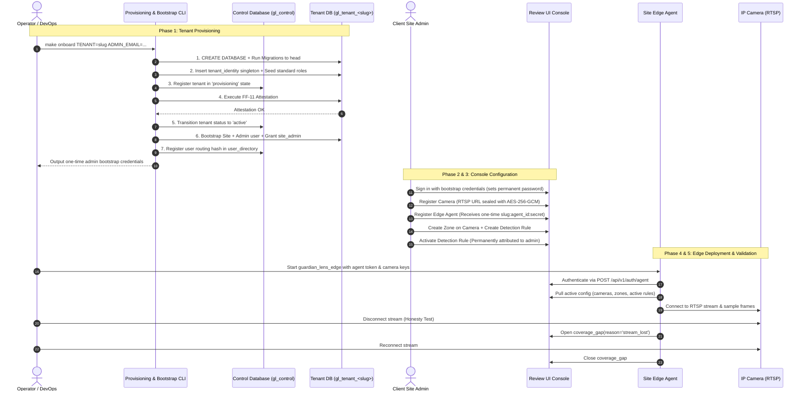

# Guardian Lens — Tenant & Client Onboarding Guide

**The complete end-to-end runbook for onboarding a new client or tenant organisation into Guardian Lens.**

| Field | Value |
|---|---|
| Document Type | Standard Operating Procedure & Technical Runbook |
| Version | 1.0 |
| Architecture Standard | ADR-016 (Physical Database-per-Tenant), ADR-017 (Control Plane Registry) |
| Companion Documents | [WORKFLOW.md](WORKFLOW.md) · [DATABASE.md](DATABASE.md) · [CAMERA_ONBOARDING.md](CAMERA_ONBOARDING.md) · [CAMERA_INTEGRATION.md](CAMERA_INTEGRATION.md) |

---

## 1. Architectural Principles & Invariants

Before onboarding a client, understand the four foundational principles governing Guardian Lens tenancy:

1. **Physical Database Isolation (ADR-016)**:
   - Every tenant has its own isolated PostgreSQL database (`gl_tenant_<slug>`).
   - Business tables contain **no `tenant_id` column**; isolation is enforced at the physical connection layer.
2. **Provisioning is Code, Never a Runbook (DATABASE.md §13.5.1)**:
   - Hand-crafting databases or manual table creation is strictly forbidden.
   - Every tenant database is provisioned and migrated through the exact same automated code path.
3. **The Attestation Gate (FF-11)**:
   - No tenant can transition to `active` status without passing **FF-11 constraint and trigger attestation**. If any constraint or trigger is missing, the tenant is flagged as `drifted` and traffic is refused.
4. **Clean Instance by Design (BR-001 / FF-8)**:
   - A newly provisioned tenant contains zero cameras, zero mock events, and zero active detection rules. Nothing is monitored by default until a named user explicitly configures and activates it.

---

## 2. End-to-End Onboarding Lifecycle



---

## 3. Phase-by-Phase Execution Runbook

### Phase 1: Automated Provisioning & Admin Bootstrapping

Execute the single onboarding command on the deployment host:

```bash
make onboard \
  TENANT=<tenant_slug> \
  ADMIN_EMAIL=<admin_email> \
  ADMIN_NAME="<Admin Full Name>" \
  SITE_NAME="<Primary Plant/Site Name>" \
  TZ="<IANA Timezone, e.g. Asia/Kolkata>"
```

*Example:*
```bash
make onboard \
  TENANT=acme_mfg \
  ADMIN_EMAIL=security.admin@acme.com \
  ADMIN_NAME="Vikram Sharma" \
  SITE_NAME="Pune Assembly Plant 1" \
  TZ="Asia/Kolkata"
```

> [!NOTE]
> If `GL_BOOTSTRAP_PASSWORD` is exported in your environment, it will be assigned. Otherwise, a cryptographically secure 18-character token will be generated, printed once to `stdout`, and never logged.

#### Internal Execution Steps:
1. **`_create_database`**: Spawns `gl_tenant_acme_mfg`.
2. **`_migrate_to_head`**: Runs all Alembic migrations (`0001` through `0010_refresh_tokens`).
3. **`_write_identity`**: Inserts the singleton row into `tenant_identity`.
4. **`_seed_roles`**: Seeds default roles (`reviewer`, `safety_manager`, `site_admin`, `auditor`).
5. **`_register`**: Creates entry in `gl_control.tenants` with status `provisioning`.
6. **`attest()`**: Validates all schema constraints, indexes, triggers, and immutability rules.
7. **Status `active`**: Marks the tenant ready to receive traffic.
8. **`bootstrap()`**:
   - Creates the site record in `sites`.
   - Creates the admin account in `users` (hashed with Argon2id).
   - Assigns the `site_admin` role in `user_roles`.
   - Writes the email hash to `gl_control.user_directory` for auth routing.
   - Emits immutable audit entries (`site.created`, `user.created`, `user.role_granted`, `tenant.admin_bootstrapped`).

---

### Phase 2: First Admin Sign-In

1. Provide the client's site admin with the Review UI URL (e.g., `https://guardian.clientdomain.com` or `http://localhost:5173`).
2. The admin logs in using their registered email and the bootstrap password.
3. The admin changes their temporary password immediately.
4. The dashboard displays a clean instance: 0 candidate events, 0 active rules, and 1 site ready for configuration.

---

### Phase 3: Site & Hardware Configuration (Web Dashboard)

Logged in as `site_admin`, navigate to **Administration → Configuration**:

#### 1. Register Camera(s)
- Click **Add Camera**.
- Provide:
  - **Camera Name**: (e.g., `Bay 3 Overhead East`)
  - **Location Description**: (e.g., `Building A, Heavy Fabrication Bay 3`)
  - **RTSP Stream URL**: `rtsp://<user>:<password>@<camera_ip>:554/<stream_path>`
  - **Stream Profile**: `secondary` (sub-stream recommended for 2 fps analysis)
  - **Sample Rate (FPS)**: `2.0` (default)
- Click **Save Camera** (Confirmed submit `CS-AD-03`).
  - *Security Enforcement*: The RTSP URL is sealed using `AES-256-GCM` (`GL_CAMERA_KEY`) upon submission. The control plane cannot unseal it; only the on-site edge agent can unseal it in-memory.

#### 2. Register Edge Agent Principal
- Under **Edge Agents**, click **Register Agent**.
- Select the site and enter an agent name (e.g., `Edge-Box-01`).
- Submit to reveal the **One-Time Composite Credential**:
  ```text
  acme_mfg:9b1deb4d-3b7d-4bad-9bdd-2b0d7b3dcb6d:sec_abc123...
  ```
- **Copy this credential immediately.** It is never displayed again. Note the generated **Agent UUID**.

#### 3. Define Zones
- Under **Zones**, click **Add Zone**.
- Associate the zone with the camera (Full-frame or normalise coordinate polygon `[[0,0],[1,0],[1,1],[0,1]]`).

#### 4. Configure & Activate Detection Rules
- Under **Detection Rules**, click **Create Rule**:
  - **Rule Type**: (e.g., `ppe_hardhat_absence`, `person_in_exclusion_zone`)
  - **Confidence Threshold**: (e.g., `0.70` — orders candidates in the review queue)
  - **Debounce Window**: (e.g., `30s` — quiet interval to avoid duplicate alerts)
  - **Rule Text**: Clear description of the condition.
  - **Written Safety Reference**: Citation of the client’s internal SOP (e.g., `Acme Safety SOP Section 4.2`).
- **Activate the Rule**:
  - The rule is created **inactive** by default (`BR-001`).
  - Click **Activate**. This confirmed action permanently binds your user ID as `activated_by` in the audit log (`BR-C-02`).

---

### Phase 4: On-Premises Edge Agent Deployment

On the Linux edge appliance located at the client's plant (connected to the camera network):

#### 1. Software Installation
```bash
# Clone the repository and install core + camera decoding extras
python3 -m venv .venv
source .venv/bin/activate
pip install -e ".[edge-camera]"
```

#### 2. Configure Environment Variables
Set the credentials in the edge environment:
```bash
export GL_AGENT_CREDENTIAL="<composite_credential_copied_from_UI>"
export GL_CAMERA_KEY="<base64_aes_key_from_control_plane_env>"
export GL_CAMERA_KEY_ID="<key_id>"
```

#### 3. Start the Edge Agent Service
Launch the agent with required operational thresholds (stated explicitly per deployment):

```bash
python -m guardian_lens_edge \
  --source rtsp \
  --api https://guardian-api.clientdomain.com \
  --agent-id "<AGENT_UUID>" \
  --site "<SITE_UUID>" \
  --outbox-warning-bytes 52428800 \
  --outbox-critical-bytes 104857600 \
  --failure-window 60 \
  --degraded-failure-rate 0.2 \
  --halt-failure-rate 0.5 \
  --decode-failure-threshold 10
```

> [!TIP]
> For production deployments, wrap this command in a systemd unit (`guardian-edge.service`) with `Restart=always` and `RestartSec=10`.

---

### Phase 5: Verification, Honesty Testing & Handover

Perform the following 3 validation gates before signing off:

#### Gate A: The Stream Honesty Test (Mandatory)
1. Physically unplug or terminate the RTSP stream of one camera.
2. In the Review UI, navigate to **Reports → Coverage Gaps**.
3. Verify that a `stream_lost` gap opens for that camera.
4. Restore the connection; verify the gap automatically closes with an accurate duration.
5. *Why*: Proves the system never disguises "we were not watching" as "zero incidents occurred".

#### Gate B: Event Review Workflow
1. Have a test subject walk through the configured zone under a rule condition.
2. The candidate event will appear in the **Review Queue** with its single JPEG evidence frame.
3. Reviewer conducts disposal using keyboard hotkeys:
   - **`A`** — Accept (Becomes a verified incident record).
   - **`R`** — Reject (Prompts for rejection reason; recorded in rejection ledger).
   - **`C`** — Correct (Allows bounding box/metadata modification).
4. Verify the decision is attributed to the reviewer and recorded in the append-only audit log.

#### Gate C: Reports & Audit Verification
1. Navigate to **Reports**: Verify that charts and summary KPIs reflect **only verified records**.
2. Navigate to **Audit Trail**: Confirm all administrative actions (`camera.created`, `rule.activated`, `event.decided`) are recorded with timestamps, user IDs, and immutable before/after diffs.

---

## 4. Operational Day-2 Tasks

| Operation | Action / Command |
|---|---|
| **Rotate Camera Password** | UI → Configuration → Cameras → Click **Replace Credential** (CS-AD-06). Never exposes existing password. |
| **Camera Maintenance** | UI → Configuration → Cameras → Toggle **Disable** (stops polling and logs maintenance gap). |
| **Add Site Reviewers** | Site Admin invites users via email with role `reviewer` or `safety_manager`. |
| **Verify Attestation** | Run `make attest TENANT=<slug>` anytime to confirm zero schema or trigger drift. |
| **Deprovision Tenant** | Run `python -m guardian_lens.db.provisioning deprovision <slug>`. Drops the database, cleans user directory entries, and retains a permanent tombstone row in the control registry. |

---

## 5. Security & Isolation Safeguards

| Safeguard | Mechanism | Guarantee |
|---|---|---|
| **Cross-Tenant Contamination** | Database-per-tenant (`gl_tenant_<slug>`) | Impossible to query another tenant's data via SQL injection or missing WHERE clauses. |
| **Camera Credential Theft** | AES-256-GCM Sealing | Server database holds only ciphertexts; keys reside in edge process memory. |
| **Tamper-Resistant Audit** | PostgreSQL `BEFORE UPDATE OR DELETE` + statement-level `TRUNCATE` triggers | Audit records cannot be modified or deleted, even by DB admins. |
| **AI Decisional Authority** | Database CHECK constraint (`chk_decided_requires_reviewer`) | No candidate event can transition to `accepted` without a human `reviewer_id`. |
