# Guardian Lens — Technical Requirement Document

**Production architecture with MVP scope marked**

| Field | Value |
|---|---|
| Document | Technical Requirement Document (TRD) |
| Version | 1.1 |
| Status | For engineering review and build |
| Inputs | Product Discovery research (D00–D18) · Product Requirements Document (PRD) v1.0 |
| Architecture scope | **Production system.** Components in MVP scope are marked `[MVP]`. Later phases marked `[V1]` and `[V2+]`. |
| Authority | Where this document and the PRD disagree, **the PRD prevails**. Business rules BR-001 … BR-012 are architectural constraints, not preferences. Where this document and **[RULE_BOOK.md](RULE_BOOK.md)** disagree on *what a rule requires*, the rule book prevails; on *how it is enforced*, this document prevails. **§2 is a summary view of [ARCHITECTURE.md](ARCHITECTURE.md); §8–9 are summary views of [DATABASE.md](DATABASE.md)** — where they disagree, those documents prevail. |
| Companions | [ARCHITECTURE.md](ARCHITECTURE.md) — normative architecture description · [DATABASE.md](DATABASE.md) — normative data model |
| Answers | PRD OQ-12 (security architecture), NFR-SEC-06, and the deployment topology deferred in D17 §7 |

---

## Scope Marking Convention

| Tag | Meaning |
|---|---|
| `[MVP]` | Built for the first pilot. One site, one to three cameras, one detection class. |
| `[V1]` | Production release. Multi-camera, multi-site, retention enforcement, roles. |
| `[V2+]` | Later phases. Designed for, not built now. |
| `[OPEN]` | Unresolved. Carries a PRD Open Question reference. Never resolved by assumption. |

> **Design instruction:** `[V1]` and `[V2+]` components must be *designed for* but not *built* in MVP. Where an MVP shortcut would foreclose a later phase, the shortcut is rejected. Where it would not, it is taken deliberately and recorded in §22 Technical Debt.

---

## Technical Decisions Register

Every technology and architecture choice below was made by the architect using stated defaults, not supplied by the product team. **Each is overrulable.** Rationale and the cost of reversing are given so a change can be made cheaply and early.

| ID | Decision | Chosen | Rationale | Cost to reverse |
|---|---|---|---|---|
| TD-001 | Backend language | **Python 3.11+** | Strongest computer-vision and ML ecosystem. Same language for edge agent and control plane reduces context switching for a 3-person build team. | Low if changed now; high after schema and API exist |
| TD-002 | **Deployment topology** | **Split plane** — edge agent on site, control plane centralised | Satisfies BR-008: video never leaves the site. Only structured events and a single evidence frame cross the boundary, and frame transport is configurable. See §2. | **High.** This is the most consequential decision in the document |
| TD-003 | Inference hardware | **x86 mini-PC** `[MVP]` → **NVIDIA Jetson Orin family** `[V1]` | MVP needs availability and ease of setup, not efficiency. Production needs cost-per-camera. Inference is abstracted behind a runtime interface so the swap is contained. | Low — deliberately abstracted |
| TD-004 | Control-plane API framework | **FastAPI** | Async, native OpenAPI generation, Pydantic validation — validation is a business-rule enforcement point here, not a convenience. | Medium |
| TD-005 | Primary database | **PostgreSQL 16** | Required for the CHECK constraints and triggers that enforce BR-004, BR-005 and BR-AU-02 at the data layer. SQLite cannot enforce these adequately for production. | High |
| TD-006 | Edge local store | **SQLite** | Outbox pattern for offline resilience. No server process on the edge device. | Low |
| TD-007 | Event transport | **HTTPS + transactional outbox**, no broker `[MVP]` `[V1]` | A message broker is unnecessary at expected volume and adds an operational component to maintain. Outbox gives at-least-once delivery with no broker. Broker reconsidered at `[V2+]`. | Low — outbox is broker-compatible |
| TD-008 | Frontend | **React 18 + TypeScript + Vite + Tailwind** | Mainstream; review screen is the critical UI and needs keyboard-first interaction (NFR-ACC-01). | Medium |
| TD-009 | Object storage | **Local filesystem** `[MVP]` → **S3-compatible** `[V1]` | Abstracted behind a storage interface from day one so the swap is a config change. | Low |
| TD-010 | Authentication | **JWT access + refresh tokens**, OIDC-ready | Reviewer identity must come from an authenticated session (BR-S-01). OIDC federation deferred to `[V1]`. | Medium |
| TD-011 | Authorisation | **RBAC** with four roles | PRD F-12 requires zone/site-scoped reviewer rights. | Low |
| TD-012 | Containerisation | **Docker + Docker Compose** | Kubernetes is overkill for single-site edge deployment and adds operational burden a 5-person team cannot carry. Reconsidered at `[V2+]` if multi-tenant SaaS emerges. | Medium |
| TD-013 | CI/CD | **GitHub Actions** | Team already uses GitHub for contribution evidence (D09). No new tooling. | Low |
| TD-014 | Detection model | **Fine-tuned YOLO-family detector** | Published research on this problem uses this family; pretrained weights and public PPE datasets exist. Training from scratch is unjustifiable. | Medium |
| TD-015 | Inference runtime | **ONNX Runtime** with TensorRT provider on Jetson | Decouples the trained model from the deployment hardware, making TD-003 cheap to reverse. | Low |
| TD-016 | Monitoring | **Prometheus + Grafana**, self-hosted | No vendor lock-in; runs in the same Compose stack. | Low |
| TD-017 | Cloud provider | **AWS** as reference; architecture is provider-agnostic | Default only. Nothing in the design depends on AWS-specific services. | Low |
| TD-018 | **Tenant isolation** | **Database per tenant** — one PostgreSQL database per customer organisation | Physical isolation between customers, not filtering. Cross-tenant exposure ceases to be a defect class; per-tenant erasure, restore and relocation become clean operations. Full rationale and cost ledger in **[ARCHITECTURE.md](ARCHITECTURE.md) ADR-016**, which supersedes ADR-012. | **High.** Reversing to a shared schema means merging N databases and reintroducing filter-based scoping |

> **If any decision above is wrong, say so now.** TD-002, TD-005 and TD-018 are the three that become expensive after implementation starts.
>
> **On migrating this register to ADRs.** [GOVERNANCE.md](GOVERNANCE.md) §8.5 states that TD-001…TD-017 are the seed set, migrated to individual ADRs *"at the first architectural change"*. TD-018 is that change. The register is retained here for continuity and the migration is scheduled rather than performed inline, because converting seventeen settled decisions during a tenancy change would mix two unrelated changes in one review — exactly what §8.1 forbids. New decisions from this point are recorded as ADRs in [ARCHITECTURE.md](ARCHITECTURE.md) §9, not as TD entries.

---

# 1. Technical Overview

## 1.1 What is being built

A two-plane system:

- An **Edge Agent** deployed on the customer's site, which connects to existing cameras, runs detection locally, applies deterministic rules, and emits structured candidate events.
- A **Control Plane**, which receives candidate events, presents them to authorised humans for verification, stores verified records with reviewer attribution, and produces reports.

Raw video never leaves the site. The boundary between planes is structured events plus, optionally, a single evidence frame per event.

## 1.2 Architectural drivers

The architecture is shaped by six constraints drawn from the PRD. These are not preferences — each has a specific structural consequence.

| Driver | Source | Structural consequence |
|---|---|---|
| No record without human verification | BR-004 | Verified records are created only through the decision API. A database CHECK constraint makes any other path impossible. |
| Every record carries its reviewer | BR-005 | `reviewer_id` and `decided_at` are non-nullable **at the data layer** for any non-unverified status. An application-layer check is insufficient because a future API could bypass it. |
| No automatic action against a person | BR-003 | No outbound integration layer to HR, performance or disciplinary systems exists in the codebase. Not disabled — absent. |
| Local processing by default | BR-008 | Ingestion and inference are edge-resident. The control plane never receives a video stream. |
| No individual measurement | BR-002 | No schema field stores per-person duration, count or rate. Enforced by schema review, and by the absence of any person-identity concept. |
| The safety path is deterministic | AP-1, FR-025 | Zone geometry, thresholds and dwell logic are code, not models. No inference occurs after detection. |

## 1.3 Quality attribute priorities

Ranked. Where two conflict, the higher-ranked wins.

| Rank | Attribute | Why it ranks here |
|---|---|---|
| 1 | **Auditability / integrity** | The record is the product. A record that cannot be trusted has no value at all. |
| 2 | **Correctness of the human gate** | If verification can be bypassed, the product's only differentiator is gone. |
| 3 | **Reviewer latency** | Median review time is a product-survival metric (PRD P-02, DP-2). |
| 4 | **Resilience to network and stream loss** | Sites have unreliable networks. Silent gaps are worse than visible ones. |
| 5 | **Deployability** | Configuration effort per site determines whether this is software or services (PRD P-06). |
| 6 | Throughput | Matters, but a missed frame is recoverable; a corrupted record is not. |

## 1.4 What this document does not decide

| Deferred | Reason | Reference |
|---|---|---|
| Model accuracy targets | No labelled site footage exists. Targets set before measurement would be invented. | PRD OQ-5, AP-2 |
| Cameras supported per edge device | Requires benchmarking on real hardware | PRD OQ-9 |
| Latency targets | Measured in pilot, then set | PRD OQ-8 |
| NVR interface specifics | Depends on which NVRs exist at target sites | PRD OQ-2 |
| Jurisdiction-specific legal controls | Legal review per deployment; not a product feature | PRD OQ-6 |

---

# 2. Solution Architecture

> **This section is a summary view.** [ARCHITECTURE.md](ARCHITECTURE.md) is the normative architecture description — arc42 structure, C4 levels 1–3, runtime scenarios, threat model, ADRs and quality scenarios. Where the two disagree, **ARCHITECTURE.md prevails** and this section is corrected. The diagrams below are retained as the orientation view; they are not the specification.

## 2.1 High-Level Architecture

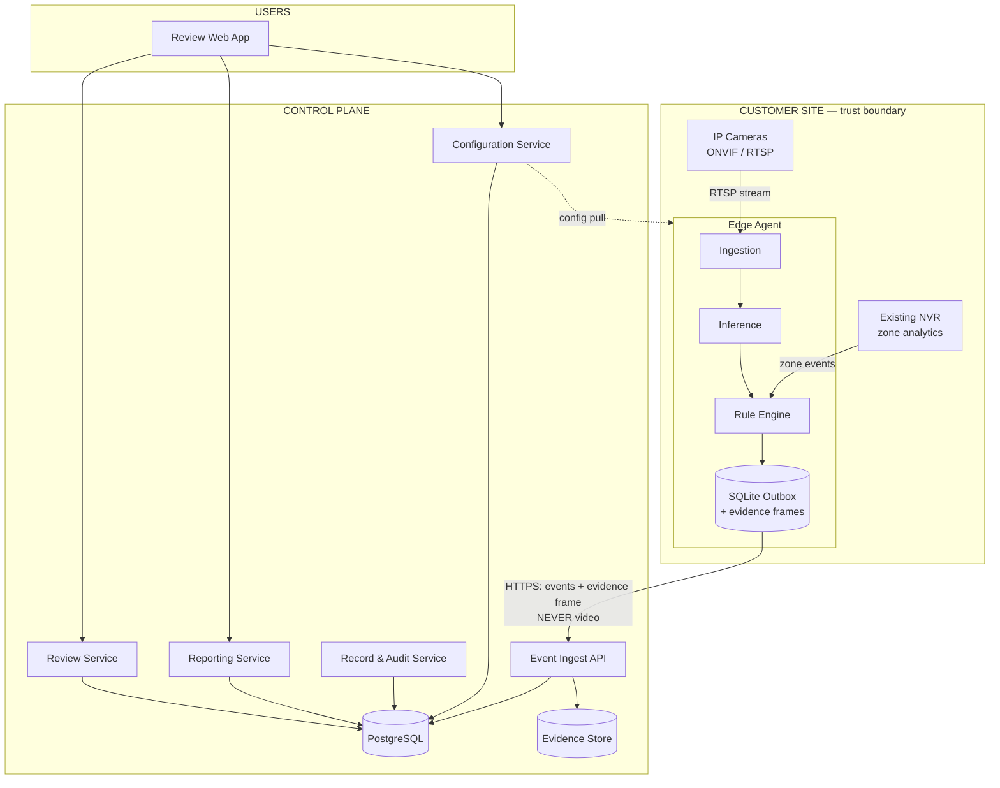

**The critical property:** the arrow from site to control plane carries structured events and at most one still image per event. It never carries a video stream. This is BR-008 expressed as topology rather than policy.

## 2.2 Logical Architecture

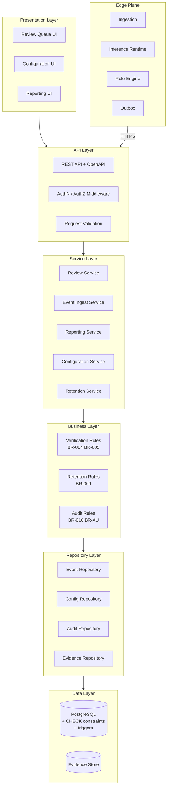

> **Note the placement of L4.** Business rules sit *between* services and repositories, and are additionally enforced *inside* L6 by database constraints. This is deliberate double enforcement: the application layer gives good error messages; the data layer makes violation impossible.

## 2.3 Physical Architecture

### MVP `[MVP]` — single-site, co-located

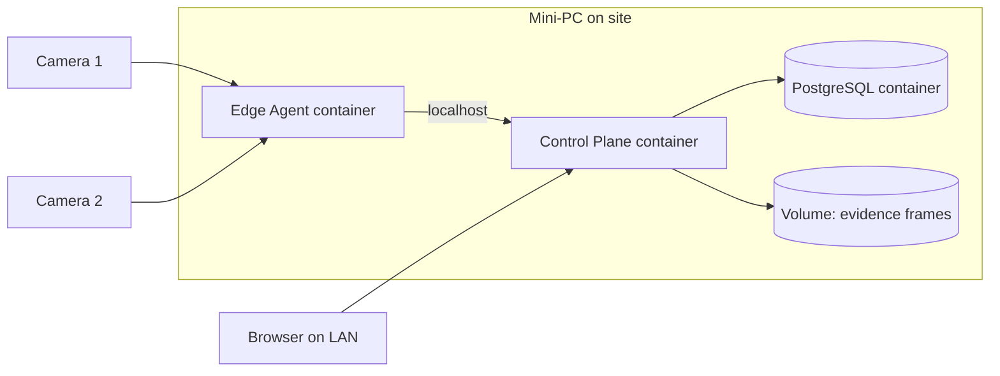

For the MVP everything runs on one machine on the site LAN. This is the simplest deployment that exercises the full architecture, and it satisfies BR-008 absolutely — nothing leaves the site at all.

### Production `[V1]` — distributed

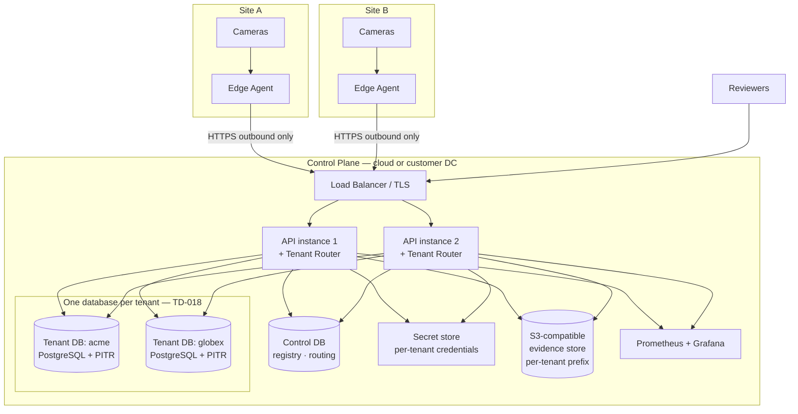

> **Outbound only.** Edge agents initiate all connections. No inbound path to the site is required, satisfying NFR-SEC-05 and persona P-4's primary objection.

> **Tenant isolation is physical — TD-018.** A **tenant** is a customer organisation owning one or more sites. Each tenant has its own PostgreSQL database; nothing is shared between tenants except the stateless API tier, the routing registry and the object-store service. Sites A and B above may belong to the same tenant or to different ones — sites of one tenant share that tenant's database, sites of different tenants share nothing. Full model in [ARCHITECTURE.md](ARCHITECTURE.md) §8.9 and [DATABASE.md](DATABASE.md) §1.3.
>
> **The consequence that matters most:** the CHECK constraints and triggers enforcing BR-004 and BR-005 now exist **once per tenant database**, so the product's central guarantee is only as strong as the weakest tenant's schema. Continuous per-tenant constraint attestation (fitness function FF-11) is a release condition for this topology, not a follow-up — see [ARCHITECTURE.md](ARCHITECTURE.md) §8.2.3 and risk R-9.

## 2.4 Component Diagram

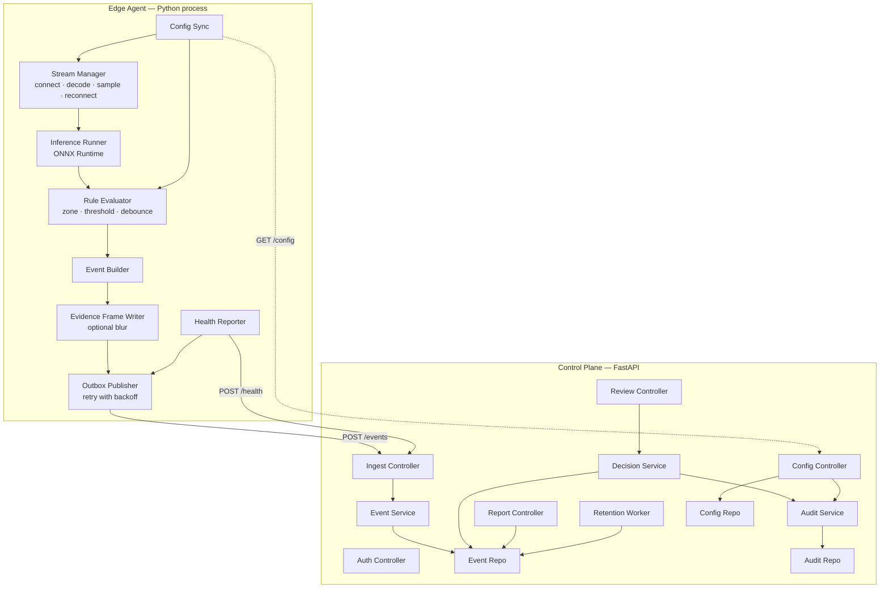

## 2.5 Deployment Diagram

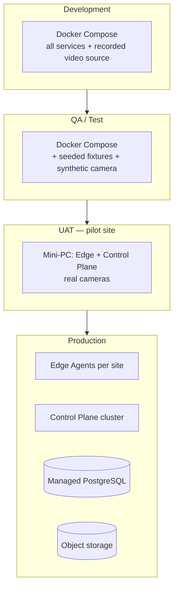

| Environment | Composition | Scope |
|---|---|---|
| Development | Compose stack, recorded video file as camera source | `[MVP]` |
| QA | Compose stack, synthetic RTSP source, seeded fixtures | `[MVP]` |
| UAT / Pilot | Single mini-PC, both planes co-located, real cameras | `[MVP]` |
| Production | Edge agents per site; control plane with managed database and object storage | `[V1]` |

---

# 3. Technology Stack

| Layer | Technology | Version | Scope | Justification |
|---|---|---|---|---|
| **Frontend** | React + TypeScript | 18 / 5.x | `[MVP]` | Review screen is the critical UI; TS catches contract drift against the API |
| | Vite | 5.x | `[MVP]` | Fast dev loop for a small team |
| | TailwindCSS | 3.x | `[MVP]` | No design system to build; utility classes keep the review screen simple |
| | TanStack Query | 5.x | `[MVP]` | Server-state caching and polling for the queue |
| **Backend** | Python | 3.11+ | `[MVP]` | Shared language with the edge agent |
| | FastAPI | 0.11x | `[MVP]` | Pydantic validation is a rule-enforcement point, not a convenience |
| | Uvicorn / Gunicorn | current | `[MVP]` / `[V1]` | ASGI server; Gunicorn workers in production |
| | SQLAlchemy 2.x + Alembic | current | `[MVP]` | Repository layer and versioned migrations |
| **Edge** | Python | 3.11+ | `[MVP]` | — |
| | OpenCV + FFmpeg | 4.x | `[MVP]` | RTSP decode and frame sampling |
| | onvif-zeep | current | `[V1]` | ONVIF Profile S discovery; manual RTSP is the MVP path |
| | ONNX Runtime | 1.17+ | `[MVP]` | Hardware-abstracted inference — makes TD-003 reversible |
| **Database** | PostgreSQL | 16 | `[MVP]` | CHECK constraints and triggers enforce BR-004/005/AU-02 at the data layer |
| | SQLite | 3.x | `[MVP]` | Edge outbox only. Not a system of record. |
| **AI framework** | PyTorch + Ultralytics | current | `[MVP]` | Training and fine-tuning only; not used at inference |
| | ONNX | opset 17+ | `[MVP]` | Model interchange format |
| | TensorRT execution provider | — | `[V1]` | Jetson-optimised inference |
| **Message queue** | *None — transactional outbox* | — | `[MVP]` `[V1]` | Expected volume does not justify a broker. Outbox gives at-least-once with no extra component. |
| | Redis Streams or RabbitMQ | — | `[V2+]` | Reconsider at multi-site scale |
| **Storage** | Local filesystem volume | — | `[MVP]` | Behind a storage interface |
| | S3-compatible (MinIO / AWS S3) | — | `[V1]` | Same interface, different driver |
| **Authentication** | JWT access + refresh (PyJWT) | — | `[MVP]` | Reviewer identity from session only — BR-S-01 |
| | OIDC federation | — | `[V1]` | Google Workspace / Entra ID |
| **Authorization** | RBAC, four roles | — | `[MVP]` basic / `[V1]` scoped | PRD F-12 |
| **Logging** | structlog → JSON | — | `[MVP]` | Structured logs; separate audit channel |
| | Loki or CloudWatch | — | `[V1]` | Aggregation |
| **Monitoring** | Prometheus + Grafana | — | `[MVP]` basic / `[V1]` full | Self-hosted, in-stack |
| | Sentry (or equivalent) | — | `[V1]` | Error tracking |
| **CI/CD** | GitHub Actions | — | `[MVP]` | Team already on GitHub |
| **Containers** | Docker + Compose | 24+ | `[MVP]` `[V1]` | Kubernetes deferred — see TD-012 |
| **Cloud** | AWS (reference) | — | `[V1]` | Provider-agnostic design |

### Explicitly rejected technologies

| Rejected | Reason |
|---|---|
| Kubernetes at MVP or V1 | Operational burden a 5-person team cannot carry for single-site edge deployment. Revisit only if multi-tenant SaaS is pursued. |
| Message broker at MVP | An additional component to run and monitor for volume that does not require it. The outbox pattern achieves the same delivery guarantee. |
| NoSQL primary store | The core requirement is relational integrity constraints. A document store cannot enforce BR-005 at the data layer. |
| Cloud video streaming | Prohibited by BR-008. Not a performance decision — a product-rule decision. |
| Any facial-recognition or person-re-identification library | Prohibited by BR-006. Must not be present in the dependency tree at all. |

---

# 4. System Modules

## 4.1 Module map

| Module | Plane | PRD module | Scope |
|---|---|---|---|
| MOD-1 Stream Manager | Edge | M1 Ingestion | `[MVP]` |
| MOD-2 Inference Runner | Edge | M2 Detection | `[MVP]` |
| MOD-3 Rule Evaluator | Edge | M3 Rule Engine | `[MVP]` |
| MOD-4 Event Builder & Outbox | Edge | M3 / M6 | `[MVP]` |
| MOD-5 NVR Connector | Edge | M6 Integration | `[V1]` |
| MOD-6 Ingest Service | Control | M4 | `[MVP]` |
| MOD-7 Review Service | Control | M4 Verification | `[MVP]` |
| MOD-8 Record & Audit Service | Control | M5 | `[MVP]` |
| MOD-9 Reporting Service | Control | M7 | `[MVP]` basic |
| MOD-10 Configuration Service | Control | M8 | `[MVP]` minimal |
| MOD-11 Retention Worker | Control | M5 | `[V1]` |
| MOD-12 Identity & Access | Control | cross-cutting | `[MVP]` |

---

### MOD-1 — Stream Manager `[MVP]`

| Aspect | Detail |
|---|---|
| **Responsibilities** | Establish and maintain camera connections; decode frames; sample at configured rate; detect disconnection; reconnect with backoff; report stream health; record coverage gaps. |
| **Interfaces** | *In:* camera configuration (URL, credentials, profile, sample rate). *Out:* `Frame(camera_id, timestamp, image, sequence)` to MOD-2; `StreamHealth` to MOD-4. |
| **Dependencies** | FFmpeg/OpenCV; network reachability; camera credentials from local encrypted config. |
| **Failure handling** | Connection loss → exponential backoff (1s, 2s, 4s … capped 60s), unlimited retries. Every gap written to the outbox as a `coverage_gap` record — **gaps are recorded, never inferred** (FR-005). Decode error on a single frame → drop frame, increment counter, continue. Sustained decode failure > threshold → mark camera `degraded`, alert. |
| **Rule enforcement** | Never writes video to disk beyond the in-memory ring buffer required for sampling. |

---

### MOD-2 — Inference Runner `[MVP]`

| Aspect | Detail |
|---|---|
| **Responsibilities** | Load the ONNX model artefact; run inference on sampled frames; emit detections with class, bounding box, confidence; expose model version. |
| **Interfaces** | *In:* `Frame`. *Out:* `Detection(class, bbox, confidence, model_version, frame_ref)`. |
| **Dependencies** | ONNX Runtime; model artefact with version manifest; compute (CPU `[MVP]`, CUDA/TensorRT `[V1]`). |
| **Failure handling** | Model load failure → agent refuses to start and reports fatal health; **it does not run without a model and does not silently produce zero detections**. Inference exception on a frame → drop, count, continue. Sustained failure → `degraded`, stop generating events rather than generate wrong ones (BR-012 fail-safe). |
| **Rule enforcement** | Loads only the detection model. No identity, biometric or re-identification model may be loaded (BR-006). Enforced by dependency review and a startup assertion on the model manifest. |

---

### MOD-3 — Rule Evaluator `[MVP]`

| Aspect | Detail |
|---|---|
| **Responsibilities** | Apply zone geometry (point-in-polygon on detection anchor); apply confidence threshold; apply debounce and dwell-time; decide whether a detection constitutes a candidate event. |
| **Interfaces** | *In:* `Detection`, active rule set. *Out:* `CandidateEvent`. |
| **Dependencies** | MOD-2; configuration from MOD-10 via config sync. |
| **Failure handling** | Missing or malformed rule configuration → rule is treated as inactive and an error is logged. **Never falls back to a default rule** — that would violate BR-001. |
| **Rule enforcement** | **Fully deterministic. No model inference occurs in this module** (FR-025, AP-1). The rule that fired is recorded in a human-readable form (DP-6). |

---

### MOD-4 — Event Builder & Outbox `[MVP]`

| Aspect | Detail |
|---|---|
| **Responsibilities** | Construct the full candidate event payload; write the evidence frame (with optional blur); persist to the local outbox; publish to the control plane; handle retry, backoff and deduplication. |
| **Interfaces** | *In:* `CandidateEvent`, `StreamHealth`. *Out:* `POST /api/v1/events`. |
| **Dependencies** | SQLite; local evidence store; network. |
| **Failure handling** | Control plane unreachable → events accumulate in the outbox and are retried indefinitely with backoff. Outbox is capped by disk quota; on approaching the cap the agent raises a critical alert and **stops generating new events rather than silently dropping old ones**. Duplicate delivery is handled by an idempotency key (`event_id`, client-generated UUID) — the control plane deduplicates. |
| **Rule enforcement** | Every event leaves with status `unverified` (FR-024). The agent has no capability to create a verified record. |

---

### MOD-5 — NVR Connector `[V1]`

| Aspect | Detail |
|---|---|
| **Responsibilities** | Receive zone/intrusion events from the site's existing NVR; normalise into `CandidateEvent`; retain provenance. |
| **Interfaces** | *In:* ONVIF event subscription, vendor HTTP callback, or polling — depends on device. *Out:* `CandidateEvent` with `source = 'nvr'`. |
| **Dependencies** | Availability and licensing of NVR analytics — **`[OPEN]` PRD OQ-2**. |
| **Failure handling** | Subscription loss → re-subscribe with backoff; gap recorded. Malformed vendor payload → log, drop, count; never guess missing fields. |
| **Rule enforcement** | Externally sourced events enter the identical review path and are indistinguishable to the reviewer in workflow, but `source` is retained in the record (FR-032, FR-033). |

---

### MOD-6 — Ingest Service `[MVP]`

| Aspect | Detail |
|---|---|
| **Responsibilities** | Authenticate the edge agent; validate the event payload; deduplicate by `event_id`; persist candidate; store the evidence frame; record coverage gaps and health. |
| **Interfaces** | `POST /api/v1/events`, `POST /api/v1/agents/health`, `POST /api/v1/coverage-gaps`. |
| **Dependencies** | Event repository; evidence store; agent credentials. |
| **Failure handling** | Validation failure → `422` with a field-level error; the agent retains the event and does not retry a permanently invalid payload. Database unavailable → `503`; the agent retries. Duplicate `event_id` → `200` with the existing record (idempotent). |
| **Rule enforcement** | Rejects any inbound payload attempting to set `status`, `reviewer_id` or `decided_at`. These fields are not accepted from the edge under any circumstances. |

---

### MOD-7 — Review Service `[MVP]`

| Aspect | Detail |
|---|---|
| **Responsibilities** | Serve the review queue; serve individual candidates with context; accept the accept/reject/correct decision; attach reviewer identity from the session; expose queue depth. |
| **Interfaces** | `GET /api/v1/events`, `GET /api/v1/events/{id}`, `POST /api/v1/events/{id}/decision`, `GET /api/v1/events/{id}/evidence`. |
| **Dependencies** | Event repository; identity service; evidence store. |
| **Failure handling** | Concurrent decision on the same event → optimistic concurrency via version column; second decision receives `409` with the existing decision. Session expiry mid-decision → `401`; the UI preserves the draft decision locally and replays after re-auth. |
| **Rule enforcement** | **This is the only service permitted to transition an event out of `unverified`.** Reviewer identity is taken from the validated token, never from the request body (BR-S-01, FR-045). No bulk endpoint exists (FR-047). No confidence-based auto-approval path exists (FR-048). |

---

### MOD-8 — Record & Audit Service `[MVP]`

| Aspect | Detail |
|---|---|
| **Responsibilities** | Persist verified records and rejections; write audit entries for every decision and configuration change; guarantee audit append-only semantics. |
| **Interfaces** | Internal only — invoked by MOD-7 and MOD-10. Read access via `GET /api/v1/audit`. |
| **Dependencies** | PostgreSQL. |
| **Failure handling** | Audit write failure → **the transaction rolls back entirely**. A decision that cannot be audited must not be recorded. This is deliberate: partial recording is worse than no recording. |
| **Rule enforcement** | Decision and audit write occur in a single transaction. Database triggers reject any `UPDATE` or `DELETE` on `audit_log` (BR-AU-01) and any modification of `reviewer_id` or `decided_at` after creation (BR-AU-02). |

---

### MOD-9 — Reporting Service `[MVP]` basic / `[V1]` full

| Aspect | Detail |
|---|---|
| **Responsibilities** | Filtered retrieval of verified events; aggregation by zone, rule and period; export with provenance header. |
| **Interfaces** | `GET /api/v1/reports/summary`, `GET /api/v1/reports/export`. |
| **Dependencies** | Event repository (read-only). |
| **Failure handling** | Large range → paginate; never partial-render a report without indicating truncation. |
| **Rule enforcement** | **All report queries filter `status IN ('accepted','corrected')`.** Rejected and unverified records are excluded at the repository layer, not the presentation layer, so no report path can accidentally include them (BR-R-01, FR-064). |

---

### MOD-10 — Configuration Service `[MVP]` minimal / `[V1]` full

| Aspect | Detail |
|---|---|
| **Responsibilities** | CRUD for sites, cameras, zones and rules; retention settings; reviewer assignment; serve configuration to edge agents. |
| **Interfaces** | `GET/POST/PATCH /api/v1/cameras`, `/zones`, `/rules`, `/sites`; `GET /api/v1/agents/{id}/config`. |
| **Dependencies** | Config repository; audit service. |
| **Failure handling** | Invalid zone polygon → `422` with the geometric reason. Rule referencing a deleted zone → rejected by foreign key. |
| **Rule enforcement** | New site or camera has **no active rule** and generates no events until one is deliberately enabled (BR-001, FR-073). Every mutation writes an audit entry with the acting user (BR-010). |

---

### MOD-11 — Retention Worker `[V1]`

| Aspect | Detail |
|---|---|
| **Responsibilities** | Scheduled enforcement of per-site retention: delete expired evidence frames and records; log every deletion. |
| **Interfaces** | Scheduled job. No public API. |
| **Dependencies** | Event repository; evidence store; audit service. |
| **Failure handling** | Partial deletion → retried on next run; the audit entry is written only for what was actually deleted, never for what was attempted. |
| **Rule enforcement** | Deletion is verifiable and recorded (BR-009, FR-056, FR-057). |

---

### MOD-12 — Identity & Access `[MVP]`

| Aspect | Detail |
|---|---|
| **Responsibilities** | Authenticate users and agents; issue and refresh tokens; enforce RBAC; expose current identity for reviewer attribution. |
| **Interfaces** | `POST /api/v1/auth/login`, `/refresh`, `/logout`; middleware on all routes. |
| **Dependencies** | User store; secret management. |
| **Failure handling** | Invalid credentials → `401`, generic message, rate-limited. Expired access token → `401`; client refreshes. Invalid refresh token → full re-authentication. |
| **Rule enforcement** | Reviewer identity is derived from the validated token only (BR-S-01). Agent credentials are a distinct principal type and carry **no** review permission — an edge agent cannot verify an event even if compromised. |

---

# 5. AI Architecture

## 5.1 Position of AI in the system

```mermaid
flowchart LR
    A[Raw frame] -->|ML| B[Detection<br/>class + bbox + confidence]
    B -->|DETERMINISTIC| C[Zone evaluation]
    C -->|DETERMINISTIC| D[Threshold]
    D -->|DETERMINISTIC| E[Debounce / dwell]
    E -->|DETERMINISTIC| F[Candidate event]
    F -->|HUMAN| G[Accept / Reject / Correct]
    G -->|DETERMINISTIC| H[(Verified record)]

    style B fill:#1C7293,color:#fff
    style G fill:#3AAFA9,color:#fff
```

**One ML step. One human step. Everything else is code.**

| Stage | Nature | Justification |
|---|---|---|
| Detection | Machine learning | Cannot be expressed as rules over pixel values; must be learned from examples (PRD §3.6) |
| Zone evaluation | Deterministic | Point-in-polygon is exact, instant and free |
| Threshold, debounce, dwell | Deterministic | The customer must be able to read the rule that fired |
| Verification | **Human** | BR-004. No automated path exists |
| Record construction | Deterministic | Must be reproducible for the audit trail to have value |

## 5.2 Detection Pipeline

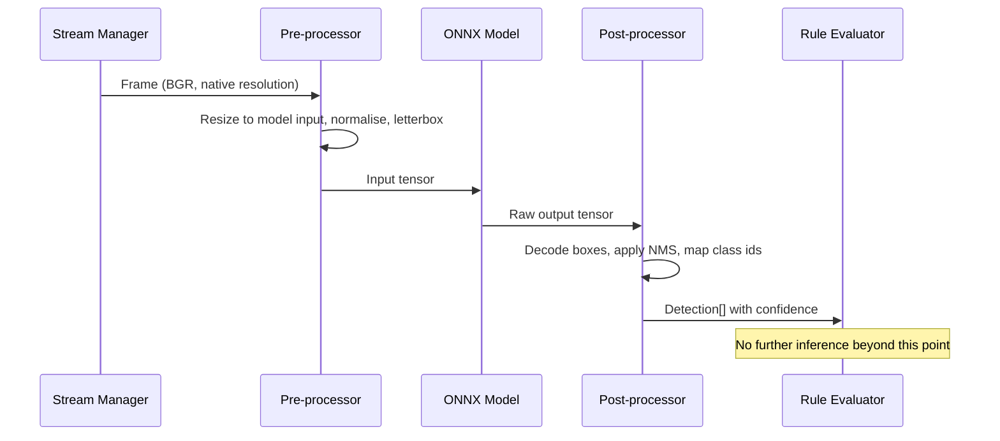

| Stage | Detail | Scope |
|---|---|---|
| Sampling | Configurable rate; default 2 fps `[MVP]`. Full frame rate is unnecessary for rule compliance and multiplies cost with no detection benefit. | `[MVP]` |
| Pre-processing | Letterbox resize preserving aspect ratio; normalise; convert to model input tensor | `[MVP]` |
| Inference | ONNX Runtime; CPU provider `[MVP]`, TensorRT provider `[V1]` | `[MVP]` |
| Post-processing | Box decode, non-maximum suppression, class mapping | `[MVP]` |
| Output | `Detection(class, bbox, confidence, model_version)` | `[MVP]` |

## 5.3 Inference Pipeline — operational characteristics

| Property | MVP | V1 | Notes |
|---|---|---|---|
| Execution provider | CPU (ONNX Runtime) | TensorRT on Jetson | Abstracted — TD-015 |
| Batch size | 1 | Configurable | Batching only helps at multi-camera scale |
| Cameras per device | 1–3 | `[OPEN]` PRD OQ-9 | Must be benchmarked, not estimated |
| Frame sampling | 2 fps default | Configurable per camera | Trade-off exposed to configuration |
| Model warm-up | On agent start | On agent start | Prevents first-detection latency spike |
| Failure mode | Fail safe — stop generating events | Same | BR-012 |

## 5.4 Human Verification — architecture

The verification gate is enforced at **four independent layers**. Any one failing does not compromise the rule.

| Layer | Enforcement |
|---|---|
| **Edge** | The agent can only emit `status = 'unverified'`. It has no credential permitting any other status. |
| **API** | The ingest endpoint rejects any payload containing `status`, `reviewer_id` or `decided_at`. Only the decision endpoint may set them. |
| **Service** | Only MOD-7 may transition an event out of `unverified`, and it takes reviewer identity from the validated token. |
| **Database** | A CHECK constraint makes a row with a decided status and a null `reviewer_id` **impossible to insert or update**, by any client, including direct SQL. |

> **Why four layers.** The PRD calls this the core product commitment. A single application-layer check is one refactor away from being bypassed. The database constraint is the one that cannot be accidentally removed — it would require a deliberate, reviewable migration.

## 5.5 Confidence Thresholds

| Aspect | Approach |
|---|---|
| Purpose of confidence | Suppress low-confidence noise before it reaches a human, and optionally order the queue. |
| **Never** | Confidence must never auto-approve, auto-reject-and-discard, or bypass human review (AP-4, FR-048). |
| Default threshold | `[OPEN]` — PRD OQ-4/OQ-5. Set from pilot data, not from a published benchmark, because published figures are not comparable across datasets and conditions. |
| Configurability | Per rule, per zone. Changes are audited (BR-010). |
| Below threshold | The detection is discarded and counted. It is **not** silently suppressed without a counter — the count feeds tuning. |

## 5.6 Fallback Logic

| Failure | Fallback | Rule |
|---|---|---|
| Model fails to load | Agent refuses to start; fatal health reported | Never run without a model |
| Inference throws on a frame | Drop frame, increment counter, continue | Single-frame loss is acceptable |
| Sustained inference failure | Mark camera `degraded`; stop generating events for it; alert | BR-012 — fail safe, not fail silent |
| Stream lost | Reconnect with backoff; write `coverage_gap` | FR-005 — gaps recorded, never inferred |
| Control plane unreachable | Buffer in outbox; retry indefinitely | No event loss |
| Outbox approaching disk cap | Critical alert; stop generating new events | Never silently discard buffered events |
| NVR event source lost | Guardian Lens fallback detection where configured; otherwise record the gap | PRD §7.5 |

> **The governing principle:** every failure produces either a recorded gap or a visible alert. There is no failure mode in which the system appears to be watching but is not.

## 5.7 Model Lifecycle

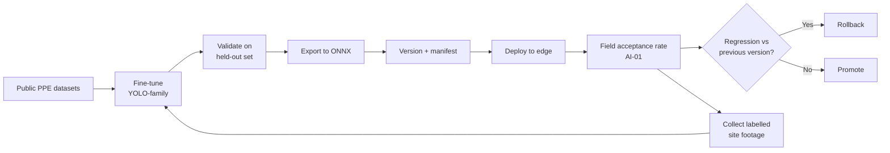

| Stage | Detail | Scope |
|---|---|---|
| Base | Pretrained YOLO-family weights | `[MVP]` |
| Fine-tune | Public PPE/helmet datasets | `[MVP]` |
| Site adaptation | Labelled footage from real deployments | `[V1]` |
| Export | ONNX, opset 17+, with a version manifest | `[MVP]` |
| Versioning | Semantic version + training-data hash, recorded on every detection (FR-013) | `[MVP]` |
| Promotion gate | Field acceptance rate must not regress against the incumbent version (AI-06) | `[V1]` |
| Rollback | Previous ONNX artefact retained; swap is a config change and agent restart | `[MVP]` |

## 5.8 Training Strategy

| Aspect | Approach |
|---|---|
| v1 class | Helmet present / absent only. Published research reports the highest accuracy for visually distinctive classes; visually ambiguous classes fall materially under occlusion (PRD §3.6). |
| Additional classes | Each gated on measured per-class accuracy on real site footage. Not added speculatively. |
| Data sources | Public PPE datasets `[MVP]`; site footage under a written data agreement `[V1]`. |
| Labelling | Manual, with a documented labelling standard. The standard is a deliverable, not an afterthought — inconsistent labels produce unmeasurable models. |
| **Accuracy claims** | **None until measured on real site footage** (AP-2, PRD OQ-5). Published benchmark figures may not be presented as this product's accuracy. |
| Face blurring interaction | Published work indicates a measurable accuracy cost on the helmet class specifically. If blurring is enabled, the model must be evaluated **with blurring applied**, not without. |
| Bias review | Evaluate across lighting conditions, PPE colour variation and camera angle. Document known weak conditions rather than reporting a single headline figure. |

---

# 6. Backend Architecture

## 6.1 Application Layers

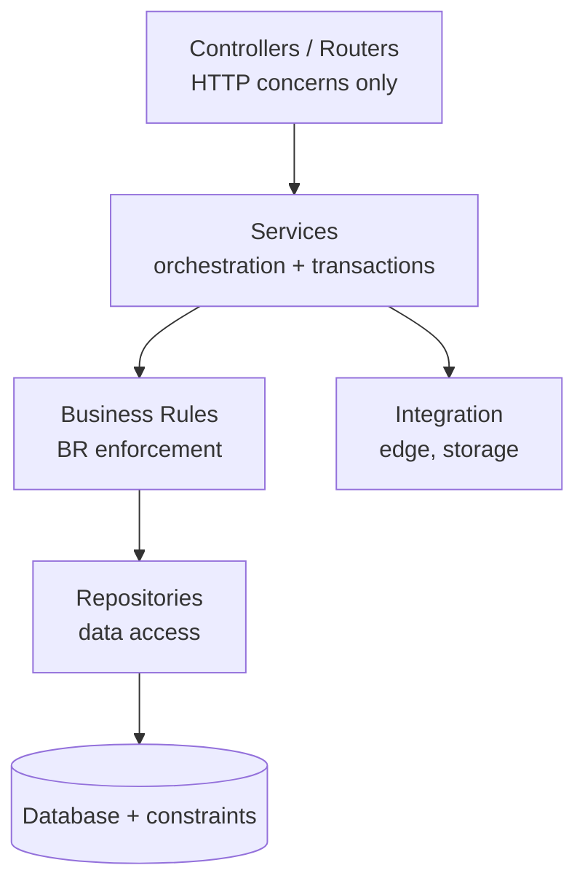

| Layer | Responsibility | Must not |
|---|---|---|
| Controller | HTTP parsing, status codes, serialisation | Contain business logic or touch repositories directly |
| Service | Orchestration, transaction boundaries, cross-module coordination | Contain SQL |
| Business rules | Enforce BR-001 … BR-012 with meaningful errors | Be the *only* enforcement — the database also enforces the critical ones |
| Repository | Data access, query construction | Contain business decisions |
| Integration | Edge agent contract, object storage, future external systems | Contain any HR, performance or disciplinary integration (BR-003) |

## 6.2 Service Layer

| Service | Responsibility | Transaction boundary |
|---|---|---|
| `EventIngestService` | Validate, deduplicate, persist candidate, store evidence | Single transaction per event |
| `DecisionService` | Apply reviewer decision, write record, write audit | **Single transaction covering both** — an unaudited decision must not exist |
| `ReportingService` | Read-only aggregation | Read-only |
| `ConfigurationService` | Mutate configuration, write audit | Single transaction covering both |
| `RetentionService` | Delete expired data, write audit | Batched, per-batch transaction |
| `IdentityService` | Authenticate, issue tokens, resolve current principal | — |

## 6.3 Business Layer

Business rules are implemented as explicit, testable units — not scattered through services.

| Rule object | Enforces | Test |
|---|---|---|
| `VerificationGuard` | BR-004 — no record without human verification | Attempt state transition without a reviewer → must raise |
| `ReviewerAttributionGuard` | BR-005, BR-S-01 — reviewer from session only | Attempt to supply a reviewer name in the body → must reject |
| `RejectionExclusionGuard` | BR-R-01 — reports exclude rejections | Query builder inspection test |
| `DefaultOffGuard` | BR-001 — nothing monitored by default | New site fixture → assert zero active rules |
| `AuditWriteGuard` | BR-010, BR-AU-01 — every mutation audited, append-only | Attempt audit update → must fail |
| `RetentionGuard` | BR-009 — deletion enforced and recorded | Short-retention fixture → assert deletion and log entry |
| `NoActionGuard` | BR-003 — no outbound consequence integration | Static analysis: assert no HR/performance client exists in the dependency graph |

## 6.4 Repository Layer

| Repository | Entities | Notable constraint |
|---|---|---|
| `EventRepository` | `events`, `event_corrections` | Verified-read methods filter `status IN ('accepted','corrected')` **at the repository level** so no caller can bypass it |
| `ConfigRepository` | `sites`, `cameras`, `zones`, `rules` | — |
| `AuditRepository` | `audit_log` | **Insert-only interface.** No update or delete method is exposed at all. |
| `EvidenceRepository` | Object storage | Interface abstracts filesystem `[MVP]` vs S3 `[V1]` |
| `IdentityRepository` | `users`, `roles`, `agents` | — |

## 6.5 Integration Layer

| Integration | Direction | Scope |
|---|---|---|
| Edge Agent contract | Inbound (agent → control plane) | `[MVP]` |
| Object storage | Outbound | `[MVP]` |
| OIDC provider | Outbound | `[V1]` |
| NVR event source | Inbound at edge | `[V1]` |
| **HR / performance / disciplinary systems** | **NONE — must not exist** | BR-003, FR-081 |

---

# 7. Frontend Architecture

## 7.1 Screens

| ID | Screen | Purpose | Personas | Scope |
|---|---|---|---|---|
| SCR-1 | Login | Authenticate | All | `[MVP]` |
| SCR-2 | **Review Queue** | The critical screen. List of unverified candidates with depth always visible. | P-2, P-3 | `[MVP]` |
| SCR-3 | **Candidate Detail** | Evidence frame, time, camera, zone, rule, and the three decision actions on one screen | P-2, P-3 | `[MVP]` |
| SCR-4 | Event History | Filter and retrieve verified events | P-2, P-1 | `[MVP]` |
| SCR-5 | Rejection Log | Rejected candidates with reason and reviewer | P-1, P-2 | `[MVP]` |
| SCR-6 | Reports | Aggregation by zone, rule, period; export | P-1 | `[MVP]` basic |
| SCR-7 | Camera Configuration | Register cameras, check stream health | P-4 | `[MVP]` minimal |
| SCR-8 | Zone & Rule Configuration | Define zones, enable rules, reference written rule | P-2, P-4 | `[MVP]` minimal |
| SCR-9 | Retention Settings | Per-site retention period | P-4 | `[V1]` |
| SCR-10 | Audit Log Viewer | Configuration and decision history | P-1, P-4 | `[V1]` |
| SCR-11 | User & Role Management | Reviewer assignment, scoping | P-1, P-4 | `[V1]` |
| SCR-12 | System Health | Agent and stream status, coverage gaps | P-4 | `[V1]` |

## 7.2 Navigation

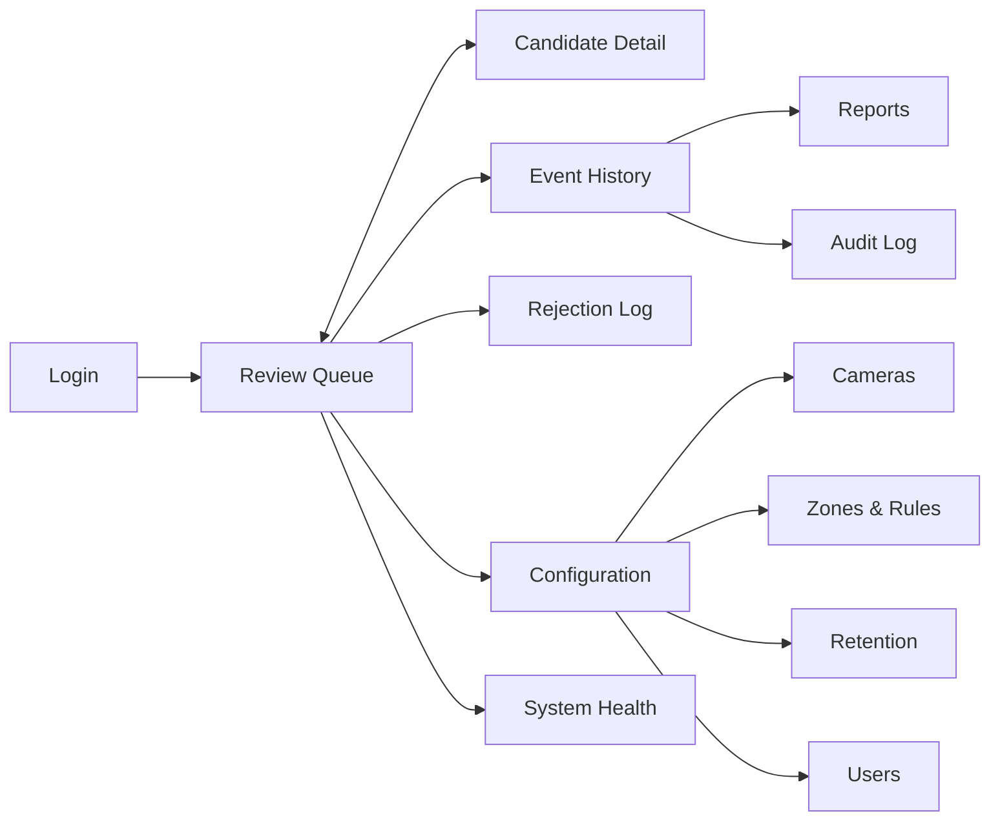

> **The queue is home.** For P-2 the application opens on the review queue and every other screen is a departure from it. This reflects the fact that clearing the queue is the daily job and everything else is occasional.

## 7.3 State Management

| Concern | Approach | Rationale |
|---|---|---|
| Server state | TanStack Query | Queue polling, cache invalidation on decision, optimistic update with rollback |
| Auth state | React Context + refresh interceptor | Single source for the current principal |
| Draft decision | Local component state, persisted to `sessionStorage` | Survives token refresh mid-decision (MOD-7 failure handling) |
| UI preferences | `localStorage` | Non-critical |
| **Not used** | Redux or equivalent | Application state is small; server state dominates. A global store would add ceremony without benefit. |

**Queue behaviour:** poll every 15 seconds `[MVP]`; server-sent events `[V1]`. Polling is chosen for MVP because it is trivially reliable and the volume is low; SSE is a refinement, not a requirement.

## 7.4 UI Components

| Component | Purpose | Requirement |
|---|---|---|
| `QueueList` | Ordered candidates, depth badge | Depth always visible — DP-4 |
| `EvidenceFrame` | Display evidence image with zone overlay | Must render before decision actions enable |
| `DecisionBar` | Accept / Reject / Correct | **Keyboard-operable: A / R / C** — NFR-ACC-01, DP-2 |
| `RejectionReasonDialog` | Capture reason on reject | Reason mandatory — FR-043 |
| `CorrectionForm` | Amend the erroneous field | Original model output displayed alongside |
| `RuleBadge` | Human-readable rule that fired | DP-6 |
| `StatusChip` | Event status | **Never colour alone** — NFR-ACC-02 |
| `ZoneEditor` | Draw zone polygon on camera view | `[V1]` — F-13 |
| `StreamHealthIndicator` | Per-camera connection state | Degraded state must be unmistakable |

### Components that must not be built

| Not built | Rule |
|---|---|
| Bulk accept / bulk reject control | FR-047, DP-3 — would create rubber-stamping |
| Any per-person dashboard, leaderboard or activity chart | BR-002 |
| Any "notify HR" or escalation-to-management action | BR-003 |
| Any confidence-based auto-dispose toggle | FR-048, AP-4 |

---

# 8. Database Design

> **This section and §9 are summary views.** [DATABASE.md](DATABASE.md) is the normative data-model specification — DDL, constraint and trigger bodies, indexes with their queries, data classification, retention mechanics, the edge store, migration strategy and operations. Where they disagree, **DATABASE.md prevails** and these sections are corrected. Sixteen amendments arising from that review are listed in [DATABASE.md](DATABASE.md) Appendix A.1 and remain outstanding.

> **One database per tenant — TD-018.** Everything in §8 and §9 describes the schema of a **single tenant database**, instantiated once per customer organisation. There is deliberately **no `tenant_id` column on any table**: the database is the tenant scope, so there is no filter to apply and therefore no filter to forget. A separate small **control database** holds the tenant registry, routing and per-tenant schema version, and holds no business data ([DATABASE.md](DATABASE.md) §1.4). Each tenant database additionally carries a single-row `tenant_identity` table, asserted by the router on every connection acquisition, because in a silo model nothing in the rows themselves can contradict a mis-routed connection.

## 8.1 Entities

| Entity | Purpose | Scope |
|---|---|---|
| `tenant_identity` | Single row naming the tenant this database belongs to — anti-misrouting assertion | `[MVP]` |
| `sites` | A physical location, belonging to exactly one tenant | `[MVP]` |
| `cameras` | A camera at a site | `[MVP]` |
| `zones` | A polygon on a camera view | `[MVP]` |
| `detection_rules` | A rule bound to a zone, with a written-rule reference | `[MVP]` |
| `events` | Candidate and verified events — one table, status-driven | `[MVP]` |
| `event_corrections` | Field-level corrections applied by a reviewer | `[MVP]` |
| `coverage_gaps` | Recorded periods of unavailable analysis | `[MVP]` |
| `users` | Human principals | `[MVP]` |
| `roles`, `user_roles` | RBAC | `[MVP]` |
| `agents` | Edge agent principals | `[MVP]` |
| `model_versions` | Deployed model artefacts | `[MVP]` |
| `audit_log` | Append-only record of every mutation | `[MVP]` |
| `retention_policies` | Per-site retention configuration | `[V1]` |
| `user_zone_scopes` | Zone-scoped reviewer permissions | `[V1]` |

## 8.2 Entity Relationships

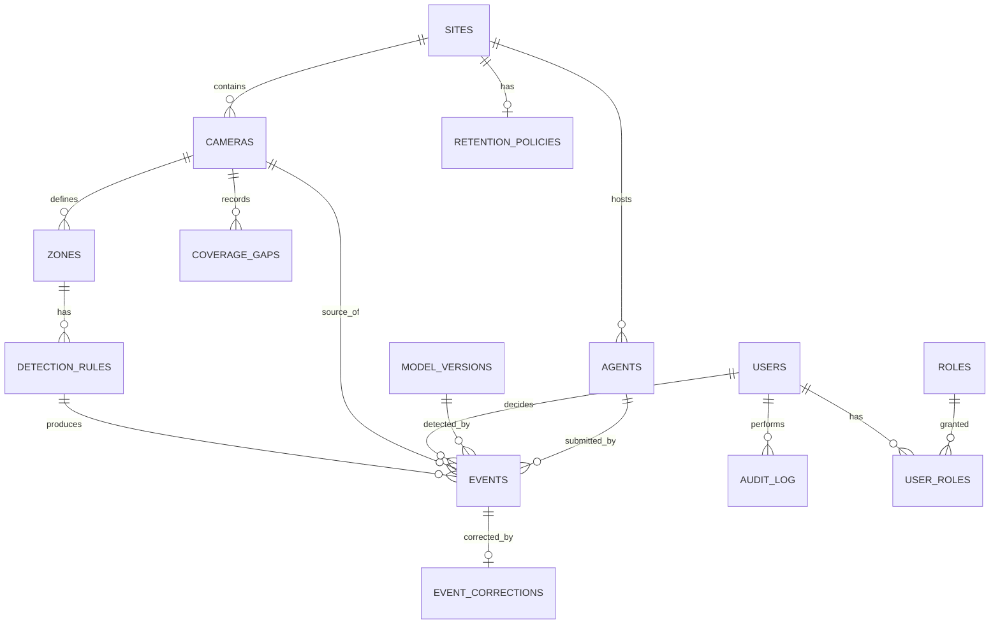

## 8.3 Normalisation

Third normal form throughout, with two deliberate exceptions:

| Exception | Rationale |
|---|---|
| `events` denormalises `site_id` alongside `camera_id` | Every report filters by site; the join saved is on the hottest read path. Enforced consistent by trigger. |
| `events` stores `rule_snapshot` as JSONB | The rule as it existed **at detection time**. If the rule is later edited, historical events must still show what actually fired. This is an audit requirement, not an optimisation. |

## 8.4 Constraints — the critical ones

These implement business rules at the data layer. **They are not optional and must not be removed to "simplify" a migration.**

| Constraint | Enforces | Behaviour |
|---|---|---|
| `chk_decided_requires_reviewer` | BR-005 | A row with `status IN ('accepted','rejected','corrected')` and a null `reviewer_id` or `decided_at` cannot exist. Insert or update fails. |
| `chk_unverified_has_no_reviewer` | BR-004 | A row with `status = 'unverified'` may not carry a reviewer. Prevents pre-filled attribution. |
| `trg_events_immutable_decision` | BR-AU-02 | Trigger rejects any update that changes `reviewer_id`, `decided_at` or `decision_type` once set. |
| `trg_audit_append_only` | BR-AU-01 | Trigger rejects all `UPDATE` and `DELETE` on `audit_log`. |
| `chk_rule_requires_zone` | Coherence | A rule cannot exist without a zone. |
| `uq_events_event_id` | Idempotency | Client-generated UUID prevents duplicate ingestion on retry. |

## 8.5 Indexes

| Index | Table | Purpose |
|---|---|---|
| `idx_events_status_created` | `events` | Queue query — the hottest read path |
| `idx_events_site_occurred` | `events` | Reporting by site and period |
| `idx_events_zone_rule_occurred` | `events` | Aggregation by zone and rule |
| `idx_events_reviewer_decided` | `events` | Reviewer activity and audit |
| `idx_audit_entity_time` | `audit_log` | Audit retrieval by entity |
| `idx_gaps_camera_period` | `coverage_gaps` | Coverage reporting |
| Partial index on `status='unverified'` | `events` | Keeps the queue query fast as verified volume grows |

## 8.6 Audit Tables

| Table | Contents | Mutability |
|---|---|---|
| `audit_log` | Actor, action, entity type, entity id, before/after JSONB, timestamp, IP | **Append-only, trigger-enforced** |
| `events` | Decision fields, once written | Immutable after decision, trigger-enforced |
| `event_corrections` | Original value and corrected value | Insert-only |

---

# 9. Database Schema

Complete DDL for the production schema. `[MVP]` tables are marked; `[V1]` tables are included so the schema does not require restructuring later.

> **Summary view.** The normative schema, including full constraint and trigger bodies, the control-database schema and the edge SQLite store, is [DATABASE.md](DATABASE.md) §5, §6 and Appendix B. The tables below are the tenant schema, created once per tenant database (TD-018).

## 9.1 `sites` `[MVP]`

| Column | Type | Nullable | Description |
|---|---|---|---|
| `id` | UUID PK | No | Site identifier |
| `name` | VARCHAR(200) | No | Display name |
| `timezone` | VARCHAR(64) | No | IANA timezone — NFR-L-02 |
| `created_at` | TIMESTAMPTZ | No | |
| `updated_at` | TIMESTAMPTZ | No | |

## 9.2 `cameras` `[MVP]`

| Column | Type | Nullable | Description |
|---|---|---|---|
| `id` | UUID PK | No | |
| `site_id` | UUID FK → sites | No | |
| `name` | VARCHAR(200) | No | Human label, e.g. "Bay 3 entrance" |
| `location_description` | TEXT | Yes | Free text for the reviewer's context |
| `stream_url_encrypted` | BYTEA | No | Encrypted RTSP URL including credentials — NFR-SEC-02 |
| `stream_profile` | VARCHAR(20) | No | `primary` or `secondary` — FR-007 |
| `sample_rate_fps` | NUMERIC(4,2) | No | Default 2.0 |
| `status` | VARCHAR(20) | No | `active`, `degraded`, `disconnected`, `disabled` |
| `created_at` / `updated_at` | TIMESTAMPTZ | No | |

**Indexes:** `idx_cameras_site` on `(site_id)`

## 9.3 `zones` `[MVP]`

| Column | Type | Nullable | Description |
|---|---|---|---|
| `id` | UUID PK | No | |
| `camera_id` | UUID FK → cameras | No | |
| `name` | VARCHAR(200) | No | |
| `polygon` | JSONB | No | Normalised vertex array `[[x,y],…]`, 0–1 coordinate space so it survives resolution change |
| `created_at` / `updated_at` | TIMESTAMPTZ | No | |

## 9.4 `detection_rules` `[MVP]`

| Column | Type | Nullable | Description |
|---|---|---|---|
| `id` | UUID PK | No | |
| `zone_id` | UUID FK → zones | No | |
| `rule_type` | VARCHAR(50) | No | `ppe_helmet`, `zone_entry` |
| `is_active` | BOOLEAN | No | **Default FALSE — BR-001** |
| `confidence_threshold` | NUMERIC(4,3) | No | |
| `debounce_seconds` | INTEGER | No | Suppresses repeat events for a continuing condition |
| `dwell_seconds` | INTEGER | Yes | Minimum duration before an event fires |
| `written_rule_reference` | TEXT | Yes | The customer's own written rule — BR-011 |
| `human_readable` | TEXT | No | Plain-language description shown to the reviewer — DP-6 |
| `created_by` | UUID FK → users | No | |
| `created_at` / `updated_at` | TIMESTAMPTZ | No | |

## 9.5 `events` `[MVP]` — the core table

| Column | Type | Nullable | Description |
|---|---|---|---|
| `id` | UUID PK | No | Server identifier |
| `event_id` | UUID UNIQUE | No | Client-generated idempotency key from the edge agent |
| `site_id` | UUID FK → sites | No | Denormalised for reporting — §8.3 |
| `camera_id` | UUID FK → cameras | No | |
| `zone_id` | UUID FK → zones | Yes | Null for events with no zone context |
| `rule_id` | UUID FK → detection_rules | Yes | Null permitted so historical events survive rule deletion |
| `rule_snapshot` | JSONB | No | The rule **as it was at detection time** — audit requirement |
| `source` | VARCHAR(20) | No | `guardian_lens` or `nvr` — FR-032 |
| `agent_id` | UUID FK → agents | No | Which edge agent submitted it |
| `model_version_id` | UUID FK → model_versions | Yes | Null for NVR-sourced events — FR-013 |
| `confidence` | NUMERIC(4,3) | Yes | Null for NVR-sourced events |
| `occurred_at` | TIMESTAMPTZ | No | When the condition was observed |
| `received_at` | TIMESTAMPTZ | No | When the control plane received it |
| `evidence_ref` | TEXT | Yes | Object-store key for the evidence frame |
| `evidence_blurred` | BOOLEAN | No | Whether face blurring was applied |
| **`status`** | VARCHAR(20) | No | `unverified` · `accepted` · `rejected` · `corrected` · `expired` |
| **`reviewer_id`** | UUID FK → users | **Yes*** | *Null only while `unverified` — enforced by CHECK |
| **`decided_at`** | TIMESTAMPTZ | **Yes*** | *Same |
| `decision_type` | VARCHAR(20) | Yes | `accept`, `reject`, `correct` |
| `rejection_reason` | TEXT | Yes | Mandatory when `status='rejected'` — FR-043 |
| `version` | INTEGER | No | Optimistic concurrency — MOD-7 |
| `created_at` | TIMESTAMPTZ | No | |

**Constraints:**

```sql
CONSTRAINT chk_decided_requires_reviewer CHECK (
    (status = 'unverified' AND reviewer_id IS NULL AND decided_at IS NULL)
    OR
    (status IN ('accepted','rejected','corrected')
     AND reviewer_id IS NOT NULL
     AND decided_at IS NOT NULL
     AND decision_type IS NOT NULL)
    OR
    (status = 'expired')
),
CONSTRAINT chk_rejection_has_reason CHECK (
    status <> 'rejected' OR rejection_reason IS NOT NULL
)
```

**Trigger:** `trg_events_immutable_decision` — rejects any `UPDATE` altering `reviewer_id`, `decided_at` or `decision_type` when the existing value is non-null.

**Indexes:**

| Index | Definition |
|---|---|
| `idx_events_queue` | `(status, occurred_at DESC) WHERE status = 'unverified'` — partial, keeps the queue fast |
| `idx_events_site_occurred` | `(site_id, occurred_at DESC)` |
| `idx_events_zone_rule` | `(zone_id, rule_id, occurred_at DESC)` |
| `idx_events_reviewer` | `(reviewer_id, decided_at DESC)` |
| `uq_events_event_id` | UNIQUE `(event_id)` |

## 9.6 `event_corrections` `[MVP]`

| Column | Type | Nullable | Description |
|---|---|---|---|
| `id` | UUID PK | No | |
| `event_id` | UUID FK → events | No | |
| `field_name` | VARCHAR(64) | No | Which field was corrected |
| `original_value` | TEXT | No | Model output, retained |
| `corrected_value` | TEXT | No | Reviewer's value |
| `corrected_by` | UUID FK → users | No | |
| `corrected_at` | TIMESTAMPTZ | No | |

## 9.7 `coverage_gaps` `[MVP]`

| Column | Type | Nullable | Description |
|---|---|---|---|
| `id` | UUID PK | No | |
| `camera_id` | UUID FK → cameras | No | |
| `started_at` | TIMESTAMPTZ | No | |
| `ended_at` | TIMESTAMPTZ | Yes | Null while ongoing |
| `reason` | VARCHAR(50) | No | `stream_lost`, `inference_failure`, `agent_down`, `outbox_full` |
| `detail` | TEXT | Yes | |

> **Why this table exists.** FR-005 requires that gaps are recorded, not inferred. Without it, a report showing zero events could mean "nothing happened" or "we were not watching" — and those are opposite conclusions.

## 9.8 `users`, `roles`, `user_roles` `[MVP]`

**`users`**

| Column | Type | Nullable | Description |
|---|---|---|---|
| `id` | UUID PK | No | |
| `email` | CITEXT UNIQUE | No | |
| `full_name` | VARCHAR(200) | No | Appears on every record they verify |
| `password_hash` | TEXT | Yes | Null when federated via OIDC `[V1]` |
| `external_idp_subject` | TEXT | Yes | OIDC subject `[V1]` |
| `is_active` | BOOLEAN | No | |
| `created_at` / `updated_at` | TIMESTAMPTZ | No | |

**`roles`** — seeded values

| Role | Permissions |
|---|---|
| `reviewer` | Read queue, submit decisions |
| `safety_manager` | Reviewer + reports + rule configuration |
| `site_admin` | All above + cameras, users, retention |
| `auditor` | Read-only across events, rejections and audit log |

**`user_roles`** — `(user_id, role_id, site_id)`, composite PK. Site-scoped from the start so `[V1]` multi-site needs no migration.

## 9.9 `agents` `[MVP]`

| Column | Type | Nullable | Description |
|---|---|---|---|
| `id` | UUID PK | No | |
| `site_id` | UUID FK → sites | No | |
| `name` | VARCHAR(200) | No | |
| `credential_hash` | TEXT | No | Agent principal — **no review permission ever** |
| `last_seen_at` | TIMESTAMPTZ | Yes | |
| `agent_version` | VARCHAR(40) | Yes | |
| `status` | VARCHAR(20) | No | `active`, `degraded`, `offline` |

## 9.10 `model_versions` `[MVP]`

| Column | Type | Nullable | Description |
|---|---|---|---|
| `id` | UUID PK | No | |
| `version` | VARCHAR(40) UNIQUE | No | Semantic version |
| `artefact_hash` | TEXT | No | SHA-256 of the ONNX file |
| `training_data_hash` | TEXT | Yes | Reproducibility |
| `classes` | JSONB | No | Class list |
| `deployed_at` | TIMESTAMPTZ | Yes | |
| `notes` | TEXT | Yes | Known weak conditions — §5.8 |

## 9.11 `audit_log` `[MVP]`

| Column | Type | Nullable | Description |
|---|---|---|---|
| `id` | BIGSERIAL PK | No | |
| `actor_user_id` | UUID FK → users | Yes | Null for system actions |
| `actor_agent_id` | UUID FK → agents | Yes | |
| `action` | VARCHAR(64) | No | `rule.enabled`, `event.decided`, `retention.deleted`, … |
| `entity_type` | VARCHAR(50) | No | |
| `entity_id` | UUID | Yes | |
| `before_state` | JSONB | Yes | |
| `after_state` | JSONB | Yes | |
| `ip_address` | INET | Yes | |
| `occurred_at` | TIMESTAMPTZ | No | |

**Trigger:** `trg_audit_append_only` — raises an exception on any `UPDATE` or `DELETE`.

**Index:** `idx_audit_entity_time` on `(entity_type, entity_id, occurred_at DESC)`

## 9.12 `retention_policies` `[V1]`

| Column | Type | Nullable | Description |
|---|---|---|---|
| `id` | UUID PK | No | |
| `site_id` | UUID FK → sites UNIQUE | No | |
| `event_retention_days` | INTEGER | No | |
| `evidence_retention_days` | INTEGER | No | May be shorter than event retention |
| `updated_by` | UUID FK → users | No | |
| `updated_at` | TIMESTAMPTZ | No | |

## 9.13 `user_zone_scopes` `[V1]`

| Column | Type | Nullable | Description |
|---|---|---|---|
| `user_id` | UUID FK → users | No | Composite PK |
| `zone_id` | UUID FK → zones | No | Composite PK |

Absence of any row for a user means site-wide scope, subject to role.

---

# 10. API Specification

## 10.1 Conventions

| Aspect | Standard |
|---|---|
| Base path | `/api/v1` |
| Format | JSON; `application/json` |
| Auth | `Authorization: Bearer <JWT>` on every route except `/auth/login` and `/health` |
| Timestamps | ISO 8601, UTC, `Z` suffix |
| Identifiers | UUID v4 |
| Pagination | `?limit=&cursor=`; cursor-based for stable paging over a moving queue |
| Idempotency | `event_id` on ingest; repeat submission returns the existing resource |
| Versioning | Path-based. Breaking changes require `/api/v2`. |
| OpenAPI | Auto-generated by FastAPI at `/api/v1/openapi.json` |

## 10.2 Authentication

### `POST /api/v1/auth/login`

**Request**
```json
{ "email": "reviewer@example.com", "password": "..." }
```

**Response `200`**
```json
{
  "access_token": "eyJ...",
  "refresh_token": "eyJ...",
  "token_type": "bearer",
  "expires_in": 900,
  "user": { "id": "uuid", "full_name": "A Reviewer", "roles": ["reviewer"] }
}
```

| Code | Meaning |
|---|---|
| `200` | Authenticated |
| `401` | Invalid credentials — generic message, no user enumeration |
| `429` | Rate limited — §12.7 |

### `POST /api/v1/auth/refresh` · `POST /api/v1/auth/logout`

Standard refresh-token rotation; logout revokes the refresh token.

## 10.3 Event Ingest — edge agent only

### `POST /api/v1/events`

Authenticated as an **agent principal**. A user token is rejected on this route.

**Request**
```json
{
  "event_id": "uuid-generated-by-agent",
  "camera_id": "uuid",
  "zone_id": "uuid",
  "rule_id": "uuid",
  "rule_snapshot": { "type": "ppe_helmet", "threshold": 0.55, "human_readable": "Helmet required in Bay 3" },
  "source": "guardian_lens",
  "model_version": "1.2.0",
  "confidence": 0.81,
  "occurred_at": "2026-07-31T09:14:22Z",
  "evidence": { "content_type": "image/jpeg", "blurred": false, "data_b64": "..." }
}
```

**Validation**

| Rule | Response on failure |
|---|---|
| `event_id` must be a UUID and unique | `200` with existing resource (idempotent) |
| `camera_id`, `zone_id`, `rule_id` must exist | `422` |
| `occurred_at` must not be in the future beyond clock-skew tolerance | `422` |
| **`status`, `reviewer_id`, `decided_at` must be absent** | **`400` — these fields are never accepted from an agent** |
| Evidence payload must be within size limit | `413` |

**Response `201`**
```json
{ "id": "uuid", "event_id": "uuid", "status": "unverified", "received_at": "2026-07-31T09:14:23Z" }
```

| Code | Meaning |
|---|---|
| `201` | Created |
| `200` | Duplicate `event_id` — existing resource returned |
| `400` | Forbidden field present |
| `401` / `403` | Not an agent principal |
| `413` | Evidence too large |
| `422` | Validation failure |
| `503` | Database unavailable — agent should retry |

### `POST /api/v1/agents/health` · `POST /api/v1/coverage-gaps`

Agent-authenticated. Health heartbeat and gap reporting.

## 10.4 Review

### `GET /api/v1/events`

| Parameter | Type | Description |
|---|---|---|
| `status` | enum | Default `unverified` |
| `site_id`, `camera_id`, `zone_id`, `rule_id` | UUID | Filters |
| `from`, `to` | ISO 8601 | Period |
| `limit`, `cursor` | | Pagination |

**Response `200`**
```json
{
  "items": [
    {
      "id": "uuid",
      "camera": { "id": "uuid", "name": "Bay 3 entrance" },
      "zone": { "id": "uuid", "name": "Bay 3 PPE area" },
      "rule": { "human_readable": "Helmet required in Bay 3" },
      "source": "guardian_lens",
      "confidence": 0.81,
      "occurred_at": "2026-07-31T09:14:22Z",
      "status": "unverified",
      "evidence_url": "/api/v1/events/uuid/evidence",
      "version": 1
    }
  ],
  "queue_depth": 7,
  "next_cursor": null
}
```

> `queue_depth` is returned on every queue response so the UI can honour DP-4 without a second request.

### `GET /api/v1/events/{id}` · `GET /api/v1/events/{id}/evidence`

Evidence returns the image with `Cache-Control: private, max-age=300`. Access is authorised against the caller's site and zone scope.

### `POST /api/v1/events/{id}/decision` — the critical endpoint

**Request**
```json
{
  "decision": "accept",
  "version": 1
}
```
```json
{
  "decision": "reject",
  "rejection_reason": "Person was carrying the helmet, not required in transit",
  "version": 1
}
```
```json
{
  "decision": "correct",
  "corrections": [ { "field": "zone_id", "value": "uuid-of-correct-zone" } ],
  "version": 1
}
```

**Validation**

| Rule | Response |
|---|---|
| Event must be `unverified` | `409` if already decided, with the existing decision |
| `version` must match | `409` on concurrent modification |
| `rejection_reason` mandatory when `decision = reject` | `422` |
| Caller must hold `reviewer` role and zone scope | `403` |
| **`reviewer_id` must NOT be present in the body** | **`400`** — identity comes from the token only (BR-S-01) |

**Response `200`**
```json
{
  "id": "uuid",
  "status": "accepted",
  "reviewer": { "id": "uuid", "full_name": "A Reviewer" },
  "decided_at": "2026-07-31T09:15:02Z",
  "decision_type": "accept",
  "version": 2
}
```

| Code | Meaning |
|---|---|
| `200` | Decision recorded |
| `400` | Forbidden field present |
| `403` | Insufficient role or out of zone scope |
| `409` | Already decided, or version conflict |
| `422` | Validation failure |

## 10.5 Reporting

### `GET /api/v1/reports/summary`

| Parameter | Description |
|---|---|
| `site_id`, `from`, `to` | Required |
| `group_by` | `zone`, `rule`, `day`, `shift` |

**Response `200`**
```json
{
  "period": { "from": "2026-07-01T00:00:00Z", "to": "2026-07-31T23:59:59Z" },
  "generated_by": { "id": "uuid", "full_name": "A Manager" },
  "generated_at": "2026-07-31T10:00:00Z",
  "basis": "verified_events_only",
  "groups": [
    { "zone": "Bay 3 PPE area", "rule": "ppe_helmet", "verified_count": 14 }
  ],
  "coverage_gaps_minutes": 42
}
```

> `basis` and `coverage_gaps_minutes` are mandatory fields. A count without coverage context is misleading — zero events may mean zero exceptions *or* zero watching.

### `GET /api/v1/reports/export`

Returns CSV or PDF with a provenance header stating period, generating user and basis (BR-R-02).

## 10.6 Configuration

| Endpoint | Method | Role | Scope |
|---|---|---|---|
| `/api/v1/sites` | GET, POST | site_admin | `[MVP]` |
| `/api/v1/cameras` | GET, POST, PATCH | site_admin | `[MVP]` |
| `/api/v1/cameras/{id}/test` | POST | site_admin | Validates stream connectivity before saving `[MVP]` |
| `/api/v1/zones` | GET, POST, PATCH, DELETE | safety_manager | `[MVP]` |
| `/api/v1/rules` | GET, POST, PATCH | safety_manager | `[MVP]` |
| `/api/v1/rules/{id}/activate` | POST | safety_manager | Explicit activation — BR-001 `[MVP]` |
| `/api/v1/retention` | GET, PUT | site_admin | `[V1]` |
| `/api/v1/users` | GET, POST, PATCH | site_admin | `[V1]` |
| `/api/v1/audit` | GET | auditor | `[V1]` |
| `/api/v1/agents/{id}/config` | GET | agent | Config pull `[MVP]` |

## 10.7 Health

### `GET /api/v1/health` — unauthenticated liveness

```json
{ "status": "ok", "version": "1.0.0" }
```

### `GET /api/v1/health/ready` — readiness

```json
{
  "status": "ok",
  "checks": { "database": "ok", "evidence_store": "ok" }
}
```

## 10.8 Error format

All errors share one envelope:

```json
{
  "error": {
    "code": "GL-4221",
    "message": "rejection_reason is required when decision is reject",
    "field": "rejection_reason",
    "trace_id": "uuid"
  }
}
```

| Code range | Meaning |
|---|---|
| `GL-400x` | Malformed request or forbidden field |
| `GL-401x` | Authentication |
| `GL-403x` | Authorisation |
| `GL-409x` | Conflict — already decided, version mismatch |
| `GL-422x` | Validation |
| `GL-429x` | Rate limit |
| `GL-500x` | Server |
| `GL-503x` | Dependency unavailable |

## 10.9 Endpoints that must never exist

| Endpoint | Rule |
|---|---|
| Any bulk decision endpoint | FR-047, DP-3 |
| Any endpoint setting `status` directly | BR-004 |
| Any endpoint modifying `reviewer_id` or `decided_at` post-decision | BR-AU-02 |
| Any `DELETE` or `PATCH` on `/audit` | BR-AU-01 |
| Any webhook or export to HR, performance or disciplinary systems | BR-003, FR-081 |
| Any endpoint returning per-person activity aggregates | BR-002 |

---

# 11. Workflow Engine

## 11.1 Event Lifecycle State Diagram

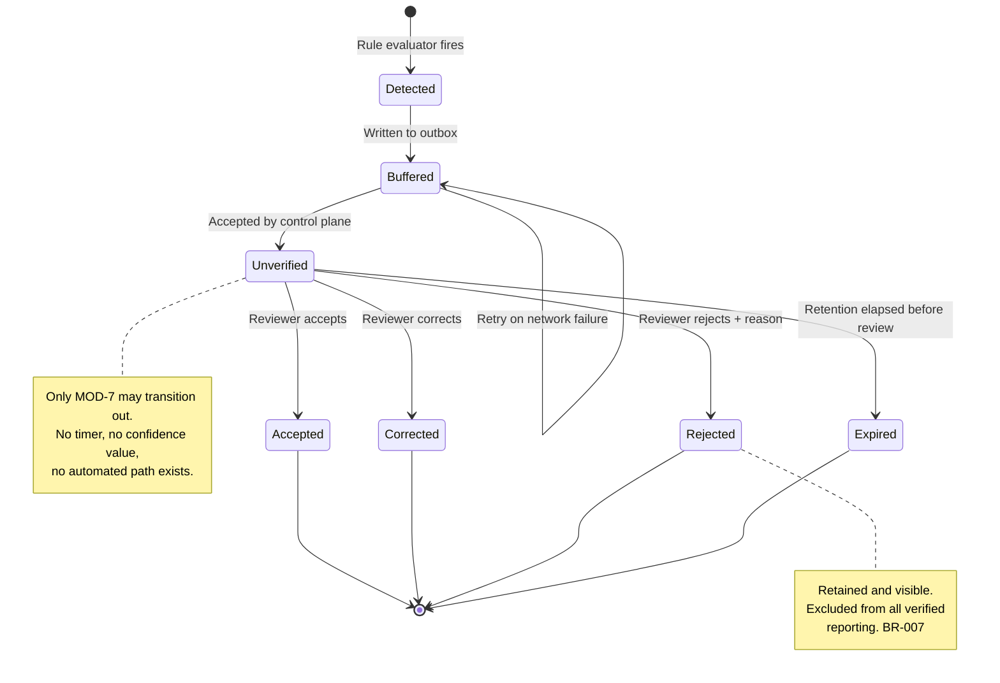

## 11.2 State definitions

| State | Meaning | Appears in reports? | Terminal |
|---|---|---|---|
| `unverified` | Awaiting human decision | No | No |
| `accepted` | Reviewer confirmed as a real exception | **Yes** | Yes |
| `corrected` | Reviewer confirmed with amendment | **Yes** | Yes |
| `rejected` | Reviewer determined not a real exception | No — visible in rejection log only | Yes |
| `expired` | Retention elapsed while unverified | No | Yes |

> **There is no `auto_accepted` state and no `escalated` state.** Their absence is the architecture, not an omission.

## 11.3 Verification Flow

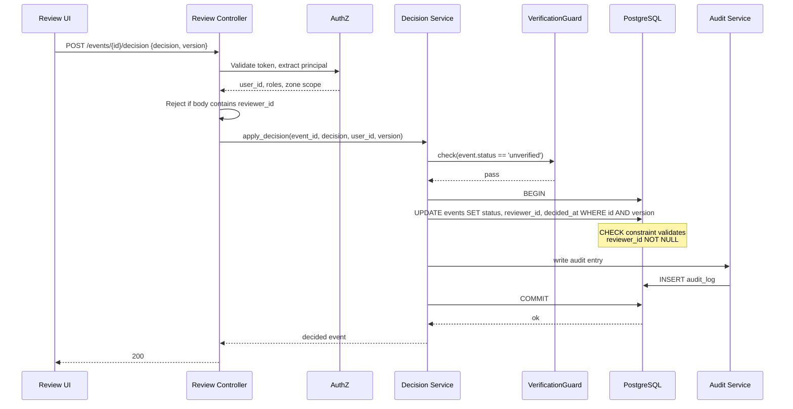

**Transaction rule:** the decision update and the audit insert occur in **one transaction**. If the audit write fails, the decision rolls back. A decision that cannot be audited must not exist.

## 11.4 Approval Flow

v1 has a **single-step** approval model: one authorised reviewer decides, and the decision is final. There is deliberately no multi-stage approval, no escalation and no supervisor override.

| Question | Answer |
|---|---|
| Can a decision be reversed? | No. A decided event is immutable (BR-AU-02). |
| What if a reviewer made a mistake? | A correcting record may be raised referencing the original. The original remains, because an audit trail that can be edited is not an audit trail. `[V1]` |
| Is there a second-approver mode? | Not in v1. If a customer requires it, it is a `[V2+]` feature requiring its own rule review. |
| Can a supervisor override a reviewer? | No. Overriding attribution would defeat BR-005. |

## 11.5 Configuration Approval Flow

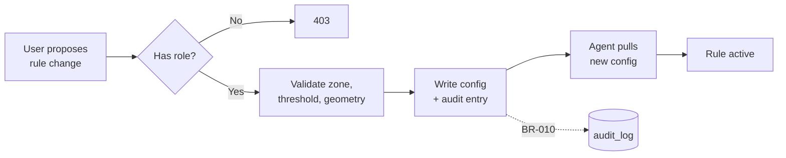

Rule activation is always explicit and always audited. There is no path by which a rule becomes active without a named user having activated it.
---

# 12. Security

> This section answers PRD **OQ-12** and **NFR-SEC-06**, both of which were explicitly deferred to the TRD.

## 12.1 Trust boundaries

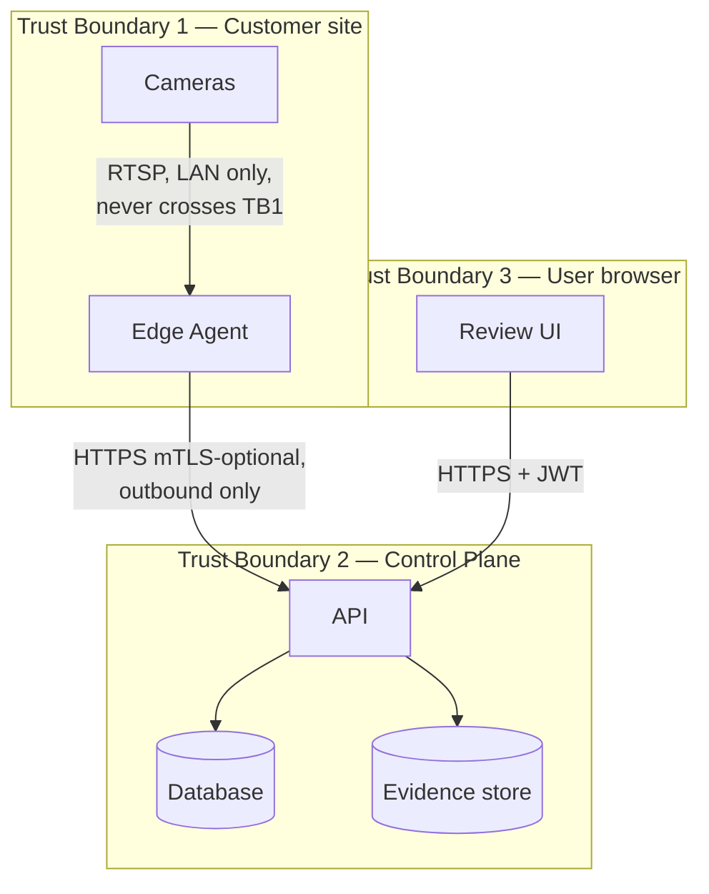

| Boundary | Crossing | Controls |
|---|---|---|
| Camera → Edge Agent | RTSP on the site LAN | Credentials encrypted at rest on the agent; never leaves the site |
| Edge Agent → Control Plane | HTTPS, outbound only | TLS 1.3, agent credential, payload validation, no inbound path to site |
| Browser → Control Plane | HTTPS | TLS 1.3, JWT, CORS allowlist, CSP |
| Control Plane → Database | Internal network | TLS, least-privilege database role, **per tenant** |
| **Tenant → Tenant** `[V1]` | **None. There is no connection spanning two tenant databases** | Physical separation (TD-018); per-tenant credentials; `tenant_identity` asserted on every connection acquisition. Threats T-17…T-20 in [ARCHITECTURE.md](ARCHITECTURE.md) §8.2 |

**Video never crosses a trust boundary.** Only structured events and a single evidence frame do.

## 12.2 Authentication

| Principal | Method | Scope |
|---|---|---|
| Human user | Email + password → JWT access (15 min) + refresh (7 days, rotating) | `[MVP]` |
| Human user | OIDC federation (Google Workspace / Entra ID) | `[V1]` |
| Edge agent | Long-lived agent credential exchanged for a short-lived token | `[MVP]` |
| Edge agent | Mutual TLS with per-agent client certificate | `[V1]` |

| Control | Detail |
|---|---|
| Password storage | Argon2id. Never MD5, SHA-1 or unsalted hashes. |
| Password policy | Minimum length enforced; breached-password check against a known-compromised list `[V1]` |
| Token signing | RS256 asymmetric. The signing key never leaves the control plane. |
| Refresh rotation | Each refresh issues a new refresh token and revokes the prior one. Reuse of a revoked token invalidates the whole family and raises a security alert. |
| Session revocation | Refresh-token denylist in the database, checked on refresh |
| **Agent isolation** | **An agent principal can never obtain a `reviewer` role.** Role assignment is not possible for agent principals at the data layer. A fully compromised edge agent cannot verify an event. |

## 12.3 Authorisation

Four roles, site-scoped, with zone scoping available.

| Role | Queue read | Decide | Config | Users | Retention | Audit read |
|---|---|---|---|---|---|---|
| `reviewer` | ✔ (scoped) | ✔ (scoped) | — | — | — | — |
| `safety_manager` | ✔ | ✔ | zones, rules | — | — | ✔ |
| `site_admin` | ✔ | ✔ | all | ✔ | ✔ | ✔ |
| `auditor` | ✔ read-only | — | — | — | — | ✔ |
| `agent` | — | **never** | — | — | — | — |

**Enforcement points:**

1. Route-level dependency injection asserts the required role before the controller executes.
2. Repository-level scope filters apply site and zone constraints to every query — so an authorisation bug in a controller cannot leak data from another site.
3. Object-level check on evidence retrieval.

## 12.4 Encryption

| Data | At rest | In transit |
|---|---|---|
| Camera credentials | AES-256-GCM, key from the secret manager | Never transmitted to the control plane |
| Evidence frames | Storage-layer encryption (filesystem `[MVP]`, SSE-S3 or SSE-KMS `[V1]`) | TLS 1.3 |
| Database | Volume encryption `[MVP]`; managed encryption at rest `[V1]` | TLS to database |
| Tokens | Refresh-token hashes only; never plaintext | TLS 1.3 |
| Backups | Encrypted with a separate key | TLS |

## 12.5 Secrets Management

| Secret | Storage | Rotation |
|---|---|---|
| Database credentials | Environment injection from secret store; never in the repository | 90 days `[V1]` |
| JWT signing key pair | Secret store; private key never leaves the control plane | 180 days with overlap `[V1]` |
| Camera credentials | Encrypted in `cameras.stream_url_encrypted`; decryption key in the secret store | On customer request |
| Agent credentials | Hashed in `agents.credential_hash` | On compromise or 365 days |
| Evidence-store keys | Cloud KMS `[V1]`; filesystem permissions `[MVP]` | Managed |

`[MVP]` uses Docker secrets and an `.env` file excluded from version control. `[V1]` uses AWS Secrets Manager or equivalent. **No secret is committed to the repository at any phase** — enforced by a pre-commit secret scanner in CI.

## 12.6 OWASP Top 10 — controls

| Risk | Control |
|---|---|
| A01 Broken Access Control | Repository-level scope filtering; object-level checks on evidence; deny-by-default routing |
| A02 Cryptographic Failures | TLS 1.3 everywhere; Argon2id; AES-256-GCM for credentials; no home-grown cryptography |
| A03 Injection | SQLAlchemy parameterised queries exclusively; Pydantic validation on every input; no dynamic SQL construction |
| A04 Insecure Design | Business rules enforced at the data layer, not only in application code — the central design decision of this system |
| A05 Security Misconfiguration | Compose and image configuration in version control; no default credentials; debug mode disabled outside development |
| A06 Vulnerable Components | Dependency scanning in CI; pinned versions; automated update pull requests |
| A07 Auth Failures | Rate limiting; generic authentication errors; refresh rotation with reuse detection; short access-token lifetime |
| A08 Data Integrity Failures | Signed container images `[V1]`; model artefact hash verified on load; audit log append-only |
| A09 Logging Failures | Structured logging; separate audit channel; security events logged and alertable |
| A10 SSRF | The control plane makes no outbound requests to user-supplied URLs. Camera URLs are used only by the edge agent, on the local network, and are validated against private address ranges. |

## 12.7 Rate Limiting

| Endpoint | Limit | Rationale |
|---|---|---|
| `POST /auth/login` | 5 per minute per IP, 10 per hour per account | Credential stuffing |
| `POST /auth/refresh` | 30 per hour per user | Token abuse |
| `POST /events` (agent) | 1000 per minute per agent | Generous; a breach indicates a malfunctioning agent |
| `POST /events/{id}/decision` | 120 per minute per user | Human ceiling — a higher rate implies scripted disposition, which would defeat BR-004 |
| `GET /reports/export` | 10 per hour per user | Expensive operation |
| Global per-IP | 600 per minute | Baseline |

> **The decision-endpoint limit is a product control, not only a security control.** A rate above human capability suggests automation of the human gate, and is alerted on.

## 12.8 Security testing

| Activity | Frequency | Scope |
|---|---|---|
| Dependency vulnerability scan | Every CI run | `[MVP]` |
| Static analysis (Bandit, Semgrep) | Every CI run | `[MVP]` |
| Secret scanning | Pre-commit and CI | `[MVP]` |
| Container image scan | Every build | `[V1]` |
| Business-rule bypass test suite | Every CI run | `[MVP]` — attempts to violate BR-004, BR-005, BR-AU-01 via direct API and SQL |
| Penetration test | Before first external customer | `[V1]` |

---

# 13. Infrastructure

## 13.1 Environments

| Environment | Purpose | Composition | Data | Scope |
|---|---|---|---|---|
| **Development** | Local build | Docker Compose; recorded video file as camera source | Synthetic fixtures | `[MVP]` |
| **Testing / CI** | Automated verification | Ephemeral Compose stack per pipeline run | Seeded fixtures, torn down after | `[MVP]` |
| **Staging / UAT** | Pilot | Single mini-PC on the pilot site; both planes co-located | Real, from the pilot site | `[MVP]` |
| **Production** | Customer deployments | Edge agents per site; control plane centralised | Real customer data | `[V1]` |

## 13.2 Development environment

```yaml
# docker-compose.dev.yml — structure, not final
services:
  db:          # postgres:16, volume-persisted
  api:         # FastAPI, hot reload, mounted source
  web:         # Vite dev server
  edge-agent:  # Python agent, VIDEO_SOURCE=/fixtures/sample.mp4
  rtsp-sim:    # optional synthetic RTSP source for stream-loss testing
```

A recorded video file replaces a live camera. This is legitimate and deliberate: the MVP tests the workflow, not the detector, and a fixed input makes results reproducible.

## 13.3 Staging / pilot environment

| Aspect | Specification |
|---|---|
| Hardware | x86 mini-PC, 16 GB RAM, SSD, wired Ethernet |
| Deployment | Docker Compose, all services co-located |
| Network | Site LAN; browser access from LAN only; **no inbound internet path** |
| Data | Real site footage; retention set short deliberately during pilot |
| Backup | Nightly database dump to a separate volume |

## 13.4 Production infrastructure `[V1]`

| Component | Specification |
|---|---|
| Edge agent host | Jetson Orin family or x86 mini-PC per site, depending on camera count `[OPEN — OQ-9]` |
| API | 2+ instances behind a load balancer with TLS termination. Each instance carries the Tenant Router and per-tenant connection pools |
| Database | **One managed PostgreSQL 16 database per tenant** (TD-018), each with automated backups, point-in-time recovery and optional read replica. Plus one small **control database** for registry and routing |
| Database credentials | **Per tenant**, held in the secret store and referenced — never stored — by the control database. A leaked connection string reaches one tenant, not all of them |
| Connection budget | `API instances × tenants × pool size`. **This is the binding scaling limit under TD-018, not write volume** — see §18.3 and [DATABASE.md](DATABASE.md) §17.3 |
| Tenant provisioning | Code path only, never manual: create → migrate to head → seed → attest → activate. A tenant reaches `active` only by passing constraint attestation ([DATABASE.md](DATABASE.md) §13.5.1) |
| Evidence store | S3-compatible with lifecycle policy aligned to retention configuration, **partitioned by tenant prefix** with its own access policy |
| Monitoring | Prometheus, Grafana, alert routing |
| Log aggregation | Centralised, with the audit channel separated |
| Secrets | Managed secret store |

## 13.5 Capacity

`[OPEN]` — all sizing depends on PRD OQ-4 (events per shift) and OQ-9 (cameras per device). These are measured in pilot, not estimated here. Deliberately left unspecified rather than filled with invented numbers.

---

# 14. DevOps

## 14.1 CI/CD Pipeline

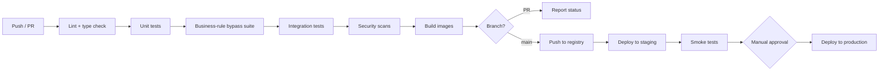

| Stage | Tools | Blocking |
|---|---|---|
| Lint & type check | ruff, mypy, eslint, tsc | Yes |
| Unit tests | pytest, vitest | Yes |
| **Business-rule bypass suite** | pytest | **Yes — a failure here is never overridden** |
| Integration tests | pytest + ephemeral Postgres | Yes |
| Security scans | Bandit, Semgrep, pip-audit, secret scan | Yes |
| Build | Docker Buildx | Yes |
| Deploy staging | Compose over SSH | Automatic on `main` |
| Deploy production | Manual approval gate | `[V1]` |

## 14.2 Docker

| Image | Base | Notes |
|---|---|---|
| `guardian-api` | `python:3.11-slim` | Multi-stage; non-root user; no build tools in the final layer |
| `guardian-web` | `nginx:alpine` | Static build output only |
| `guardian-edge` | `python:3.11-slim` or Jetson base `[V1]` | Includes ONNX Runtime and the model artefact |

**Standards:** non-root user in every image; no secrets in layers; pinned base image digests; healthcheck defined per image; image size minimised to reduce attack surface.

## 14.3 Kubernetes

**Not used at `[MVP]` or `[V1]`.** See TD-012. Docker Compose is sufficient for single-site edge deployment and a small control plane, and Kubernetes would add an operational burden the team cannot carry.

Reconsidered at `[V2+]` if multi-tenant SaaS is pursued. The design does not preclude it: services are stateless apart from the database and evidence store, so a future migration is mechanical rather than architectural.

## 14.4 Deployment Strategy

| Environment | Strategy | Downtime |
|---|---|---|
| Staging | Recreate | Acceptable |
| Production control plane `[V1]` | Rolling, 2+ instances | Zero |
| Production edge agent `[V1]` | Staged rollout: one site, observe, then fleet | Brief per agent |
| Database migrations | Expand-contract, backward-compatible in two steps | Zero |

**Migration rule:** every migration must be backward-compatible with the previous application version, so a rollback never requires a database rollback. This is non-negotiable given that the schema holds the audit trail.

## 14.5 Rollback Strategy

| Failure | Rollback |
|---|---|
| Application defect | Redeploy the previous image tag. Under two minutes. |
| Bad migration | Forward-fix. **Never drop a column containing audit data.** Expand-contract exists to make this possible. |
| Model regression | Swap `model_version` config, restart the agent. Previous ONNX artefact is retained. |
| Edge agent failure | Agent restarts automatically; outbox preserves buffered events across restarts. |
| Total control-plane failure | Agents buffer to the outbox. No event loss provided disk capacity holds. |

---

# 15. Logging

## 15.1 Log channels

Four separate channels, deliberately. Mixing them makes the audit channel unusable for its purpose.

| Channel | Content | Retention | Sensitivity |
|---|---|---|---|
| **Application** | Request lifecycle, service operations, performance | 30 days | Low |
| **AI** | Model version, inference duration, detection counts, threshold decisions | 90 days | Low |
| **Audit** | Every mutation with actor and before/after state | **Per retention policy — never shorter than event retention** | High |
| **Error** | Exceptions with stack traces and trace correlation | 90 days | Medium |

## 15.2 Format

Structured JSON on every channel:

```json
{
  "timestamp": "2026-07-31T09:15:02.331Z",
  "level": "INFO",
  "channel": "application",
  "service": "control-plane",
  "trace_id": "uuid",
  "user_id": "uuid",
  "event": "event.decision.recorded",
  "event_ref": "uuid",
  "decision": "accept",
  "duration_ms": 42
}
```

## 15.3 What must never be logged

| Never logged | Reason |
|---|---|
| Camera credentials or stream URLs containing credentials | NFR-SEC-02 |
| JWT contents or refresh tokens | Token theft via log access |
| Password material of any kind | — |
| Evidence frame binary content | Log volume and privacy |
| **Any per-person activity aggregate** | **BR-002 — logs must not become a back door to a prohibited capability** |

> The last row is easy to overlook. A well-meaning "user X reviewed 47 events today" log line is an individual productivity metric. It is prohibited in logs exactly as it is prohibited in the product.

## 15.4 AI-specific logging

| Logged | Purpose |
|---|---|
| Model version per inference batch | Traceability, regression detection |
| Inference duration | Performance |
| Detections above and below threshold, counted | Threshold tuning — §5.5 |
| Detections discarded by debounce | Distinguishes "no exception" from "suppressed repeat" |
| Model load, warm-up, failure | Operational |

## 15.5 Audit logging

Audit entries are written to the `audit_log` table, **not to a log file**. This is deliberate: files can be rotated, truncated or lost, and the audit trail is a product feature rather than an operational convenience. Log files are an operational aid; the database table is the record.

---

# 16. Monitoring

## 16.1 Health checks

| Check | Endpoint / mechanism | Frequency |
|---|---|---|
| API liveness | `GET /api/v1/health` | 10 s |
| API readiness | `GET /api/v1/health/ready` — database, evidence store | 30 s |
| Edge agent heartbeat | `POST /api/v1/agents/health` | 60 s |
| Camera stream health | Reported in agent heartbeat | 60 s |
| Database connectivity | Connection pool probe | 30 s |

## 16.2 Metrics

### Technical

| Metric | Type | Alert threshold |
|---|---|---|
| `http_request_duration_seconds` | Histogram | p95 above target |
| `http_requests_total{status}` | Counter | 5xx rate > 1% |
| `db_connection_pool_available` | Gauge | < 20% for 5 min |
| `edge_agent_last_seen_seconds` | Gauge | > 300 s |
| `edge_outbox_depth` | Gauge | > 1000 or growing 15 min |
| `stream_reconnect_total` | Counter | > 10/hour per camera |
| `inference_duration_seconds` | Histogram | p95 above sampling interval |

### Product

| Metric | Why monitored |
|---|---|
| `review_queue_depth` | Leading indicator of reviewer abandonment — PRD RD-01 |
| `event_decision_latency_seconds` | PRD P-02, median review time |
| `events_created_total{rule,camera}` | PRD P-01, events per shift |
| `decisions_total{type}` | Feeds acceptance rate — PRD AI-01 |
| `coverage_gap_minutes_total` | Honesty metric — a report without this is misleading |

> **`review_queue_depth` is the single most important operational metric.** A rising queue is the earliest observable signal that the product is failing at a site, and it precedes churn by weeks.

## 16.3 Alerts

| Alert | Severity | Condition | Action |
|---|---|---|---|
| Agent offline | **Critical** | No heartbeat > 5 min | Coverage is lost — investigate immediately |
| Outbox filling | **Critical** | Depth > 1000 and rising | Event loss risk |
| Queue depth excessive | **High** | Above site threshold for 24 h | Reviewer is not coping — product risk, not just ops |
| Camera degraded | High | Repeated reconnects | Camera or network problem |
| 5xx rate elevated | High | > 1% for 5 min | Service degradation |
| Decision-rate anomaly | **High** | Decisions/min above human plausibility | **Possible automation of the human gate — investigate as a rule violation** |
| Audit write failure | **Critical** | Any occurrence | Integrity risk — decisions are rolling back |
| Model load failure | Critical | On agent start | Agent will not run |
| Retention job failure | Medium | Job error | Compliance risk |

## 16.4 Dashboards

| Dashboard | Audience | Panels |
|---|---|---|
| **Operations** | Engineering | Request rate, latency, errors, database, agent status |
| **Edge fleet** | Engineering | Per-agent status, stream health, outbox depth, coverage gaps |
| **Product health** | Product | Queue depth, decision latency, acceptance rate, events per shift |
| **AI quality** | AI Engineering | Acceptance rate by model version, rejection rate by camera and rule, threshold distribution |
| **Site view** | Customer `[V1]` | Their own coverage, queue and verified counts |

---

# 17. Performance

## 17.1 Expected throughput

| Path | MVP | V1 | Note |
|---|---|---|---|
| Frames sampled | 2 fps × 1–3 cameras | Configurable per camera | Sampling, not full frame rate — §5.2 |
| Inference | 2–6 inferences/sec | `[OPEN — OQ-9]` | Must be benchmarked on target hardware |
| Candidate events | `[OPEN — OQ-4]` | `[OPEN]` | **The critical unknown.** Measured by running a detector across a full shift of recorded footage |
| API ingest | Low | Scales with sites | Non-demanding |
| Concurrent reviewers | 1–2 | 5–20 per site | Non-demanding |

## 17.2 Latency

| Path | Target |
|---|---|
| Condition → candidate in queue | `[OPEN — OQ-8]`. Measured in pilot. Design intent: seconds, not minutes |
| Queue list load | Sub-second at expected volume |
| Evidence frame load | Must complete before decision actions enable — DP-2 |
| Decision submission | Sub-second |
| Report generation, one month | Seconds |

> **No latency number is asserted here.** Setting one before the first measurement would be inventing a figure, which contradicts AP-2. §17 is completed after pilot.

## 17.3 Caching

| Layer | Strategy | Invalidation |
|---|---|---|
| Configuration on edge | In-memory, refreshed on config-sync poll | On version change |
| Evidence frames | Browser cache, `private, max-age=300` | Immutable content |
| Queue list | TanStack Query, 15 s stale time | On decision submission |
| Report aggregates | Not cached at `[MVP]`; materialised view `[V1]` | Scheduled refresh |
| Model artefact | Loaded once at agent start | On version change and restart |

## 17.4 Optimisation

| Optimisation | Applied where | Benefit |
|---|---|---|
| Secondary stream for inference | Ingestion | Materially cheaper decode with no detection loss at typical zone sizes |
| Frame sampling rather than full rate | Ingestion | Linear reduction in inference cost |
| Partial index on `status='unverified'` | Queue query | Queue stays fast as verified volume grows indefinitely |
| Denormalised `site_id` | Reporting | Removes a join on the hottest reporting path |
| Cursor pagination | Queue and history | Stable paging over a moving dataset |
| Batched outbox publishing | Edge | Fewer round trips on poor networks |
| ONNX Runtime with hardware provider | Inference | Hardware acceleration without code change |

**Deliberately not optimised at MVP:** report materialisation, inference batching, connection multiplexing. All are premature before the volume figures from OQ-4 exist.

---

# 18. Scalability

## 18.1 Horizontal scaling

| Component | Scalable? | Method |
|---|---|---|
| Edge agent | Per site, per camera group | Add agents; they are independent and share nothing |
| API | Yes | Stateless; add instances behind the load balancer. Note each instance multiplies the connection budget by the tenant count |
| Database | Per tenant, plus read replicas for reporting | **Scaling is by tenant, not by shard** (TD-018). Each tenant's writes remain single-primary, which is appropriate for per-tenant write volume. Beyond one cluster's connection budget, tenants are distributed across clusters by cohort |
| Control database | Vertically only; it is small and read-mostly | **Availability-critical** — if routing is unavailable, every tenant is unavailable. The router serves from cache during a control-database outage rather than failing requests |
| Evidence store | Yes | Object storage scales independently |
| Retention worker | Single instance, leader-elected `[V1]` | Concurrent deletion is not desirable |

## 18.2 Vertical scaling

| Component | When to scale up | Ceiling |
|---|---|---|
| Edge device | More cameras per site | `[OPEN — OQ-9]` — benchmark, do not assume |
| Database | Write volume from many sites | Managed instance resize |
| API instance | Rarely — the workload is I/O-bound, not CPU-bound | — |

## 18.3 Scaling limits and their remedies

| Limit | Symptom | Remedy |
|---|---|---|
| Cameras per edge device | Inference cannot keep pace with sampling | Reduce sample rate, or add a second agent, or move to accelerated hardware |
| Events per reviewer | **Queue grows faster than disposition** | **This is a product limit, not a technical one.** Tune thresholds and debounce. Adding servers does not fix it. |
| Verified events in the queue query | Slower queue load | Already mitigated by the partial index |
| Reporting over long periods | Slow aggregation | Materialised views `[V1]` |
| Evidence storage growth | Cost | Retention policy enforcement — MOD-11 |
| **Database connections** `[V1]` | **Connection exhaustion at a few dozen tenants, long before write volume is a problem** | Small per-tenant pools, lazy open/close on idle, a transaction-mode pooler, then tenant cohorts across clusters ([DATABASE.md](DATABASE.md) §17.3). **This is the limit TD-018 introduces and the one that binds on the number the business is trying to increase** |
| **Migration fan-out time** `[V1]` | Every schema change runs once per tenant; the window grows linearly with tenants | Per-tenant transactions, canary-first ordering, resumable runs, and drift recorded centrally ([DATABASE.md](DATABASE.md) §13.5). A tenant behind head is **suspended from binding**, not served |

> **The most important row is the second.** The binding constraint on this system is human review capacity, not compute. Scaling infrastructure to accommodate more events a human cannot review would be scaling the wrong thing — and would make PRD RD-01 worse, not better.

## 18.4 Future architecture `[V2+]`

| Change | Trigger |
|---|---|
| Message broker between edge and control plane | Sustained high event volume across many sites |
| Kubernetes | Multi-tenant SaaS with per-tenant isolation requirements |
| Database sharding by site | Write volume beyond a single primary |
| Regional control planes | Data-residency requirements in multiple jurisdictions |
| Edge-side model update service | A fleet large enough that manual agent updates become impractical |

---

# 19. Testing Strategy

## 19.1 Test pyramid

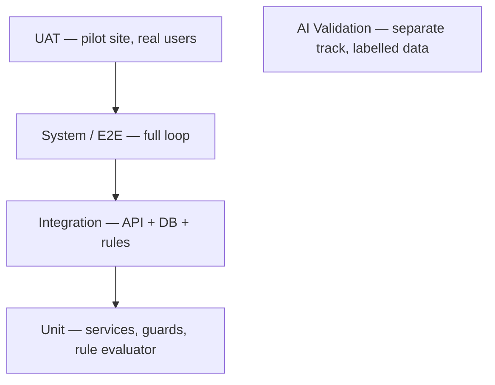

## 19.2 Unit testing

| Target | Coverage focus |
|---|---|
| Rule evaluator | Point-in-polygon edge cases; boundary conditions; threshold exactly at limit; debounce window boundaries |
| Business-rule guards | Each of the seven guards in §6.3, tested for both pass and fail paths |
| Decision service | State transition validity; version conflict handling |
| Repository query builders | Verified-only filtering — assert rejected events never appear in a report query |
| Frontend components | Decision bar keyboard handling; status chip non-colour indication |

**Target coverage:** 80% overall; **100% on business-rule guards.** The latter is not negotiable — these encode the product's core commitments.

## 19.3 Integration testing

| Test | Asserts |
|---|---|
| Ingest → queue → decision → record | The full happy path writes a correct verified record |
| Duplicate `event_id` submission | Returns the existing resource; creates no duplicate |
| Decision with stale `version` | Returns 409; does not overwrite |
| Concurrent decisions on one event | Exactly one succeeds |
| Audit write failure | **Decision rolls back — no orphan record exists** |
| Retention run | Deletes expired records and writes the audit entry |
| Agent config pull | Returns only that site's configuration |

## 19.4 Business-rule bypass suite — mandatory

A dedicated suite that **actively attempts to violate every ABSOLUTE rule.** It runs on every CI execution and a failure is never overridden.

| Attempt | Must result in |
|---|---|
| Insert a verified event with null `reviewer_id` via direct SQL | Database rejects — CHECK constraint |
| Set `status` via the ingest endpoint | 400 |
| Supply `reviewer_id` in the decision body | 400 — identity taken from token only |
| Update `reviewer_id` after decision | Trigger rejects |
| `UPDATE` or `DELETE` on `audit_log` | Trigger rejects |
| Call a bulk decision endpoint | 404 — the route does not exist |
| Query any per-person activity aggregate | No such endpoint or field exists |
| Authenticate as an agent and attempt a decision | 403 |
| Enable a rule without an audit entry | Impossible — same transaction |
| Include a rejected event in a report | Repository filter prevents it |
| **`TRUNCATE audit_log`** | **Trigger rejects** — a row-level trigger does not fire on TRUNCATE, so a statement-level one is required ([DATABASE.md](DATABASE.md) §10.1) |
| **Bind a request to tenant A and hand it a connection to tenant B** | **Router aborts on the `tenant_identity` mismatch and quarantines the pool** |
| **Execute any query with no tenant binding** | Impossible — no unbound state exists |
| **Connect to another tenant's database with this tenant's credentials** | Permission denied — credentials are per tenant |
| **Serve traffic from a tenant database missing any rule-bearing constraint** | **FF-11 attestation fails; the tenant is suspended from binding, not merely alerted** |

> **This suite is the executable form of the PRD's business rules.** If it passes, the product's core commitments hold. If it fails, the product is not shippable regardless of feature completeness.

## 19.5 System / end-to-end testing

| Scenario | Method |
|---|---|
| Full loop with a recorded video source | Automated E2E in CI |
| Stream loss and recovery | Synthetic RTSP source, killed and restarted |
| Control plane unavailable, then restored | Agent buffers, then drains without loss |
| Outbox reaching capacity | Agent alerts and stops generating rather than dropping |
| Retention deletion | Time-shifted fixtures |

## 19.6 Performance testing

| Test | Scope |
|---|---|
| Inference throughput on target hardware | `[MVP]` — answers OQ-9 |
| Sustained multi-hour agent run | `[MVP]` — memory leak and stability |
| Queue query at 100k verified events | `[V1]` |
| Concurrent reviewer load | `[V1]` |

## 19.7 AI validation — separate track

Model validation is not software testing and does not belong in the same pipeline.

| Stage | Method | Gate |
|---|---|---|
| Held-out dataset evaluation | Precision, recall, mAP per class on data not used in training | Before any deployment |
| **Real site footage evaluation** | Labelled footage from the actual deployment environment | **Before any accuracy claim is made** — PRD OQ-5 |
| Condition-stratified evaluation | Performance broken down by lighting, occlusion, camera angle, PPE colour | Documented as known weak conditions, not averaged away |
| Blur-interaction evaluation | Model evaluated **with** face blurring applied if blurring is enabled | Before defaulting blurring on |
| Field acceptance rate | Reviewer acceptance rate in production | Continuous — PRD AI-01 |
| Regression gate | New version must not reduce field acceptance rate | Before promotion — PRD AI-06 |

**Rule:** no accuracy figure may appear in any customer-facing material until the real-site-footage evaluation exists (AP-2).

## 19.8 User acceptance testing

Conducted at the pilot site with real users, against PRD pilot exit criteria.

| Criterion | Method |
|---|---|
| Reviewer can use the interface without being trained twice | Observation, unassisted first use |
| Median review time | Measured, not estimated |
| Events per day | Measured over several consecutive days |
| Edge cases logged | Written log is a deliverable |
| Stakeholders judge output useful | Structured feedback session |
| **Nobody feels surveilled** | Direct consultation — **if this fails, nothing else matters** |

---

# 20. Deployment Strategy

## 20.1 Pipeline by environment

| Stage | Trigger | Gate | Rollback |
|---|---|---|---|
| **Development** | Local | Tests pass locally | Discard branch |
| **QA / CI** | Push or PR | All CI stages including the bypass suite | Fix forward |
| **UAT / Pilot** | Merge to `main` | CI green + smoke tests | Redeploy previous tag |
| **Production** `[V1]` | Tagged release | **Manual approval** + staging soak period | Redeploy previous tag |

## 20.2 First deployment sequence — pilot

Follows the build order established in PRD §10 and the pilot plan.

| # | Step | Verifies |
|---|---|---|
| 1 | Deploy database with full schema and constraints | Constraints reject invalid data before any code exists |
| 2 | Deploy control plane; run the bypass suite against it | Rules hold at the API boundary |
| 3 | Deploy the review UI; exercise the loop with **stubbed events** | The human gate works before any detector exists |
| 4 | Deploy the edge agent with a **recorded video** source | Ingestion and event flow |
| 5 | Connect a real camera | Stream reliability under real conditions |
| 6 | Enable one rule on one zone | End-to-end with a real detection |
| 7 | Run in **supervised observation mode** — no queue presented | Establishes event volume before a human is handed a queue |
| 8 | Hand the queue to the named reviewer | Live operation |

> **Steps 1–3 require no camera and no model.** This is deliberate and matches the PRD build-order instruction: the detector can be improved until the last day, but the verification workflow cannot be added at the end.

## 20.3 Production deployment `[V1]`

| Component | Approach |
|---|---|
| Control plane | Rolling update, 2+ instances, health-gated |
| Database migration | Expand-contract, applied before the application deploy |
| Edge agent fleet | Canary: one site, observe for a defined soak period, then staged rollout |
| Model update | Separate from application deploy; version pinned per site so a model change never rides along with a code change |

## 20.4 Configuration management

| Configuration | Location | Change process |
|---|---|---|
| Application settings | Environment variables from the secret store | Redeploy |
| Site, camera, zone, rule | Database, via the configuration API | Audited at runtime — BR-010 |
| Model version per site | Agent configuration | Config sync + agent restart |
| Retention | Database, per site | Audited at runtime |

---

# 21. Engineering Risks

## 21.1 Technical risks

| ID | Risk | Severity | Mitigation |
|---|---|---|---|
| ER-T-01 | **Camera readiness at target sites is unknown** | **HIGH** | Physical camera audit at 3+ sites before build commitments. Cannot be researched — must be measured. PRD OQ-2 |
| ER-T-02 | ONVIF conformance varies between manufacturers | MEDIUM | Treat discovery as best-effort; manual RTSP is the primary path; maintain a per-model compatibility record |
| ER-T-03 | Camera concurrent-stream limits block ingestion | MEDIUM | Verify during the camera audit; document per model; prefer the secondary stream |
| ER-T-04 | Edge hardware cannot sustain the camera count | MEDIUM-HIGH | Benchmark before committing to hardware; ONNX Runtime abstraction makes the hardware swap cheap |
| ER-T-05 | Network instability at industrial sites | MEDIUM | Outbox with indefinite retry; gaps recorded, never inferred |
| ER-T-06 | Clock skew between edge and control plane | MEDIUM | NTP required on the edge host; skew tolerance on `occurred_at` validation; skew monitored |
| ER-T-07 | Evidence storage growth outpaces retention | MEDIUM | Retention enforcement from `[V1]`; storage alerts; short retention during pilot |

## 21.2 AI risks

| ID | Risk | Severity | Mitigation |
|---|---|---|---|
| ER-A-01 | **False-positive rate makes the queue unmanageable** | **HIGH** | Debounce and dwell logic; supervised observation before live queue; queue-depth alerting; threshold tuning from measured data |
| ER-A-02 | Laboratory-to-field accuracy gap | HIGH | No accuracy claim until real-site evaluation; condition-stratified reporting |
| ER-A-03 | Model regression between versions | MEDIUM | Field acceptance rate gate before promotion; previous artefact retained for rollback |
| ER-A-04 | Face blurring degrades helmet detection | MEDIUM | Evaluate with blurring applied; expose the trade-off rather than hiding it |
| ER-A-05 | Training data does not represent deployment conditions | HIGH | Site-footage fine-tuning from `[V1]`; document known weak conditions |
| ER-A-06 | Silent suppression by a future triage layer | HIGH `[V2+]` | If ever built: mandatory suppression logging and periodic human audit — PRD BR-A-01 |

## 21.3 Operational risks

| ID | Risk | Severity | Mitigation |
|---|---|---|---|
| ER-O-01 | Agent goes offline unnoticed | HIGH | Heartbeat with critical alerting at 5 minutes; coverage gaps surfaced in every report |
| ER-O-02 | Reviewer stops clearing the queue | **HIGH** | Queue-depth monitoring as a **product** alert, not just an ops alert; this is the earliest churn signal |
| ER-O-03 | Per-site configuration effort does not fall | MEDIUM-HIGH | Measure hours per site from site 1; if flat by site 5, the delivery model must change — PRD P-06 |
| ER-O-04 | Outbox fills during extended outage | MEDIUM | Disk quota with critical alerting; agent stops generating rather than dropping |
| ER-O-05 | Retention job fails silently | MEDIUM | Job-failure alerting; deletion counts logged and monitored |

## 21.4 Security risks

| ID | Risk | Severity | Mitigation |
|---|---|---|---|
| ER-S-01 | Camera credentials exposed | HIGH | Encrypted at rest; never transmitted to the control plane; never logged |
| ER-S-02 | Edge agent compromised | HIGH | Agent principal cannot verify events, cannot read other sites, cannot modify configuration. Blast radius is one site's event submission. |
| ER-S-03 | Evidence frames accessed without authorisation | HIGH | Object-level authorisation on every evidence request; scoped by site and zone |
| ER-S-04 | Audit log tampering | **CRITICAL** | Append-only trigger; separate backup; any modification attempt alerts |
| ER-S-05 | Token theft | MEDIUM | Short access-token lifetime; refresh rotation with reuse detection |
| ER-S-06 | Business-rule bypass through a new endpoint | **HIGH** | Data-layer constraints hold regardless of application code; bypass suite runs on every CI execution |

---

# 22. Technical Debt

Debt accepted deliberately for MVP, each with a repayment trigger. **Recording it is what prevents it from becoming invisible.**

| ID | Debt | Reason accepted | Repayment trigger | Effort |
|---|---|---|---|---|
| TD-D-01 | Both planes co-located on one machine | Simplest deployment that exercises the full architecture | First multi-site customer | Low — the split is already in the design |
| TD-D-02 | Local filesystem evidence store | Object storage is unnecessary for one site | First multi-site customer | Low — interface already abstracted |
| TD-D-03 | Manual RTSP URL entry, no ONVIF discovery | Discovery adds complexity for one to three cameras | > 10 cameras per site | Medium |
| TD-D-04 | Basic RBAC, no zone scoping | Pilot has one reviewer | Second reviewer at a site | Low — schema already supports it |
| TD-D-05 | Zone polygons entered as coordinates, not drawn | UI effort competes with the review screen | First external customer | Medium |
| TD-D-06 | No retention enforcement in MVP | Pilot uses a short fixed period | Before any customer deployment | Medium |
| TD-D-07 | Queue polling rather than server-sent events | Polling is trivially reliable at low volume | Reviewer complaints about staleness | Low |
| TD-D-08 | No materialised report views | Premature before volume figures exist | Report generation exceeds a few seconds | Low |
| TD-D-09 | Single model class | Deliberate — helmet is the evidence-backed choice | Per-class accuracy measured for a second class | Medium |
| TD-D-10 | No OIDC federation | Email/password sufficient for a pilot | First customer with an identity provider | Medium |

## Debt that will **not** be accepted

| Not accepted | Why |
|---|---|
| Skipping the database CHECK constraints "for now" | They are the enforcement mechanism for the product's core commitment. Application-only enforcement is one refactor from failure. |
| Application-layer-only audit logging | An audit trail in a rotatable file is not an audit trail. |
| Bypassing the bypass suite to ship | The suite is the executable form of the business rules. |
| Any temporary "just for testing" auto-accept path | It will survive into production. There must be no such code path at any point. |
| Storing raw video centrally "temporarily" | BR-008. Not a performance decision. |

---

# 23. Future Engineering Roadmap

| Phase | Engineering work | Trigger |
|---|---|---|
| **Post-MVP** | Retention worker; ONVIF discovery; zone drawing UI; OIDC; zone-scoped RBAC | Pilot exit criteria met |
| **V1** | Split-plane deployment; S3 evidence store; managed database with replica; monitoring stack; canary agent rollout; materialised report views | First external customer |
| **V1.5** | NVR connector for the specific devices found in the field; per-model compatibility matrix; multi-camera inference batching | Camera audit reveals which NVRs matter — PRD OQ-2 |
| **V2** | Additional detection classes with per-class validation; man-down detection with its own labelled dataset and feasibility gate; reject-rate surfacing; live notification with configurable volume | Per-capability feasibility validation |
| **V2+** | Message broker; Kubernetes if multi-tenant; regional control planes; edge model-update service; VLM-based triage **with mandatory suppression logging** | Scale or data-residency demands |

## Explicitly not on the roadmap

| Never | Reason |
|---|---|
| Facial recognition or person re-identification | BR-006 — must not enter the dependency tree at any phase |
| Individual activity or productivity computation | BR-002 — excluded at every horizon |
| HR or disciplinary system integration | BR-003 |
| Confidence-based auto-approval | FR-048, AP-4 — would make the product's core claim false |
| Central raw-video storage | BR-008 |

---

# 24. Final Architecture Review

## ✓ Architecture satisfies every PRD requirement

| PRD area | Satisfied by |
|---|---|
| §5 Product scope | §2 topology, §4 modules |
| §9 Feature catalogue F-1…F-11 | §4 modules, §10 API — mapped below |
| §11 Functional requirements FR-001…FR-084 | §4, §9, §10, §11 |
| §12 Non-functional requirements | §12 security, §17 performance, §18 scalability, §15 logging, §16 monitoring |
| §13 Business rules BR-001…BR-012 | §8.4 constraints, §6.3 guards, §19.4 bypass suite |
| §14 Product boundaries | §3 rejected technologies, §10.9 forbidden endpoints, §23 never-roadmap |
| §15 Success metrics | §16.2 product metrics |
| §18 OQ-12 security architecture | §12 — **answered** |

## ✓ Every feature has a technical implementation

| Feature | Modules | API | Schema |
|---|---|---|---|
| F-1 Camera ingestion | MOD-1 | `/cameras`, `/cameras/{id}/test` | `cameras` |
| F-2 PPE detection | MOD-2 | — (edge) | `model_versions`, `events.confidence` |
| F-3 NVR zone ingestion | MOD-5 | `POST /events` with `source=nvr` | `events.source` |
| F-4 Candidate generation | MOD-3, MOD-4 | `POST /events` | `events` |
| F-5 Review interface | MOD-7 | `GET /events`, `POST /events/{id}/decision` | `events.status` |
| F-6 Verified store | MOD-8 | — | `events` + CHECK constraints |
| F-7 Rejection retention | MOD-8 | `GET /events?status=rejected` | `events.rejection_reason` |
| F-8 Event history | MOD-9 | `GET /events` | indexes §9.5 |
| F-9 Aggregated reporting | MOD-9 | `/reports/summary`, `/reports/export` | read-only queries |
| F-10 Rule configuration | MOD-10 | `/zones`, `/rules`, `/rules/{id}/activate` | `zones`, `detection_rules` |
| F-11 Retention | MOD-11 | `/retention` | `retention_policies` |

## ✓ APIs are complete

Every feature has an endpoint; every endpoint has request, response, validation and error codes (§10). Endpoints that must **never** exist are enumerated in §10.9 — an unusual inclusion, and a deliberate one: in this product, the absent endpoints carry as much design weight as the present ones.

## ✓ Database supports all workflows

| Workflow | Support |
|---|---|
| Ingest → queue → decide → record | `events` with status transitions, §11.1 |
| Rejection retained but excluded | `status='rejected'` + repository-level filtering |
| Correction preserving original | `event_corrections` |
| Audit of every mutation | `audit_log`, append-only |
| Coverage honesty | `coverage_gaps` |
| Retention | `retention_policies` + MOD-11 |
| Multi-site | `sites`, site-scoped `user_roles` from day one |

## ✓ Security is addressed

Authentication, authorisation, encryption, secrets, key management, OWASP Top 10 and rate limiting are specified in §12. Trust boundaries are explicit, and the critical property — **video never crosses a boundary** — is topological rather than procedural. PRD OQ-12 and NFR-SEC-06 are closed.

## ✓ Performance targets are realistic

Where a target can be stated, it is. Where it cannot, it is marked `[OPEN]` with the PRD question that resolves it and the method that measures it. **No latency or throughput number has been invented.** §17 is completed after pilot measurement — this is consistent with AP-2 and is a deliberate methodological position rather than an incomplete section.

## ✓ Scalability is documented

Horizontal and vertical paths are defined (§18), with the honest observation that **the binding constraint is human review capacity, not compute.** Scaling infrastructure beyond what a reviewer can absorb would worsen the primary adoption risk rather than relieve it.

## ✓ Engineering risks are identified

Twenty-four risks across technical, AI, operational and security categories (§21), each with severity and mitigation. The two highest — camera readiness and false-positive volume — are both `[OPEN]` PRD questions requiring measurement, and both are flagged as pre-build dependencies rather than build-time discoveries.

---

## Architecture sign-off

| Role | Name | Decision | Date |
|---|---|---|---|
| Solution Architect | | ☐ Approved ☐ Changes requested | |
| Technical Lead | | ☐ Approved ☐ Changes requested | |
| AI Engineering | | ☐ Approved ☐ Changes requested | |
| Security Reviewer | | ☐ Approved ☐ Changes requested | |
| DevOps | | ☐ Approved ☐ Changes requested | |
| Product Owner | | ☐ Approved ☐ Changes requested | |

---

## Open items carried forward

| ID | Item | Owner | Resolves |
|---|---|---|---|
| OQ-2 | Camera readiness and NVR interfaces at target sites | Engineering | ER-T-01, MOD-5, §13.5 |
| OQ-4 | Candidate events per shift | Engineering | §17.1, ER-A-01, capacity |
| OQ-5 | Measured detection accuracy on site footage | AI Engineering | §19.7, any accuracy claim |
| OQ-8 | Latency targets | Engineering | §17.2 |
| OQ-9 | Cameras per edge device | Engineering | §17.1, §18.2, TD-003 |

> **None of these blocks the start of the build.** Steps 1–3 of the pilot deployment sequence (§20.2) require no camera, no model and no measured figures. They should begin while the camera audit runs in parallel.

---

## Change log

| Version | Date | Change | Author | Tier |
|---|---|---|---|---|
| 1.0 | 2026-07-31 | Initial technical requirement document | Kapil | — |
| 1.1 | 2026-08-12 | **Isolated multi-tenancy.** New **TD-018** — database per tenant, where a tenant is a customer organisation. §2 and §8–9 marked as summary views of [ARCHITECTURE.md](ARCHITECTURE.md) and [DATABASE.md](DATABASE.md). §2.3 production topology, §8 entities, §12.1 trust boundaries, §13.4 production infrastructure, §18.1 and §18.3 scaling limits, and §19.4 bypass suite updated for per-tenant databases. TD register migration to ADRs scheduled rather than performed inline. | Kapil | **T3** — touches enforcement points in [RULE_BOOK.md](RULE_BOOK.md) §6 |

### Outstanding against this version

| Item | Where | Owner |
|---|---|---|
| Sixteen data-model amendments from the DATABASE.md review — including the `TRUNCATE audit_log` hole and the missing `ON DELETE` behaviours | [DATABASE.md](DATABASE.md) Appendix A.1 | Kapil |
| Ten architecture amendments from the ARCHITECTURE.md review | [ARCHITECTURE.md](ARCHITECTURE.md) Appendix A | Kapil |
| Four RULE_BOOK amendments — the **Tenant** term does not exist in the normative vocabulary, and cross-tenant isolation has no rule behind it | [DATABASE.md](DATABASE.md) Appendix A.2 | **Kuldeep** |
| RFC and SARB review for this T3 change, stating which rules are affected and how each remains true | [GOVERNANCE.md](GOVERNANCE.md) §8.2, §8.3 | Kapil |

> **This version was recorded as a T3 change.** [GOVERNANCE.md](GOVERNANCE.md) §8.2 requires SARB review and the Decide holder for anything touching a [RULE_BOOK.md](RULE_BOOK.md) §6 enforcement point, and TD-018 replicates every data-layer enforcement point once per tenant. The document has been amended by its owner; **the review has not yet been held**, and the RFC required by §8.3 is outstanding. Ownership authorises the edit, not the approval.
